프로그램의 실행 단계 (메모리 load)

프로그램이라는 것은 파일시스템에 실행 파일 형태로 저장되어있는데 해당 파일을 실행을 하게 되면 

메모리에 올라가게 되면서 프로세스가 된다.

그리고 운영체제에 kernel 이 기본적으로 올라가있고 사용자 프로그램들을 실행을 시킬 때 메모리에 올라가서 프로세스가 된다. 

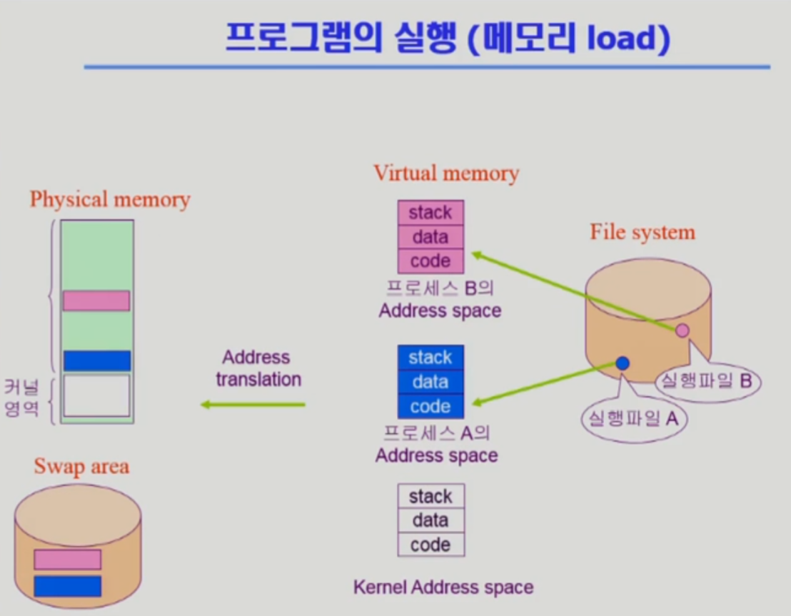

프로그램이 실행될때는 독자적인 address space 즉 주소 공간이 생성이 되는데 그걸 Virtual memory 라고 한다.

다만 virtual memory란 실제로 존재하지 않지만 머리속에 존재는 한다.??

그래서 Address space에서 당장 필요한 프로그램은 메모리에 바로 올라가게 되지만 그렇지 않은 프로그램은 디스크의 Swap area 에 머무르게 된다.

정리하자면 Virtual memory(논리 주소)에 있는 address space에는 각 프로세스가 0번지부터 가지는 주소가 각각 매겨지며 

물리적인 메모리인 Physical memory 에는 0번지부터 쭉 이어지는 하나의 주소로 매겨지며 낮은 주소에 올라가고? 그 위에 프로그램들이 올라가게 된다??

즉 virtual memory의 주소와 Physical memory는 서로 다른 주소를 가진다.

그래서 Address translation 인 주소 변환을 하게 된다   

그리고 각각의 프로세스의 **Program Virtual memory**의 구성에는 code, data, stack이 있다.

- code : 실행 파일의 code가 전달되며 실제로 CPU에서 실행될 기계어들이 위치하는 곳

- data : 데이터가 보관되는 곳으로, 프로그램이 실행되다가 메모리 데이터(전역변수, 배열)를 사용할 경우가 있는데 그때 데이터 영역이 위치하게 된다. 

  ​			다만 함수 안에 있는 지역변수의 경우 stack에 위치하게 된다. 즉 프로그램이 실행되는 순간부터 종료되는 시점에 사라지는 것만 데이터 영역에 위치.

- stack : 함수의 호출과 리턴에 관련된 정보는 스택 영역에 위치하게 된다.

운영체제 커널도 하나의 프로그램이기에 함수구조로 되어있다 그래서 프로그램이 실행될때에는 커널의 주소공간도 code, data, stack 이런것들로 구성이 된다.

---

커널의 주소 공간의 내용

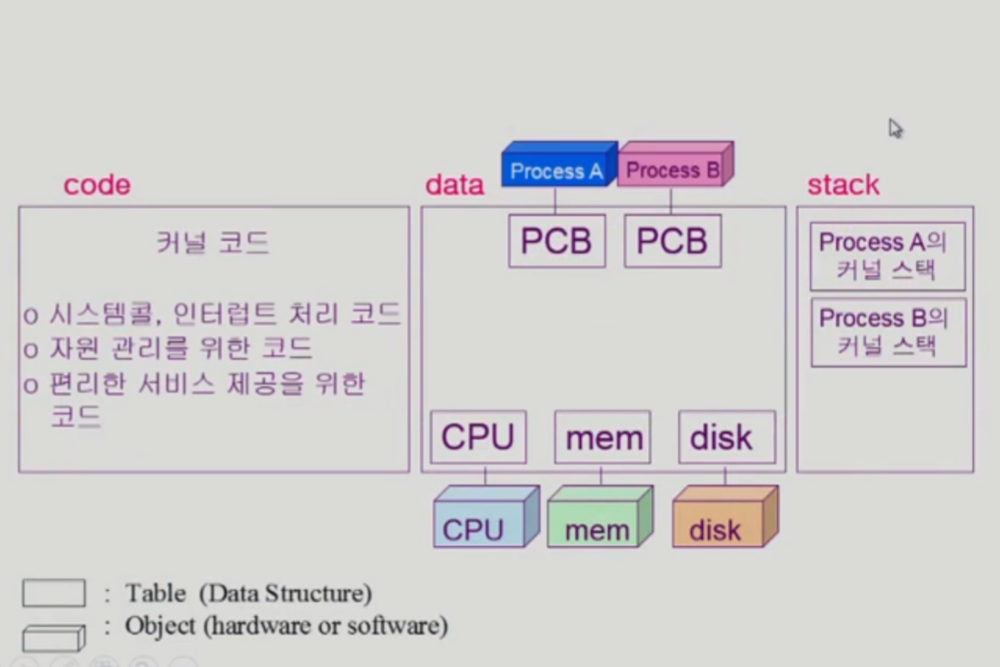

#### CODE

운영체제의 역활은 

1. 시스템 안의 자원을 효율적으로 관리하는 것인데 그럴려면 코드가 운영체제 커널에 함수 형태로 들어있어야 한다.  
2. 사용자에게 편리한 인터페이스를 제공하는데 이 또한 운영체제 커널에 함수 형태로 프로그램 되어있다.

사용자 프로그램이 CPU에서 돌아가다가 운영체제한테 CPU가 넘어가게 되는 경우는 인터럽트가 발생했을 때인데 이 또한 무엇을 처리해야할지에 대한 

코드가 커널안에 함수 형태로 프로그램 되어있다.

CPU에서 사용자 프로그램을 수행할 수 없는 특권 명령 기계어를 실행할 경우 운영체제한테 대신해달라고 콜하게 되는데 대표적인 것으로는 I/O.

​	그래서 운영체제가 해당 파일을 읽으려는 시스템 콜 또한 커널 영역에 있다.

#### DATA

운영체제 data 영역에는 모든 하드웨어들을 관리하기 위한 자료구조를 가지고 있고 모든 프로세스들을 관리하기 위한 자료구조를 가지고 있는데 이걸 PCB 라고 한다.

PCB란 시스템 안에서 작동하는 프로세스들을 관리하기 위해서는 어떤 자료구조가 필요한데 그걸 통틀어서 PCB라고 한다.

예를 들어 컴퓨터 안에 10개의 프로세스가 돌아가고 있다면 운영체제는 10개의 PCB를 만들게 된다. 

#### STACK

예를 들어 프로그램 A가 실행되다가 운영체제한테 뭔가 요청을 했을때 운영체제의 코드가 실행되는데 다만 운영체제도 함수 구조로 되어 있기 때문에 

함수가 어떤 함수를 호출하게 되면 stack을 사용하게 되는데 만약 A프로그램 때문에 호출이 된것이면 커널 스택은 A의 커널 스택을 사용하게 된다.

또한 B 프로그램이 실행되다가 운영체제한테 넘어오게 되면 운영체제의 커널 스택은 B의 커널 스택을 사용하게 된다. 

그래서 커널의 스택은 각 프로세스마다 별도로 두고 있다.

---

### 함수의 종류

사용자 정의 함수 : 자신의 프로글매에서 정의한 함수

라이브러리 함수 : 자신의 프로글맹서 정의하지 않고 갖다 쓴 함수로 실행 파일에 포함되어 있다.

커널 함수 : 운영체제 프로그램의 함수, 커널 함수의 호출 == 시스템 콜

시스템 콜 : 운영체제 함수 호출

그래서 내가 만든 프로그램의 코드에 있는 함수는 : 사용자 정의 함수와 라이브러리 함수이며

가져다 사용은 하지만 내 코드 안에 있는것이 아닌 커널에 들어있는 함수는 : 커널 함수 가 있다.

예시로 실행되다가 만약 디스크에서 파일을 읽어오는 함수를 호출할 경우 I/O는 내가 직접 할 수 있는 것이 아닌 커널에 정의된 함수이기에 커널로 CPU 제어권이 넘어간다.

또 다른 예시로 내 함수나 라이브러리 함수를 수행하는 경우는 그냥 해당 사용자 프로그램 안에서 프로그램 카운터 PC 값만 바꿔서 다른 위치의 기계어를 실행하는 것인데

시스템 콜 즉 운영체제의 커널 함수를 호출 할 경우는 가상 메모리의 주소 공간을 가로질러서 다른 프로그램의 영역으로 완전히 바뀌는 것이다. 

그래서 CPU 제어권을 운영체제한테 넘겨야 하기 때문에 시스템 콜이 일어날 경우 인터럽트 라인(Interrupt Line)을 셋팅해서 CPU제어권을 운영체제한테 넘어가게 한 뒤 실행.

---

### 프로그램의 실행

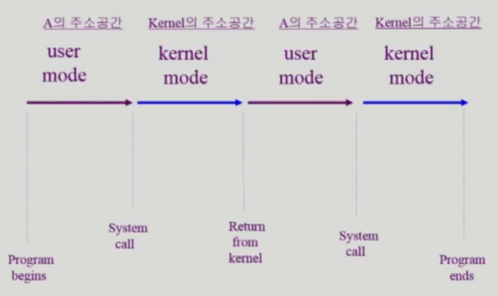  

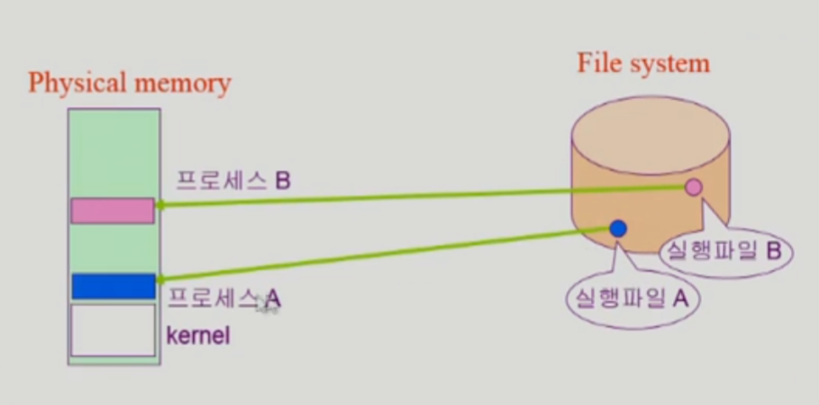

그림을 보자면 내가 정의한 함수나 라이브러리 함수를 사용할 경우 그냥 나의 주소 공간에 있는 코드가 user mode에서 실행이 되는 것이며

시스템 콜을 부르게 되면 CPU 제어권은 운영체제한테 넘어가게 되면서 kernel mode에서 운영체제의 주소공간에 있는 어떤 코드가 실행이 되는 것

그래서 하나의 프로그램을 실행시키게 되면 user mode에서 kernel 모드 이렇게 끝날기 전까지 반복을 하게 된다. 

여기서 커널 모드는 mode-bit 이 0의 경우이며 이땐 운영체제가 CPU를 사용하고 있는 것이기에 뭐든지 할 수 있다.

mode-bit이 1의 경우 즉 운영체제가 사용자 프로그램한테 CPU를 넘길 경우 mode-bit을 1로 변경 후 넘겨주게 된다. 이걸 user 모드라고 한다.

user mode의 경우 제한된 기계어만 사용가능하도록 함. 

---

### 프로세스

- 프로세스란 : 실행중인 프로그램.

- 문맥 (Context) : 단어의 사전적 의미보다 글월에 표현된 의미의 앞뒤 연결. 

- Process Context : 프로그램이 실행되다가 현재의 시점을 놓고봐서 해당 프로세스가 어떤 상태에 있는지에 대한 개념(시간에 따라 변동된다.)

  - 예를 들어 CPU를 얼마나 사용했는지, Memory를 얼마나 가지고 있는가, 함수 어디를 실행하고 있는지, 어디까지 실행했는지 등에 대한 정보.

  - 프로세스의 문맥의 분류

    - 하드웨어 문맥 : CPU에서 어디까지 수행했는지에 대한 정보.

      - CPU에서 주소공간의 어딘가에 있는 코드를 실행했을 때 어디를 실행했는가는 Program counter가 가리키는 곳을 실행하기에

        ​	PC의 값을 통해 어디를 실행하고 있는지 알 수 있다.

      -  그리고 각각의 기계어를 실행할 경우엔 레지스터에 있는 값을 통해 연산을 하고 결과를 메모리에다 사용하고 한다.

        ​	즉 CPU Context(하드웨어 문맥)는 현재 상태 CPU의 레지스터에 어떤 값을 넣고 있었는가 라고 한다.

    - PCB (Process Control Block) : 각각의 프로세스를 운영체제가 관리하면서 가지고 있는 자료구조.

      ​	그래서 운영체제는 일개 프로그램으로서 자신의 주소공간 중의 data 영역에 각 프로세스마다 PCB를 가지는데 

      ​	이 PCB에 있는 내용은 이 친구가 CPU를 얼마나 사용했는지, 메모리를 어떻게 썻는지에 대한 정보들을 종합적으로 가지는 것.

      ​	그래서 PCB를 봐야 프로세스의 문맥을 확인할 수 있다.

      

    - 그리고 커널을 수행할 때는 프로세스마다 별도의 커널 스택을 사용한다.

      ​	그래서 해당 프로세스의 문맥을 나타내기 위해서 해당 프로세스의 커널 스택에 어떤 내용이 들어있는지도 

      ​	프로세스의 현재 상태를 나타내는데 중요한 정보가 된다.

---

### 프로세스의 상태

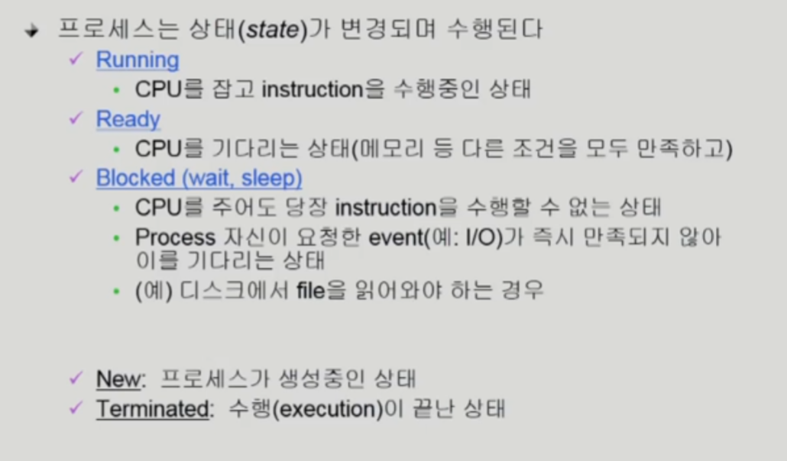

CPU는 하나 밖에 없기에 CPU에서 기계어를 실행하고 있는 프로세스는 매 순간 1개 뿐일 것. 

매 순간 실행중인 프로세스를 Running 상태에 있다라고 한다.

그리고 실행되기를 기다리는 프로세스들을 Ready queue 에 있고 Ready 상태에 있다라고 한다.

또한 CPU를 줘도 기계어 실행이 불가능한 프로세스 (예를 들어 디스크에서 파일을 읽는 경우 파일을 읽는데 작업이 오래 걸리기에 CPU 를 줘도 의미가 없다고 한다) 

​	들은 Blocked 상태에 있다고 한다. 

그래서 프로세스 상태는 크게 3가지중 한가지 상태에 있게 된다.

1. Running : CPU를 가지고 기계어를 실행중인 상태

2. Ready : CPU를 기다리는 상태 (CPU만 얻으면 실행가능한 상태)

3. Blocked(wait, sleep) : CPU가 주어져도 당장 기계어를 실행할 수 없는 상태, 뭔가 기다려야하는 상태

   ​	예를 들어 scanf를 이용해 입력을 받는 경우 --> 값이 들어오지 않는다면 CPU가 주어져도 당장 기계어를 실행할 수 없기에

   ​	만약 Blocked 상태의 프로세스가 실제로 입력이 되거나 처리가 완료되어 운영체제가 CPU를 받으려고 할 때 CPU가 바로 전달이 되는 것이 아니라

   ​	인터럽트가 필요한데 키보드에 입력이 들어왔다고 하면 키보드 컨트롤러가 CPU한테 인터럽트를 걸고나면 CPU 제어권이 운영체제한테 넘어오고 

   ​	인터럽트에 대해 확인 후 해당 프로세스의 상태를 Blocked에서 Ready 상태로 바꾸고 키보드에 입력된 내용을 메모리에 카피를 해서 CPU 를 얻을 수 있게 해준다  

   또한 하드웨어 작업만 오래걸리는 것은 아니고 공유 데이터도 있다. 

   공유 데이터란 프로세스들끼리 같이 사용하는 데이터를 의미하는데 동시에 여러 프로세스가 사용하면 문제가 생기기에 하나의 프로세스가 사용하면 

   ​	다른 프로세스들은 기다려야한다. 그때 Resource queue의 Blocked 상태로 들어가게 된다   

그래서 운영체제는 PCB를 통해서 각 프로세스의 상태가 어떤지를 관리하고 있다. 그리고 자료구조 queue를 통해 처리를 하게 된다.

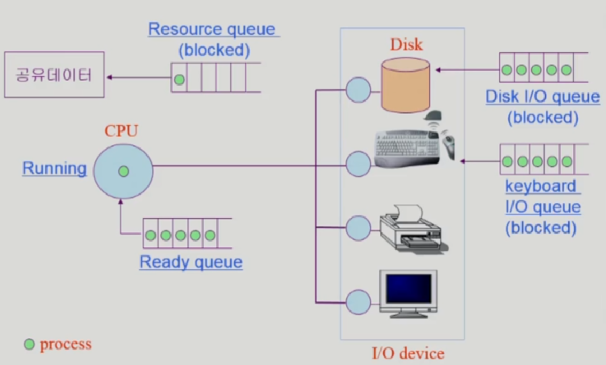

아래의 사진처럼 여러 queue를 두어 프로세스의 상태가 어떤지를 운영체제가 PCB를 통해서 자신의 데이터 영역에 프로세스마다 하나씩 PCB를 두며 관리한다. 

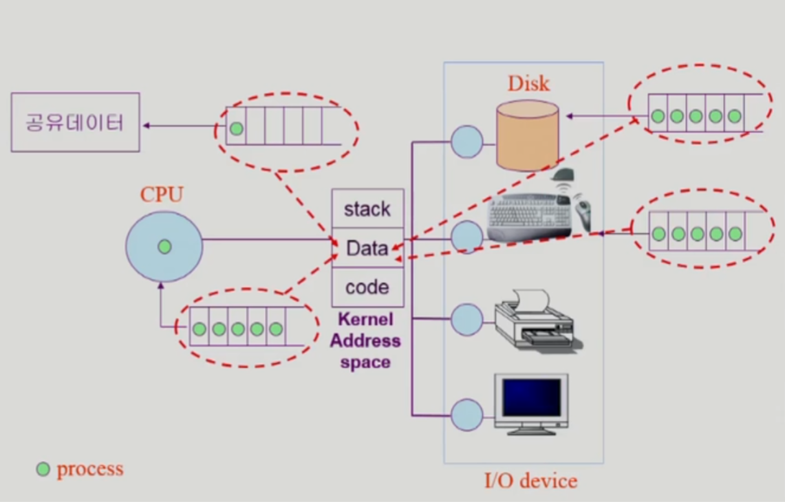

---

### 프로세스 상태도

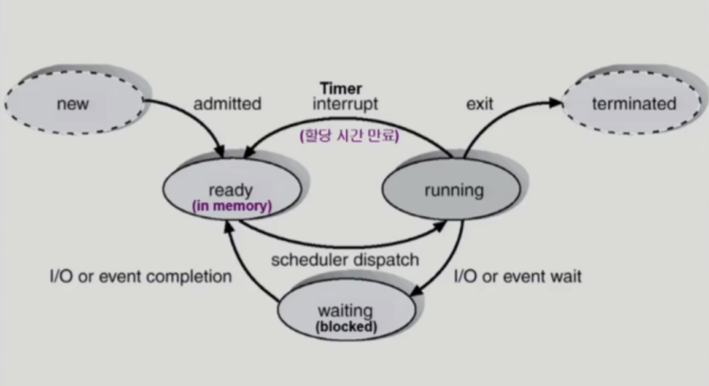

---

##### PCB (Process Control Block)

1. OS가 관리상 사용하는 정보 
   - Process State : Ready, Blocked, Running
   - Process ID : 프로세스 생성 시 운영체제가 관리하기 위해 발급하는 ID
   - Scheduling information priority : CPU에서 스케줄링 되기위한 우선 순위 정보

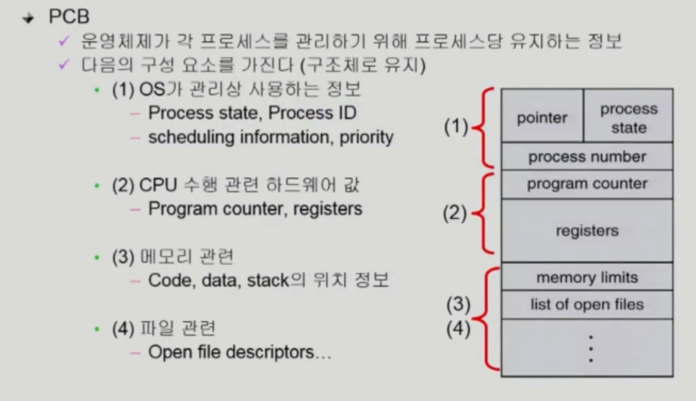

만약 프로세스 A에서 프로세스 B로 넘어간다고 할 경우 즉 B한테 CPU를 주겠다라고 하면 

​	프로세스 A는 CPU를 뺏기기 전에 프로세스 A의 PCB에 레지스터 값이라던지 현재 진행중이던 정보를 저장하고 프로세스 B한테 CPU를 넘기게 된다.

​	그리고 프로세스 B의 경우 프로세스 B의 PCB에서 이전에 CPU를 가지고 진행중이였던 데이터를 실제 CPU안에 있는 레지스터에 복원을 시키고 CPU를 받게 된다.

그래서 프로세스 A에서 프로세스 B로 CPU를 넘기는 과정을 문맥 교환 (Context Switch) 라고 한다 

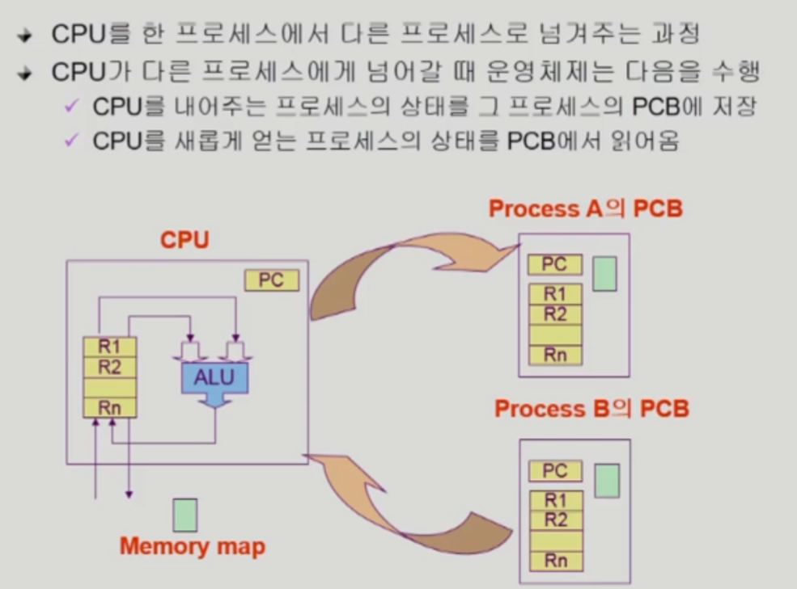

---

문맥 교환이 아닌 경우와 문맥 교환인 경우

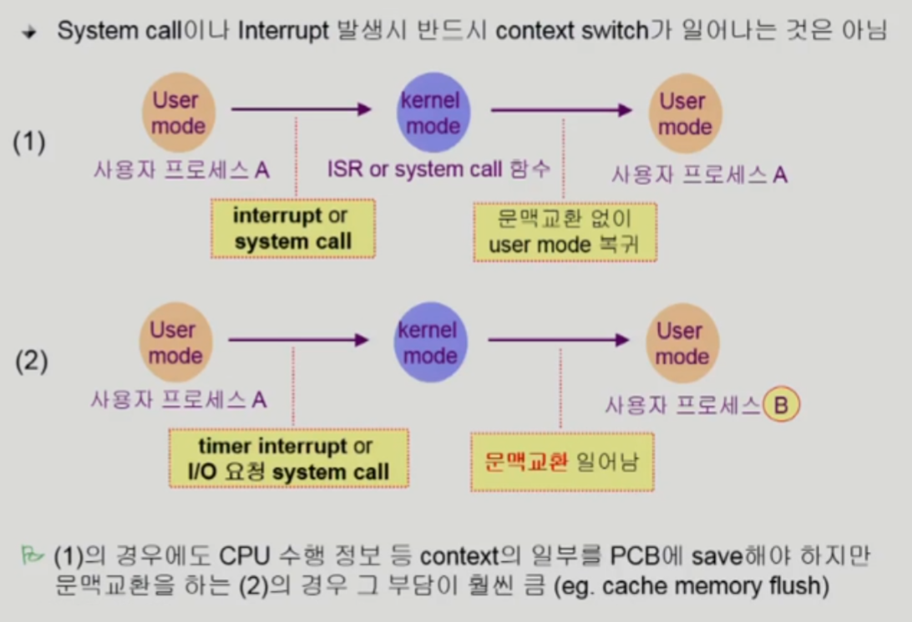

---

##### 프로세스를 스케줄링하기 위한 큐

운영체제는 프로세스들을 모두 큐에 넣고 관리하게 되는데 

종류로는 아래 사진과 같다. 

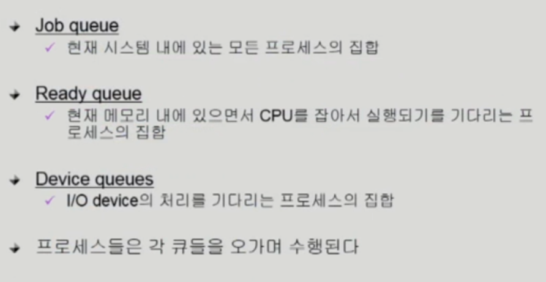

아래의 사진은 

Ready Queue와 다양한 Device Queue

 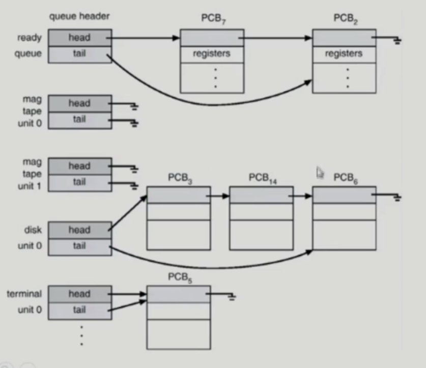

---

프로세스 스케줄링 큐의 모습 

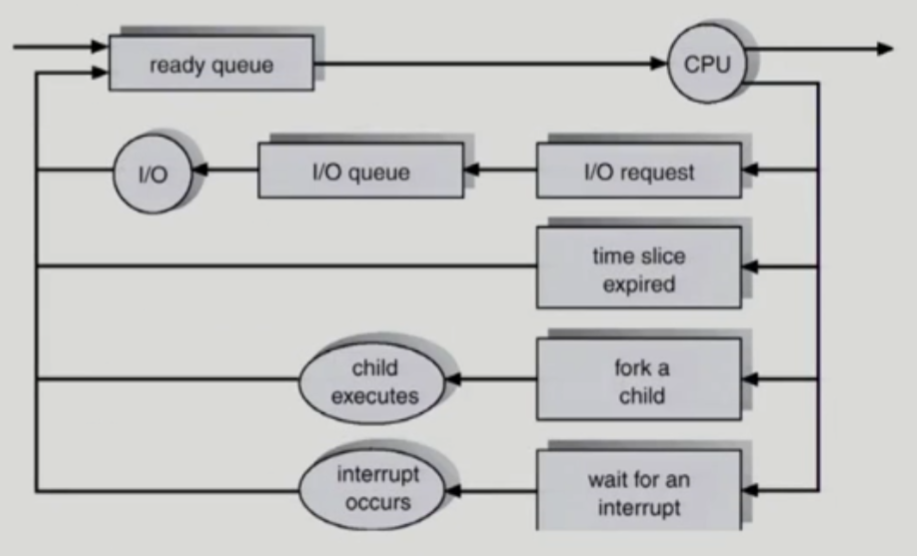

프로세스는 자식 프로세스를 만들 수 있는데 그걸 fork 한다라고 한다.

자식 프로세스란 기존 프로세스를 복제한다는 것

