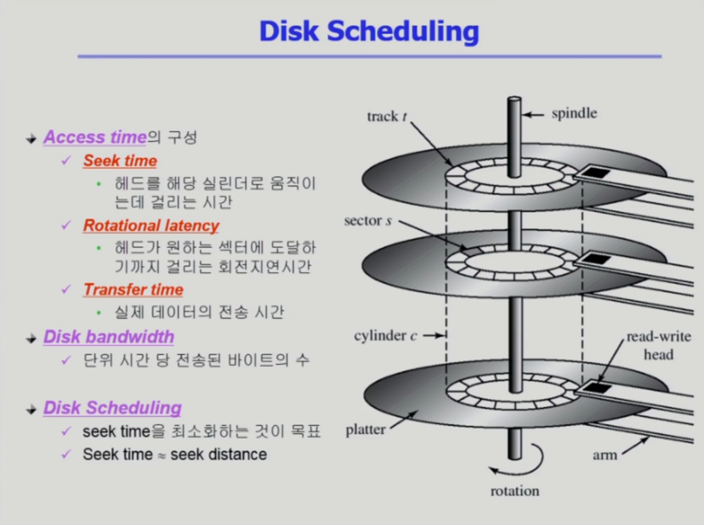
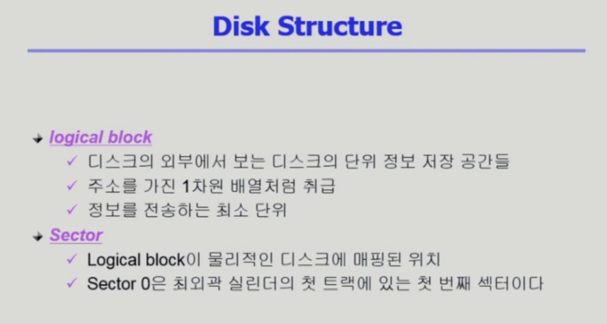
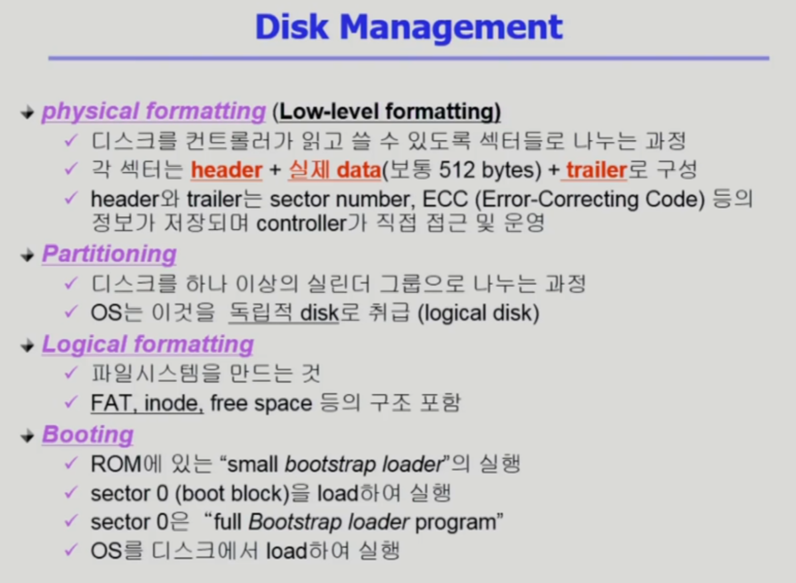
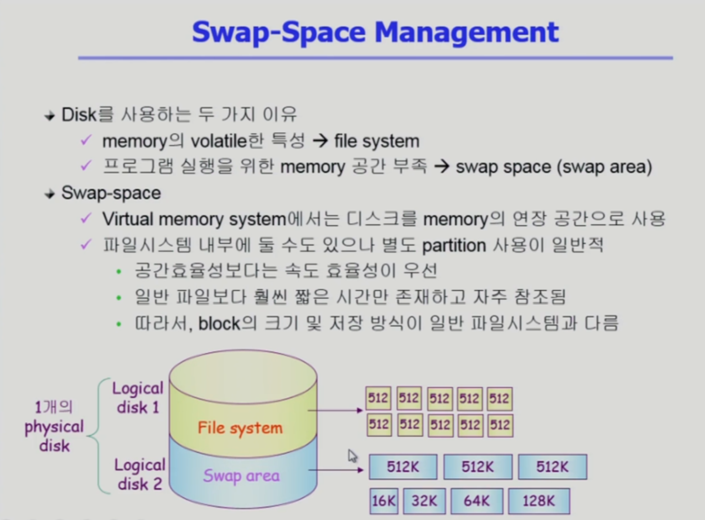
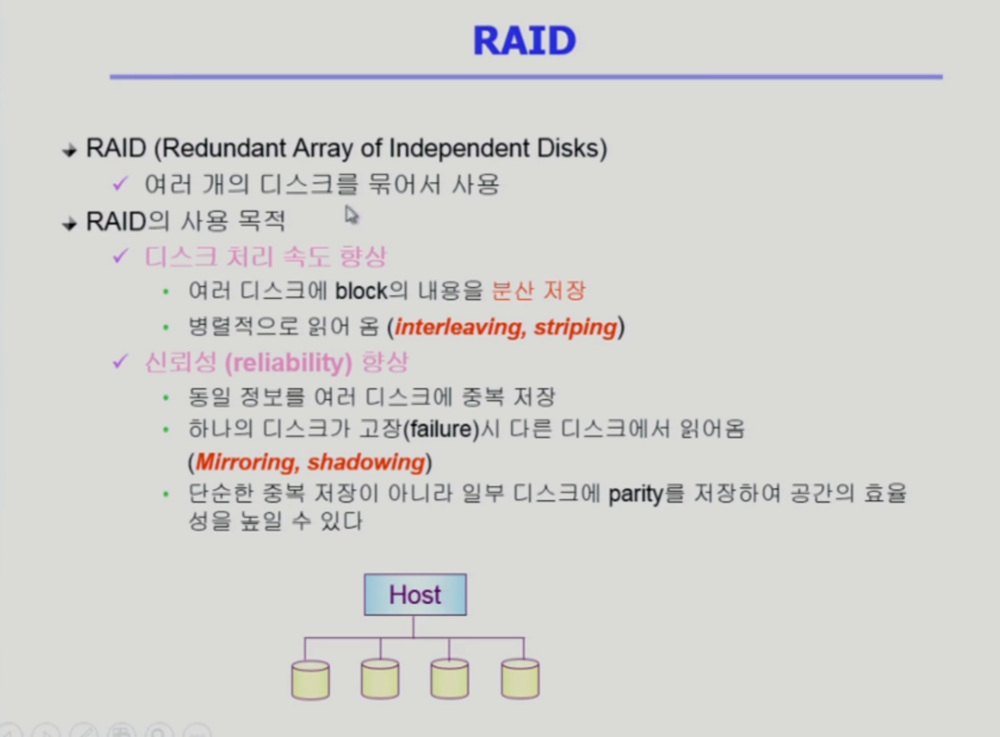

# Dist Scheduling

디스크 관리

위의 사진은 디스크의 내부구조

여러개의 원판과 마그네틱에 실제 데이터가 저장되어있다.

하드디스크 내부에서 데이터를 저장하는 최소 단위는 sector(섹터)라고 한다.

각각의 원판들은 track(트랙)으로 구성되어있으며

안쪽 트랙과 바깥쪽 트랙으로 구성되어 각각의 트랙에 데이터를 읽고 쓸 수 있도록 되어있다. 

그리고 트랙안에 있는 각각의 조각들을 sector(섹터) 라고 한다. 

그리고 cylinder(실린더)는 서로 다른 원판에서 상대적으로 같은 위치에 있는것을 모아놓은 것을 의미한다고 한다.

섹터에 데이터를 저장하고 읽고 쓰게 되는데 실제로 읽고 쓰고를 담당하는 곳은 디스크 헤드가 수행한다.

또한 디스크 헤드는 각각의 원판의 서로 다른 위치를 향할 수 없고 같이 움직여 중앙을 기준으로하여 같은 거리에 위치한다.

그래서 위의 사진처럼

Sector는 디스크 내부에서 실제로 데이터가 저장되는 최소 단위이자 위치를 의미한다. (512byte 정도로 구성된다고 한다.)

그래서 디스크 내부에서는 디스크 컨트롤러가 섹터에 데이터를 저장하거나 꺼내고 하지만 

디스크 외부에서 즉 컴퓨터 내부에서 디스크의 내부에 있는 데이터를 요청할 경우 

해당 요청은 섹터에게 요청하는 것이 아닌 Logical Block에 한다고 한다.

그래서 디스크 외부에서는 디스크 내부의 데이터를 요청할 경우 특정 원판, 특정 트랙의 섹터 번호를 전달하는 것이 아닌

논리적인 블록 번호를 전달하여 요청한다.

그래서 Logical Block의 실제 저장되는 위치는 디스크의 섹터라는 곳에 1:1로 매핑이 되어 저장이 되어있다고 한다.

그리고 섹터 0번의 경우는 항상 부팅을 위해서 항상 준비되어있으며 최외각 실린더의 첫 트랙에 있는 첫 번째 섹터이다.

 

디스크 컨트롤러가 섹터 단위로 구역을 나누는 것을 Physical formatting 이라고 한다. 

Physical formatting에서의 각 섹터는 실제 데이터인 보통 512byte로 구성되는 것 뿐 아니라 앞뒤로 header와 trailer 가 함께 구성되어 있다.

여기서 header와 trailer는 디스크 외부에 보이는 정보는 아니며 디스크 내부에서 컨트롤러가 관리하기 위해서두는 정보라고 하며 

실제로 어떤 데이터가 들어왔는지를 알 수 있는 Sector number와 데이터가 제대로 저장이 되어있는지를 체크하는 즉 데이터의 축약본인 ECC(Error-Correcting Code) 와 같은

부가적인 코드들이 Header와 tailer에 있다고 한다.

과정 정리 (디스크 컨트롤러한테 섹터에 있는 데이터를 요청할 경우)

- 디스크 컨트롤러가 해당 섹터에 있는 데이터를 읽는다.
- 실제 512byte의 데이터 뿐만 아니라 header와 trailer의 정보를 함께 읽는다.

그 다음으로 물리적인 디스크를 파티셔닝을 하는 절차를 가진다.

운영체제(OS)는 물리적인 디스크를 디스크로 보지 않고 파티셔닝을 한 각각의 파티션인 논리적인 디스크를 독립적인 디스크로 취급한다.

그 다음으로 각각의 파티셔닝이 된 논리적인 디스크는 파일시스템을 설치해서 사용하던지, Swap area 용도로 사용하던지 하는데 해당 과정을 Logical formatting이라고 한다.

그리고 컴퓨터가 부팅될 때 어떻게 디스크를 읽으며 부팅이 되는가하면 (부팅의 절차)

- 컴퓨터의 전원을 켜면 CPU는 메모리에 있는 기계어를 하나씩 실행시킨다.

- 다만 메모리는 휘발성 매체이므로 전원을 켜게 되면 메모리는 비어있게 되고 CPU는 메모리에 있는 기계어를 읽을 것이 없게 된다.

  ​	(휘발성 있는 메모리를 DRAM이라 부른다.)

- 그래서 CPU의 PCR(Program Counter Register)가 전원을 끄더라도 사라지지 않는 메모리인 ROM의 주소를 가리키고 있게 되어 ROM의 기계어를 실행시키게 된다.

- ROM의 기계어로는 부팅시 사용하는 디스크의 0번 Sector에 있는 내용을 메모리에 올리는 것으로 해당 기계어를 읽어 실행시키게 된다. 

  ​	(Small Bootstrap Loader 라고 부른다)  

- 그리고 0번 Sector를 Full Bootstrap Loader Program 이라 부르며 진정한 부팅의 과정을 하는 로더라고 한다.

그리고 디스크에 접근하는 시간은 총 3가지 요소로 구성되어 있다.

Access Time의 구성

1. Seek Time : 
   - 디스크 헤드가 해당하는 실린더로 움직이는데 걸리는 시간을 의미하며.
   - 디스크를 접근하는 시간 중 가장 큰 시간 규모를 차지한다.  
2. Rotational Latency(회전 지연시간)
   - 헤드가 원하는 섹터에 도달하기까지 걸리는 회전 지연시간을 의미.
   - Seek Time의 1/10 정도의 시간을 차지
3. Transfer Time
   - Rotational Latency 이후 실제 데이터를 읽거나 사용할 경우 데이터를 사용할 텐데 그때 실제 데이터의 전송 시간을 의미
   - Seek Time에 비해 굉장히 짧은 시간을 차지한다고 한다.

디스크의 성능 지표

- Dist Bandwidth (대역폭) : 단위 시간 당 전송된 바이트의 수로 Seek Time을 줄이게 되면 단위 시간당 전송되는 바이트의 수를 늘릴 수 있게 된다.

그래서 Disk Scheduling 이란 단위 시간 당 전송되는 바이트 수를 늘리기 위해 Seek Time을 최소화 하는 것을 목표로 한다.

---

# Swap - Space 관리

위의 사진과 같이 Disk 를 사용하는 두 가지 이유

1. 메모리의 (최적화 등 컴파일러의 재량을 제한하는 역할)한 특성으로 전원이 나가더라도 영구적으로 내용을 유지하는 File System
   - File System 의 관리: 512byte의 Sector 단위로 관리 (최근에는 호스트 컴퓨터와 데이터를 주고받는 단위를 4kbyte 단위로 관리한다고 한다.)
2. 메모리의 연장 공간으로 프로세스의 주소공간을 담는 공간 Swap Area
   - Swap Area 의 관리: File System에 비해 단위가 훨씬 크다.
   - 이유로는 파일 시스템의 데이터는 전원이 나가더라도 항상 유지해야하는 단위이기에 공간 효율적으로 관리하는 것이 중요하지만
   - Swap Area 의 경우 전원이 켜져있을 경우에만 의미가 있는 데이터이기에 공간 효율적이지 않아도 되며, 속도 효율성이 더욱 중요하기 때문.

---

# RAID

RAID의 경우 위의 사진과 같이 

여러 개의 디스크를 묶어서 사용하는 것을 의미

사용 목적

1. 디스크 처리 속도 향상
   - 여러 디스크에 Block의 내용을 분산 저장
   - 병렬적으로 읽어 옴(각각의 디스크에 분산하여 저장후 읽어오게 되면 하나의 디스크에서 읽어오는 것보다 속도가 훨씬 빠르기에)

2. 신뢰성 향상

   - 동일 정볼르 여러 디스크에 중복 저장하며

   - 하나의 디스크가 고장시 다른 디스크에서 읽어오며 이러한 과정을 Mirroring or Shadowing 이라 부른다.

   - 또한 단순한 중복 저장이 아닌 일부 디스크에 Parity를 저장하여 공간의 효율성을 높일 수 있다.

     ​	(패리티: 축약 정보로 일부 디스크에 각각의 디스크 안에 어떤 정보가 있는지를 저장)

참고: RAID의 단계별 내용

https://waystation.tistory.com/112