# File and File System

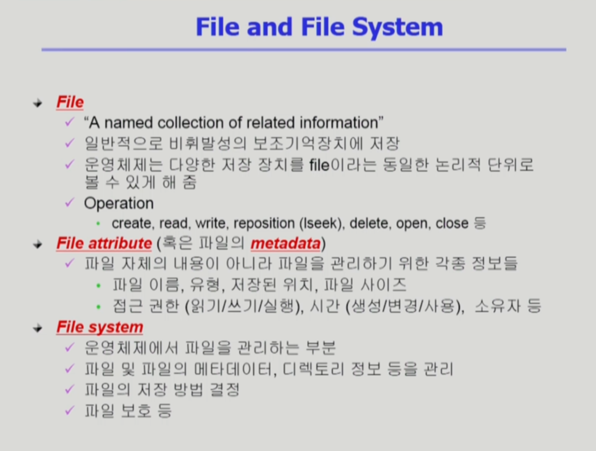

파일이라고 하면 하드 디스크에다 저장하는 단위

메모리는 주소를 통해 접근하는 장치, 

파일

- 이름을 통해 접근하는 단위
- 관련 정보를 이름을 가지고 저장하는것
- 비휘발성의 보조 기억장치에 저장(예: 하드디스크)
- 운영체제(리눅스)에서는 여러가지 다른이름의 장치들을 파일을 통해서 관리 (Device Special File)

파일에 대해 정의되는 연산

-  create <-> delete

- read, write

- reposition (lseek) : 파일은 여러개의 바이트로 구성되는데 어느 위치를 읽느냐, 쓰느냐를 가리키는 포인터가 있다. 

  ​									그래서 보통 파일을 읽으면 파일의 시작부분부터 읽게 되고, 파일을 한번 읽고 나면 파일의 위치 포인터가 다음 부분을 가리키게 된다.

  ​									다만 필요에 따라 그 다음 부분이 아닌 위치를 읽으려 할 때가 있는데, 

  ​									reposition(lseek)는 현재 접근하는 위치를 수정해주는 연산을 의미한다. 

- open <-> close : 우선 open 은 파일을 디스크에서 메모리로 내용을 올리는 것이 아닌 파일의 Metadata를 메모리로 올리는 작업을 의미한다. (뒤에서 설명해주신다고 함.)

Metadata(File attribute)

- 데이터에 대한 데이터
- 데이터를 사용하는 사람에게는 보이지 않는다
- 기계(컴퓨터)는 메타데이터의 내용을 이해하고 이를 이용한다. 
- 곧, 웹 자료나 다른 것들에 관해 기계가 이해할 수 있는 정보가 메타데이터이다.
- 유형
  1. 기술적 메타에디터 
     - 정보의 내용과는 관계가 없으나 그 정보가 어떻게 만들어졌는가를 표현하는 것
  2. 의미적 메타데이터
     - 데이터 자체의 내용적인 측면을 서술한 것

File system

- 파일 자체의 내용 + 파일의 메타데이터 또한 함께 저장
- 디렉토리를 이용하여 계층적으로 관리
- 파일을 어떻게 저장할지, 관리할지

---

# Directory and Logical Disk

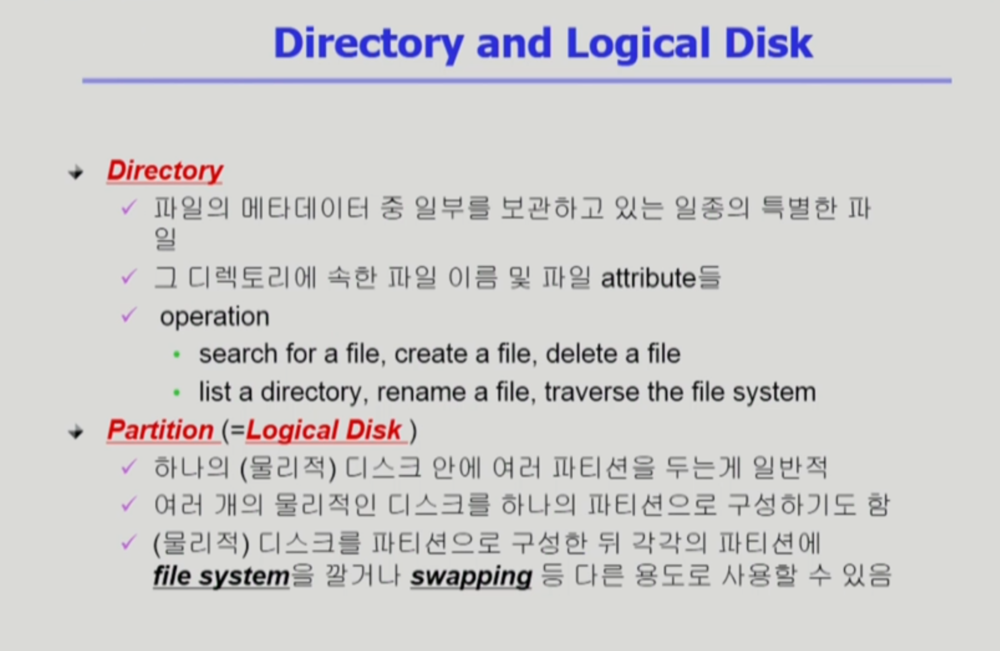

Directory

- 디렉토리 밑에 있는 파일들이 어떤건지에 해당하는 정보를 파일의 내용으로하는 파일로
- 파일의 메타데이터 중 일부를 보관하고 있는 일종의 특별한 파일.
- 연산의 유형
  - 위 사진의 Operation
  - Traverse the file system : 파일 시스템 전체를 탐색하는 연산

파일 시스템이 하드디스크에 저장될 텐데 

운영체제가 보는 디스크는 논리적인 디스크를 의미하고 다른 말로는 Partition(파티션) 이라고 한다.

파티션은 예를 들어 하나의 물리적 디스크인 하드디스크 하나를 사서 C, D 드라이브를 파티션으로 나누게 되면 각각 논리적인 디스크가 되도록 해준다.

또는 물리적인 디스크를 여러개로 하나의 논리적인 디스크를 구성하기도 한다고 한다.

그래서 물리적 디스크를 파티션으로 구성한 뒤 각각의 파티션에 파일 시스템을 설치하거나 Virtual Swap Area 용도로도 사용할 수 있다.

디스크의 용도

- 크게 두가지로 보는데 
  1. File System
  2. Swap Area 

---

# Open()

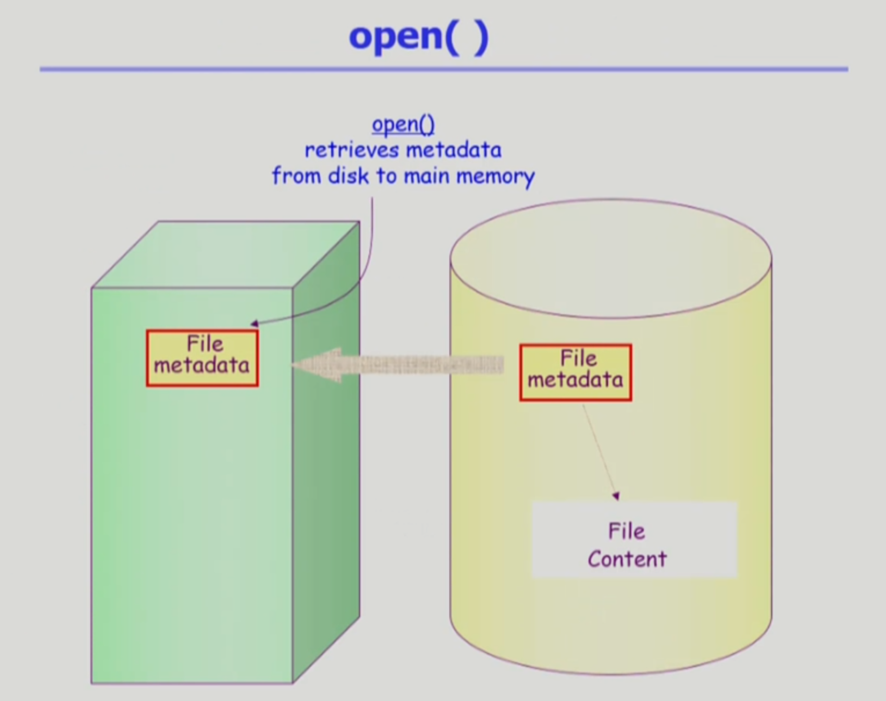

open : 파일의 메타데이터를 메모리로 올리는 것을 의미

메타데이터 중에는 아래의 사진처럼 파일의 저장 위치 또한 있기에 위의 사진의 File Metadata 안에는 파일의 위치, 파일의 내용을 가리키는 포인터 또한 함께 저장되어 있을 것.

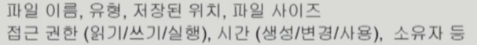

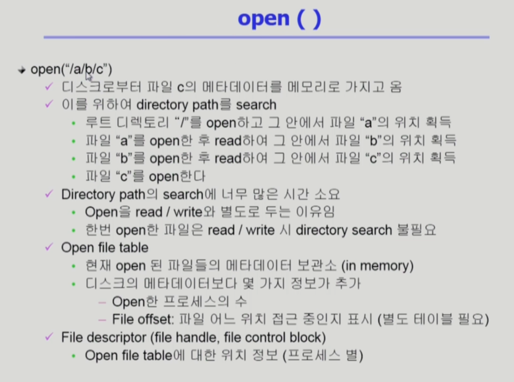

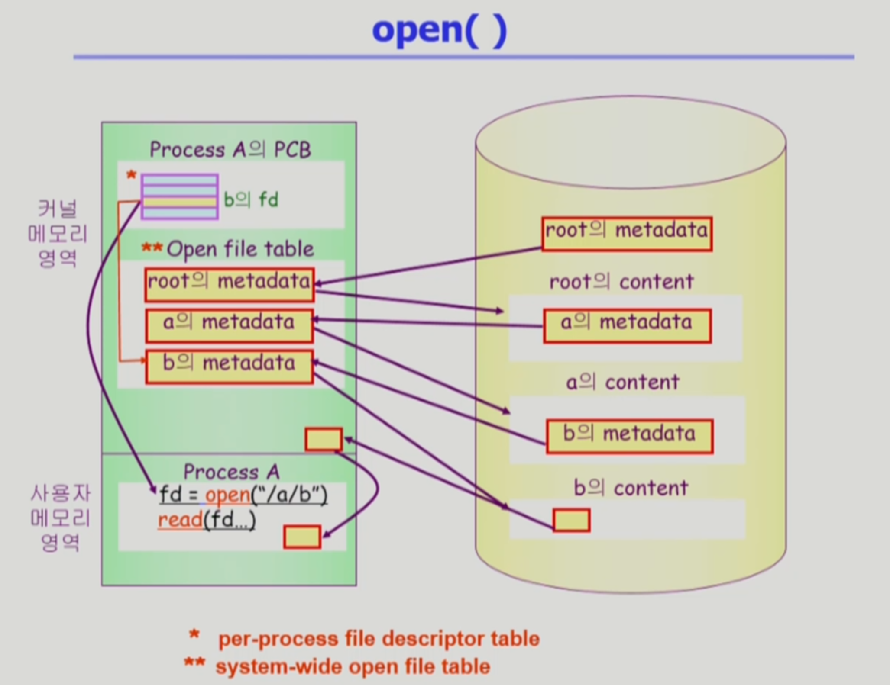

초록색 영역이 물리적 영역, 노란색 영역이 논리적인 디스크

초록색 영역은 크게 두개로 나뉜다.

- 사용자 메모리 영역 : 사용자 프로그램이 open(시스템 콜)을 하면
- 커널 메모리 영역 : cpu 제어권이 운영체제로 넘어가서 각 프로세스 별로 관리하기 위한 자료구조인 PCB가 있고 전체 프로그램들이 open 한 파일들이 어떤게 있는지를 관리하는 global한 테이블이 유지되고 있다.  

과정 (노란색 영역인 논리적인 디스크의 root의 metadata에서 시작) 

1. 루트 디렉토리의 위치는 미리 알려져 있기 때문에 루트 디렉토리의 메타데이터를 메모리로 올리게 된다.  (루트를 오픈)

2. 루트의 메타데이터에는 해당 파일의 위치 정보가 있기에 루트 메타데이터를 열어보면 루트 디렉토리의 실제 내용들이 어디에 있는지 찾을 수 있게 되어 노란색 영역으로 넘어가게 된다.

3.  위치로 가게 되면 현재 루트 디렉토리에는 a 라는 디렉토리가 있기에 a의 메타데이터가 있게 되고 해당 메타데이터를 다시 메모리로 올리게 된다.

4. 그러면 다시 a의 메타데이터에는 a 디렉토리의 위치 정보가 있가 담겨 있기에 b에 대한 실제 내용들이 어디에 있는지 찾을 수 있게 되어 다시 노란색 영역으로 넘어가게 되며 시스템 콜인 open이 끝이나지만 시스템 콜이기에 return 값을 받게 된다.

   ​	여기서 return 값은 각 프로세스마다 open 한 메타데이터 포인터를 가지고 있는 배열들이 만들어지고 해당 배열에서 몇번에 인덱스인지를 나타내는 것이 File Descriptor(FD) 가 되어 해당 값을 사용자 프로세스한테 리턴을 하게 된다.

   ​	그래서 사용자는 파일 디스크립터인 숫자(배열의 인덱스)를 가지고 파일들을 read, write 요청을 할 수 있다고 한다.  

5. read(fd...)    이것 또한 시스템 콜이기에 CPU가 운영체제로 넘어가게 되어 프로세스 A의 PCB로 가서 해당 디스크립터에 대응하는 파일의 메타데이터 부분을 Open File Table 안에서 찾아간 뒤 

   ​	해당 파일의 정보가 디스크의 어디에 있는지를 메타데이터가 알고 있기에 노란색 영역으로 간다. 

6. 그 후에는 읽으라고만 했기에 시작 위치부터 읽어오게 되는데 바로 사용자 프로그램한테 전송하는 것이 아니라 운영체제가 자신의 메모리 공간의 일부에 먼저 읽어놓고 해당 내용을 카피해서 사용자 프로그램에게 전달하게 하면 read 작업이 끝나게 된다.

7. 여기서 운영체제가 카피해서 사용자 프로그램에게 전달하는 이유는 다른 프로그램이 동일한 파일의 동일한 위치를 read 시스템 콜을 요청하면 바로 전달 할 수 있게 되기에 카피를 해서 전달하게 된다. 이러한 것을 Buffer Cache(버퍼 캐시)라고 한다.

   ​	버퍼 캐시란 

   - 최근 사용된 디스크 블록을 메모리에 캐시하는 것을 말하며, 
   - 파일 시스템의 버퍼 캐시는 버퍼 캐시에 내용이 있던지, 없던지 시스템 콜을 통해 CPU가 운영체제에 넘어오게 되어 버퍼 캐시 환경에서는 LRU, LFU 알고리즘을 자연스럽게 사용이 가능하다고 한다. (모든 정보를 운영체제가 알고 있기 때문에 )

그래서 커널을 유지하는 테이블에 대해서 이름이 다르게 주어지는데

파일 디스크립터 테이블은 프로세스마다 가지고 있기에 Per-process file descriptor table 이라고 부르며

파일을 열었으면 프로세스마다 가지고 있는것이 아니라 open된 파일들의 목록들을 한꺼번에 관리하고 있기에 System-wide Open File Talbe이라고 부른다.

---

# File Protection

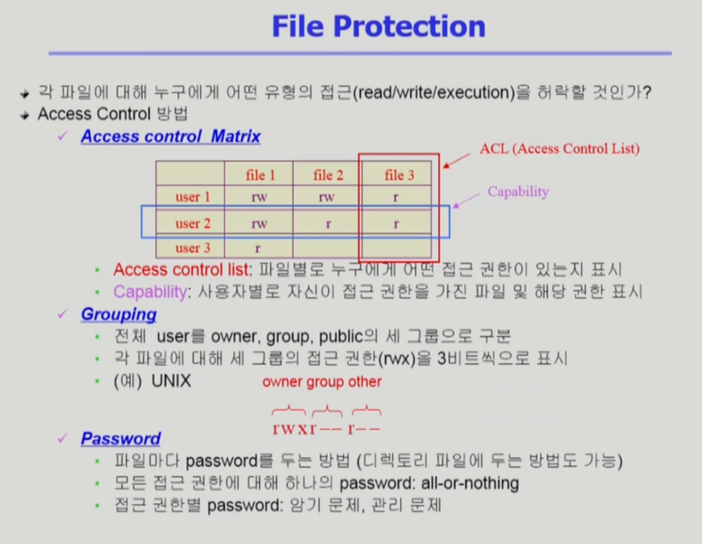

파일의 접근 권한

- 다양한 유저가 접근을 할 수 있기에 각 파일에 대해 접근 권한이 누구한테 있는지와 어떤 연산이 가능한지를 함께 가지고 있어야 한다. 

- 그래서 파일에 대한 접근 권한을 제어하는 방법은 크게 3가지가 된다.

  1.  Access control Matrix : 행과 열을 이용해 파일 이름과, 사용자 이름을 나열한 후 사용자가 각각의 파일에 대해 어떤 권한이 있는지를 표시

     - 다만 행렬을 다 만들다보니 자신만 사용할 수 있는 파일의 경우 다른 사용자는 비어있는 배열로 공간을 낭비하게 되어 

     - 주체를 누구로 하는지에 따라 2가지로 나누어 볼 수 있다.

       1. Access control list : 파일을 주체로 하여 누구에게 어떤 권한이 있는지를 표시
       2. Capability : 사용자를 주체로 하여 파일에 대해 어떤 권한이 있는지를 표시

     - 다만 위와 같은 방법으로 해도 오버헤드가 크기에 일반적인 운영체제에서는 아래의 Grouping 을 사용

       

  2. Grouping : 각 파일에 대해 세 그룹의 접근 권한(rwx) 를 총 9비트를 이용하여 표시

     - rwx 
       - r : read (읽기)
       - w : write (쓰기)
       - x : excute (실행)

     1. 사용자
     2. 사용자와 동일 그룹에 속한 사용자들
     3. 나머지 외부 사용자

     

     아래 사진중 '-' 의 의미는 일반 파일을 의미

     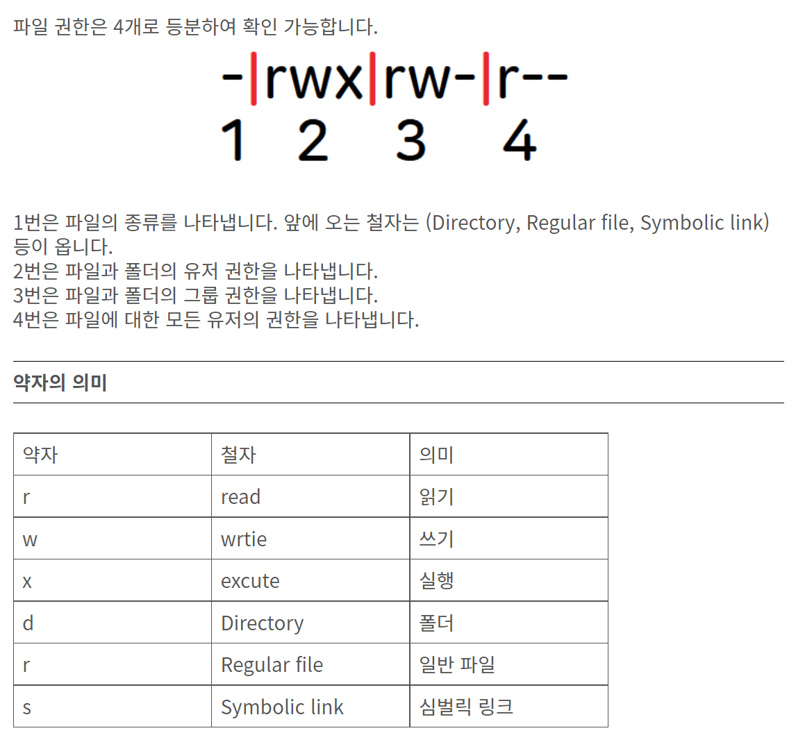

     

  3. Password

     - 모든 파일마다 password를 두는 방법
     - 단점 : 암기, 관리 문제

---

# FIle System 의 Mounting

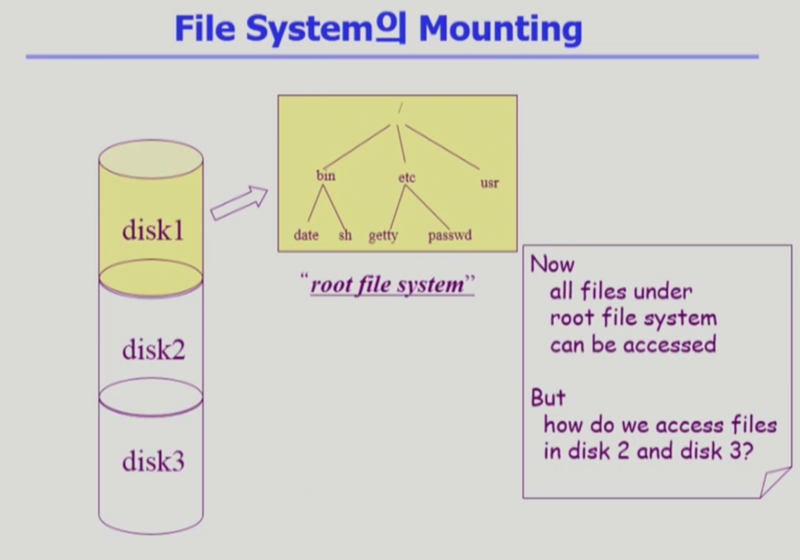

위의 사진은 하나의 물리적인 디스크를 파티셔닝을 통해 여러개의 논리적인 디스크로 나눈것을 보여주고 있다.

그리고 각각의 논리적인 디스크는 파일 시스템을 설치하여 사용할 수 있다.

만약 다른 파티션에 설치되어있는 파일 시스템에 접근하려 할 경우 Mounting 이라는 연산을 사용한다. 

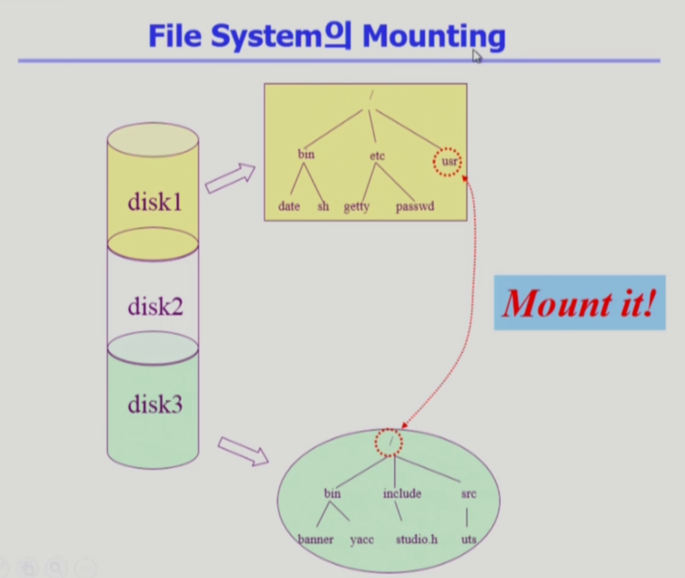

Mounting 

- 루트 파일 시스템의 특정 디렉토리 이름에 또다른 파티션에 있는 파일 시스템을 마운트 했을 경우
- 마운트 된 디렉토리에 접근하게 되면 또다른 파일 시스템의 루트 디렉토리에 접근한 것과 똑같게 되어 서로 다른 파티션에 있는 파일 시스템에 접근할 수 있게 된다. 

---

# Access Methods

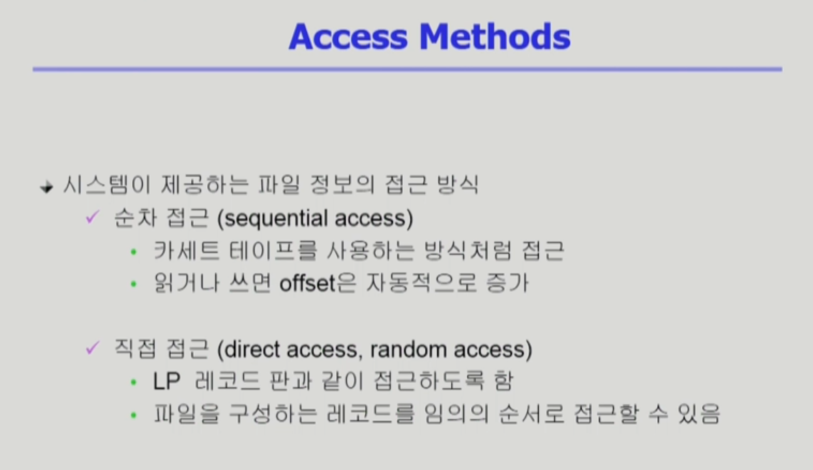

파일에 접근하는 방법

- 순차 접근 (sequential access) : 카세트 테이프 방식
- 직접 접근 (random access) : LP 판 방식