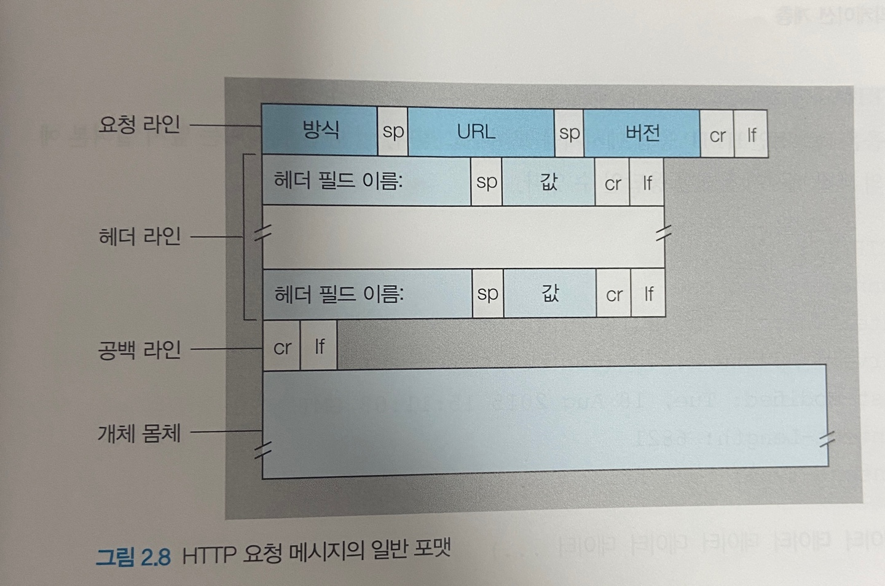
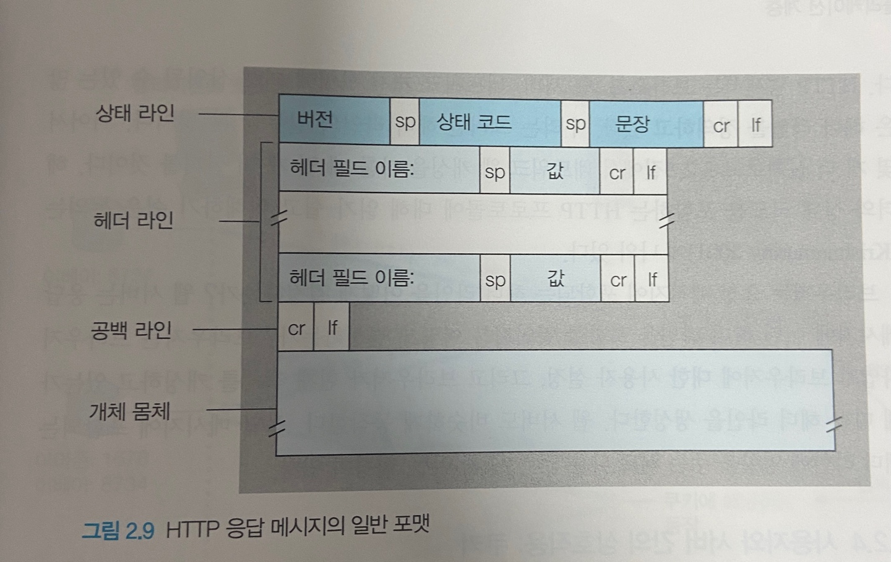

# HTTP - 요청과 응답

#### 웹 동작 방식

웹의 동작 방식으로는 온디맨드 방식으로서 

온디맨드 방식은 사용자는 본인이 원할 때 원하는 것을 수신하는 것으로서 

​	콘텐츠 제공자가 콘텐츠를 제공할 때 사용자가 주파수를 맞추고 있어야 하는 라디오/TV  방송과는 다른 방식이다.

#### URL 입력 시 일어나는 과정(SW 엔지니어 인터뷰에서 나오는 단골 질문이라고 함)

과정:

1.  웹 브라우저에 URL을 입력하고 Enter 키 입력
2.  웹 브라우저가 도메인명의 IP 주소 조회 (먼저 캐시를 찾고, 그다음 DNS를 검색)
3.  웹 브라우저가 서버와의 TCP 연결 시작
4.  웹 브라우저가 HTTP 요청을 서버로 전송 (필요한 경우, HTTPS 보안 통신이 진행됨)
5.  웹 서버가 요청을 처리하고 응답을 다시 전송
6.  웹 브라우저가 콘텐츠 렌더링

잡 지식!

DNS: 사람들이 네트워크를 통해 원격의 컴퓨터에 접속하기 위해서는 IP 주소를 이용해야 하지만

​			숫자의 연속인 IP 주소를 일일이 외울 수 없기 때문에 기억하기 쉽도록 도메인 주소 체계가 만들어졌다.

​			ex) naver.com, youtube.com

HTTP : 80 Port

HTTPS : 443 Port

---

#### HTTP 개요

HTTP(HyperText Transfer Protocol)는 웹의 애플리케이션 계층 프로토콜 중 하나로 웹의 중심이 된다.

HTTP는 두가지 프로그램인 클라이언트 프로그램, 서버 프로그램으로 구성되며, 각기 다른 종단 시스템에서 수행되는

​				클라이언트 프로그램과 서버 프로그램은 서로 HTTP 메시지를 교환하여 통신한다.

그래서 HTTP는 메시지의 구조 및 클라이언트와 서버가 메시지를 어떻게 교환하는지에 대해 정의하고 있다.

HTTP는 웹 클라이언트가 웹 서버에게 웹 페이지를 어떻게 요청하는지와 서버가 클라이언트로 어떻게 

​				웹 페이지를 전송하는지를 정의한다.

​				예를 들어 사용자가 웹 페이지를 요청할 때, 브라우저는 페이지 내부의 객체에 대한 HTTP 요청 메시지를 

​				서버로 보내고 서버는 요청을 수신하고 객체를 포함하는 HTTP 응답 메시지로 응답한다. 

또한 HTTP 서버는 클라이언트에 대한 정보를 유지하지 않으므로, HTTP를 비상태 프로토콜이라고 한다.

---

#### 비지속 연결, 지속 연결

애플리케이션과 그 애플리케이션이 어떻게 이용되는지에 따라 일련의 요구가 계속해서, 일정한 간격으로 주기적으로

​				혹은 간헐적으로 만들어질 수 있다.

그래서 클라이언트와 서버 간의 상호작용이 TCP 상에서 발생 할 때 두가지의 연결로는

1. 비지속 연결 : 각각의 요구(request), 응답(response)이 분리 되어 따로 분리된 TCP 연결을 보내는 것을 의미

   - 연결 수행 과정

     1. HTTP 클라이언트는 HTTP의 기본 포트 번호 80을 통해 서버에 TCP 연결을 시도하여

        ​	클라이언트와 서버에 각각 소켓이 있게 된다.

     2.  HTTP 클라이언트는 1단계에서 설정된 TCP 연결 소켓을 통해 서버로 HTTP 요청 메시지를 보낸다

     3.  HTTP 서버는 1단계에서 설정된 연결 소켓을 통해 요청 메시지를 받고

        ​	저장장치로부터 객체를 추출하여, HTTP 응답 메시지에 그 객체를 캡슐화한다. 

        ​	그리고 응답 메시지를 소켓을 통해 클라이언트로 보낸다.

     4.  HTTP 서버는 TCP에게 TCP 연결을 끊으라고 한다(그러나 실제로 TCP 클라이언트가 응답 메시지를 올바로 받을 때까지 연결을 끊지 않는다).

     5.  HTTP 클라이언트가 응답 메시지를 받으면, TCP 연결이 중단된다.

     6.  그 이후에 참조되는 각 객체에 대해 처음 네 단계를 반복한다.

     

   - 우선 비지속 연결은 몇 가지 단점이 있다.

     1. 각 요청 객체에 대한 새로운 연결이 설정되고 유지되어야 한다.
        - TCP 버퍼가 할당되어야 하고 TCP 변수들이 클라이언트와 서버 양쪽에 유지되어야 하는데
        - 이는 수많은 클라이언트들의 요청을 동시에 서비스하는 웹 서버에게 심각한 부담을 줄 수 있다.
     2. 각 개체는 2개의 RTT를 필요로 한다. (TCP 연결에 1개, 객체를 요청하고 받는데 1개)

     

2. 지속 연결 :  모든 요구와 해당하는 응답들이 같은 TCP 연결상으로 보내는 것을 의미

   - 지속 연결에서 서버는 응답을 보낸 후에 TCP 연결을 그대로 유지한다.
   - 같은 클라이언트와 서버 간의 이후 요청과 응답은 같은 연결을 통해 보내진다.
   - 객체에 대한 요구는 진행 중인 요구에 대한 응답을 기다리지 않고 연속해서 만들어질 수 있다.(파이프라이닝)
   - 일반적으로 HTTP 서버는 일정 기간(타임아웃 기간)  사용되지 않으면 연결을 닫는다.
   - 서버가 연속된 요구를 수신할 때, 서버는 객체를 연속해서 보낸다.
   - HTTP의 default mode는 파이프라이닝을 이용한 지속 연결을 사용한다.

---

#### HTTP 메세지 포맷

HTTP 명세서는 HTTP 메시지 포맷을 정의한다.

HTTP 메시지는 '요청 메시지' 와 '응답 메시지' 가 있다.

###### 요청 메시지

- GET /somedir/page.html HTTP/1.1
  Host: www.someschool.edu
  Connection: close
  User-agent: Mozilla/5.0
  Accept-language: fr

  

- 우선 ASCII 텍스트로 쓰여 있어 사람들이 읽을 수 있으며

- 위 메시지는 다섯 줄로 되어있고 각 줄은 CR(carriage return)과 LF(line feed)로 구별된다.

- 요청 메시지는 더 많은 줄로 구성되거나 하나의 줄이 될 수도 있다.

- HTTP 요청 메시지의 첫 줄은 요청 라인(reqeust line) 이라 부르고, 다음부터는 헤더 라인(header line)이라고 부른다.

- 요청 라인(reqeust line)은 3개의 필드를 갖는다.

  - Method Field(방식)
    - GET,POST,HEAD,PUT,DELETE 를 포함하는 여러 가지 값을 가질 수 있다.
  - URL Field
  - HTTP version Field 

  

- 헤더 라인(header line) 

  - 객체가 존재하는 호스트를 명시한다.

  - 호스트 헤더라인이 제공하는 정보는 웹 프록시 캐시에서 필요로 하며

  - Connection: close 헤더 라인을 포함함으로써, 브라우저는 서버에게 지속 연결 사용을 원하지 않는다는 것을 말하고 있다.

  - User-agent: 헤더 라인은 사용자 에이전트, 즉 서버에게 요청을 하는 브라우저 타입을 명시하고 있다.

    - 여기서 사용자 에이전트는 Mozilla/5.0, 파이어폭스 브라우저 이다.
    - User-agent 헤더 라인은 서버가 같은 객체에 대한 다른버전을 다른 타입의 사용자 에이전트에게 보낼 수 있으므로 유용하다.

  - Accept-language: 헤더는 HTTP에서 사용 가능한 많은 콘텐츠 협상 헤더 중 하나로 위 코드로는 

    ​									프랑스어 버전을 원하고 있음을 나타내고 존재하지 않으면 서버는 기본 버전을 보낸다. 
    
    
    
  - 요청 메세지의 일반 포멧
  
    
  
    
  
  - 헤더 라인(그리고 추가 CR, LF) 이후에 개체 몸체(entity body)'가 있는데 개체 몸체의 경우
  
    - GET 방식: Empty
  
    - POST 방식:  일반적으로 사용
  
      ​						POST 메시지로 사용자는 서버에 웹 페이지를 요청하고 있으나, 웹 페이지의 특정 내용은 
  
      ​						사용자가 폼 필드에 무엇을 입력하는가에 달려 있다.
  
      ​						방식 필드의 값이 POST 이면 개체 몸체는 사용자가 폼 필드에 입력한 것을 포함한다.

###### 응답 메세지

- HTTP/1.1 200 OK
  Connection: close
  Date: Tue, 18 Aug 2015 15:44:04 GMT
  Server: Apache/2.2.3 (CentOS)
  Last-Modified: Tue, 18 Aug 2015 15:11:03 GT
  Content-Length: 6821
  Content-Type: text/html
  
  
  
- 현재 응답 메세지는 아래의 3개의 섹션으로 이루어져 있다.

  - 초기 상태 라인(status line) 

    - 아래의 3개의 필드, 즉 프로토콜 가진다고 한다.

      - 버전 필드

      - 상태 코드 : 현재 예시에서는 서버가 HTTP/1.1을 사용하고 있고, 모든 것이 양호함을 나타내는 OK를 나타낸다

        ​						즉 서버가 요청 객체를 찾아서 보내고 있음을 알려준다.

      - 해당 상태 메시지

  - 6개의 헤더 라인

    1. Connection: close: 클라이언트에게 메시지를 보낸 후 TCP 연결을 닫는데 사용

    2. Date: HTTP 응답이 서버에 의해 생성되고 보낸 날짜와 시간을 나타낸다. 

    3. Server: 현재는 아파치 웹 서버에 의해 만들어졌음을 나타내며, HTTP 요청 메시지의 User-agent: 헤더 라인과 비슷하다.

    4. Last-Modified: 객체가 생성되거나 마지막으로 수정된 시간과 날짜를 나타낸다. 

       ​							이 헤더는 객체를 로컬 클라이언트와 네트워크 캐시 서버 캐싱에 매우 중요하다

    5. Content: 송신되는 객체의 바이트 수를 나타낸다.

    6. Content-Type: 개체 몸체 내부의 객체가 HTML. 텍스트인 것을 나타낸다. 

       ​							객체 타입은 파일 확장자로 나타내는 것이 아니라 공식적으로 Content-Type: 헤더로 나타낸다.

  - 개체 몸체 : 요청 객체(데이터들로 표현 된 부분)

    

    

  - 일반적인 상태 코드와 연관 문장은

    -  200 OK: 요청이 성공했고, 정보가 응답으로 보내졌다.

    -  301 Moved Permanent1y: 요청 객체가 영원히 이동되었다.  

      ​	클라이언트 소프트웨어는 자동으로 이 새로운 URL을 추출한다.

    -  400 Bad Request: 서버가 요청을 이해할 수 없다는 일반 오류 코드다.

    -  404 Not Found: 요청 문서가 서버에 존재하지 않는다.
  
    -  505 HTTP Version Not Supported: 요청 HTTP 프로토콜 버전을 서버가 지원하지 않는다.

---

#### 메소드(GET,POST,...) 특징과 개별 차이점

GET 방식  

- HTTP메시지의 대부분은 GET 방식을 사용한다 
- 브라우저가 URL 필드로 식별되는 객체를 요청할 때 사용된다

POST 방식

- HTTP 클라이언트는 사용자가 폼을 채워 넣을 때
- POST 메시지로 사용자는 서버에 웹 페이지를 요청하고 있으나,
- 웹 페이지 의 특정 내용은 사용자가 폼 필드에 무엇을 입력하는가에 달려 있다.
- 만약 방식 필드의 값이 POST이면, 개체 몸체는 사용자가 폼 필드에 입력한 것을 포함한다

HEAD 방식

- GET 방식과 유사하다.

- 서버가 HEAD 방식을 가진 요청을 받으면 HTTP 메시지로 응답하는데, 요청 객체는 보내지 않는다.

- 애플리케이션 개발자는 흔히 디버깅을 위해 HEAD 방식을 많이 사용한다. 

  

PUT 방식

- 웹 서버에 업로드할 객체를 필요로 하는 애플리케이션에 의해 사용된다.

DELETE 방식

- 사용자 또는 애플리케이션이 웹 서버에 있는 객체를 지우는 것을 허용한다.