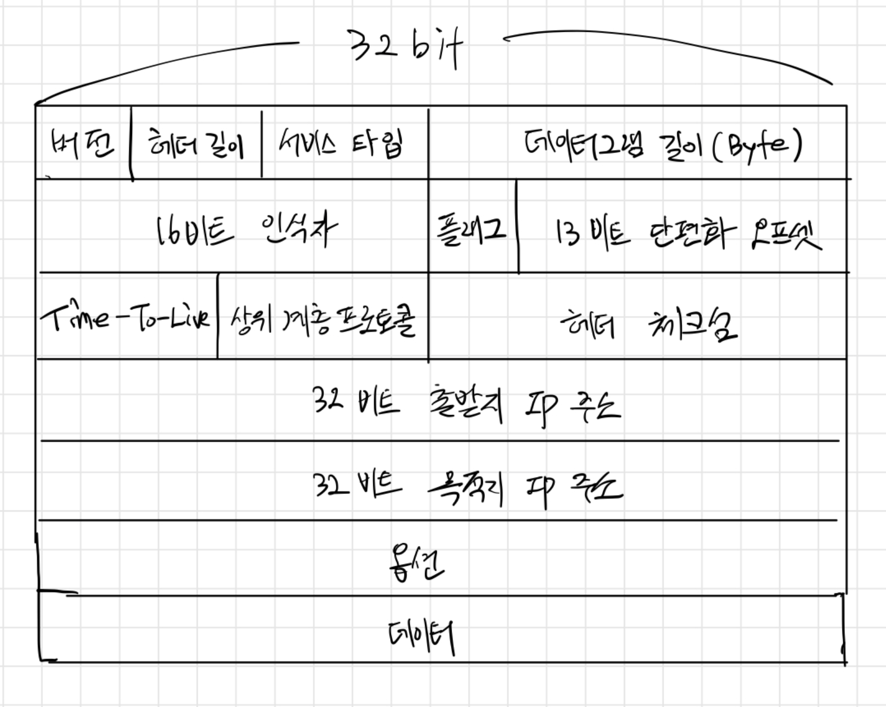
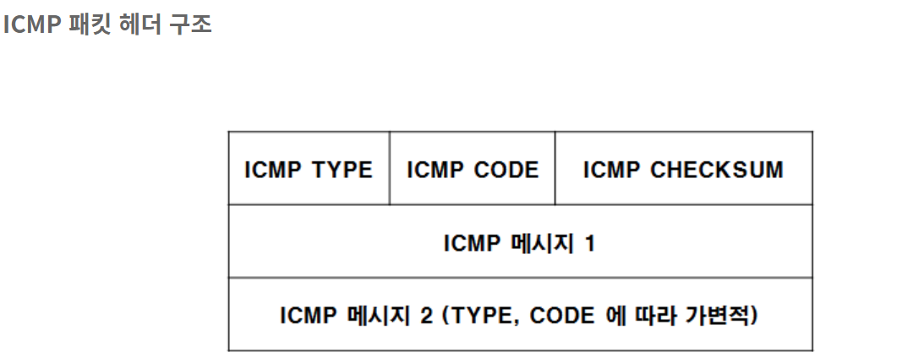
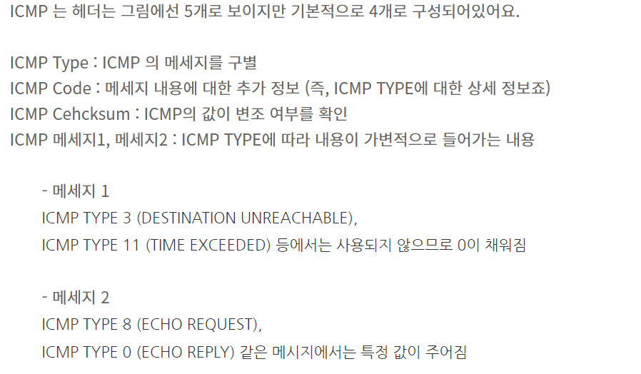
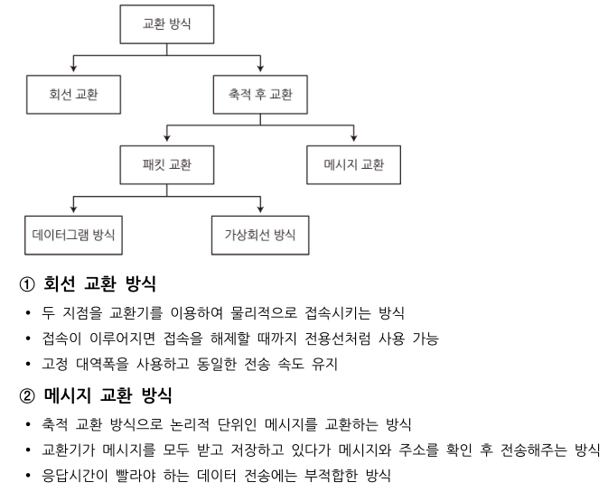
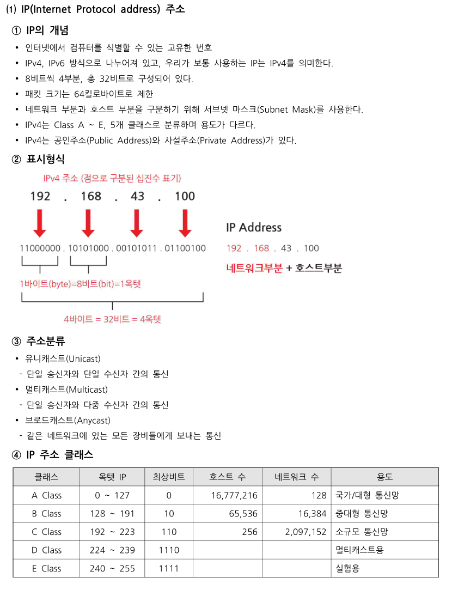
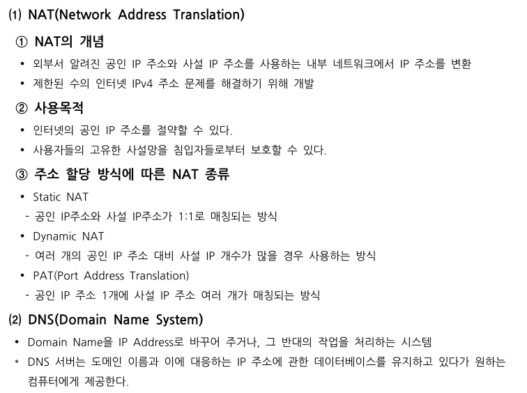

# 인터넷 프로토콜 IPv4 주소체계

## 데이터그램 포맷

데이터그램(Datagram): 인터넷을 통해 전달되는 정보의 기본 단위

우선 네트워크 계층은 출발지인 호스트에서 트랜스포트 계층 프로토콜인 TCP,UDP의 세그먼트를 받아서 캡슐화하고 전달한다. 

그리고 이 때 네트워크 계층에서 움직이는 패킷을 '데이터그램'이라고 한다.

###### 아래의 사진은 IPv4 데이터그램 포맷



```markdown
**버전 번호**: 4비트로 데이터그램의 IP 프로토콜 버전을 명시. 
   다른 버전의 IP는 다른 데이터그램 형식을 사용하기 때문에 라우터는 버전 번호를 확인하여 
   데이터그램의 나머지 부분을 어떻게 해석하는지 결정한다. 

**헤더 길이**: IPv4 데이터그램은 헤더에 가변 길이의 옵션을 포함하기 때문에 4비트의 
   헤더 길이를 통해 IP 데이터그램에서 실제 *페이로드*가 시작하는 곳을 명시해줍니다. 
   대부분 IPv4 데이터그램은 옵션을 포함하지 않아서 데이터그램의 헤더는 20바이트가 통상적.
   위 그림에서 <옵션> 부분을 없애면 32 bit씩 5줄이니까 20바이트가 된다. 
   (출발지,목적지 IP는 하나로)

**서비스 타입**: 서비스 타입 비트는 서로 다른 유형의 IP 데이터그램을 구별합니다. 
   예를 들어, 실시간 데이터그램(IP 통신 어플리케이션)과 비실시간 트래픽(FTP)을 구분할 수 있다.

**데이터그램 길이**: 바이트로 계산한 IP 데이터그램(헤더와 데이터)의 전체 길이입니다. 
   이 필드의 크기는 16비트이므로 IP 데이터그램의 이론상 최대 길이는 65,536(2^16)바이트이지만 
   1,500바이트보다 큰 경우는 거의 없으므로 최대 크기의 이더넷 프레임의 페이로드 필드에 
   IP 데이터그램이 장착될 수 있다.

**식별자, 플래그, 단편화 오프셋**: 세 필드는 *IP 단편화*와 관계가 있다. 

**TTL(Time-To-Live)**: 이 필드는 네트워크에서 데이터그램이 무한히 순환하지 않도록 합니다. 
   라우터가 데이터그램을 처리할 때마다 값을 감소시켜서 TTL 필드값이 0이 되면 
   라우터는 데이터그램을 폐기한다.

**상위 계층 프로토콜**: 이 필드는 일반적으로 IP 데이터그램이 최종 목적지에 도달했을 때만 
  사용합니다. 이 필드값은 IP 데이터그램에서 데이터 부분이 전달될 목적지의 전송 계층의 
  특정 프로토콜을 명시하는데요. 
  예를 들어, 이 필드값이 "6"이면 데이터 부분을 TCP로, "17"이면 UDP로 데이터를 전달하라는 뜻.

**헤더 체크섬**: 헤더 체크섬은 라우터가 수신한 IP 데이터그램의 비트 오류를 
   탐지하는 데 도움을 줍니다. 

**출발지와 목적지 IP 주소**: 출발지가 데이터그램을 생성할 때, 자신의 IP 주소를 
   출발지 IP 주소 필드에 삽입하고 목적지 IP 주소를 목적지 IP 주소 필드에 삽입. 

**옵션**: 옵션 필드는 IP 헤더를 확장합니다.

**데이터(페이로드)**: 데이터그램이 존재하는 이유이자 가장 중요한 마지막 필드입니다. 
   대부분의 경우에 IP 데이터그램의 데이터 필드는 목적지에 전달하기 위해 
   전송 계층 세그먼트 (TCP, UDP)를 포함하지만, *ICMP 메시지*와 같은 다른 유형의 데이터를 
   담기도 합니다.
```

```markdown
**용어 정리**
페이로드
 - 전송되는 데이터를 의미
   예를 들어 운송업에서 해당 물건을 운송해주고 나면 고객은 오직 해당 물건의 무게만큼의
   	비용을 지급하는 것과 같다.

IP 단편화
 - 단편화(Fragmentaion): 주기억장치에 프로그램을 할당하고 반납하는 과정에서 발생하는 
   사용되지 않는 작은 조각 공간
 - IP 단편화: 패킷을 MTU 이하의 조각으로 분할하는 것을 단편화, 분할된 조각을 단편이라고 한다.
 - MTU(Maximum Transmission Unit)이란?
   네트워크에 연결된 장치가 받아들일 수 있는 최대 데이터 패킷 크기를 말한다.
   
ICMP 메시지
 - Internet Control Message Protocol: 인터넷 제어 메시지 프로토콜로 
   오류 메세지를 전송받는데 주로 쓰인다.
```






### 데이터 교환 방식



---


## IPv4 주소 체계



## 네트워크 주소변환 NAT

