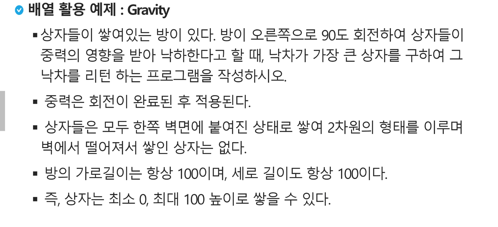
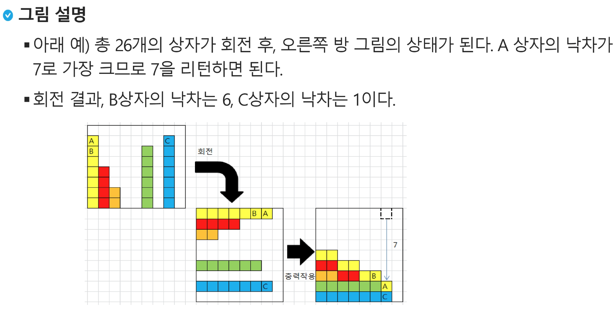

##### 알고리즘이란

문제를 해결하기 위한 절차나 방법

컴퓨터 분야에서 알고리즘을 표현하는 방법은 크게 두가지

1. 의사코드
2. 순서도

알고리즘의 성능은 무엇으로 측정하는가?

정답이라기 보단 보다 좋은 알고리즘이 있을 뿐이다.

---

상수인 고정된 계산은 C로 표기한다 

1Ghz = 10억번 연산 = 1초 연산 시간

---

##### 배열

---

---

##### 정렬

정렬 : 2개 이상의 자료를 특정 기준에 의해 작은 값부터 큰 값(ascending), 혹은 그 반대의 순서대로(descending) 재배열하는 것.

정렬 방식의 종류

- 버블 정렬 : 첫 번째 원소부터 인접한 원소끼리 계속 자리를 교환하면서 맨 마지막 자리까지 이동.
  - 시간 복잡도 O(n^2t)
- 카운팅 정렬 : 항목들의 순서를 결정하기 위해 집합에 각 항목이 몇 개식 있는지 세는 작업을 하여, 선형 시간에 정렬하는 효율적인 알고리즘 (보통 100만 까지만 사용)
  - 제한 사항 : 정수나 정수로 표현할 수 있는 자료에 대해서만 적용 가능 
    - 각 항복의 발생 회수를 기록하기 때문.
  - 시간 복잡도 O(n+k) ==> n은 리스트 길이, k는 정수의 최대값
- 선택 정렬
- 퀵 정렬
- 삽입 정렬
- 병합 정렬

안전한 방법 : 완전탐색