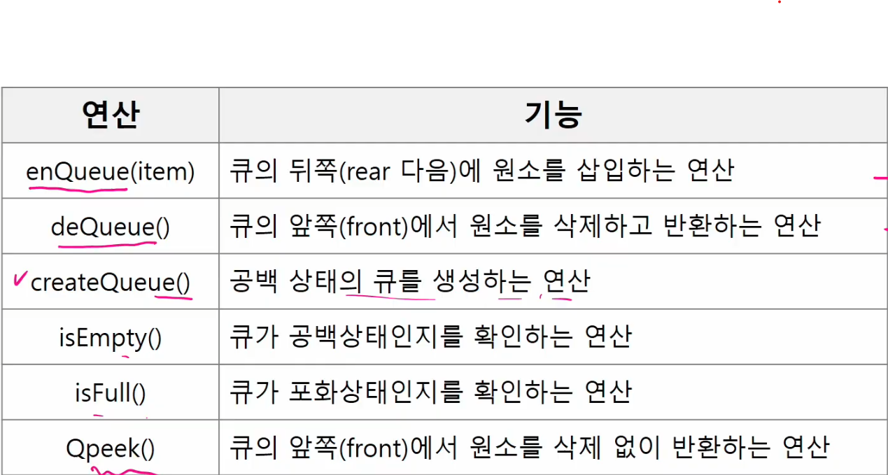
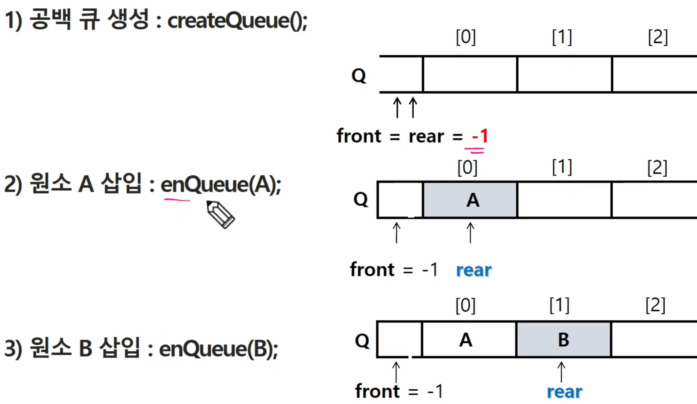
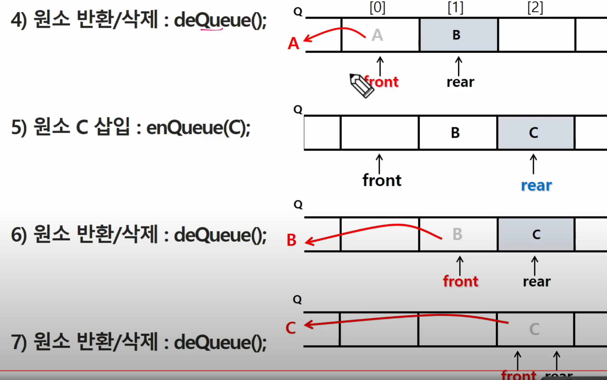
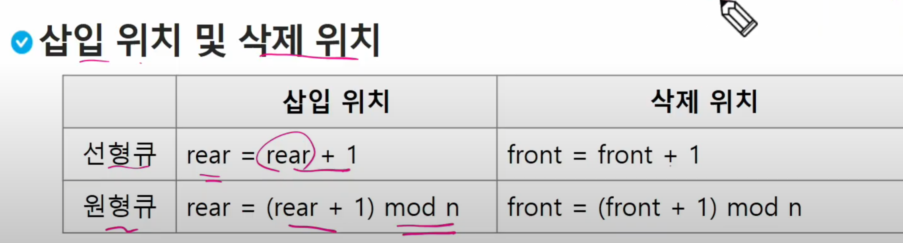

##### 큐의 선입선출 구조

Rear(꼬리) : 삽입 되는 곳으로 저장된 원소 중 마지막 원소

Front(머리) : 저장된 원소 중 첫 번째 원소(또는 삭제된 위치)


큐의 기본 연산						 스택의 기본 연산

삽입 : enQueue						push

삽제 : deQueue						pop











---


##### 큐의 구현


front 는 마지막으로 꺼낸 위치

rear 는 마지막 저장된 위치


```python
# 초기 공백 큐 생성
queue = [0]*n
front = rear = -1

# ===================================
# 삽입 : enQueue(item)
def enQueue(tiem):
    global rear
    if isFull():
        print('Queue Full')
    else:
        rear += 1
        queue[rear] = item
# ===================================
# 삭제 : deQueue()
# 가장 앞에 있는 원소를 삭제하기 위해
# 1. front 값을 하나 증가시켜 큐에 남아있게 될 첫 번째 원소 이동
# 2. 새로운 첫 번째 원소를 리턴 함으로써 삭제와 동일한 기능함.
def deQueue():
    global front
    if isEmpty() > Queue_Empty():
    else: front += 1
    	return Q[front]
# ===================================
# 공백상태 : front == rear
# 포화상태 : rear == n-1
# ===================================
# 검색 : Qpeek()
# 가장 앞에 있는 원소를 검색하여 반환하는 연산
```


```python
# 원형 큐의 구조
# 초기 공백 상태
front = rear = 0
```




원형 큐에서는 front는 항상 비워져있는 상태로 만들어줌.


문제 풀이에서는 선형큐를 사용하게 될 것.


---


##### 버퍼

버퍼 : 데이터를 한 곳에서 다른 한 곳으로 전송하는 동안 일시적으로 그 데이터를 보관하는 메모리의 영역

버퍼링 : 버퍼를 활용하는 방식 또는 버퍼를 채우는 동작을 의미한다.


---


DFS  => 재귀, 반복 사용 , 구현은 재귀의 단계 or 스택으로 구현

BFS => 반복으로 구현, 인접 거리순으로 탐색, 큐로 구현

 

미로, 그래프

A -> B : 경로가 있는가?

DFS, BFS 모두 가능


A -> B : 경로의 개수는?

DFS 사용가능


A -> B 최단 경로의 길이는?

DFS, BFS 모두 가능하지만 주로 BFS를 사용


---


##### 탐색


빠짐없이, 중복 없이 -> DFS, BFS

최단거리 -> DFS, BFS

경우의 수 -> DFS

확산(출발이 여러 곳) -> BFS 


---


스택과 큐를 이용하는 
BFS, DFS 다시 공부하기
