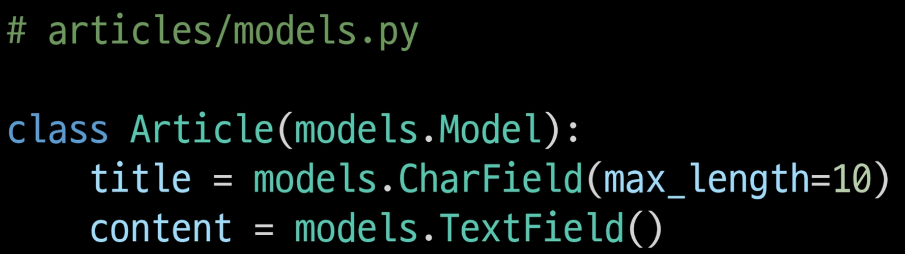

### URL namespace

각 앱의 urls.py에 app_name 작성

그러면 URL tag의 작성도 

- 기존 : 
- 변경 :  이렇게 작성하지 않으면 NoReverceMatch 발생

### Template namespace

장고는 기본적으로 app_name/templates/ 경로에 있는 템플릿 파일들만 찾을 수 있기에 물리적으로 앱의 이름을 딴 폴더를 각 앱의 템플릿 폴더 안에 만들어서 각각 가질 수 있도록 사용

---

### Database

* 체계화된 데이터의 모임
* 검색 및 구조화 같은 작업을 보다 쉽게 하기 위해 조직화된 데이터를 수집하는 저장 시스템

model.py 작성

- 모델 클래스를 작성하는 것은 데이터베이스 테이블의 스키마를 정의하는 것
- 모델 클래스 == 테이블 스키마

여러가지 필드중 max_length 는 CharField의 필수 인자이며 데이터베이스와 장고의 유효성 검사에서 활용됨

---

### Migrations

python manages.py makemigrations

python manages.py migrate

makemigrations로 인해 만들어진 설계도는 파이썬으로 DB는 SQL로 다른 언어로 되어 있기에 ORM을 통해 해석을 해준다.

### ORM(Object Relational Mapping)

객체 지향 프로그래밍 언어를 사용하여 호환되지 않는 유형의 시스템 간에 데이터를 변환하는 프로그래밍 기술

---

### 추가 필드 정의

created_at = models.DateTimeField(auto_now_add=True) : 최초 생성 일자

updated_at = models.DateTimeField(auto_now=True) : 최종 수정 날자

---

장고는 ORM  관련 구문 연습을 위해 Shell을 이용

---

### QuerySet API

Article.objects.all() : 모델 클래스 + 매니저 + QuerySet API

objects manager : 장고 모델이 데이터베이스 쿼리 작업을 가능하게 하는 인터페이스, DB를 파이썬 클래스로 조작할 수 있도록 여러 메서드를 제공하는 manager

Query : 데이터베이스에 특정한 데이터를 보여달라는 요청

QuerySet : 데이터베이스에게 전달 받은 객체 목록 (데이터 모음)

API CRUD

- Create : article.save()
- Read : Article.objects.all()
- Update : article.title = 'byebye'
- Delete : article.delete()

redirect : 인자에 작성된 곳으로 요청을 보냄

302 Found : HTTP response status code 중 하나로 해당 상태 코드를 응답 받으면 브라우저는 사용자를 해당 URL의 페이지로 이동 시킴

403 Forbidden : 서버에 요청이 전달되었지만, 권한 때문에 거절로 즉 게시글을 작성할 권힌이 없다.

HTTP response status code 응답의 유형

- 1xx : informational responses
- 2xx : Successful responses
- 3xx : Redirection messages
- 4xx : Client error responses
- 5xx : Server error responses 

Get : CRUD의 R 을 담당

POST : CRUD의 CUD 를 담당

CSRF : method가 Post였을 경우  꼭 사용해야 사용자의 데이터에 임의의 난수 값을 부여하여 매 요청시 해당 난수 값을 포함시켜 전송 시키도록 한다. 하지 않을 시 403 Fobidden

---

모든 게시물마다 뷰 함수와 템플릿 파일을 만들 수 없기에 글의 번호인 PK를 활용하여 하나의 뷰 함수와 템플릿 파일로 대응

---

Admin 계정 생성

python manage.py createsuperuser

---

### 최종 정리

Model : 장고는 모델을 통해 데이터에 접속하고 관리

ORM : 객체지향 프로그래밍을 이요한 DB조작

Migrations : 모델에 생긴 변화(필드 추가, 모델 삭제 등)를 DB에 반영하는 방법

HTTP request & response : 요청에 행동을 표현하는 HTTP request method