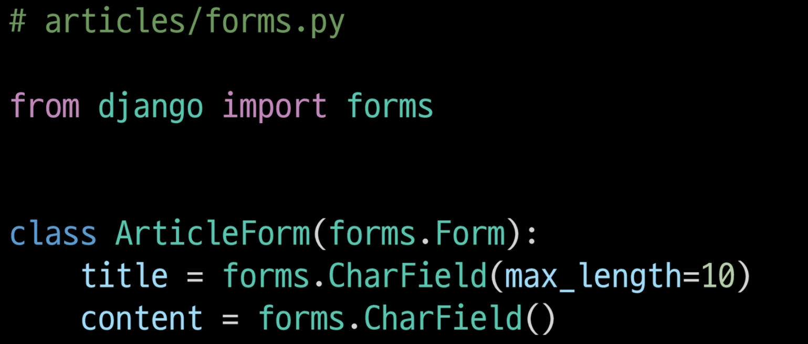
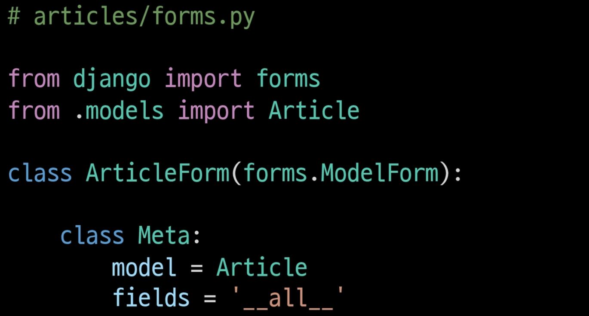
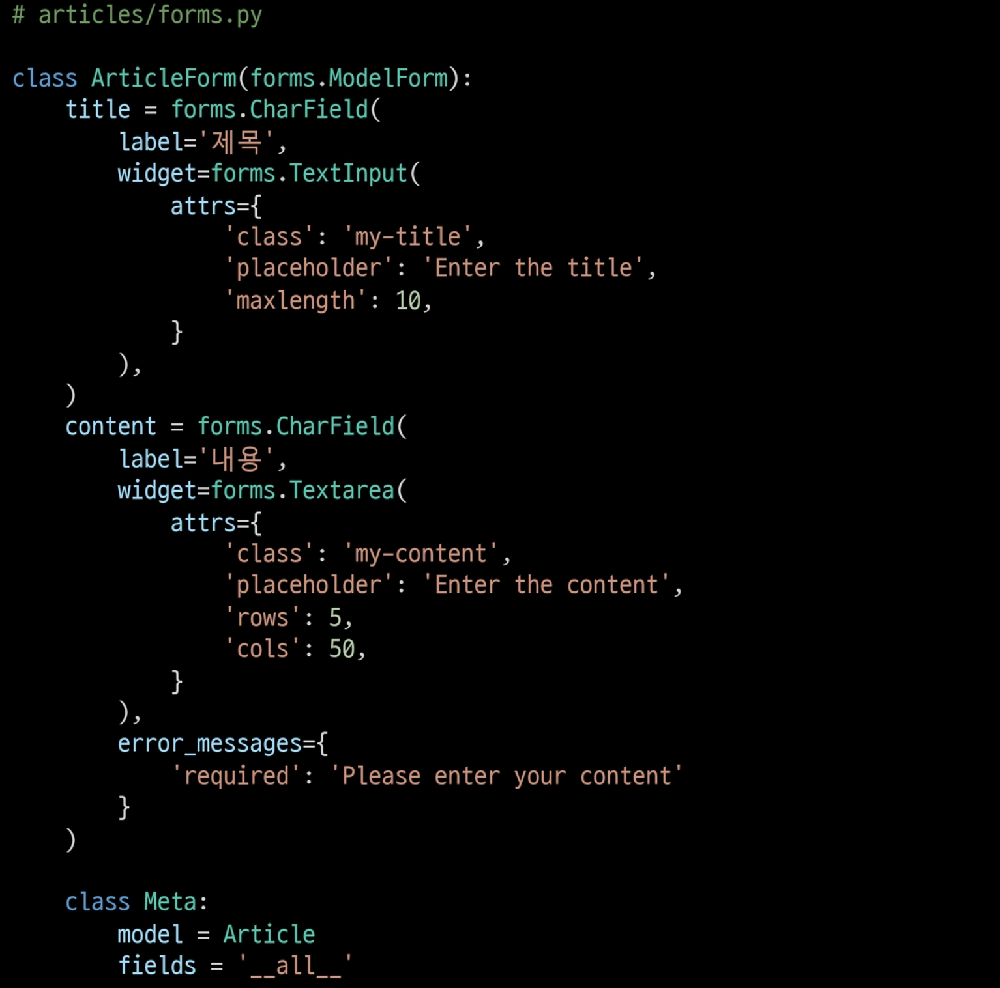
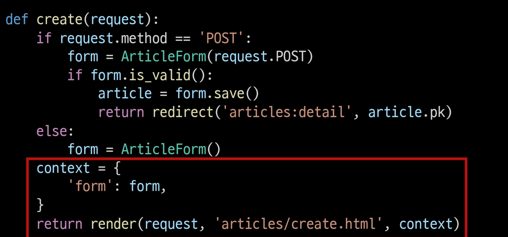
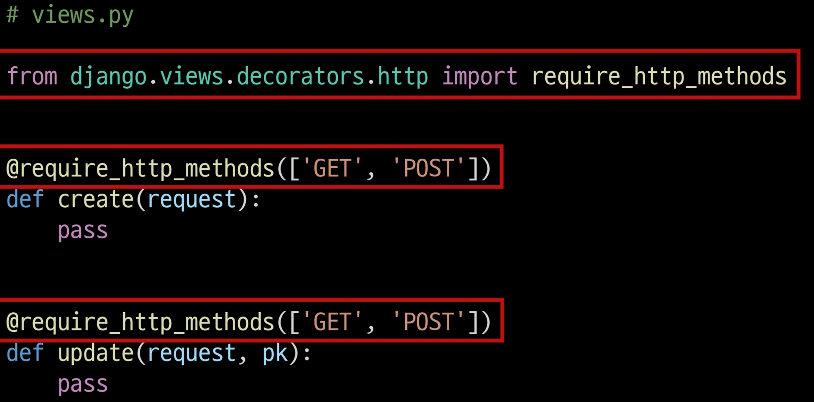
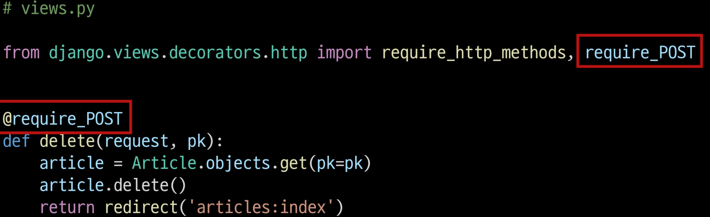
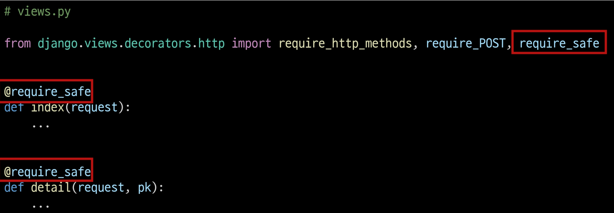

### Django Form 

 

Django Form 

- 사용자가 입력한 데이터가 우리가 원하는 데이터 형식이 맞는지에 대한 유효성 검증이 반드시 필요로 한데 

- Django Form 은 이 과정에서 과중한 작업과 반복 코드를 줄여줌으로써 훨씬 쉽게 유효성 검증을 진행할 수 있도록 만들어 준다.
- 장고는 form 과 관련한 유효성 검사를 단순화하고 자동화 할 수 있는 가능을 제공하여, 개발자가 직접 작성하는 코드보다 더 안전하고 빠르게 수행하는 코드를 작성할 수 있다.
- 즉 개발자가 필요한 핵심 부분만 집중할 수 있도록 돕는 프레임워크의 특성을 가진다.
- 장고는 form에 관련된 작업의 세부분을 처리
  1. 렌더링을 위한 데이터 준비 및 재구성
  2. 데이터에 대한 HTML forms 생성
  3. 클라이언트로부터 받은 데이터 수신 및 처리

---

### Form Class 선언

- Form Class 를 선언하는 것은 모델 클래스를 선언하는 것과 비슷하다.
- 모델과 마찬가지로 상속을 통해 선언

- form 에는 모델 필드와 달리 TextField 가 존재하지 않다.
- {} : as_p 를 통해 각각의 필드가 p 태그로 감싸져서 렌더링

장고의 2가지 HTML input 요소 

1. Form Fields
   - 입력에 대한 유효성 검사 로직을 처리
   - 템플릿에서 직접 사용됨
   - forms.CharField()
2. Widgets
   - 웹 페이지의 HTML input 요소 렌더링을 담당
     - input 요소의 단순한 출력 부분을 담당
   - 장고의 HTML input 요소의 표현을 담당하며 유효성 검증과 아무런 관계가 없다.
   - Widgets은 반드시 Form Fields에 할당 됨
   - forms.CharField(widget=forms.Textarea)

---

### Django ModelForm

Django ModelForm 

- form Class 를 작성하면서 모델이랑 너무 중복되는 부분이 많은데?
- ModelForm을 사용하면 이러한 Form을 더 쉽게 작성할 수 있다.
- Form과 똑같은 방식으로 View 함수에서 사용
- Forms 라이브러리에서 파생된 ModelForm 클래스를 상속받음
- 어떤 모델을 기반으로 form을 작성할 것인지에 대한 정보를 Meta 클래스에 지정

Meta 클래스에서 model과 fields 변수명을 똑같이 해줘야함.

Meta data : 데이터를 표현하기 위한 데이터

여기서 medel = Article 로 클래스를 호출하지 않고 이름만 작성하는 이유는 필요할 때 호출하기 위해서.

---

### ModelForm with view functions

유효성 검사

{{변수}}.is_valid() : 데이터가 유효한지에 대한 여부를 boolean 으로 반환 

save() method

- form 인스턴스에 바인딩 된 데이터를 통해 데이터베이스 객체를 만들고 저장
- ModelForm의 하위 클래스는 키워드 인자 instance 여부를 통해 생성할 지, 수정할 지를 결정함

생성시 

form = ArticleForm(request.POST)

form.save()

수정시

form = ArticleForm(request.POST, instance=article)

form.save()

instance : 수정이 되는 대상

Form과 ModelForm의 차이

- Form : 사용자로부터 받는 데이터가 DB와 연관되어 있지 않는 경우 

- ModelForm : 사용자로부터 받는 데이터가 DB와 연관되어 있는 경우

  - 데이터의 유효성 검사가 끝나면 데이터를 각각 어떤 레코드에 맵핑해야 할지 이미 알고 있기 때문에 곧바로 save() 호출이 가능

  

  

---

### Widgets 활용

---

### Handling HTTP requests

Handling HTTP requests

- 공통점

  - new-create : 모두 CREATE 로직을 구현하기 위한 공통 목적

  - edit-update : 모두 UPDATE 로직을 구현하기 위한 공통 목적

- 차이점

  - new-edit 은 GET 요청에 대한 처리
  - create-update 는 POST 요청에 대한 처리만을 진행

  

context의 들여쓰기 위치 조심

 

---

### View decorators

View decorators

- 기존에 작성된 함수에 기능을 추가하고 싶을 때, 해당 함수를 수정하지 않고 기능을 추가해주는 함수

405 Method Not Allowed : 요청 방법이 서버에게 전달 되었으나 사용 불가능한 상태

require_http_methods() : View 함수가 특정한 요청 method만 허용하도록 하는 데코레이터

require_POST : View 함수가 POST 요청 method 만 허용하도록 하는 데코레이터

require_safe : View 함수가 GET요청 method 만 허용하도록 하는 데코레이터

---

### 정리 

Django Form Class

* 장고 프로젝트의 주요 유효성 검사 도구
* 공격 밑 데이터 손상에 대한 중요한 방어 수단
* 유효성 검사에 대해 개발자에게 강력한 편의를 제공

View 함수 구조 변화

- HTTP requests 처리에 따른 구조 변화