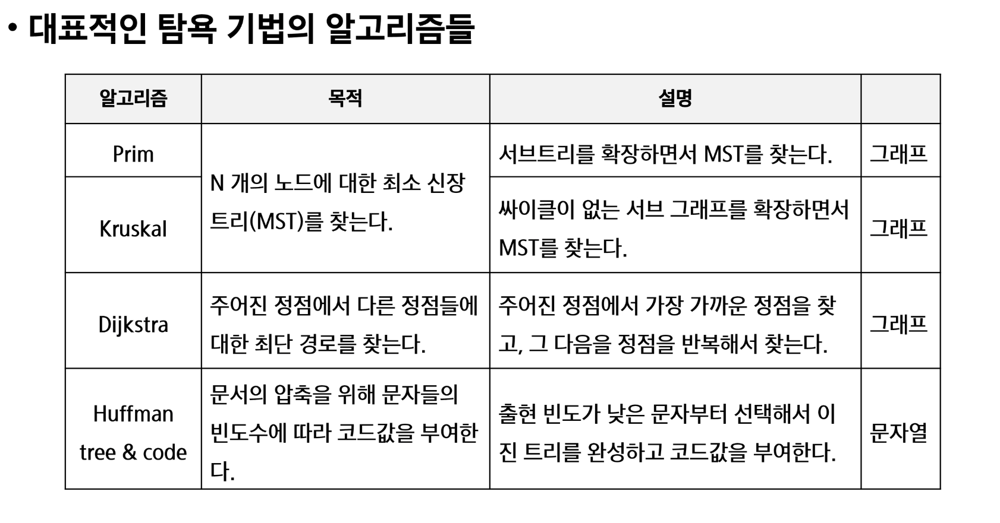

brute-force (고지식한 방법)

상대적으로 빠른 시간에 문제 해결을 할 수 있다

문제에 포함된 자료의 크기가 작다면 유용하다

자료들의 리스트에서 키 값을 찾기 위해 첫 번째 자료부터 비교하면서 진행한다.


완전 검색

많은 종류의 문제들이 특정 조건을 만족하는 경우나 요소를 찾는 것

또한 이들은 순열, 조합 그리고 부분집한과 같은 조합적 문제들과 연관된다.


완전 검색은 조합적 문제에 대한 brute-force 방법이다.


---


### 순열 

서로 다른 것들 중 몇개를 뽑아서 한 줄로 나열하는 것

서로 다른 n개 중 r 개를 택하는 순열은

```python
nPr = n*(n-1)*(n-2)*...*(n-r-1)       마지막에 n-r-1 이라고 하는 이유는 시작을 n-0 부터 하는 것이기에 1 감소 한다
nPr = n!/(n-r)!


nPn = n! 이라고 표기하며 Factorial 이라 부른다.
n! = n*(n-1)*(n-2)*...*2*1
```


다수의 알고리즘 문제들은 순서화된 요소들의 집합에서 최선의 방법을 찾는 것과 관련이 있다.

TSP(Traveling Salesman Problem)


N 개의 요소들에 대해서 n! 개의 순열들이 존재한다.

12! = 479,001,600

n > 12 인 경우, 시간 복잡도가 폭발적으로 증가


단순하게 순열을 생성하는 방법

```python
# {1,2,3}을 포함하는 모든 순열을 생성하는 함수
# 동일한 숫자가 포함되지 않았을 때, 각 자리 수 별로 loop를 이용해 아래와 같이 구현할 수 있다

for i in range(1,4):
    for j in range(1,4):
        if i != j:
            for k in range(1,4):
                if k != i and k != j:
                    print(i,j,k)
```


재귀를 사용한 순열 생성방법 (1)

```python
# 재귀호출
# p[]: 데이터가 저장된 배열
# i:선택된 원소의 수, k: 원소의 개수,
def f(i, k):
    global cnt
    if i == k:      # 인덱스 i == 원소의 개수
        cnt +=1
        print(p)
    else:
        for j in range(i,k):
            p[i], p[j] = p[j], p[i]
            f(i+1,k)
            p[i], p[j] = p[j], p[i]

cnt = 0
p = [1,2,3,4,5]
f(0,5)
print(cnt)
```


재귀를 사용한 순열 생성방법 (2)

```python
# 위아래 서로 다른 접근 순서이기에 둘다 알고 있어야 할 듯

def f(i,n):
    if i == n:
        print(p)
    else:
        for j in range(n):      # uesd 는 처음부터 끝까지 가는 것니까
            if used[j] == 0 :   # a[j] 가 아직 사용되지 않았으면
                used[j] = 1     # a[j] 가 사용됨으로 표시
                p[i] = a[j]     # p[i] 는 a[j] 로 결정
                f(i+1, n)       # p[i+1] 값을 결정하러 이동
                used[j] = 0     # a[j]를 다른 자리에서 쓸 수 있도록 해제

N = 3
a = [i for i in range(1,N+1)]
p = [0]*N
used = [0]*N
f(0,N)
```


재귀를 사용한 순열 생성방법 (3) -->아래는 N에서 R개 만큼만 고르는 경우

```python
def f(i,n,r):
    if i == r:
        print(p)
    else:
        for j in range(n):      # uesd 는 처음부터 끝까지 가는 것니까
            if used[j] == 0 :   # a[j] 가 아직 사용되지 않았으면
                used[j] = 1     # a[j] 가 사용됨으로 표시
                p[i] = a[j]     # p[i] 는 a[j] 로 결정
                f(i+1, n,r)       # p[i+1] 값을 결정하러 이동
                used[j] = 0     # a[j]를 다른 자리에서 쓸 수 있도록 해제

N = 3
R = 2
a = [i for i in range(1,N+1)]
used = [0]*N
p = [0]*R
f(0,N,R)
```


---


### 조합


서로 다른 n개의 원소 중 r개를 순서 상관 없이 골라낸 것을 조합이라고 부른다.


조합의 수식


nCr = n!/(n-r)!*r!

nC0 = 1


반복문을 사용한 조합  구하기

```python
N = 10
for i in range(N-2):
    for j in range(i+1,N-1):
        for k in range(j+1,N):
            print(i,j,k)
```


재귀를 사용한 조합 구하기

```python
def nCr(n,r,s) # n개에서 r개를 고르는 조합, s 선택할 수 있는 구간의 시작
	if r == 0:
        print(*comb)
    else:
        for i in range(s,n-r+1):
            comb[r-1] = A[i]
            nCr(n,r-1,i+1)
```


선택(순열,조합,부분집합)

행동

결과 비교


---


탐욕(Greedy) 알고리즘

일단 한번 선택된 것을 번복하지 않는다. 

이런 특성 떄문에 대부분의 탐욕 알고리즘들은 단순하며, 또한 제한적인 문제들에 적용된다.


1. 해 선택: 현재 상태에서 부분 문제의 최적 해를 구한 뒤, 이를 부분해 집합에 추가

2. 실행 가능성 검사: 새로운 부분 해 집합이 실행가능한지를 확인한다.

3. 해 검사: 새로운 부분 해 집합이 문제의 해가 되는지를 확인한다.

   ​				아직 전체 문제의 해가 완성되지 않았다면 1의 해 선택부터 다시 시작한다.


---


배낭 짐싸기(Knapsack) 문제의 정형적 정의

S = {item,item2}

Wi : item의 무게

W: 배낭이 수용가능 한 총 무게


배낭 짐싸기(Knapsack)에 대한 완전 검색 방법

- 완전 검색으로 물건들의 집합 S 에 대한 모든 부분집합을 구하고
- 부분집합의 총무게가 W를 초과하는 집합들을 버리고, 나머지 집합에서 총 값이 가장 큰 집합을 선택
- 단 시간 복잡도가 지수적으로 증가


DP는 완전탐색 기법중 하나이다.


대표적인 탐욕(Greedy) 기법의 알고리즘




