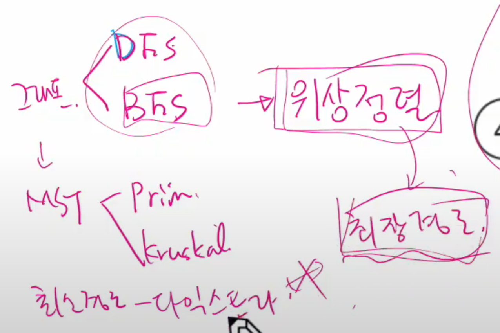

그래프

- 아이템들과 이들 사이의 연결 관계
- 정점들의 집합과 이들을 연결하는 간선들의 집합으로 구성된 자료 구조

IVI :정점의 개수, IEI :그래프에 포함된 간선의 개수

IVI 개의 정점을 가지는 그래프는 최대 IVI(IVI-1)/2 간선이 가능

ex). 5개의 정점이 있는 그래프의 최대 간선 수는 10 (5*4/2)개 이다. 

선형 자료구조나 트리 자료구조로 표현하기 어려운 N:N 관계를 가지는 원소들을 표현하기에 용이하다.

그래프의 유형

- 무향 그래프(Undirected Graph)

- 유향 그래프(Directed Graph)

- 가중치 그래프(Weighted Graph) --> 방향에 비용이 있는 것

- 사이클 없는 방향 그래프(DAG, Directed Acyclic Graph)

- 완전 그래프 :정점들에 대해 가능한 모든 간선들을 가진 그래프

- 부분 그래프 :원래 그래프에서 일부의 정점이나 간선을 제외한 그래프

- 인접 :두 개의 정점에 간선이 존재(연결됨)하면 서로 인접해 있다고 한다.

  ​		그래서 완전 그래프에 속한 임의의 두 정점들은 모두 인접해 있다.

그래프의 표현

- 간선의 정보를 저장하는 방식, 메모리나 성능을 고려해서 결정
- 인접 행렬 (Adjacent matrix)
  - IVI(정점)*IVI 크기의 2차원 배열을 이요해서 간선 정보를 저장
  - 배열의 배열(포인터 배열)
  - IVI*IVI 정방 행렬
  - 행 번호와 열 번호는 그래프의 정점에 대응
  - 두 정점이 인접되어 있으면 1, 그렇지 않으면 0으로 표현
- 인접 리스트 (Adjacent List)
  - 각 정점마다 해당 정점으로 나가는 간선의 정보를 저장
- 간선의 배열
  - 간선(시작 정점, 끝 정점)을 배열에 연속적으로 저장

---

그래프 순회

- 비선형 구조인 그래프로 표현된 모든 자료(정점)를 빠짐없이 탐색하는 것을 의미

두 가지 방법

- 깊이 우선 탐색(DFS)
- 너비 우선 탐색(BFS)

