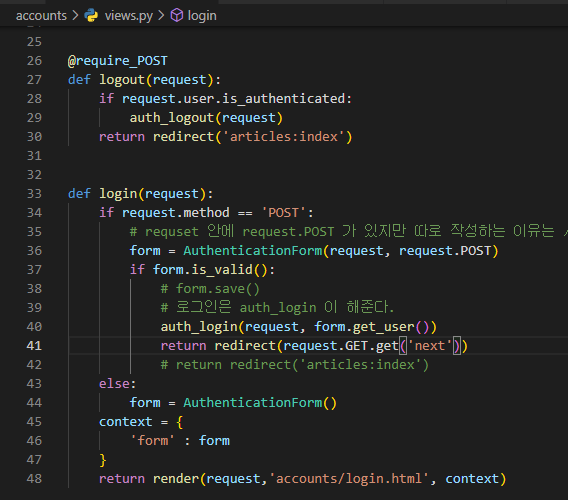

1. 로그인
2. 게시글 - user 정보 필요
3. 댓글 - user+게시글 필요

---

(순서는게시글 -> 로그인 -> 댓글 순서로 할 예정)

.settings.py 에서 작성

INSTALLED_APPS = [

  'articles',

LANGUAGE_CODE = 'ko-kr'

TIME_ZONE = 'Asia/Seoul'

---

=== 설치 순서 ===

$ python -m venv venv

$ source venv/Scripts/activate

$ pip install django==3.2.13

$ pip freeze > requirementes.txt

$ django-admin startproject {{ 프로젝트 명 }} .

$ python manage.py startapp articles ( 앱 이름은 복수형으로 만들어주기 )

작업 순서는

요청 -> url -> view -> template

------

앱 생성 후

crud의 urls.py 에

  path('articles/', include('articles.urls')) 작성하여 urls을 찾아 갈 수 있도록 해주기.

이후 해당 앱의 urls.py 를 생성 후 작성하기

---

보통 base.html 은 각 앱들마다 만들어 주게 되지만 우선 공통적으로 사용할 것이라면

  최상위 폴더에 만들면된다. ( 프로젝트와 앱을이 폴더로 되어있는 폴더에 templates 폴더 생성 후 base.html 생성)

주의 할 것은 extend 를 할 때는 최상단에 아무것도 작성하면 안된다.

---

모델을 생성 후 

$ python manage.py makemigrations 를 하여 DB 설계도를 만들게 되면 아래와 같이 폴더가 생성이 되고

DB를 생성 하려 하면 

$ python manage.py migrate 실행 후 아래와 같이 DB가 생성이 된다.

---

게시글을 보여주기 위해서는 어떤 데이터를 보여줄지를 알려줘야하기에 

from models import Article 하여 모델을 불러오고

데이터를 articles에 넣고 context에 담에 딕셔너리 값으로 보내주기

DTL 인 태그 요소를 이용하여 하나씩 보여주기

---

create

create.html 에 하나하나씩 입력 태그를 넣고 하기에는 너무 일이 많아지기에

Form 을 이용하여 모델을 가져와 한번에 적용하기 위해 forms.py 를 해당 어플리케이션 안에 생성한다.

---

detail 만들기

여기서 index 페이지에서 해당 제목이나 글을 선택시 원하는 detail 번호로 가려 하는데

위의 사진처럼 하게 되면 no reverse match  에러가 나온다.

그래서 아래의 사진처럼 a 태그 안에 article_pk 를 넣어줘야한다.

for 문 안에 넣어야 해당 article.pk 에 맞는 디테일 페이지를 보여주게 된다!!

---

다른 과정을 넘어서 댓글을 다는 1:N 을 작성하려한다.

1번 게시글에 단 댓글이라는 것을 몇번 게시글에 넣은 것인지에 대한 정보를 넣어준다.

댓글 생성은 해당 디테일 페이지에서 하기때문에 

Comment 에 대한 form 을 사용해야하기에 생성

views.py 에서 detail 수정

 위와 같이 작성하고 실행을 하게 되면

위와 같이 생성이 되기에

모든 필드 요소가 아니라 article에 대한 요소는 제외하고 출력하도록 한다.

---

accounts 앱 만들기

 url.py 생성

view.py 에서 signup 함수를 작성하는데 

이때 form 에 대한 입력 요소를 하나하나 하기엔 너무 많기에

아래의 사진과 같이 model을 만들어서 사용하려는데 

이때 기존 user 를 사용하지 않도록 AbstractUser 를 불러와서 적용시켜준다.

UserCreationForm 을 사용하기만 하면 오류가 나는 이유는

UserCreationForm 은 기존의 User를 사용하기 때문에 

우리는 accounts.user 를 사용하려 하기 때문에 CustomUserCreationForm 을 사용하는 것이다,

그래서 CustomUserCreationForm는 UserCreationForm 을 상속받고

UserCreationForm 안에 있는 Meta 데이터에 있는 기존 model은 AUTH_USER_MODEL 인데  

이것을 get_user_model()로 변경해준다면 모두 수정이 된다.

---

회원가입 이후 기존 index 페이지로만 가는 것이 아니라

로그인을 시켜 놓기

어나니머스 유저는 is_authenticated 에 대한 답은 False

user 는 True 를 준다.

---

logout

login을 실행 할 때 request와 user 를 넣어주고

logout 을 실행 할 때는 request 까지만 넣어준다

위와 같이 데코레이터를 작성하게 되면 된다.

우선 account 에 관련된 것들은 계속 작성하면서 외워보자! 

---

urls.py

views.py

login.html

---

게시물을 작성한 작성자를 입력해주기.

유저에 대한 모델의 경우에는 

이렇게 작성한다.

---

### 질문 사항:

매직 메서드의 return 항목에 대한 질문

모델을 변경했기에 적용하려니까

이렇게 문구가 생성된다.

1 : 지금 처리하겠다

이상하게 유저에 대한 목록을 보여주게 되기에 

위와 같이 exclude 를 사용하여  user 목록을 제외 한다.

다만 실행시키면 아래와 같이 user_id 를 제외했기때문에 넣어줘야한다.

그래서 아래의 사진과 같이 create의 form 안에 요청하는 유저의 정보또한 함께 넣어줘야한다.

다만 회원이 아닌 어나니머스 유저가 글을 작성하려하면

이렇게 문구가 뜨기에

이렇게 작성을 해서 로그인을 해야만 글을 작성할 수 있게 만든다.

위와 같이 작성하고 해도 되지만

이렇게만 작성해도 가능하다.

@login_required  을 사용하게 되면 로그인 페이지로 가게 만든다.

위의 주소와 같이 쿼리 스트링 파라미터 값이 들어있는데 

해당 값을 향해 수행이 마치면 갈 수 있도록 

이렇게 작성하면 쿼리의 다음 위치가 있을 때는 가지만

없을 경우 에러가 생기기에  or 문을 사용하여 없는 경우에 가도록 하는 위치로 간다.

---

게시글 삭제

로그인 한 사람만 삭제하고, 게시글을 작성한 사람만 삭제를 해야한다.

그래서 데코레이터를 사용하기보다 

조건을 나누어서 위와 같이 작성을 한다.

이제는 작성자만 삭제 할 수 있도록 하는 방법.

아래의 사진처럼 게시글의 유저와 현재 요청한 유저가 같을 경우만 삭제 할 수 있도록 한다.

