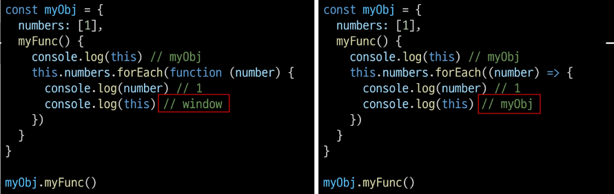

이번 시간에 배울 것은 

DOM (Document Object Model) : 문서 객체 모델로

문서의 구조화된 표현을 제공하며 프로그래밍 언어가 DOM 구조에 접근할 수 있는 방법을 제공한다.

DOM 에서는 HTML 문서를 구조화 하여 각 요소를 객체로 취급한다.

항성 선택부터 먼저.

브라우저는 HTML, CSS, JS 로 구성한다.

JS는 브라우저에서 DOM API를 통해 문서를 동적으로 수정해준다.

태그 하나, 속성 하나들을 Object로 구성한다.

즉 DOM은 웹 페이지의 객체 지향 표현을 의미한다.

그래서 우리는 DOM의 주요 객체들을 활용해서 문서를 조작하거나 특정 요소들을 얻을 수 있다.

DOM의 주요 객체로는

- window: 
  - DOM을 표현하는 창
  - 가장 최상위 객체 (작성 시 생략 가능)
  - 탭 기능이 있는 브라우저에서는 각각의 각각의 window 객체로 나타낸다.
  - 메서드 예시
    - window.open()
    - window.print()
    - window.alert()
- document
  - 브라우저가 불러온 웹 페이지
  - window 보다는 하위 객체이다.
  - 페이지 컨텐츠의 진입점 역할을 하며, <body> 등과 같은 수많은 다른 요소들을 포함하고 있다.
  - document.title = 'ssafy' 를 작성하면 해당 탭 페이지의 이름이 바뀐다.
- navigator, location, history, screen 등이 있지만 

이번 시간은 window와 document 를 배울 것 이다.

파싱 (Parsing)

- 구문 분석, 해석
- 브라우저가 문자열을 해석하여 DOM Tree로 만드는 과정

---

DOM 조작

- Document가 제공하는 기능을 사용해 웹 페이지 문서 조작하기
- DOM 조작 순서
  1. 선택(Select)
  2. 조작(Manipulation)
     - 생성, 추가, 삭제 등

* 선택 관련 메서드
  * document.querySelector(selector)
    * 제공한 선택자와 일치하는 element 한 개 선택
    * 제공한 CSS Selector를 만족하는 첫 번째 element 객체를 반환 (없다면 null 반환)
  * document.querySelectorAll(selector)
    * 제공한 선택자와 일치하는 여러 element를 선택
    * 매칭 할 하나 이상의 셀럭터를 포함하는 유효한 CSS selector를 인자로 받음
    * 제공한 CSS selector를 만족하는 NodeList를 반환

- NodeList
  - index로만 각 항목에 접근 가능
  - 배열의 querySelectorAll()에 의해 반환되는 NodeList는 DOM의 변경사항을 실시간으로 반영하지 음

---

조작 관련 메서드

- document.createElement(tagName): 
  - 작성한 tagmame 작성한 name
  - Node.innerText: Node 객체와 그 자손의 텍스트 컨텐츠를 표현
- Node.innerText
  - Node 객체와 그 자손의 텍스트 컨텐츠(DOMString)를 표현
  - 사람이 읽을 수 있는 요소만 남김
  - 즉, 줄 바꿈을 인식하고 숨겨진 내용을 무시하는 등 최종적으로 스타일링이 적용된 모습으로 표현
- Node.appendChild()
  - 한 Node를 특정 부모 Node의 자식 NodeList 중 마지막 자식으로 삽입
  - 한번에 오직 하나의 Node만 추가할 수 있음
  - 추가된 Node 객체를 반환
  - 만약 주어진 Node가 이미 문서에 존재하는 다른 Node를 참조한다면 현재 위치에서 새로운 위치로 이동

조작 관련 메서드 (속성 조회 및 설정)

- Element.getAttribute(attributeName)
  - 해당 요소의 지정된 값(문자열)을 반환
  - 인자(AttributeName)는 값을 얻고자 하는 속성의 이름

- Element.setAttribute(name, value)
  - 지정된 요소의 값을 설정
  - 속성이 이미 존재한다면 값을 갱신, 존재하지 않으면 지정된 이름과 값으로 새 속성을 추가

속성을 추가하는 건 

- setAttribute

태그 안에 내용은

- innerText

태그를 선택하는 변수 설정은

- const div = document.querySelector('div')

---

Event

- 프로그래밍하고 있는 시스템에서 일어나느 사건 혹은 발생으로, 각 이벤트에 대해 조작할 수 있도록 

  ​	특정 시점을 시스템이 알려주는 것

- 예를 들어 사용자가 웹 페이즈의 버튼을 클릭한다면 클리에 대해 이벤트가 발생하고 우리는 이벤트를 통해 

  ​	클릭이라는 사건에 대한 결과를 받거나, 조작을 할 수 있음

- 클릭 말고도 웹에서는 각양각색의 Event가 존재
  - 키보드 키 입력, 브라우저 닫기, 데이터 제출, 텍스트 복사 등

Evnet object

- DOM 요소는 Event를 받고 수신
- 받은 Event를 처리 할 수 있다
  - Event 처리는 주로 addEventListener()라는 Event 처리기를 다양한 html 요소에 부착해서 처리함

Event handler - addEventListener()

- 대상에 특정 Event가 발생하면, 할 일을 등록하자
- EventTartget.addEventListener(type, listener)
- listener은 콜백 함수

- 지정한 Event가 대상에 전달될 때마다 호출할 함수를 설정
- Event를 지원하는 모든 객체(Element, Document, Window 등)를 대상(Event Target)으로 지정 가능

- Type
  - 반응 할 Event 유형을 나타내는 대소문자 구분 문자열
  - 대표 이벤트
    - input, click, submit 등등
- listener
  - 지정된 타입의 Event를 수신할 객체
  - JavaScript function 객체(콜백 함수)여야 함
  - 콜백 함수는 발생한 Event의 데이터를 가진 Event 객체를 유일한 매개변수로 받음

---

Event 취소

event.preventDefault()

---

로또 번호 추출기

---

자바에서 사용하는 라이브러리 (Lodash)

---

this 

- 어떠한 object를 가리키는 키워드 (파이썬에서는 self)

- JavaScript의 함수는 호출될 때 this를 암묵적으로 전달 받음

- JavaScript에서의 this는 일반적인 프로그래밍 언어에서의 this와 조금 다르게 동작

- JavaScript는 해당 함수 호출 방식에 따라 this에 바인딩 되는 객체가 달라짐

- 즉, 함수를 선언할 때 this에 객체가 결정되는 것이 아니고,

  ​	함수를 호출할 때 함수가 `어떻게` 호출 되었는지에 따라 동적으로 결정됨

this INDEX

1. 전역 문맥에서의 this
2. 함수 문맥에서의 this
   - 단순 호출
   - method(객체의 메서드로서)
   - Nested (함수안에 콜백함수로 사용될때)

전역 문맥에서의 this

- 브라우저의 전역 객체인 window를 가리킴
  - 전역객체는 모든 객체의 유일한 최상위 객체를 의미
  - console.log(this)

함수 문맥에서의 this

- 함수의 this 키워드는 다른 언어와 조금 다르게 동작

  - this의 값은 함수를 호출한 방법에 의해 결정됨
  - 함수 내부에서 this의 값은 함수를 호출한 방법에 의해 좌우됨

-  단순 호출

  - 전역 객체를 가리킴

  - const myFunc = function () {

    ​	consolo.log(this)}

  - 브라우저

    - myFunc() --> window

  - Node.js

    - myFunc()  -> global

- Method

  - 메서드로 선언하고 호출한다면, 객체의 메서드이므로 해당 객체가 바인딩

  - this는 현재 위치의 객체

    

  

- Nested (Function 키워드)

  - forEach의 콜백 함수에서의 this가 메서드의 객체를 가리키지 못하고 전역 객체 window를 가리킴
  - 단순 호출 방식으로 사용되었기 때문
  - 이를 해결하기 위해 등장한 함수 표현식이 바로 '화살표 함수'
  - 함수로 인해 호출이 되었기 때문에 window 를 가리킨다.

  

  - function을 사용하지 않고 => 를 사용하게 되면
  - 자신을 감싸고 있는 전체 객체를 가리키고 있다.

  

- Nested (화살표 함수)
  - 이전에 일반 function 키워드와 달리 메서드의 객체를 잘 가리킴
  - 화살표 함수에서 this는 자신을 감쌈 정적 범위
  - 자동으로 한 단계 상위의 scope의 context를 바인딩

화살표 함수

- 화살표 함수는 호출의 위치와 상관없이 상위 스코프를 가리킴
- Lexical scope
  - 함수를 어디서 호출하는지가 아니라 어디에 선언하였는지에 따라 결정
  - Static scope 라고도 하며 대부분의 프로그래밍 언어에서 따르는 방식
- 따라서 함수 내의 함수 상황에서 화살표 함수를 쓰는 것을 권장

this와 addEventListener

- addEventListener에서의 콜백 함수는 특별하게 function 키워드의 경우
- addEventListener를 호출한 대상을 뜻함
- 반면 화살표 함수의 경우 상위 스코프를 지칭하기 때문에 window 객체가 바인딩 됨
- 결론
  - addEventListener 의 콜백 함수는 function 키워드르 사용하기

---

시험! 

this 가 호출되는 순간에 결정되는 것(런타임) 장점/단점

- 함수(메서드)를 하나만 만들어서 여러 객체에서 재사용할 수 있다.

- 이런 유연함이 실수로 이어질 수 있다는 것은 단점

  