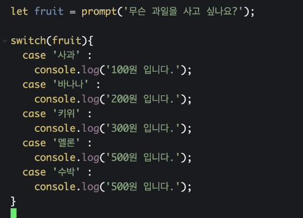
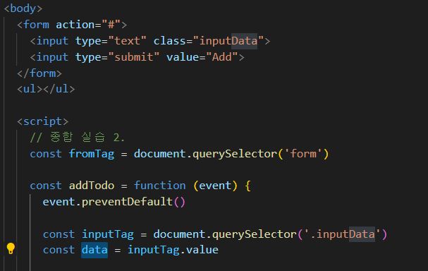
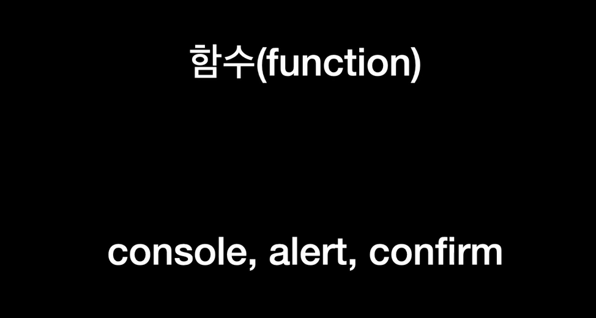
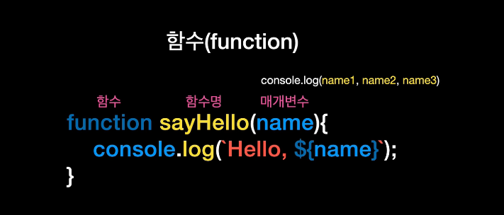
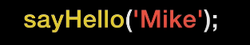
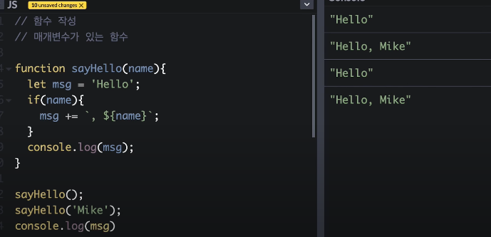
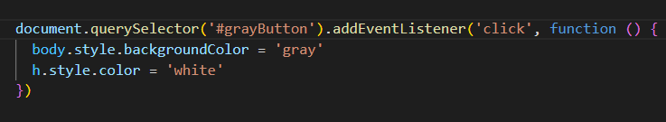

append = 여러개 넣을 수 있는데

appendChild = 하나만 넣을 수 있다. (노드의 개념으로 접근)

prepend는 앞에 넣을 수 있다.

레이아웃 구성할때 lorem 으로 글 추가하려 할때는

lorem1000 이런 식으로 하면 된다.

스크롤 위치에 대한 것은 scrollY 가 알고 있다

window.innerHeight : 현재 페이지 위치

document.body.scrollHeight: 전체 페이지 크기

event.target = 이벤트가 발생한 요소를 반환해준다.

trim() 공백으로만 이루어지거나 값이 없으면 false

reset() 은 form 태그가 가지고 있는 것으로 다 초기화 시킬 수 있다.

input 태그의 기본 속성으로 require 을 추가해주면 질문도 해준다.

includes 사용하는 방법: 

​	배열.includes(확인 할 문자열) 

위의 사진에서 break 를 해주면 해당 위치까지만 된다.

여기서 .inputData 를 하는 이유 :

- 클래스를 선택하고 싶을 때는 => .class 명
- id를 선택하고 싶을 때는 => #id 명
- 태그를 선택하고 싶을 때는 => 태그 명

---

함수

---

내가 정의한 body에 .style은 스타일을 적용한다는 의미인 것이고, 

.backgroundColor을 하는 이유는 style 요소의 backgroundColor를 적용한다는 것이다.

---

이번주 주말 공부할 것!!

JS 기초 문법 다시 공부하기

DOM 트리 직관적으로 보여주는 사이트

https://fritscher.ch/dom-css/

