경고창 alert

const 는 변수는 대문자로 선언하는 것이 좋다고 한다. (상수라는 것을 표현)

변수 타입은 

- var
- const
- let

문자열 사용

- 큰 따옴표 (" ")

- 작은 따옴표 (' ')
- 백틱 (``) : 파이썬의 f string 기능 구현
  - ex). `My name is ${name}'   

 

alert 와 comfirm 의 차이

alert 는 확인 창만 있고

confirm은 확인 버튼과 취소 버튼이  둘다 있다.

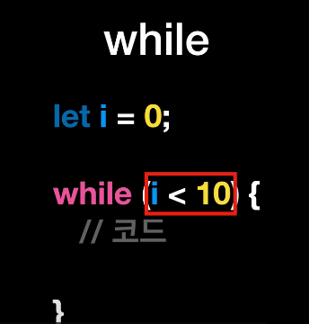

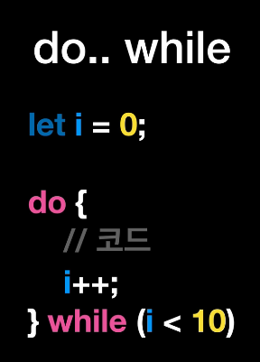

함수에 리턴값이 없어도 리턴을 하게 된다.

그리고 파이썬 처럼 함수의 리턴값을 변수를 선언하여 담아서 출력도 가능하다

---

### 함수 선언문

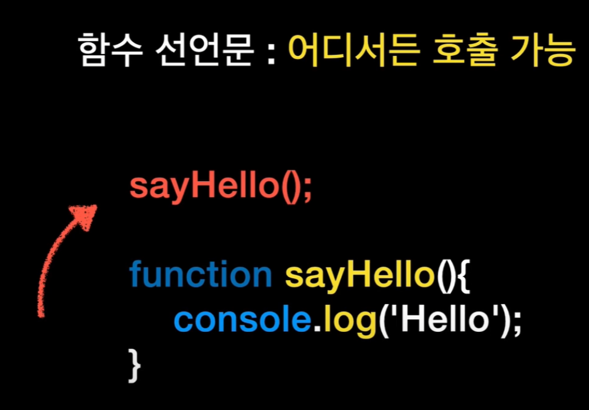

JS는 인터프리터 언어지만 위와 같은 함수 선언문의 경우 어디서든 호출이 가능한 이유로는

실행되기전 초기화 단계에서 코드의 모든 함수 선언문을 찾아서 선언된 함수 모임을 생성하기 때문이다. (호이스팅)

### 함수 표현식

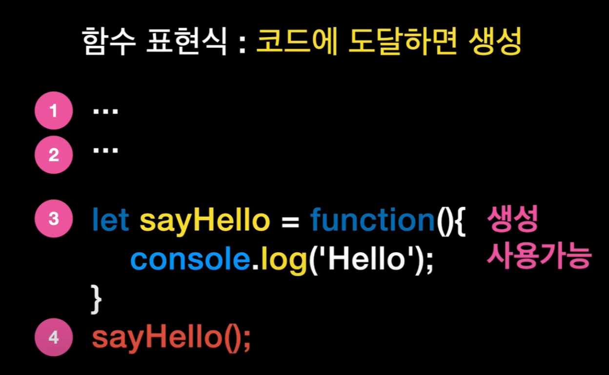

### 화살표 함수

화살표 함수는 함수 표현식에서 사용하나봄

1. 우선 function을 제거할 경우엔 매개 변수 우측에 화살표를 넣어주고
2. return 을 제거할 경우 밖에 있던 중괄호를 소괄호로 변경우 제거
3.  여기서 리턴문이 한줄일 경우 소괄호 또한 없앨 수 있다.

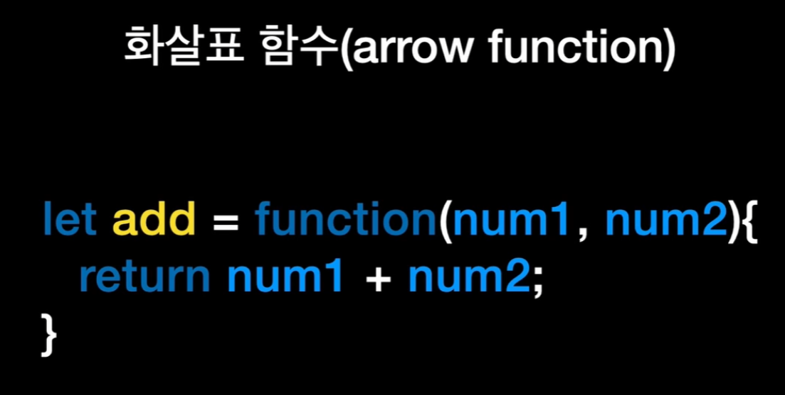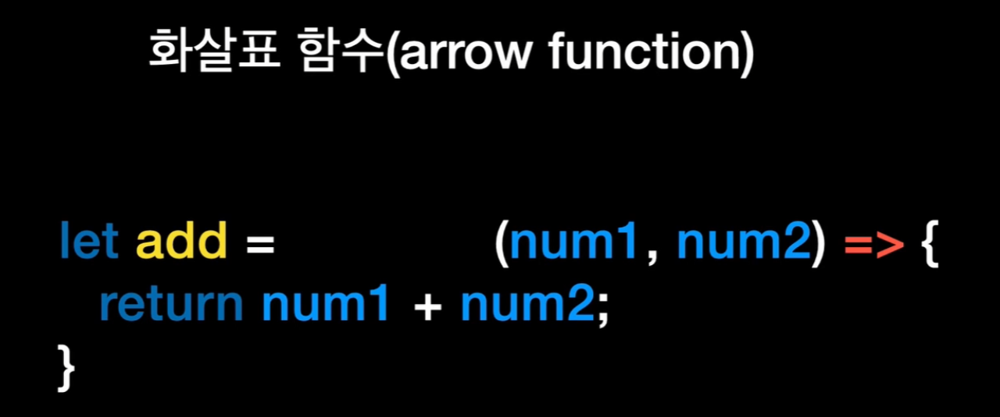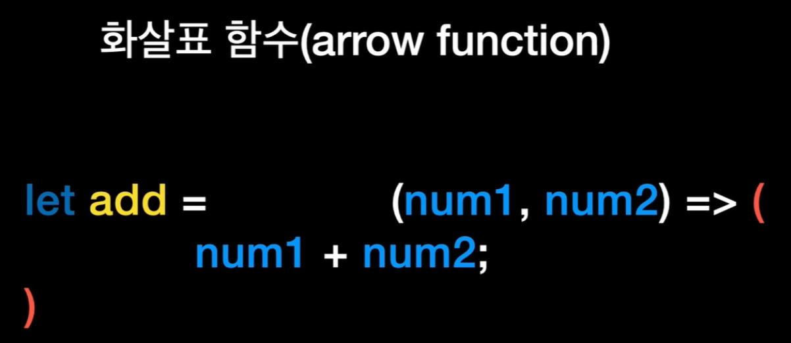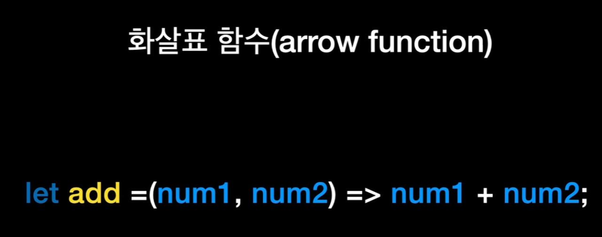

---

### Object 생성

객체를 생성할 때는 중괄호로 감싼 뒤 key : value 형식으로 작성

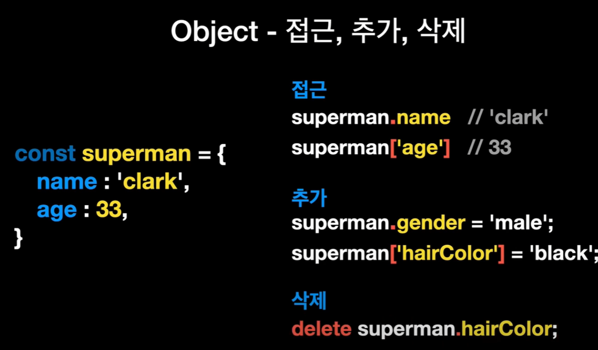

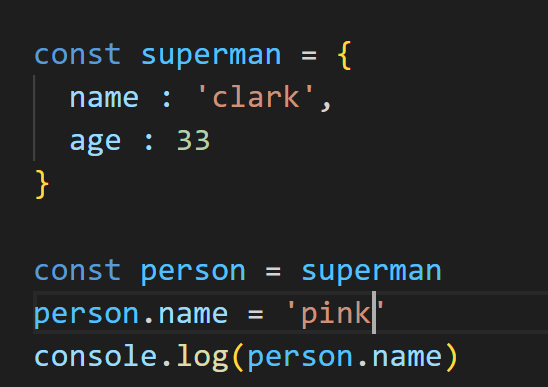

객체 생성 후 값 변경 가능.

객체 속성 조회,추가, 삭제

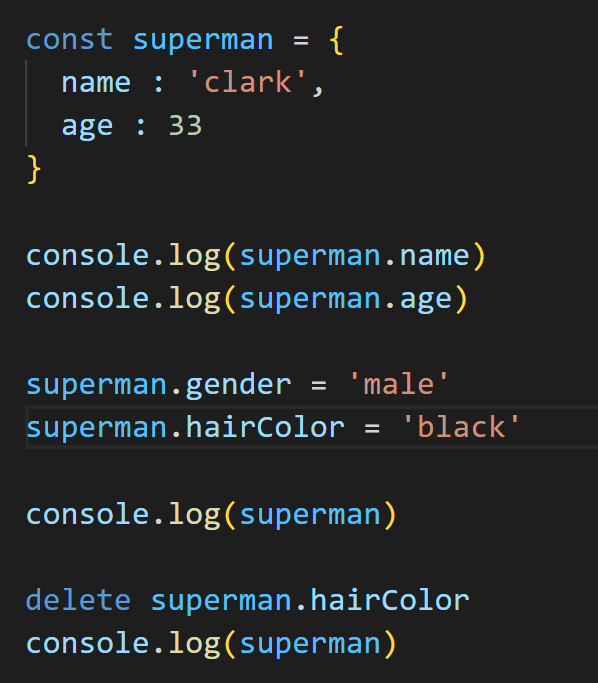

또 다른 객체 생성 방법(입력 값에 따른 생성)

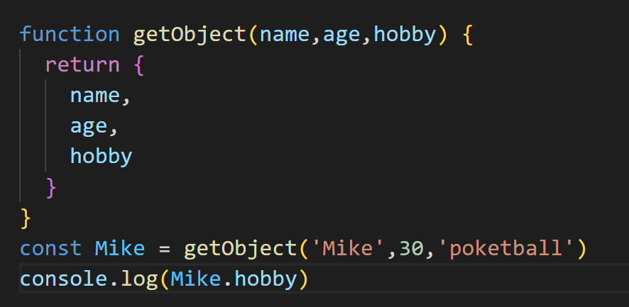

for in 을 이용한 조회

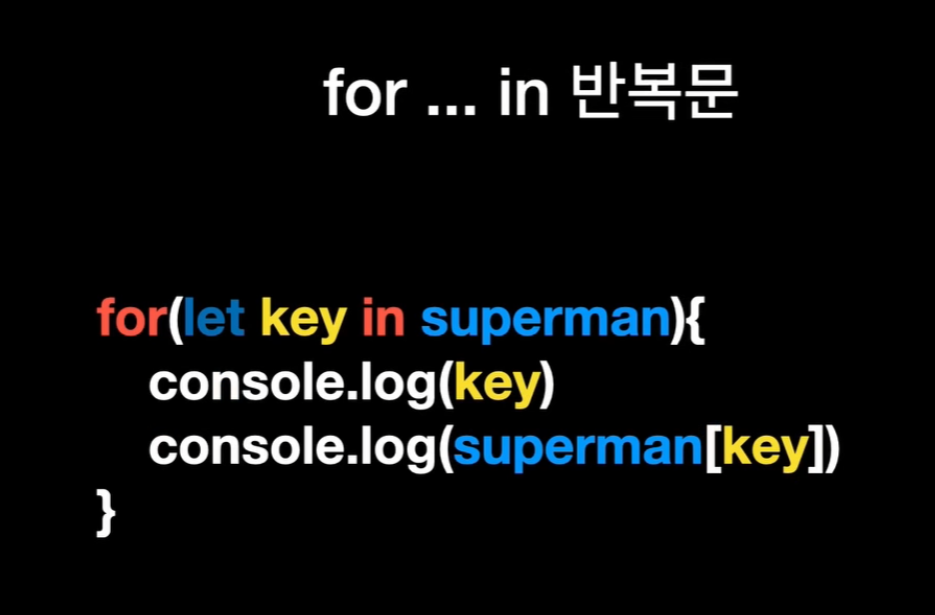

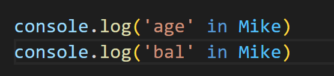

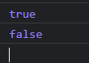

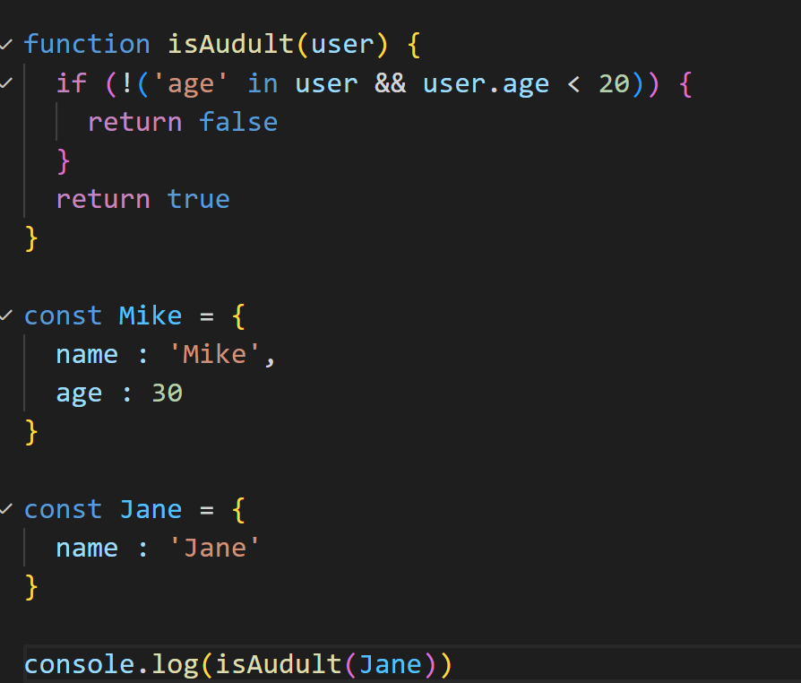

Object의 key 값 가져오기

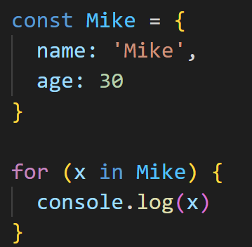

Object의 value 값 가져오기

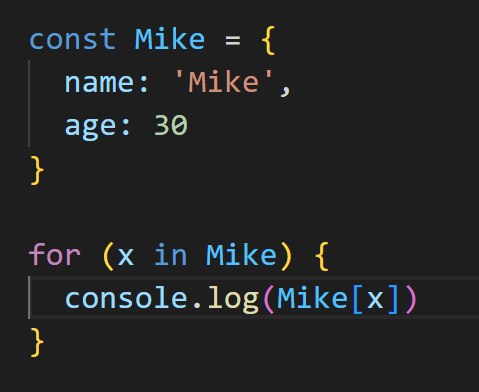

---

### 객체 - method

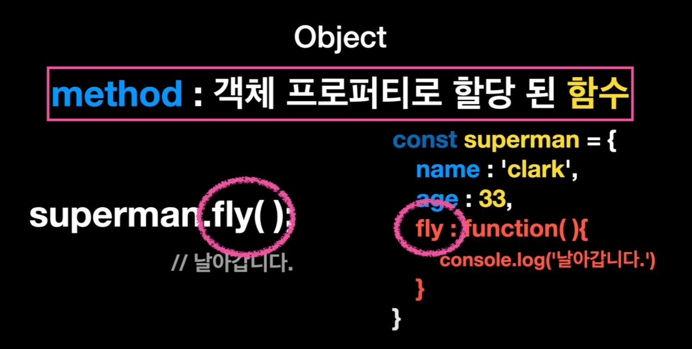

아래와 같이 줄여서 사용도 가능

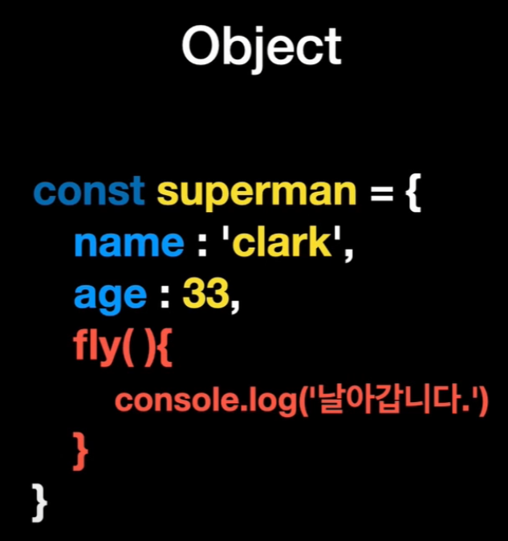

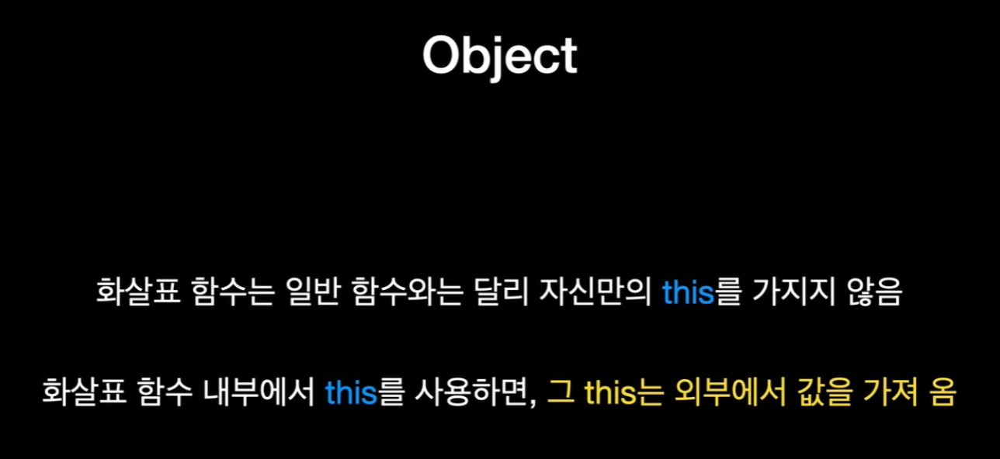

그래서 객체 내부에서의 method 을 사용할 경우엔 this를 사용하지 말기

---

### Array

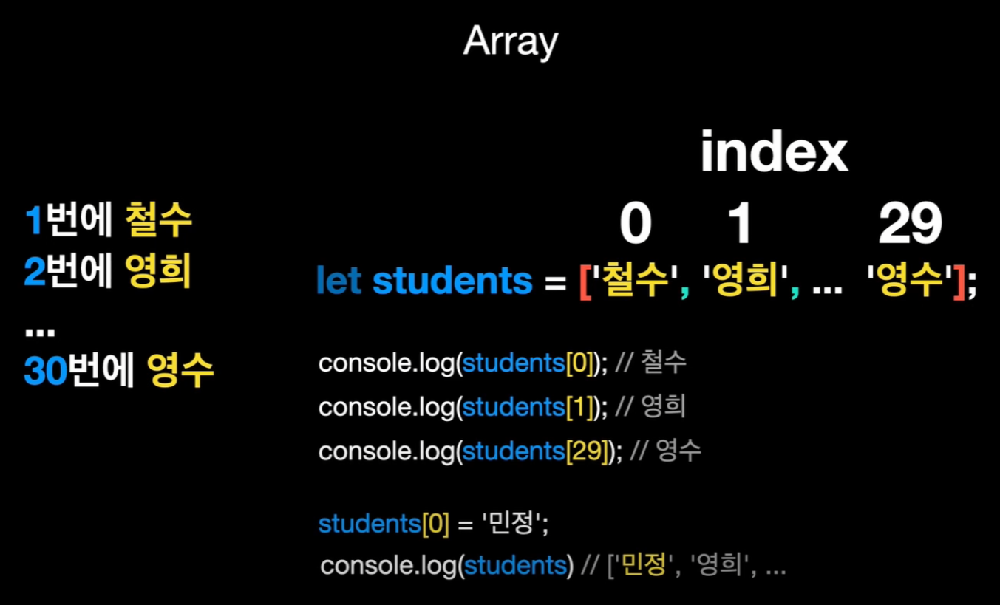

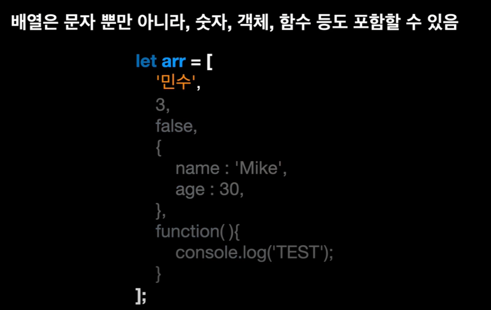

배열 메서드

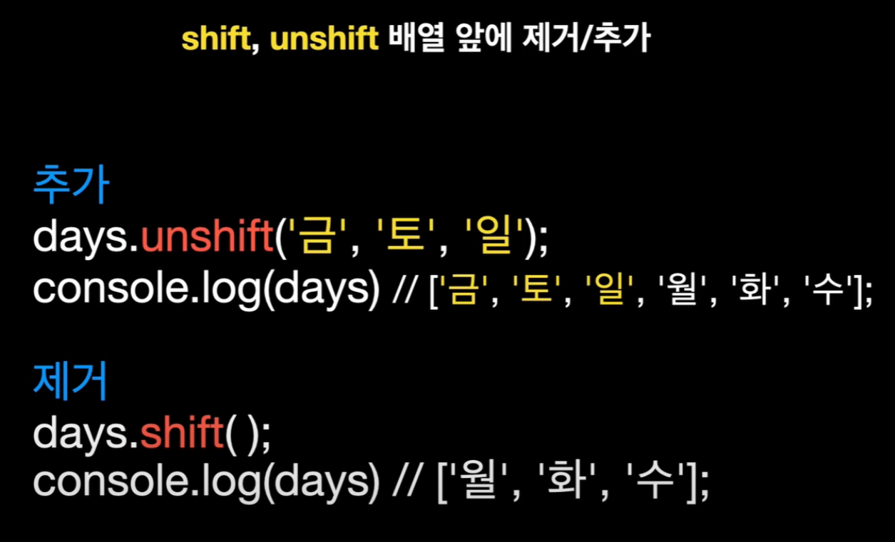

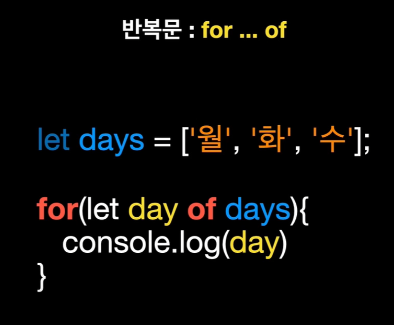