Block: 

파이썬 코드의 반복문을 실행시키는 중에 

이후의 코드가 나오지 않는걸 의미

Non-Block: 

---

동기: 

비동기:

왼쪽에 함수를 실행시켜놓고

그것과는 별개로 일을 하는 것을 의미

Block - 동기

커피 주세요 -> 기다리세요 (커피가 만들어지는 과정만을 보고 있는 상황이 Block)

Block-비동기

---

Non Block - 동기

다른 곳 갈 수 있는데 계속 커피가 나왔는지 물어보는것

Non Block - 비동기

일반적으로 우리가 생각하는 카페 ( 커피가 나오는걸 기다리지 않는 것을 의미) 

---

JS에서의 라이브러리 사용은 npm, CDN 사용

---

프론트에서 요청을 보냈는데 400번대 에러가 뜬다면 프론트 잘못

500번대가 뜬다면 백의 잘못

---

### Promise(프로미스) 란?

JS 비동기 처리에 사용되는 객체

Promise가 필요한 이유

프로미스는 주로 서버에서 받아온 데이터를 화면에 

async: 

function 앞에 위치하며

앞에 위치하게 하면 해당 함수는 항상 프라미스를 반환하게 된다.

프라미스가 아닌 값을 반환하더라도 이행 상태의 프라미스로 값을 감싸 이행된 프라미스가 반환되도록 한다.

---

### AJAX란?

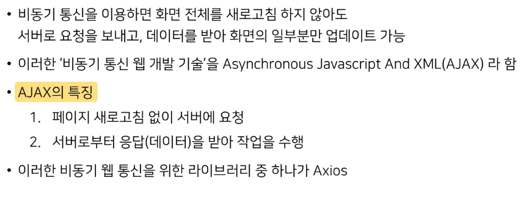

AJAX 특징

- 페이지 전체를 reload를 하지 않고서도 수행되는 비동기성
- 서버의 응답에 따라 전체 페이지가 아닌 일부분만을 업데이트 할 수 있음

1. 페이지 새로고침 없이 서버에 요청
2. 서버로부터 응답을 받아 작업을 수행

HTML ELEMENT

html 요소를 JS 로 가져오기 위해선 data-* 로서

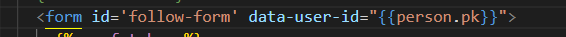

JS 는 케밥 케이스 

html은 카멜 케이스

csrf 없으면 403 fobiden 에러가 생긴다.

조건문일 경우는 쿼리셀렉터 

아닐경우 쿼리셀렉터 올

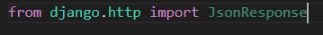

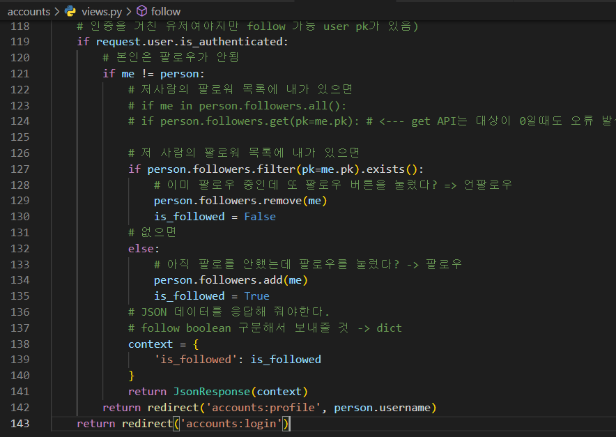

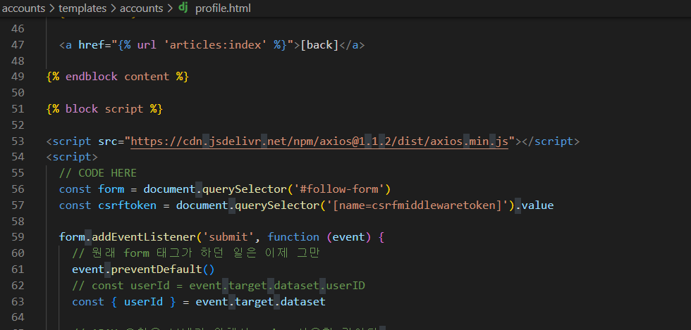

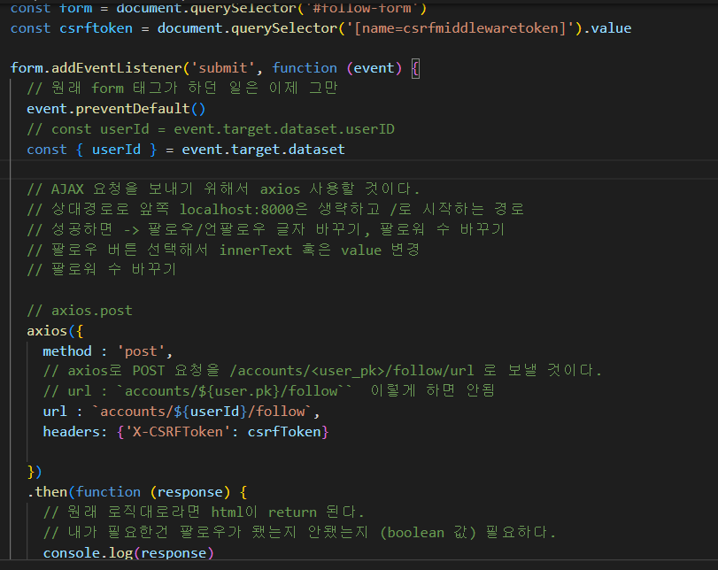

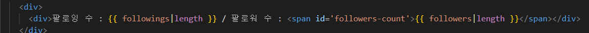

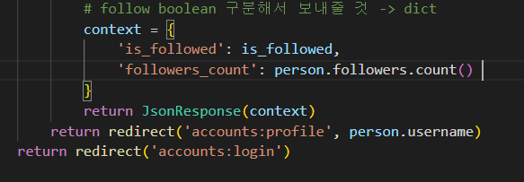

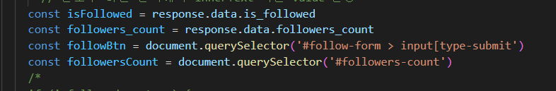

---

## AJAX

우선 계속해서 해당 CDN이 필요하여 요청해야하는 경우가 아니면

각각의 html 페이지에 script 블록위에 작성해준다.

그리고

기존에는 block content를 작성하여 

body 부분에만 따로 작성했지만

JS 의 경우엔 script 에 작성해야 하기에 

따로 base.html 에 block script 를 작성하여 해당 블록 안에 JS 문을 입력하기 

---

우리는 현재 axios 로 요청을 보낼 것이며 요청하는 method 또한 함께 지정해주기 때문에

form 태그에 있는 기존의 action과 method 속성을 삭제해주고 id 속성을 넣어주기.

아래는 기존의 form 태그 요소

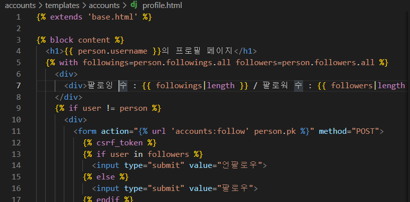

아래는 바뀐 form 태그 요소

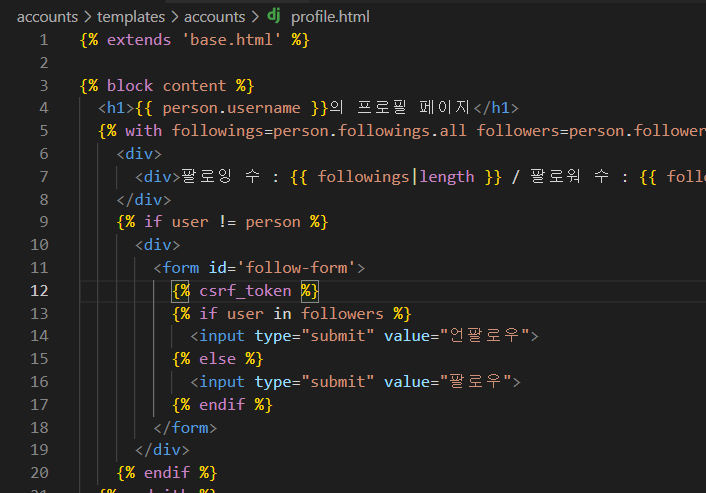

이후 아래 사진과 같이 script 태그안에 body태그에 있는 form 태그를 선택 할 수 있도록 선택하는 변수를 만들기

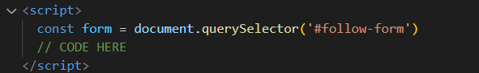

그리고 form 태그로 데이터를 전송할 때 addEventListener 함수를 사용하여 어떻게 처리할 것인지?

submit 을 하는 이벤트가 발생할 때마다 어떻게 할 것인지 작성해주는데

여기서 이벤트가 생성 될 때마다 페이지가 갱신이 되지 않도록 event.preventDefault() 를 앞단에 넣어준다. 

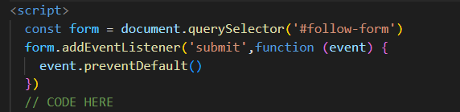

그 이후로 axios 요청을 할 수 있도록 해야하는데 

기존의 axios() 함수안에 있는 속성으로

method 는 어떤것을 사용 할지, form 요청후 어디로 향할 것인지를 작성

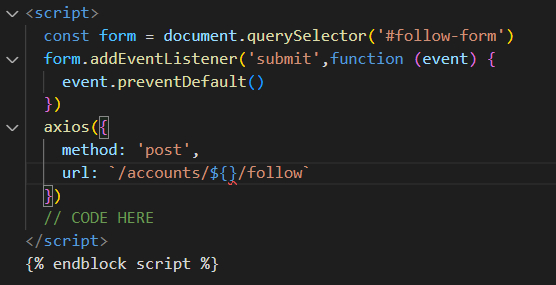

위의 사진에서 ${ } 사이에는 follow 를 마친 후 username 으로 이동해야 하기에  

해당 person의 이름이 필요하다.

 1026 수업 교제 87p