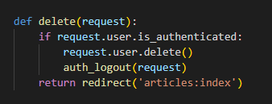
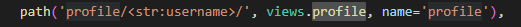
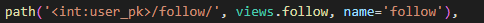
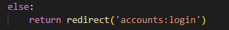
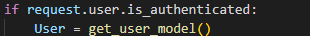
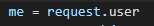
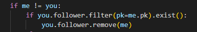
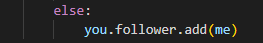
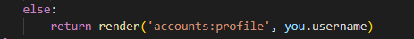

장고 디버깅 시험
모델을 망가뜨리지는 않음


공부하기
1. get_user_model()
2. get_object_or_404
3. Promise
4. 인증, 인가, 로그인
    로그인 -- 작성 순서에 대해 이해하기
5. 좋아요
6. DRF , 
7. JSON 데이터 주고 받기 
8. 컨벤션 정하기

우선 CRUD는 만든거 좀 빨라지긴 했음


get_user_model : 현재 User Model 을 가져와라

get_object or 404: 조건에 맞는 객체를 가져오는데 없으면 404 포비든 에러를 표현해줘라


---


로그인 App 생성 순서


1. accounts 앱 생성하기
   1. python manage.py startapp accounts
2. model 생성
   1. accounts의 model 에서 기존의 User를 새로 정의하기


3. form 생성
   1. accounts의 forms.py 를 생성 후 UserCreationModel, UserChangeModel 를 불러온 후
   2. 각각 재정의 하고
   3. 앞서 재정의 해놓은 User 모델을 가져 올 수 있도록 get_user_model 을 불러오기


4. 현재 로그인 되어있는 유저인지 base.html 에 표시하기
   1. base.html 에서 현재 사용자가 로그인 되어있는 유저인지 체크하기 위해서
   2. {{user.username}} 으로 체크가능하지만
   3. 조건문을 이용하여 로그인이 되어 있는 경우만 표시해주도록 했음


5. accounts 의 경우 index 페이지는 필요 없기에 signup 페이지부터 만들어주기

   1. 해당 요청이 POST 인지 GET 인지 판단 후 

   2. GET 요청의 경우 forms.py 에서 만들어 둔 form을 전달 

   3. 작성 후 POST 를 요청 할 경우

   4. 해당 form 에는 요청한 POST 데이터를 넣어준 후 유효성 검사를 한 후 저장하는데

   5. 저장하기 전에 user 라는 변수에 데이터를 넣고 login 을 다른 이름으로 정의한 

      ​	auth_login 메서드의 값에 POST 데이터를 담아둔 user 를 넣어주어 회원가입 후 로그인이 유지되도록 한다


 

6.  login 페이지 생성

   1. 우선 로그인을 하기 위해선 GET, POST 요청 둘다 필요로 한다

   2. 로그인을 하기 위한 GET 요청을 할때 로그인 폼 페이지를 전송해야하는데 

      ​	그때 필요한건 AuthenticationForm 이기에 

      
      
      

​				

form = AuthenticationForm() 

로그인 폼을 보내기 위해서 form 변수를 통해 context 를 통해 보내주기


login.html 에 해당 form을 보내주고


그래서 해당 요청이 POST 의 경우

로그인을 하는 행위이기 때문에 

form 변수에 AuthenticationForm() 매개변수 안에 request 요청과 request.POST 요청을 함께 넣어준다.

그리고 해당 form 에 대한 유효성 검사를 하고

통과가 된다면

바로 로그인이 가능하도록 auth_login() 메서드 안에 auth_login(request, form.get_user()) 넣어주는데

해당 요청과 form 을 요청한 user 에 대한 정보를 함께 넣어서 로그인이 유지되도록 한다.

---

7. logout
   1. 만약 현재 요청이 인증된 유저라면  
   2. auth_logout() 메서드를 사용하여 로그아웃을 하도록 한다.  


---

8. Password change

   1. 우선 password 부터는 새로 import  하는것이 많아지는데

   2. url 부터 보자면 비밀번호를 바꿀 경우엔 로그인이 되어있다는 조건에 실행하기에 pk 값은 필요 없다.

      

   3. 이후 view 를 보자면

      1. 우선 요청 method 가 POST, GET 나누어 보자면

      2. GET 의 경우 현재 요청한 유저의 데이터를 어떤 form으로 넣어줘야하는데 

         ​	장고에서 이미 만들어둔 비밀번호 변경 form인 PasswordChangeForm을 import 하기

         

      3. 이후 PasswordChangeForm() 메서드 안에 현재 요청한 유저의 데이터를 넣어 

         ​	form에 담기

         

      4. HTML 페이지를 작성 후 변경 데이터를 요청하여 POST 요청을 할 경우

         1. PasswordChangeForm() 메서드 안에는 요청한 유저의 정보와 

            ​	요청한 변경 데이터를 함께 넣어서 form 에 담는다.

         2. 이후 유효성 검사를 한 후 session 을 갱신하기 위한 메서드인

             update_session_auth_hash() 메서드를 사용

             해당 메서드에는 request와 해당 form에 대한 user의 정보를 담기.

            *주의 할 것*

            우선 update_session_auth_hash() 추가하는 import 는 아래와 같고

            

            update_session_auth_hash() 안의 매개변수로는

            request 값과 form에 대한 user 의 정보라는 것!

         

---

9. update
   1. update 의 경우 로그인되어있는 자신을 사용하면 되기때문에
   2. form 변수에 CustomUserCreationForm() 메서드를 사용한다
   3. 해당 메서드의 매개 변수로는 request.POST, instance=request.user 처리 후 
   4. 유효성 검사 후 저장

​							

---

10. Delete
    1. 로그아웃과 마찬가지로 
    1. 요청한 유저가 인증된 유저의 경우 
    1. 요청한 유저를 삭제
    1. 이후 로그아웃을 하도록 auth_logout() 메서드를 사용하는데
    1. 이때 메서드 안의 매개변수로는 요청한 데이터를 넘겨준다.
    
    

---

11. profile

    1. 우선 가장 유명한 프로필로는 인스타그램의 프로필 페이지를 볼 수 있다
    2. 여기서 해당 유저의 프로필로 가는 주소를 보면 
    3. article 의 detail 페이지와 같이 페이지의 pk 번호로 이동하는 것이 아닌
    4. username 으로 향해 가게 된다.
    5. 그렇기 때문에 urls.py 에서 profile로 path를 만들 때는 아래와 같다.

    

    6. 이후 views.py 에서 profile에 대한 view를 만들 때

    7. 고려해야 할 부분이 나와 상대를 구분할 수 있어야 하는데 그것을 구분하기 위해 models.py 에서 기존 User 클래스에 followings 속성을 추가한다. 여기서 팔로워가 아닌 팔로잉에 대한 것을 정의하는 이유는 팔로워를 해도 괜찮지만 나라는 유저가 상대방을 팔로잉 하는 것이 좀 더 어울리다? 그런 느낌이었던 것 같다.

       ```python
       class User(AbstractUser):
           
           followings = models.ManyToManyField('self', symmetrical=False, related_name='followers')
       ```

        위의 코드에서 N:M 관계인 ManyToManyField를 하는 이유는 1:1로 관계를 맺는것이 아닌 한사람으로 부터 다수의 사람들과 연결이 되어있고,

       한 사람 또한 다수의 사람을 연결하기 때문이다.(?? 맞겠지 ??)

       그리고 symmetrical=False 를 하는 이유로는 내가 상대를 팔로워 했을 경우 상대도 나를 팔로워 하는 시스템은 좀 이상하기 때문이다.

       그리고 related_name='followers' 하는 이유는 팔로워와 팔로잉을 

       구분해야 하는데 기존의 팔로잉으로는 구분 할 수 없어서 

       별도의 이름을 만들어준다?? 라고 이해하고 있다.

    8. views.py 로 넘어가서 profile 함수 작성

       1. 우선 모든 유저에 대한 모델을 User 에 넣어준다

       2. 해당 User 모델에서 username 이 넘겨준 username과 같은 유저를 person 변수에 담아준다.

    9. 이후 profile.html 로 이동하여 페이지를 보여준다.

    10. 일단은 articles/index.html 페이지에서 상단의 본인 이름을 누르면       프로필 페이지로 이동할 수 있도록 하기.  

    11. 그러기 위해 base.html 에서 로그인 되어있을 경우 유저 이름을 누르면 이동하도록 했다.

---


12. follow

    1. 팔로우라는 건 내가 상대방을 따르겠다는 의미인거니까 해당 유저에 대한 pk 값이 필요하기에 < int:user.pk > 를 함께 받아와야 한다. 

    

    2. follow 함수를 작성할때 또한 현재 요청이 인가된 유저의 요청의 경우

       ​	허락하고 아닌 경우엔 로그인을 하도록 페이지를 옮겨준다.

       ​	(else 는 없어도 됨)

    

    3. 만약 현재 요청이 인가된 유저의 요청의 경우 현재 유저의 모델을 User에 담아주기

    

    4. 이후 요청하는 나에 대한 데이터는 

       

    5. 팔로우할 상대에 대한 데이터는 

    

    6. 위와 같이 데이터를 담아준 후  

       - 나와 상대방이 같은 데이터인지 판별 후 만약 같지 않다면 

       1. 상대의 팔로워 중에 나의 pk 값이 존재한다면
          - 팔로워 해제 하도록 하기

       

       2. 상대의 팔로워 중에 나의 pk 값이 존재하지 않다면

          - 팔로워에 추가하기

          

       - 만약 나와 상대방이 같은 데이터의 경우

       
