부산 마루하우스 : 420,000원

부산 송정아리랑펜션 : 190,000원

비타민 송 펜션 : 600,000원, 400,000원, 

장고 디버깅 시험
모델을 망가뜨리지는 않음

공부하기
1. get_user_model()
2. get_object_or_404
3. Promise
4. 인증, 인가, 로그인
    로그인 -- 작성 순서에 대해 이해하기
5. 좋아요
6. DRF , 
7. JSON 데이터 주고 받기 
8. 컨벤션 정하기

우선 CRUD는 만든거 좀 빨라지긴 했음

get_user_model : 현재 User Model 을 가져와라

get_object or 404: 조건에 맞는 객체를 가져오는데 없으면 404 포비든 에러를 표현해줘라

---

로그인 App 생성 순서

1. accounts 앱 생성하기
   1. python manage.py startapp accounts
2. model 생성
   1. accounts의 model 에서 기존의 User를 새로 정의하기

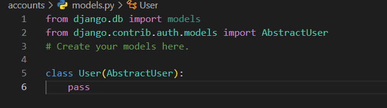

3. form 생성
   1. accounts의 forms.py 를 생성 후 UserCreationModel, UserChangeModel 를 불러온 후
   2. 각각 재정의 하고
   3. 앞서 재정의 해놓은 User 모델을 가져 올 수 있도록 get_user_model 을 불러오기

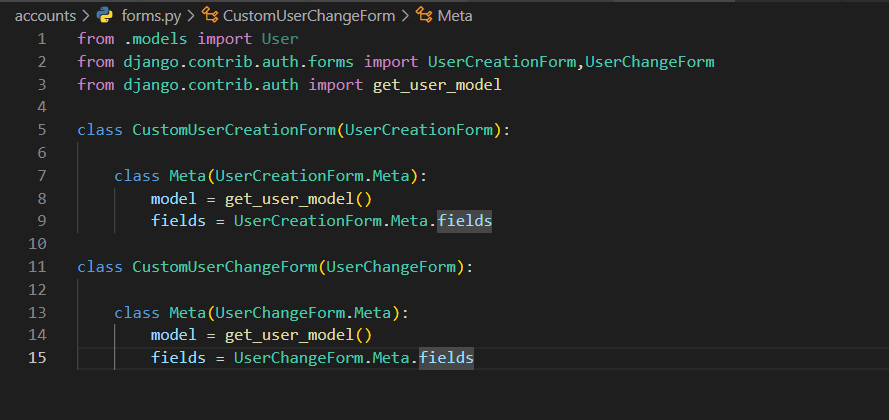

4. 현재 로그인 되어있는 유저인지 base.html 에 표시하기
   1. base.html 에서 현재 사용자가 로그인 되어있는 유저인지 체크하기 위해서
   2. {{user.username}} 으로 체크가능하지만
   3. 조건문을 이용하여 로그인이 되어 있는 경우만 표시해주도록 했음

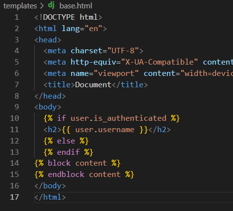

5. accounts 의 경우 index 페이지는 필요 없기에 signup 페이지부터 만들어주기

   1. 해당 요청이 POST 인지 GET 인지 판단 후 

   2. GET 요청의 경우 forms.py 에서 만들어 둔 form을 전달 

   3. 작성 후 POST 를 요청 할 경우

   4. 해당 form 에는 요청한 POST 데이터를 넣어준 후 유효성 검사를 한 후 저장하는데

   5. 저장하기 전에 user 라는 변수에 데이터를 넣고 login 을 다른 이름으로 정의한 

      ​	auth_login 메서드의 값에 POST 데이터를 담아둔 user 를 넣어주어 회원가입 후 로그인이 유지되도록 한다

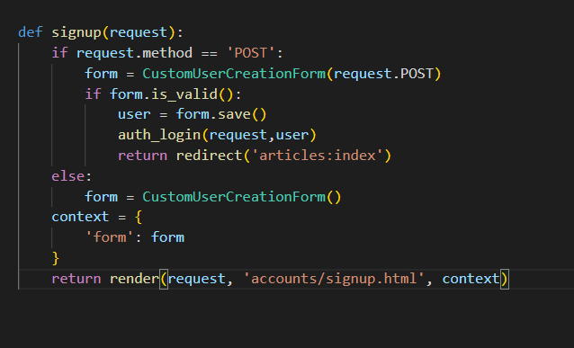

 

6.  login 페이지 생성

   1. 우선 로그인을 하기 위해선 GET, POST 요청 둘다 필요로 한다

   2. 로그인을 하기 위한 GET 요청을 할때 로그인 폼 페이지를 전송해야하는데 

      ​	그때 필요한건 AuthenticationForm 이기에 

      
      
      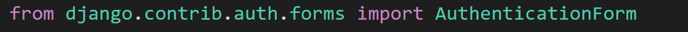

​				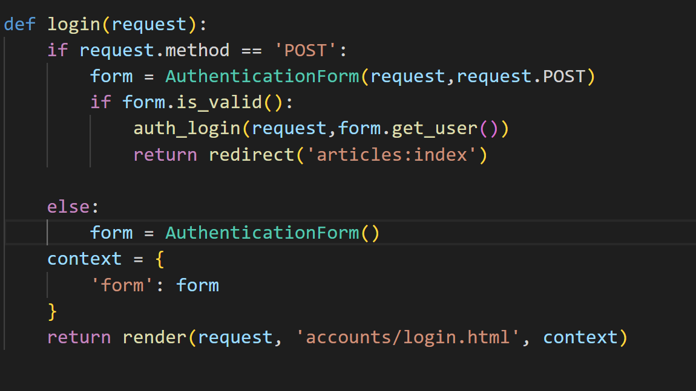

form = AuthenticationForm() 

로그인 폼을 보내기 위해서 form 변수를 통해 context 를 통해 보내주기

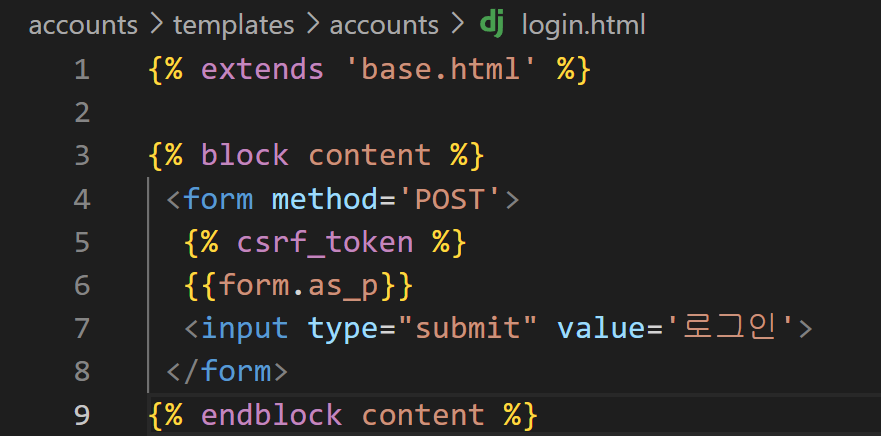

login.html 에 해당 form을 보내주고

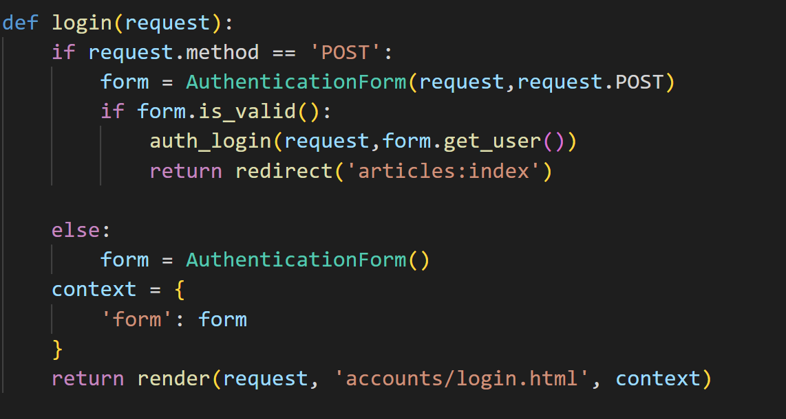

그래서 해당 요청이 POST 의 경우

로그인을 하는 행위이기 때문에 

form 변수에 AuthenticationForm() 매개변수 안에 request 요청과 request.POST 요청을 함께 넣어준다.

그리고 해당 form 에 대한 유효성 검사를 하고

통과가 된다면

바로 로그인이 가능하도록 auth_login() 메서드 안에 auth_login(request, form.get_user()) 넣어주는데

해당 요청과 form 을 요청한 user 에 대한 정보를 함께 넣어서 로그인이 유지되도록 한다.

---

7. logout
   1. 만약 현재 요청이 인증된 유저라면  
   2. auth_logout() 메서드를 사용하여 로그아웃을 하도록 한다.  

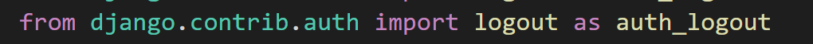

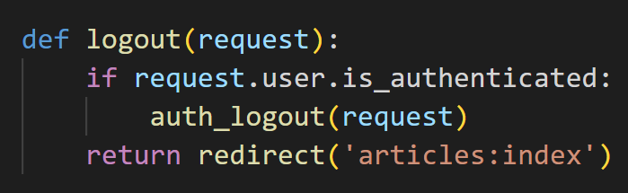

---

8. Password change

   1. 우선 password 부터는 새로 import  하는것이 많아지는데

   2. url 부터 보자면 비밀번호를 바꿀 경우엔 로그인이 되어있다는 조건에 실행하기에 pk 값은 필요 없다.

      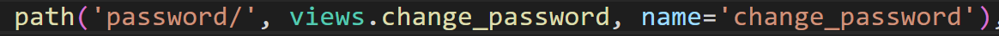

   3. 이후 view 를 보자면

      1. 우선 요청 method 가 POST, GET 나누어 보자면

      2. GET 의 경우 현재 요청한 유저의 데이터를 어떤 form으로 넣어줘야하는데 

         ​	장고에서 이미 만들어둔 비밀번호 변경 form인 PasswordChangeForm을 import 하기

         

      3. 이후 PasswordChangeForm() 메서드 안에 현재 요청한 유저의 데이터를 넣어 

         ​	form에 담기

         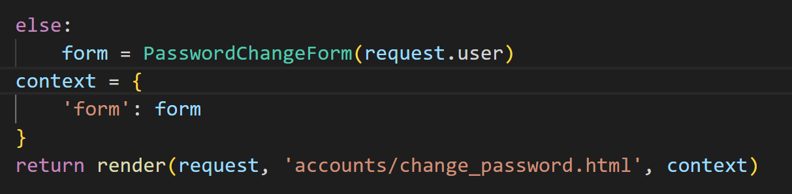

      4. HTML 페이지를 작성 후 변경 데이터를 요청하여 POST 요청을 할 경우

         1. PasswordChangeForm() 메서드 안에는 요청한 유저의 정보와 

            ​	요청한 변경 데이터를 함께 넣어서 form 에 담는다.

         2. 이후 유효성 검사를 한 후 session 을 갱신하기 위한 메서드인

             update_session_auth_hash() 메서드를 사용

             해당 메서드에는 request와 해당 form에 대한 user의 정보를 담기.

            *주의 할 것*

            우선 update_session_auth_hash() 추가하는 import 는 아래와 같고

            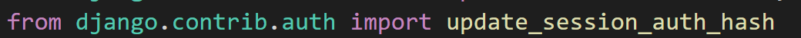

            update_session_auth_hash() 안의 매개변수로는

            request 값과 form에 대한 user 의 정보라는 것!

         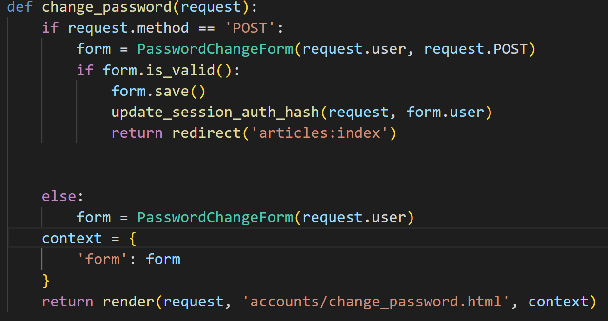

---

9. update
   1. update 의 경우 로그인되어있는 자신을 사용하면 되기때문에
   2. form 변수에 CustomUserCreationForm() 메서드를 사용한다
   3. 해당 메서드의 매개 변수로는 request.POST, instance=request.user 처리 후 
   4. 유효성 검사 후 저장

​							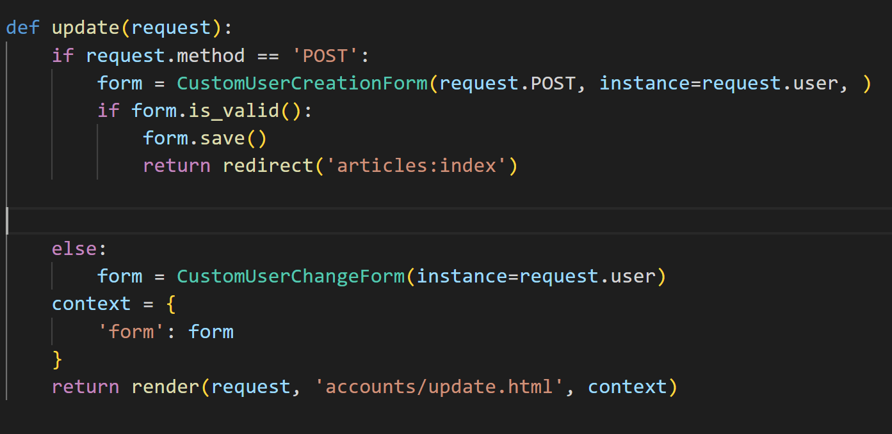

---

10. Delete
    1. 정리하기
