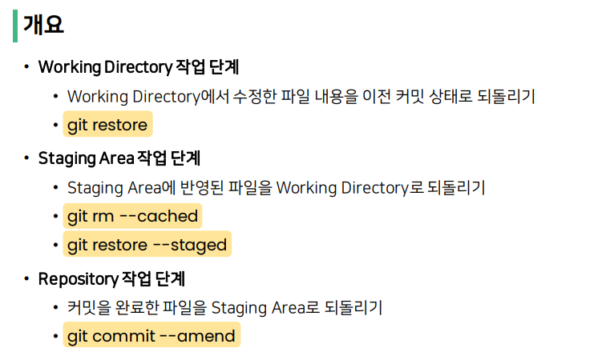

### Working Directory

깃으로 관리하고 있는 로컬에서의 폴더에서 트랙킹이 되고 있는 상태를 의미

git add . 하기 전

---

### Staging Area

git add . 이후 단계로 working directory 이후 단계

만약 이미 프로토타입이 올라가 있는 상태라면

레포지토리에 올라가 있는 것과의 차이점만 add 하게 된다.

---

### Repository

깃 랩, 깃 허브에 올린 상태가 아님

레포지토리 단계는 깃에게 등록한 것으로 

git commit 단계를 의미한다.

---

#### 명령어

- $ rm -rf {{파일명}} : 삭제

- HEAD는 나의 branch에서 최신 영역을 의미한다.?
  - 그래서 root-commit 이 없을 경우 HEAD는 없을 수 밖에 없다.
- mkdir : 폴더 만들기

---

# Working Directory 작업 단계 되돌리기

1. git init
2. touch a.md ( 마크다운타입 a 파일 생성) 
3. git add .
4. git commit 
5. git log --oneline ( 로그 확인 )
6. vim a.md ( a.md 파일을 vim로 열기 )
7. Insert or i 누르기
8. 작성후
9. esc 누르고 :wq 를 입력하면 나가진다.
10. 다시 git add, git commit 을 하고
11. git log --oneline 으로 확인하면

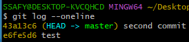

12. 다시 수정 후 
13. git status 를 입력하면 차이점이 있다.
14. 최신 버전으로 되돌리는 방법(즉. 수정 이전)
    1. git restore {{파일명}}

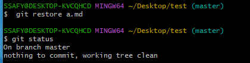

**git restore 를 조심해야하는 경우**

해당 작업은 로컬에서의 작업을 되돌리는 것이기에 조심해야한다(즉, 백업 후 하는게 좋을듯)

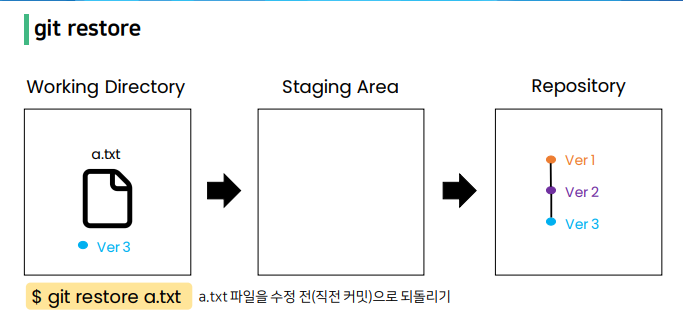

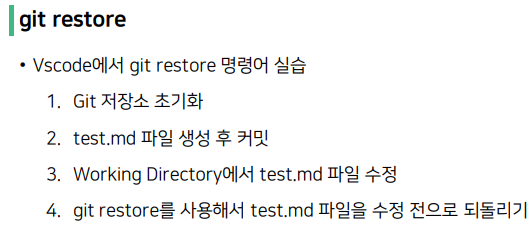

---

# Staging Area 작업 단계 되돌리기

root commit 이란 저장소에 커밋을 한번도 하지 않은 경우(비교 대상이 없을 경우)

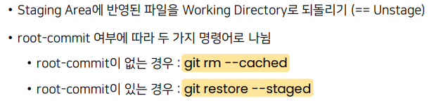

---

### git rm --cached

git rm --cached {{파일 명}} 는 add 이후 저장을 취소할 때 사용한다.

root-commit 이 없을 경우 사용

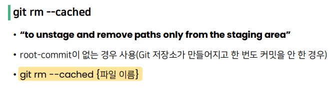

rm으로 삭제하는 이유는 비교대상이 없기 때문에 그냥 staging Area에 올렸던 캐싱을 지우는 것. ( 즉 add 한 것을 지우는 행위를 의미한다. )

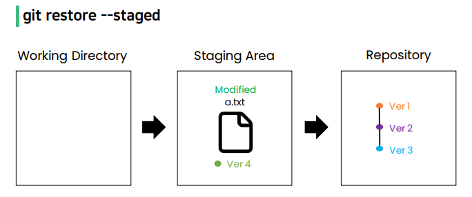

### git restore --staged

git restore --staged {{파일명}} : commit 을 한 적이 있는 경우 초기 상태로 돌아가도록 하는 명령문

즉 root-commit 이 있을 경우 사용

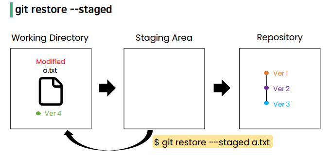

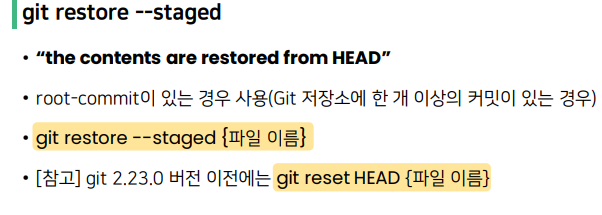

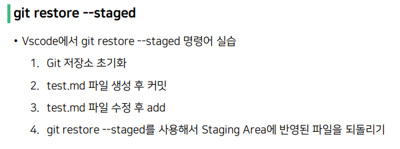

---

# Repository 작업 단계 되돌리기

git commit --amend 를 입력하면 vim 이 열리게 된다.

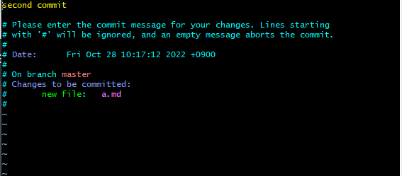

그래서 insert 혹은 i 를 입력 후 수정

그리고 esc -> : -> wq 하게 되면 저장 후 종료하게 된다.

위와 같이 하게 되면 commit 의 명칭을 변경하게 된다.

그런데 이렇게 수정하게 되면 *커밋 명*만 바꾸는 것이 아닌

커밋 자체를 새로 하게 되는 것.

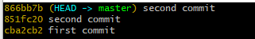

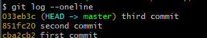

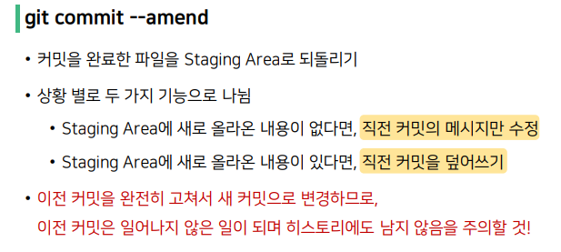

`여기서 commit 을 한 이후 다른 파일을 추가했을 경우` 

새로 커밋을 하게 되면 버전관리가 안되기에 

이때도 git commit --amend 를 실행 후 다른 입력없이

바로 종료하게 되면 기존의 커밋 데이터와 이후 추가 데이터가 합쳐지게 된다.

---

# git reset

시게를 마치 과거로돌리는 듯한 행위로, 프로젝트를 특정 커밋 상태로 되돌림

특정 커밋으로 되돌아 갔을 때, 해당 커밋 이후로 쌓았던 커밋들은 전부 사라짐

git reset [옵션] {커밋 ID}

​	옵션은 soft, mixed, hard 중 하나를 작성

​	커밋 ID는 되돌아가고 싶은 시점의 커밋 ID를 작성

즉 버전관리가 잘 안되었을 때 사용하는 것.

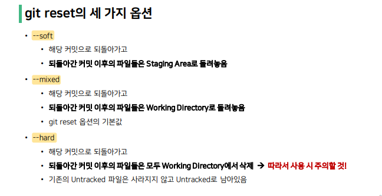

### soft

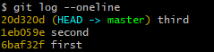

위의 사진처럼 같은 .git 으로 관리되고 있는 것이라면 ID가 같기 때문에 

다른 유저가 해당 파일을 가지고만 있다면 복구가 가능하다.

그래서 현재는 third commit 을 가리키고 있는데 

이것을 first 로 이동하기

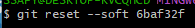

위오 같이 입력하게 되면

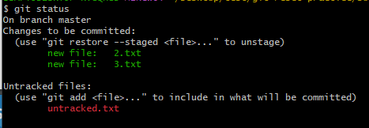

이렇게 이전 commit 으로 돌아가게 된다.

로컬의 파일도 아무것도 달라진것은 없지만

커밋에 대한 데이터만 변경되어 원하는 지점의 commit으로 돌아가게 된다.

### mixed

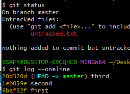

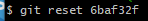

저렇게만 적는이유는 mixed는 reset 의 기본 명령어기 때문이고

add 조차 되지 않은 상태로 만들어 주기에 

원하지 않는 내용이 들어가지 않도록 add 완료 이전으로 돌아갈 수 있다.

그래서 soft, mixed reset의 경우는 로컬의 파일 데이터에 대해선 건들이지 않고

commit 자체만 변경하게 된다.

### hard

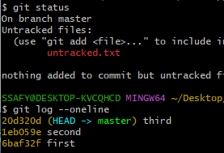

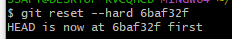

이렇게 하면 해당 commit 지점의 모든 데이터를 삭제

여기서 실수로 잘못 지웠을 경우

git reflog 를 하게 되면 

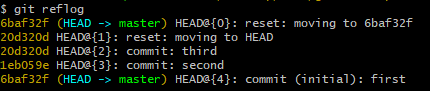

---

# Git revert

과거를 없었던 일로 만드는 행위로, 이전 커밋을 취소한다는 새로운 커밋을 생성함

git revert {커밋 ID}

​	커밋 ID는 취소하고 싶은 커밋 ID를 작성

revert 를 하는 이유는 이전의 커밋을 제거한 상황을 다시 최신 commit 으로 흔적을 남긴다

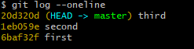

git revert {{커밋 ID}} 이후 나가게 되면 아래와 같고

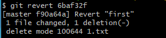

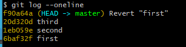

위와 같은 사진처럼 커밋이 지워지지 않고 해당 버전이 가장 최신 HEAD가 된다.

그래서 위의 작업은 first 커밋을 없었던 일로 만든다는 것을 의미한다.

즉 revert 를 하게 되면 지정 커밋ID 에 대한 커밋 버전을 없애버린다는 것.

여기서 한번에 없애버리는 방법은

 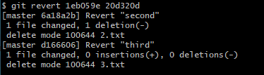

여기서 commit을 자동으로 하지 않도록 하는 방법은

git revert --no-commit {{커밋ID}}

---

# Git branch

위에서 우리가 revert를 하고 나니 (master)에서 (master|REVERTING)로 변경이 되었다.

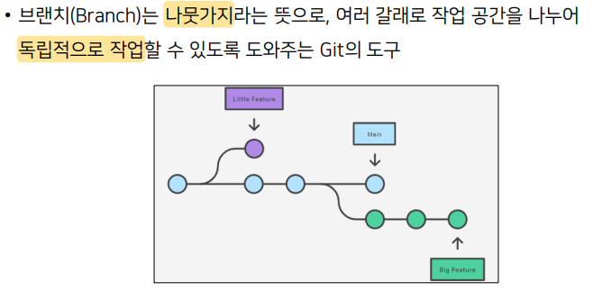

지금껏 교수님과 lectures 로 했다.

#### branch  

- 버전관리를 용이하게 하기 위해서
- 독립 공간을 형성하기 때문에 원본에 대해 안전하다 

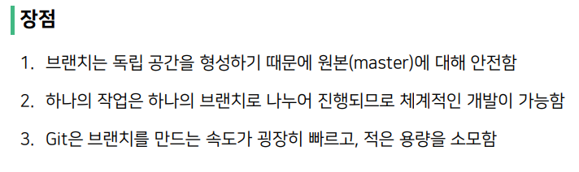

우리가 주로 사용할 명령어로는 

git branch 밖에 없긴하다.

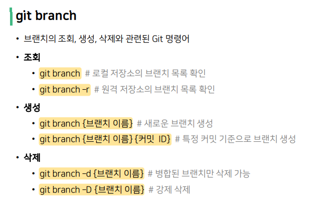

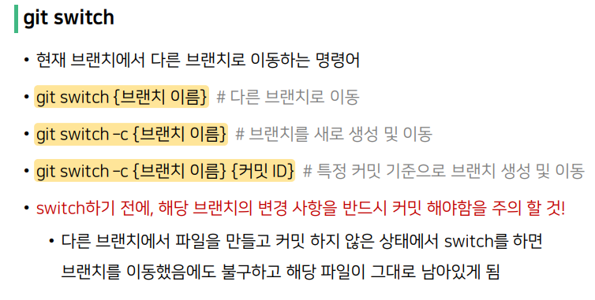

1. 브랜치 조회

2. 브랜치 생성(커밋이 있어야 해당 작업 공간으로 부터 분화가 생길 수 있다.)

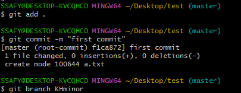

3. 새롭게 파일을 생성 후 커밋을 하게 되면 HEAD는 master을 가리킨다.

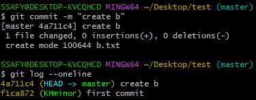

4. 다시 한번 조회

   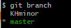

5. 이후 작업공간을 변경하고 싶을 경우

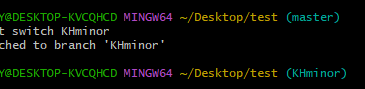

(master) -> (KHminor) 로 변경되었다. 

그리고 로그를 찍어보면 master에서 변경된 사항이 나타아지 않는다.(b.txt)

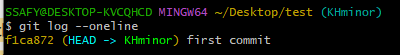

6. 이후 KHminor에서 파일을 생성후 커밋을 하고

   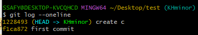

7. switch 하게 되면

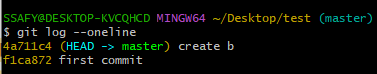

​			KHminor에서 커밋한거는 log가 찍히지 않는다.

*만약 브랜치를 바꾸지 않고 master에서 작업을 했다면 커밋하기 전 상태로 돌려놓고 브랜치를 바꾸면 된다.*

8. 이후 master 작업과 KHminor의 작업을 합치고 싶을 경우(대상으로 switch)

   master은 병합이 되어진 것이고 KHminor은 그냥 그대로이다.

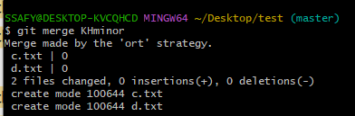

위와 같이 하게 되면

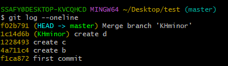

9. 해당 과정을 그래프로 본다면

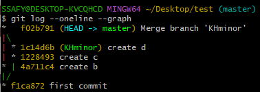

---

# Git merge

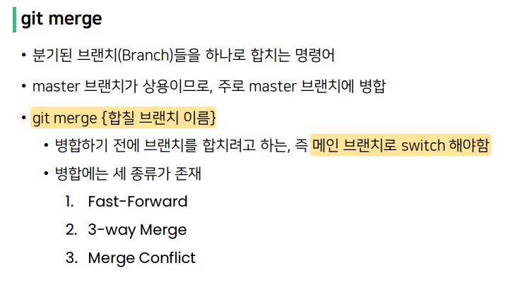

## Fast Forward

가져와서 그냥 냅다 합쳐주는 것?

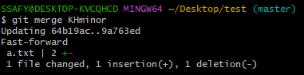

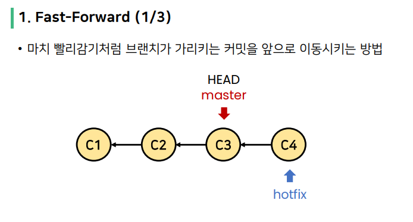

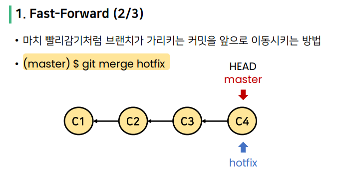

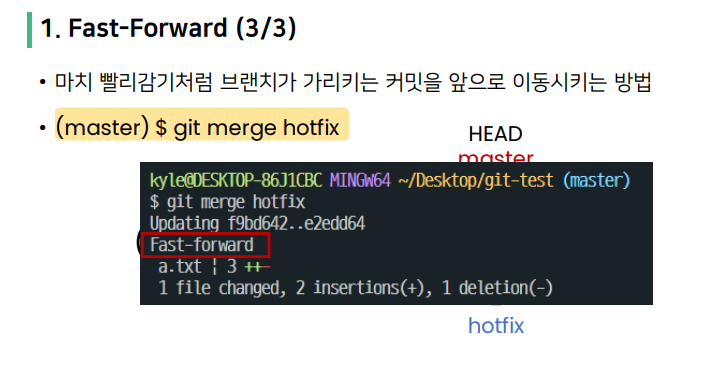

3. ### Merge Conflict

   1. 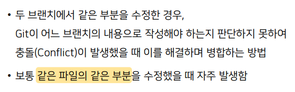

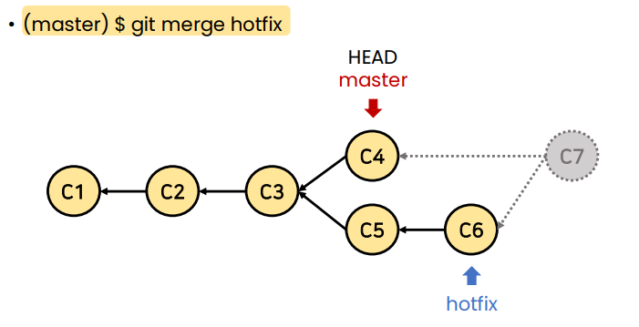

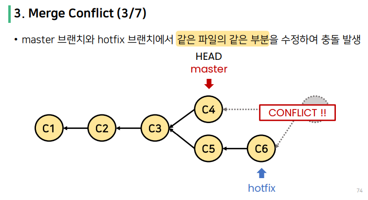

1. 마스터에서 데이터를 수정후 커밋 

2. 이후 스위치 하여 다른 브랜치에서 같은 파일을 수정 후 커밋

3. 이후 KHminor을 master과 병합을 하려고 하는데

4. 해당 파일인 a.txt 를 텍스트 에디터로 열어보게 되면

5. 현재 KHmior 의 데스크이기에 위에 텍스트로 먼저 나오게 되고

   ​	merge 할 master은 아래에 나오게 된다. 

   ​	그래서 수정하고 나면 문제가 없이 해결이 된다.

6. status를 찍으면

​	그래프를 보면 호출한 기준으로 부터 일직선으로 작업이 되기에 3줄이 되었다.

일반적으로 merge 하는 시점은 해당 과정이 마쳤을때 하게 된다??

merge 순서( 대략적 순서? ):

1. master repo 에서 branch 를 생성 후 
2. 커밋 , 풀 완료 후 
3. 깃 웹 사이트에서 등록 한 후 
4. master repo에서 다 승인을 하여 당겨온 후? (create merge  request)
5. master 입장에서 pull 한 다음 
6. branch에서 git merge master 하게 되면 모두 가져오게 된다.

---

# Shared repository model

---

# Fork & Pull model (깃헙에서 실습했음)

Shared repository model 이거와 거의 유사.

 github 에서 Fork 만 해주면 됨

****

---

# PR (Pull Reqeust)

---

# Git 브랜치 전략

개발 과정에서는 develop 에서 작업하기