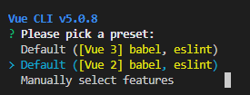
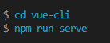
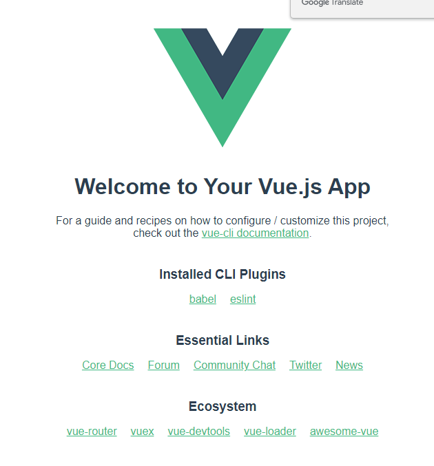
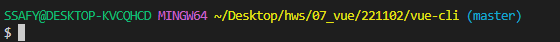
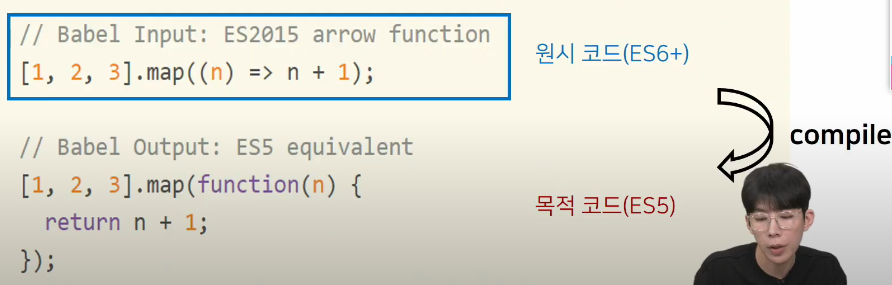
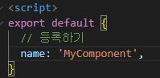
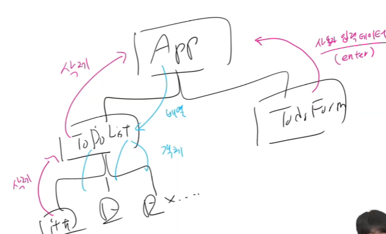

# Vue CLI


## Node.js

- 자바스크립트는 브라우저를 조작하는 유일한 언어
  - 하지만 브라우저 밖에서는 구동할 수 없었음
- 자바스크립트를 구동하기 위한 런타임 환경인 Node.js로 인해 브라우저가 아닌 환경에서도 구동할 수 있게 됨
  - Browser만 조작 가능했으나, Server-Side-programming 또한 가능


---

## NPM (Node Package Manage)

- 자바스크립트 패키지 관리자
  - 파이썬에 pip가 있다면 Node.js에는 npm이 있다.
  - pip와 마찬가지로 다양한 의존성 패키지를 관리
- Node.js 설치 시 함께 설치됨

---

## Vue CLI

- Vue 개발을 위한 표준 도구
- 프로젝트의 구성을 도와주는 역할
- 확장 플러그인, GUI, Babel 등 다양한 tool 제공


- 설치
  - $ npm install -g @vue/cli
  - pull 받아 왔을 때는 
    - `$ npm install` 만 하면 된다. 
  
- 프로젝트 생성
  - vscode terminal에서 진행 (interactive shell 을 사용하기 위해)
  
  - $ vue create {{vue 명}}
  
  - $ vue create vue-cli
  
    
  
  - 아래와 같은 문구가 뜨는 이유는
    - create로 인해 폴더가 생성되었기 때문에 한번 더 들어가서 실행해야함.
  
  
  
  - cd vue-cli 로 이동 후 npm run serve를 하게 되면 아래의 사진과 같다. 
  
    
  
  - Local과 Network 의 차이는 Network는 모바일로도 접속이 가능하는 것을 의미?
  
    

---

## Vue CLI 프로젝트 구조



위의 사진처럼 (master) 되어있다면 git init이 되어있기에 

만약 나의 TIL_edu 폴더에서 PJT 작업을 한다면 

TIL_edu 폴더의 .git 폴더를 지우고 업로드를 해야 올라갈 수 있다고 한다.


- node_modules

  - node.js 환경의 여러 의존성 모듈
  - python의 venv와 비슷한 역할을 함
    - 따라서 .gitignore에 넣어주어야 하며, Vue 프로젝트를 생성하면 자동으로 추가됨

- node_modules-Bael (JS의 컴파일러 역활), 호환성 문제 

  - JavaScript compiler

  - 자바스크립트 ES6+ 코드를 구버전으로 번역/변환 해주는 도구

  - 자바스크립트의 파편화, 표준화의 영향으로 작성된 코드의 스펙트럼이 매우 다양

    - 최신 문법을 사용해도 브라우저의 버전 별로 동작하지 않는 상황이 발생

    - 버전에 따른 같은 의미의 다른 코드를 작성하는 등의 대응이 필요해졌고,

      ​	이러한 문제를 해결하기 위한 도구

    - 원시 코드(최신 버전)를 목적 코드(구 버전)으로 옮기는 번역기(컴파일러)가   

      ​	등장하면서 항상 코드가 특정 브라우저에서 동작하지 않는 

      ​	상황에 대해 크게 고민하지 않는다

    - 다만 우리가 신경 쓸 필요 없다.

    ```javascript
    // Babel Input: ES2015 arrow function
    ```

    

  - 

  

- node_modules-webpack

  - static module bundler
  - 모듈 간의 의존성 문제를 해결하기 위한 도구
  - 프로젝트에 필요한 모든 모듈을 매핑하고 내부적으로 종속성 그래프를 빌드함

  

- Module

  - 개발하는 애플리케이션의 크기가 커지고 복잡해지면 파일 하나에 모든 기능을 담기 힘듦

  - 따라서 자여스럽게 파일을 여러 개로 분리하여 관리를 하게 되었고,

    ​	이때 분리된 파일 각각이 모듈(module) 즉, js파일 하나가 하나의 모듈

  - 모듈은 대개 기능 단위로 분리하며, 클래스 하나 혹은 특정한 목적을 가진

    ​	복수의 함수로 구성된 라이브러리 하나로 구분됨

  - 여러 모듈 시스템

    - ESM, AMD, CommonJS, UMD

  

- Module 의존성 문제

  - 모듈의 수가 많아지고 라이브러리 혹은 모듈 간의 의존성(연결성)이 깊어지면서

    ​	특정한 곳에서 발생한 문제가 어떤 모듈 간의 문제인지 파악하기 어려움

    - Webpack은 이 모듈 간의 의존성 문제를 해결하기 위해 등장


- Bundler

  - 모듈 의존성 문제를 해결해주는 작업이 Bundling
  - 이러한 일을 해주는 도구가 Bundler 이고, Webpack은 다양한 Bunlder 중 하나
  - 모듈들을 하나로 묶어주고 묶인 파일은 하나 혹은 여러개로 만들어짐
  - Bundling 된 결과물은 개별 모듈의 실행 순서에 영향을 받지 않고 동작하게 됨
  - Vue CLI는 이러한 Babel, Webpack에 대한 초기 설정이 자동으로 되어있다.
  - node_modules의 의존성 깊이는 엄청나게 깊다..

  

- package.json

  - 프로젝트의 종속성 목록과 지원되는 브라우저에 대한 구성 옵션을 포함

- package-lock.json

  - node_modules에 설치되는 모듈과 관련된 모든 의존성을 설정 및 관리
  - python의 requirements.txt 역할
  - 함부로 수정 NO!

  

- public/index.html

  - Vue 앱의 뼈대가 되는 html
  - Vue 앱과 연결될 요소가 있음


- src/
  - src.assets
    - 정적 파일을 저장하는 디렉토리
  - src/components
    - 하위 컴포넌트들이 위치
  - src/App.vue
    - 최상위 컴포넌트
    - public/index.html과 연결됨
  - src/main.js
    - webpack이 빌드를 시작할 때 가장 먼저 불러오는 entry point
    - Vue 전역에서 활용할 모듈을 등록할 수 있는 파일

---

## Component

- UI를 독립적이고 재사용 가능한 조각들로 나눈 것
- CS에서는 다시 사용할 수 있는 범용성을 위해 개발된 소프트웨어 구성 요소를 의미
- 컴포넌트는 유지보수를 쉽게 만들어 줄 뿐만 아니라 재사용성의 측면에서도 매우 강력하다.


- Django에서의 예시
  - 우리는 base.html과 index.html을 분리하여 작성하였지만, 하나의 화면으로 볼 수 있다.
    - 즉, 한 화면은 여러개의 컴포넌트로 이루어짐
  - base.html을 변경하면 이를 extends하는 모든 화면에 영향을 미침

---

## SFC

- component in Vue

  - 그렇다면 Vue에서 말하는 component란 무엇일까?
    - 이름이 있는 재사용 가능한 Vue intance
  - 그렇다면 Vue instance란?
    - 앞서 수업에서 사용한 new Vue()로 만든 인스턴스 

  

- SFC (Single Fil Component)

  - 하나의 .vue 파일이 하나의 Vue instance이고, 하나의 컴포넌트 이다.
    - 즉, Single File Component
  - Vue instance 에서는 HTML, CSS, JavaScript 코드를 한번에 관리
    - 이 Vue instance를 기능 단위로 작성하는것이 핵심
  - 정리
    - HTML, CSS 그리고 JavaScript 를 .vue라는 확장자를 가진 파일 안에서 관리하며 개발
    - 이 파일을 Vue instance, Vue component 라고 하며, 기능 단위로 작성
    - Vue ClI가 Vue를 Component based하게 사용되도록 도와줌

---

## Vue component 구조

- 템플릿(HTML)
  - HTML의 body 부분
  - 눈으로 보여지는 요소 작성
  - 다른 컴포넌트를 HTML 요소처럼 추가 기능
- 스크립트(JavaScript)
  - JS 코드가 작성되는 곳
  - 컴포넌트 정보, 데이터, 메서드 등 vue 인스턴스를 구성하는 대부분이 작성 됨
- 스타일(CSS)
  - CSS가 작성되며 컴포넌트의 스타일을 담당
- Vue component 구조 정리
  - 컴포넌트들이 tree 구조를 이루어 하나의 페이지를 만듦
  - root에 해당하는 최상단의 component가 App.vue
  - 이 App.vue를 index.html과 연결
  - 결국 index.html 파일 하나만을 rendering
    -  이게 바로 SPA 방식

---

## Vue component 실습

- 현재 구조
  - Vue CLI를 실행하면 이미 Helloworld.vue 라는 컴포넌트가 생성되어 있고 App.vue에 등록되어 사용되고 있음
    - npm run serve 명령어를 진행 했을 떄 나온 화면이 대부분 Helloworld.vue


- `MyComponent.vue 3단계` (대문자 camel 케이스를 지키기.)

  1. src/components/ 안에 생성

  2. script에 이름 등록( 등록을 해야 상위 폴더에서 가져 갈 수 있다.)

     

  3. template에 요소 추가

     ​	템플릿을 구성하는 최상단에는 태그가 하나 꼭 있어야 한다고 한다.

     `주의` templates 안에는 반드시 하나의 요소만 추가 가능

     - 비어 있어도 안되며
     - 해당 요소 안에 추가 요소를 작성해야 함

  

- `Component 등록 3단계` (django에서의 url,view,template)

  1. 불러오기
     1. src는 의미하는 절대경로: @, 그리고 .vue 또한 작성 하지 않아도 된다.
  2. 등록하기
     1. 
  3. 보여주기


- Component 등록 - 불러오기
  - import {instance name} from {위치}
  - instance name은 instance 생성 시 작성한 name
  - @은 src의 shortcut
  - .vue 생략 가능


기본 vue 템플릿 작성은 vue 작성 후 자동완성

- 자식 컴포넌트 작성
  - 불러오기
  - export default { components: { 불러온 파일명 }}
  - template 에 사용하기

---

## Pass Props & Emit Events

- Data in components
  - 우리는 정적 웹페이지가 아닌, 동적 웹페이지를 만들고 있음
    - 즉, 웹페이지에서 다뤄야 할 데이터가 등장
  - 한 페이지 내에서 같은 데이터를 공유 해야 함
    - 하지만 페이지들은 component로 구분이 되어있음
  - 각 Component는 독립적이므로 서로 다른 data를 갖게 될 것이다.
  - 필요한 컴포넌트들끼리 데이터를주고받으면 될까?
    - 데이터의 흐름을 파악하기 힘듦
    - 개발 속도 저하
    - 유지보수 난이도 증가
  - 컴포넌트는 부모 자식 관계를 가지고 있으므로, 부모-자식 관계만 데이터를 주고받게 하자.
    - 데이터의 흐름을 파악하기 용이
    - 유지 보수하기 쉬워짐
- Pass Props & emit event
  - 부모 => 자식으로의 데이터의 흐름
    - pass `props`의 방식
  - 자식 => 부모로의 데이터의 흐름
    - `emit` event의 방식

---

## Pass Props

- 요소의 속성(property)을 사용하여 데이터 전달

  - <HelloWorld msg='Welcome to Your Vue.js App'/> 를 통해

- props는 부모(상위) 컴포넌트의 정보를 전달하기 위한 사용자 지정 특성

- 자식(하위) 컴포넌트는 props 옵션을 사용하여 수신하는 props를 명시적으로 선언해야 함

- Vue CLI를 설치시 만들어주었던 App.vue의 Helloworld 컴포넌트

- App.vue의 <HelloWorld/>요소에 msg='~' 라는 property를 설정하였고,

  하위 컴포넌트인 HelloWorld는 자신에게 부여된 msg property를 template에서 {{msg}}의 형태로 나타냄

- 이렇게 부모 => 자식으로의 data 전달 방식을 pass props라고 함

- 정적인 데이터를 전달하는 경우 static props라고 명시하기도 함

- 요소에 속성을 작성하듯이 사용 가능하여, prop-data-name='value'의 형태로 데이터 전달

  - 이때 속성의 키 값은 kebab-case를 사용

- `주의 할 것`

  - 부모에서 보낼 때는 케밥 케이스로 보내고(HTML), 받을 때는 카멜 케이스로 받는다(JS)

- Pass Prop 명시

  - Prop 명시
  - 데이터를 받는 쪽, 즉 하위 컴포넌트에서도 Props에 대해 명시적으로 작성 해주어야 함
  - 전달받은 props를 type과 함께 명시
  - 컴포넌트를 문서화할 뿐만 아니라, 잘못된 타입이 전달하는 경우 브라우저의 자바스크립트 콘솔에서 사용자에게 경고

- Pass Props convention

- 부모에서 넘겨주는 props

  - kebab-case (HTML 속성명은 대소문자를 구분하지 않기 때문)

- 자식에서 받는 porps

  - camelCase

- 부모 템플릿(html)에서 kebab-case로 넘긴 변수를 자식의 스크립트(vue)에서 자동으로 camelCase로 변환하여 인식함

  

- Dynamic props

  - 변수를 props로 전달할 수 있음
  - v-bind directive를 사용해 데이터를 동적으로 바인딩
  - 부모 컴포너느의 데이터가 업데이트 되면 자식 컴포넌트로 전달되는 데이터 또한 업데이트 됨

- Pass Props

  - :dynamic-props="dynamicProps"는 앞의 key값(dynamic-props)이란 이름으로 

    ​	뒤의 " " 안에 오는 데이터(dynamicProps)를 전달하겠다는 뜻

  - 즉, :my-props="dynamicProps"로 데이터를 넘긴다면, 자식 컴포넌트에서myProps로 데이터를 받아야 함.

  - v-bind로 묶어있는 " "안의 구문은 JS구문으로 볼 수 있다

    - 따라서 dynamicProps 라고 하는 변수에 대한 data를 전달할 수 있는 것

    ```javascript
    <SomeComponent :num-props="1"/> 
        
    // ""안이 JS문법으로 숫자 1이 전달된다.


- 단방향 데이터 흐름 (위 -> 아래 방향)

  - 모든 props는 부모에서 자식으로 즉 아래로 단방향 바인딩을 형성

  - 부모 속성이 업데이트되면 자식으로 흐르지만 반대 방향은 아님

    - 부모 컴포넌트가 업데이터될 때마다 자식 컴포넌트의 모든 prop들이 최신 값으로 새로고침 됨

  - 목적 

    - 하위 컴포넌트가 실수로 상위 컴포넌트 상태를 변경하여 앱의 데이터 흐름을 

      ​	이해하기 힘들게 만드는 것을 방지

  - 하위 컴포넌트에서 prop를 변경하려고 시도해선 안되며 그렇게 하면 Vue는 콘솔에서 경고

---

## Emit Event

- 부모 컴포넌트에서 자식 컴포넌트로 데이터를 전달할 때는 이벤트를 발생 시킴

- 이벤트를 발생시키는게 어떻게 데이터를 전달하는 것인가하면

  1. 데이터를 이벤트 리스너의 콜백함수의 인자로 전달
  2. 상위 컴포넌트는 해당 이벤트를 통해 데이터를 받음

  

- $emit 메서드를 통해 부모 컴포넌트에 이벤트를 발생

  - $emit('event-name') 형식으로 사용하며 부모 컴포넌트에 event-name이라는 이벤트가 발생했더는 것을 알림
  - 마치 사요자가 마우스 클릭을 하면 click 이벤트가 발생하는 것처럼 $emit('event')가  실행되면 event-name 이벤트가 발생하는 것

  

- Emit Event 흐름 정리

  1. 자식 컴포넌트에 있는 버튼 클릭 이벤트를 청취하여 연결된 핸들러 함수(childToParent) 호출
  2. 호출 된 함수에서 $emit을 통해 상위 컴포넌트에 이벤트(child-to-parent)발생
  3. 상위 컴포넌트는 자식 컴포넌트가 발생시킨 이벤트(child-to-parent)를 청취하여 연결된 핸들러 함수(parentGetEvent) 호출

  

- emit with data 흐름 정리

  1. 자식 컴포넌트에 있는 버튼 클릭 이벤트를 청취하여 연결된 핸들러 함수(ChildToParent) 호출
  2. 호출된 함수에서 $emit을 통해 부모 컴포넌트에 이벤트(child-to-parent)를 발생
     - 이벤트에 데이터(child data)를 함께 전달
  3. 부모 컴포넌트는 자식 컴포넌트의 이벤트(child-to-paren)를 청취하여 연결된 핸들러 함수(parentGetEvent) 호출, 함수의 인자로 전달된 데이터(child data)가 포함되어 있음
  4. 호출된 함수에서 console.log(`~child data~')로 실행

  

- emit with dynamic data 흐름 정리

  1. 자식 컴포넌트에 있는 keyup.enter 이벤트를 청취하여 연결된 핸들러 함수(ChildInput)호출

  2. 호출된 함수에서 $emit을 통해 부모 컴포넌트에 이벤트(child-input)를 발생

     - 이벤트에 v-model로 바인딩 된 입력받은 데이터를 전달

  3. 상위 컴포넌트 자식 컴포넌트의 이벤트(child-input)를 청취하여 연결된 

     ​	핸들러 함수(GetDynamicData)호출, 함수의 인자로 전달된 데이터가 포함되어 있음

  4. 호출된 함수에서 console.log(`~입력받은 데이터~')실행

  

- 정리

  - 자식 컴포넌트에서 부모 컴포넌트로 이벤트를 발생시킴
    - 이벤트에 데이터를 담아 전달 가능
  - 부모 컴포넌트에서는 자식 컴포넌트의 이벤트를 청취
    - 전달받은 데이터는 이벤트 핸들러 함수의 인자로 사용

  

- Pass props / emit event 컨벤션

  - HTML: kebab-case  (꼬치)
  - JavaScript: camelCase (낙타 등)

- props

  - 상위=>하위 흐름에서 HTML 요소로 내려줌: kebab-case
  - 하위에서 받을 때 JavaScript 에서 받음: camelCase

- emit

  - emit 이벤트를 발생시키면 HTML 요소가 이벤트를 청취함: kebab-case
  - 메서드, 변수명 등은 JavaScript 에서 사용함: camelCase

## etc

1. vue-cli에서는 객체를 넘겨주는 것이 아닌 함수의 return 값을 보내줘야한다.
   - 각 vue 인스턴스는 같은 data 객체를 공유하므로 새로운 data 객체를 반환(return)하여 	사용해야 함.
2. 동적 Props 를 정적 Props 보다 훨씬 많이 사용한다고 한다.




