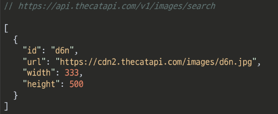

# PJT 연습

대댓글 - 1:N


python manage.py makemigrations

python manage.py migrate  

python manage.py loaddata movies.json 

위와 같은 순서로 해야한다.


---

## Axios 연습하기


```javascript
<script> src ="url"</script>  // url 에 axios cdn을 넣고
<script>
    axios.get('요청할 url')
	.then(성공하면 수행할 콜백함수)
	.catch(실패하면 수행할 콜백함수)

```



가져올 url의 데이터가 위와 같을 때

```javascript
`파이썬 방식`

import requests

url을 담아줄 변수 생성 후 
url 담아주기

cat_image_serch_url = '{{url}}'

이후 요청을 하기 위해 불러온 requests를 사용하여
response 변수에 요청 return 값을 넣어주기  
response = requests.get(cat_image_serch_url)
```


```javascript
Axios로 요청해보기 (비동기)
<script> src ="url"</script>  // url 에 axios cdn을 넣고
<script>
    const {{변수명}} = "{{url 주소}}"
	axios.get({{변수명}})
		.then({{매개변수명}} => {
              성공시 실행 할 코드
              })
    	.catch({{매개변수명}} => {
               실패시 실행 할 코드
               })
</script>

```


---


## axios CDN 작성


1. 기존의 form 에 있던 action과 method 속성은 axios 요청으로 대체되기 때문에 삭제해준다.
2. script 태그안에 form 태그를 선택하는 변수를 만들어주기.
3. 그리고 해당 form 태그를 submit 하는 이벤트가 발생 시 event로 인해 갱신되는것을 막기 위해 preventDefault()를 넣어준다.

```javascript
const form = document.querySelector('#follow-form')
form.addEventListener('submit', function(event) {
	event.preventDefault()    
})
```

4. 이후 axios 요청을 보내기 위해 필요한 것은 method 가 무엇인지, url이 무엇인지 

   ​	그리고 profile 페이지로 요청하기 위해 userId 값이 필요하기 때문에 user pk 값을 가져와야한다.

   ​	그래서 views.py 에서 받아온 person의 pk 인 person.pk 값을 데이터로 넘겨줄 data-user-id 변수에 담아주기

```javascript
<form id='follow-form' data-user-id="{{person.pk}}">
    ...
</form>
```

​		이후 data-user-id 변수에 담은 데이터를 script 로 넘겨 줄 때 

​		변수의 이름에 있는 data는 dataset으로 user-id는 userId로 기존의 케밥 케이스에서 카멜 케이스로 변경 해준다. 

```javascript
const userId = event.target.dataset.userId
```

```javascript
axios({
    method: 'post',
    url: `/accounts/${userId}/follow/`
})
```


5. 여기서 이제 POST 요청이기에 csrftoken 을 함께 보내줘야하는데 해당 속성은 hidden으로 되어있어서 

   ​	숨겨져있는 csrf값을 가진 input 태그를 선택해야한다.

   ​	위와 같이하면 AJAX로 csrftoken을 보내게 된다.

```javascript
const csrftoken = document.querySelector('[name=csrfmiddlewaretoken]').value
```

​		이후 axios의 속성으로 headers의 값으로 {'X-CSRFToken':csrftoken}을 넣어주기

```javascript
axios({
    method: 'post',
    url: `/accounts/${userId}/follow/`,
    headers: {'X-CSRFToken': csrftoken}
})
```

