# Vue

## State Management

- 상태(State)란?
  
  - 현재에 대한 정보(data)
  - 그럼 Web Application에서의 상태는 어떻게 표현할 수 있을까?
    - 현재 App이 가지고 있는 Data로 표현할 수 있음
    - 우리는 여러 개의 component를 조합해서 하나의 App을 만들고 있음
    - 즉, 여러 개의 component가 같은 상태(data)를 유지할 필요가 있음
      - 상태 관리(State Management) 필요

- Pass Props & Emit Event
  
  - 지금까지 우리는 props와 event를 이용해서 상태 관리를 하고 있음
  - `같은 데이터를 공유하고 있으므로`, 각 컴포넌트가 동일한 상태를 유지하고 있음
  - 데이터의 흐름을 직관적으로 파악 가능
  - 그러나 component의 중첩이 깊어지면 데이터 전달이 쉽지 않음
  - `중앙 저장소(store)에 데이터를 모아서 상태 관리` => Vuex
  - 각 component는 중앙 저장소의 데이터를 사용
  - component의 계층에 상관없이 중앙 저장소에 접근해서 데이터를 얻거나 변경할 수 있음

- Vuex 
  
  - "state management pattern + Library" for vue.js
    
    ​    (상태 관리 패턴 + 라이브러리)
  
  - 중앙 저장소를 통해 상태 관리를 할 수 있도록 하는 라이브러리
  
  - `데이터가 예측 가능한 방식으로만 변경 될 수 있도록 하는 규칙을 설명하며,`
    
    ​    `Vue의 반응성을 효율적으로 사용하는 상태 관리 기능을 제공`
  
  - Vue의 공식 도구로서 다양한 기능을 제공

---

## Vuex 시작하기

- 프로젝트 with vuex
  
  - $ vue create vuex-app // 프로젝트 생성
  - $ cd vuex-app // 디렉토리 이동
  - $ vue add vuex // Vue CLI를 통해 vuex plugin 적용

- src/ store/ index.js 가 생성됨 

- vuex의 핵심 컨셉 4가지
  
  1. state
  2. getters
  3. mutations
  4. actions
  
  ```javascript
  // index.js
  
  import Vue from 'vue'
  import Vuex from 'vuex'
  
  Vue.use(Vuex)
  
  export default new Vuex.Store({
      state: {  
      },
      getters: {  
      },
      mutations: {  
      },
      actions: {  
      },
      modules: {  
      },
  })
  ```
+ Vue와 Vuex 인스턴스 비교

```javascript
// Vue 인스턴스

export default {
    name: 'VueInstance',
    data: ()=> {
        return {
        }
    },
    computed: { 
    },
    methods: {
    },
}

// Vuex 인스턴스

export default new Vuex.Store({
    state: {  
    },
    getters: {  
    },
    mutations: {  
    },
    actions: {  
    },
    modules: {  
    },
})
```

1. State
   
   * vue 인스턴스의 data에 해당
   * 중앙에서 관리하는 모든 상태 정보
   * 개별 component는 state에서 데이터를 가져와서 사용
     * 개별 component가 관리하던 data를 중앙 저장소(Vuex Store의 state)에서 관리하게 됨
   * state의 데이터가 변화하면 해당 데이터를 공유(사용)하는 component도 자동으로 다시 렌더링
   * $store.state로 state 데이터에 접근

2. Mutations
   
   * `실제로 state를 변경하는 유일한 방법`
   
   * vue 인스턴스의 methods에 해당하지만 Mutations에서 호출되는 
     
     ​    핸들러(handler)함수는 반드시 `동기적`이어야 함
     
     * 비동기 로직으로 mutations를 사용해서 state를 변경하는 경우,
       
       ​    state의 변화 시기를 특정할 수 없기 때문
   
   * 첫 번째 인자로 `state`를 받으며, component 혹은 Actions에서 `commit()` 메서드로 호출됨
   
   * `mutations, actions에서 호출되는 함수를 handler 함수라고 함`

3. Actions
   
   * mutations와 비슷하지만 `비동기 작업을 포함할 수 있다는 차이가 있음`
   
   * `state를 직접 변경하지 않고 commit()메서드로 mutations를 호출해서 state를 변경함`
   
   * context 객체를 인자로 받으며, 이 객체를 통해 store.js의 모든 요소와 메서드에 접근할 수 있다.
     
     ​    (== 즉 state를 직접 변경할 수 있지만 하지 않아야 한다. 이유는 mutations를 통해 변경해야 하기에??)
   
   * component에서 `dispatch()` 메서드에 의해 호출됨

4. Getters
   
   - vue 인스턴스의 computed에 해당
   
   - `state를 활용하여 계산된 값을 얻고자 할 때 사용`
     
     ​    state의 원본 데이터를 건들지 않고 계산된 값을 얻을 수 있다
   
   - computed와 마찬가지로 getters의 결과는 캐시(cache)되며, 종속된 값이 변경된 경우에만 재계산됨
   
   - getters에서 계산된 값은 state에 영향을 미치지 않음
   
   - 첫번째 인자로 `state`, 두번째 인자로 `getter`를 받음
* Mutations & Actions
  
  * vue component의 methods 역할이 vuex에서는 아래와 같이 분화된다.
  
  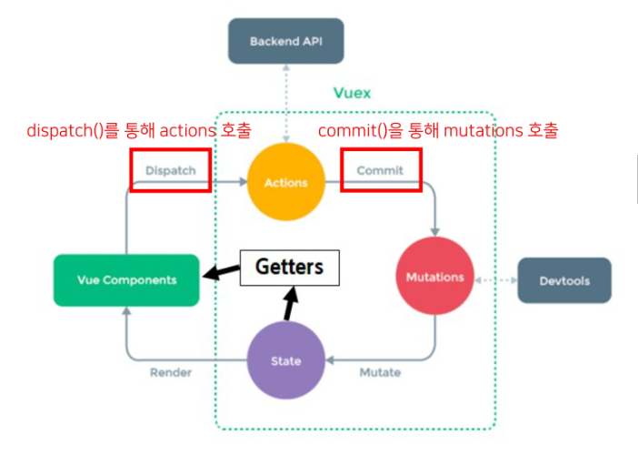
  
  - Mutations
    - state를 변경
  - Actions
    - state 변경을 제외한 나머지 로직

* 그럼 이제 모든 데이터를 Vuex에서 관리해야 할까??
  
  * Vuex를 사용한다고 해서 모든 데이터를 state에 넣어야 하는 것은 아님
  * Vuex에서도 여전히 pass props, emit event를 사용하여 상태를 관리할 수 있다.
  * 개발 환경에 따라 적절하게 사용하는 것이 필요함

* ### 정리
  
  * state
    
    * 중앙에서 관리하는 `모든 상태 정보`
  
  * mutations
    
    * `state를 변경`하기 위한 methods `(동기적)`
  
  * actions
    
    * `비동기 작업이 포함될 수 있는(외부 API 와의 소통 등)` methods
    * `state를 변경하는 것 외의 모든 로직 진행`
  
  * getters
    
    * state를 활용해 `계산한 새로운 변수 값`
    * 원본 state의 값 변경 X

* component에서 `데이터를 조작`하기 위한 데이터의 흐름
  
  * component => (actions) => mutations => state

* component에서 `데이터를 사용`하기 위한 데이터의 흐름
  
  * state => (getters) => component


###### dispatch(action을 호출) -> commit(mutations를 호출) -> mutations에서 stats를 변경

---

## Vuex 실습

- 이제부터는 객체 메서드 축약형을 사용할 것

```javascript
// before 
const obj1 = {
    addValue: function(value) {
        return value
    },
}

// after
const obj2 = {
    addValue(value) {
        return value
    },
}

// 객체에서의 함수는 {{함수명}}(인자) {return },
```

- src/ store/ index.js

- vuex의 핵심 컨셉 4가지
  
  - state
  - getters
  - mutations
  - actions
  
  ```javascript
  // index.js
  
  import Vue from 'vue'
  import Vuex from 'vuex'
  
  Vue.use(Vuex)
  
  export default new Vuex.Store({
      state: {  
          message: 'message in store'
      },
      getters: {  
      },
      mutations: {  
      },
      actions: {  
      },
      modules: {  
      },
  })
  ```

- ### state
  
  - 중앙에서 관리하는 모든 상태 정보
  - $store.state로 접근 가능
  - store의 state에 message 데이터 정의
  
  ```javascript
  state: {  
          message: 'message in store'
      },
  ```
  
  - component에서 state 사용 
  
  ```vue
  <template>
      <div id="app">
          <h1>{{ $store.state.message }}</h1>
      </div>
  </template>
  ```
  
  
  
  * $store.state로 바로 접근하기 보다 `computed에 정의 후` 접근하는 것을 권장
  
  ```vue
  <template>
      <div id="app">
          <h1>{{ message }}</h1>
      </div>
  </template>
  
  <script>
      export default {
          name: 'App',
          computed: {
              message() {
                  return this.$store.state.message
              }
          }
      }
  </script>
  ```
  
  - Vue 개발자 도구에서의 Vuex
  - 관리 화면을 Vuex로 변경
  - 관리 되고 있는 state 확인 가능
  
  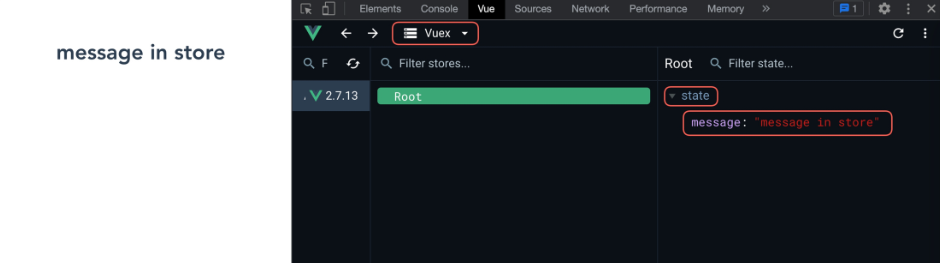

- ### actions
  
  - state를 변경할 수 있는 `mutations 호출` (actions 또한 변경 가능하지만 하지 않음)
  - component에서 `dispatch()에 의해 호출됨`
  - `dispatch(A,B)
    - A: 호출하고자 하는 actions 함수
    - B: 넘겨주는 데이터(payload)
  - actions에 정의된 changeMessage 함수에 데이터 전달하기
  - component에서 actions는 dispatch()에 의해 호출됨
  
  ```vue
  // App.vue
  
  <template>
      <div>
          <h1>{{ message }}</h1>
          <input type="text" @keyup.enter="changeMessage" v-model='inputDate'>
      </div>
  </template>
  
  <script>
      export default {
          ...
          data() {
              return {
                  inputData: null,
              }
          },
          methods: {
              changeMessage() {
                  const newMessage = this.inputData
                  this.$store.dispatch('changeMessage', newMessage)
                  this.inputData = null
              },
          },
         }
  </script>
  ```
  
  * actions의 첫 번째 인자는 context
    
    * context는 store의 전반적인 속성을 모두 가지고 있으므로
      
      ​    context.state와 context.getters를 통해 mutations를 호출하는 것이 모ㄷ 가능
    
    * dispatch()를 사용해 다른 actions도 호출할 수 있음
    
    * `단, actions에서 state를 직접 조작하는 것은 삼가`
  
  * actions의 두 번째 인자는 payload
    
    * 넘겨준 데이터를 받아서 사용
* ### mutations
  
  * 'actions에서 commit()을 통해 mutations 호출하기'
  
  * mutations는 state를 변경하는 유일한 방법
  
  * component 또는 actions에서 `commit()에 의해 호출됨`

* `commit(A,B)`
  
  * A: 호출하고자 하는 mutations 함수
    * `여기서 함수명을 대문자로 하는 이유는 
      	mutations 함수인것을 강조하기 위해서라고 한다.`
  
  * B: paload
  
  ```javascript
  // store/index.js
  
  export default new Vuex.Store({
    ...
    actions: {
        changeMessage(context, message) {
            context.commit('CHANGE_MESSAGE', message)
        },
    },
    ...
  })
  ```
  
* 'mutations 함수 작성하기'

* mutations는 state를 변경하는 유일한 방법

* mutations 함수의
  
  * 첫 번째 인자는 state
  * 두 번째 인자는 payload
  
  ```javascript
  mutations: {
    CHANGE_MESSAGE(state, message) {
        // console.log(state)
        // console.log(message)
        state.message = message
    },
  },
  ```

* ### getters
  
  * `getters 는 state를 활용한 새로운 변수`
  * getters 함수의 
    * 첫 번째 인자는 state
    * 두 번째 인자는 getters
  
  ```javascript
  // store/index.js
  
  export default new Vuex.Store({
      ...
      getters: {
          messageLength(state) {
              return state.message.length
          },
      },
      ...
  })
  ```
  
  * getters의 다른 함수 사용해 보기
  
  ```javascript
  // store/index.js
  
  export default new Vuex.Store({
      ...
      getters: {
          messageLength(state) {
              return state,message.length
          },
      }
  
      // messageLength를 이용해서 새로운 값을 계산
      doubleLenth(state, getters) {
          return getters.messageLengh * 2 
      },
  },
  ...
  })
  ```
  
  * getters 역시 state와 마찬가지로 computed에 정의해서 사용하는 것을 권장
  
  ```vue
  // App.vue
  ...
  
  <template>
      <div>
          <h1>길이 {{ messageLength }}의 메세지 {{ message }}를 입력받음</h1>
          <h3>x2 : {{ doubleLength }}</h3>
          <input type='text' @keyup.enter="changeMessage" v-model='inputData'>
      </div>
  </template>
  <script>
      export default {
          ...
          computed: {
              message() {
                  return this.$store.state.message
              },
              messageLength() {
                  return this.$store.state.messageLength
              },
              doubleLength() {
                  return this.$store.getters.doubleLength
              },
          }
      }
  </script>
  ```
  
  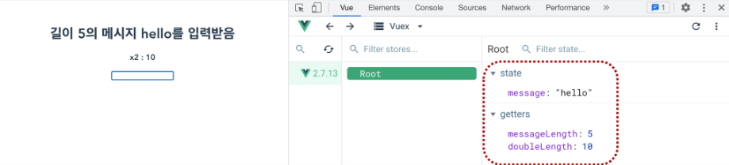

---

## Lifecycle Hooks

* Lifecycle Hooks
  * 각 Vue 인스턴스는 생성과 소멸의 과정 중 단계별 초기화 과정을 거침
    * Vue 인스턴스가 생성된 경우, 
    * 인스턴스를 DOM에 마운트하는 경우,
    * 데이터가 변경되어 DOM를 업데이트하는 경우 등
  * 각 단계가 트리거가 되어 특정 로직을 실행할 수 있다.
  * 이를 Lifecycle Hooks라고 한다.

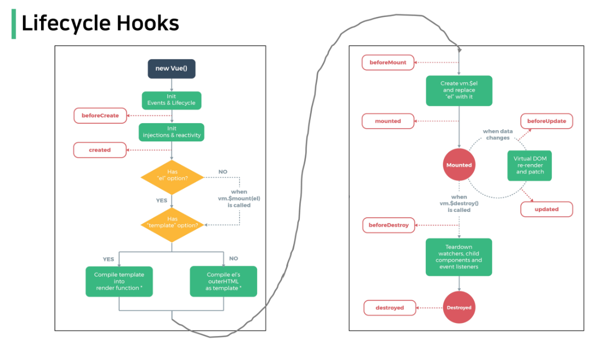

* ### created
  
  * Vue instance가 생성된 후 호출됨
  
  * data, computed 등의 설정이 완료된 상태
  
  * 서버에서 받은 데이터를 vue instance의 data에 할당하는 로직을 구현하기 적합
  
  * 단, mount 되지 않아 요소에 접근할 수 없다.
  
  * ex.
    JS에서 학습한 Dog API 활용 실습의 경우 버튼을 누르면 강아지 사진을 보여주는데
      버튼을 누르지 않아도 첫 실행 시 기본 사진이 출력되도록 하고 싶다면?
    
    * created 함수에 강아지 사진을 가져오는 함수를 추가
    
    ```vue
    // component/DogComponent.vue
    
    export default {
        ...
        created() {
            this.getDogImage()
        },
    }
    ```

* ### mounted
  
  * Vue instance가 요소에 mount된 후 호출됨
  * mount된 요소를 조작할 수 있음
  
  ```vue
  // components.DogComponent.vue
  
  export default {
      ...
      mounted() {
          const btn = document.querySelector('button')
          btn.innterText = '멍멍'
      },
  }
  ```
  
  
  
  * created의 경우,
    mount 되기 전이기 때문에 DOM에 접근할 수 없으므로 동작하지 않음
  * mounted는 주석 처리
  
  ```vue
  // component/DogComponent.vue
  
  export default {
      ...
      created() {
          this.getDogImage()
          const btn = document.querySelector('button')
          btn.innerText = '멍멍!' // 바뀌지 않음
      },
  }
  
  DOM 요소인 document, innerText 가 동작 x
  ```

* ### updated
  
  * 데이터가 변경되어 DOM에 변화를 줄 때 호출됨
  
  ```vue
  // components/DogComponent.vue
  
  export default {
      ...
      updated() {
          console.log('새로운 멍멍!')
      },
  }
  ```
  
  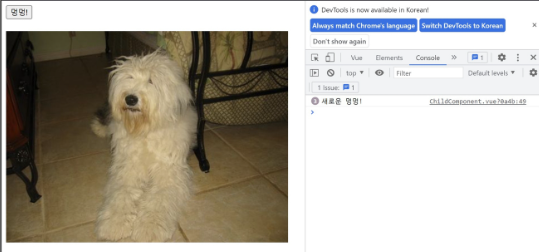 

* ### Lifecycle Hooks 특징
  
  * instacne마다 각각의 Lifecycle을 가지고 있음
  
  ```vue
  // App.vue
  
  export default {
      ...
      created() {
      console.log('App created!')
      },
      mounted() {
      console.log('App mounted!')
      },
  }
  
  -----------------------------------------------------------------------------------------
  
  // ChildComponent.vue
  
  export default {
      ...
      created() {
      this.getDogImage()
      console.log('Child created!')
      },
      mounted() {
      const btn = document.querySelector('button')
      btn.innerText = '멍멍!'    
      console.log('Child mounted!')
      },
      updated() {
      console.log('새로운 멍멍!')
      console.log('Child updated!')
      },
  }
  ```

* Lifecycle Hooks는 컴포넌트별로 정의할 수 있음

* 현재 해당 프로젝트는 아래와 같은 순서로 동작.
  
  * App.vue 생성 => ChildComponent 생성 => ChildComponent 부착
    => App.vue 부착 => ChildCompnent 업데이트 
  
  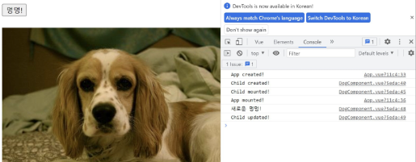

* 부모 컴포넌트의 mounted hook이 실행 되었다고 해서 자식이 mount 된 것이 아니고,
   부모 컴포넌트가 updated hook이 실행 되었다고 해서 자식이 updated 된 것이 아님
  
  * 부착 여부가 부모-자식 관계에 따라 순서를 가지고 있지 않은 것

* instance마다 각각의 Lifecycle을 가지고 있기 때문

---

## Todo with Vuex

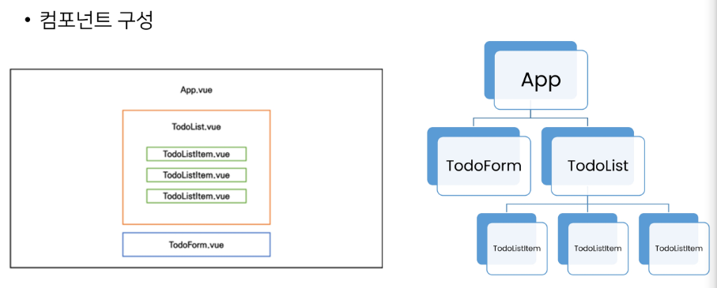

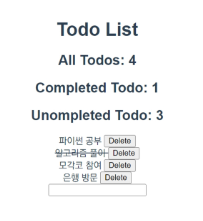

---

### Init Project

1. 프로젝트 생성 및 vuex 플러그인 추가

   ```terminal
   $ vue create todo-vuex-app
   $ cd todo-vuex-app
   $ vue add vuex
   ```

   

2. HelloWorld 컴포넌트 및 관련 코드 삭제

   - App.vue의 CSS코드는 남김


### 컴포넌트 작성

* TodoListItem.vue

  ```vue
  // components/TodoListItem.vue
  
  <template>
  	<div>Todo</div>
  </template>
  
  <script>
  	export default {
          name: 'TodoListItem',
      }
  </script>
  ```

* TodoList.vue

```vue
// components/TodoList.vue

<template>
	<div>
    	<TodoListItem>    
    </div>
</template>

<script>
    import TodoListItem from '@/components/TodoListItem'
	export default {
        name: 'TodoList',
        components: {
            TodoListItem,
        }
    }
</script>
```

* TodoForm.vue

```vue
// components/TodoForm.vue

<template>
	<div>Todo Form</div>
</template>

<script>
	export default {
        name: 'TodoForm',
    }
</script>
```

* App.vue

```vue
// App.vue

<template>
	<div id='app'>
        <h1>Todo List</h1>
    	<TodoForm> 
        <TodoList>
    </div>
</template>

<script>
    import TodoList from '@/components/TodoList'
    import TodoForm from '@/components/TodoForm'
    
	export default {
        name: 'App',
        components: {
            TodoList,
            TodoForm,
        }
    }
</script>
```


---


## Read Todo


* ### State 세팅

  * 출력을 위한 기본 todo 작성

  ```javascript
  // index.js
  
  import Vue from 'vue'
  import Vuex from 'vuex'
  
  Vue.use(Vuex)
  
  export default new Vuex.Store({
      state: {
          todos: [
              {
                  title: '할 일 1',
                  isCompleted: false,
              }
          ]
      },
  })
  ```

  * Vue 개발자 도구에서 state 데이터 확인

  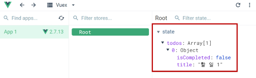


* ### state 데이터 가져오기

  * 컴포넌트에서 Vuex Store의 state에 접근($store.state)
  * computed로 계산된 todo 목록을 가져올 수 있도록 설정
  * `v-for의 key는 배열의 각 요소 간의 유일한 식별자 값을 사용해야 하지만 
      vuex 흐름에 집중하기 위해 index를 key로 사용하도록 함

  ```vue
  // components/TodoList.vue
  
  <template>
  	<div>
      	<TodoListItem>   
          v-for="(todo, index) in todos":key = "indedx"
      </div>
  </template>
  
  <script>
      import TodoListItem from '@/components/TodoListItem'
  	export default {
          name: 'TodoList',
          components: {
              TodoListItem,
          },
          computed: {
              todos(){
                  rturn this.store.state.todos
              }
          }
      }
  </script>
  ```


* ### Pass Props

  * TodoList.vue -> Todo.vue

  ```vue
  // components/TodoList.vue
  
  <template>
  	<div>
      	<TodoListItem>   
          v-for="(todo, index) in todos"
              :key = "indedx"
              :todo = 'toto'
      </div>
  </template>
  ```

  * TodoList.vue -> Todo.vue
  * todo 데이터 내려받기

  ```vue
  // components/TodoListItem.vue
  
  <template>
  	<div>{{ todo.title }} </div>
  </template>
  
  <script>
  	export default {
          name: 'TodoListItem',
          props: {
              todo: Object,
          }
      }
  </script>
  ```

  

---

## Create Todo

* ### TodoForm

  * todoTitle을 입력 받을 input 태그 생성
  * todoTitle을 저장하기 위해 data를 정의하고 input과 v-model을 이용해 양방향 바인딩
  * enter 이벤트를 사용해 createTodo 메서드 출력 확인

  ```vue
  // components/TodoForm.vue
  
  <template>
  	<div>
      	<input
                 type="text"
                 v-model='todoTitle'
                 @keyup.enter = "createTodo"
                 >
      </div>
  </template>
  
  <script>
  	export default {
          name: 'TodoForm',
          data() {
              return {
                  todoTitle: null,
              }
          },
          methods: {
              createTodo() {
                  console.log(this.todoTitle)
              }
          }
      }
  </script>
  ```

  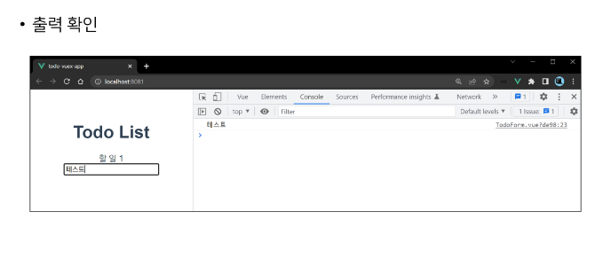

### Actions

* createTodo 메서드에서 actions을 호출(dispatch)
* todoTitle까지 함께 전달하기

```vue
// components/TodoForm.vue

<template>
	<div>
    	<input
               type="text"
               v-model='todoTitle'
               @keyup.enter = "createTodo"
               >
    </div>
</template>

<script>
	export default {
        name: 'TodoForm',
        data() {
            return {
                todoTitle: null,
            }
        },
        methods: {
            createTodo() {
                this.$store.dispatch('createTodo', this.todoTitle)
                this.todoTitle = null
            }
        }
    }
</script>
```

* `actions에는 보통 비동기 관련 작업이 진행 되지만 현재 별도의 비동기 관련 작업이 불필요하기에
    입력 받은 todo 제목(todoTodo)을 todo 객체(todoItem)로 만드는 과정을 Actions에서 작성할 예정
* createTodo에서 보낸 데이터를 수신 후 todoItem object를 생성

```js
// index.js

export default new Vuex.Stroe({
    ...
    action: {
        createTodo(context, todoTitle) {
            const todoItem = {
                title: todoTitle,
                isCompleted: false,
            }
            console.log(todoItem)
        },
    },
    modules: {
        
    }
})
```

 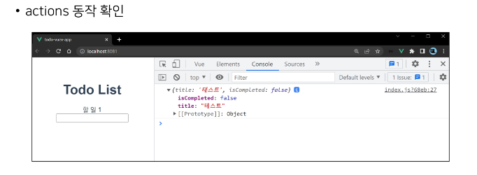


* ### Mutations

  * CREATE_TODO mutations 메서드에 todoItem를 전달하며 호출(commit)

  ```js
  // index.js
  
  export default new Vuex.Stroe({
      ...
      action: {
          createTodo(context, todoTitle) {
              const todoItem = {
                  title: todoTitle,
                  isCompleted: false,
              }
              // console.log(todoItem)
              context.commit('CREATE_TODO', todoItem)
          },
      },
      modules: {   
      }
  })
  ```

  

* mutations에서 state의 todos에 접근해 배열에 요소를 추가

```js
export default new Vuex.Stroe({
    ...
    mutations: {
        CREATE_TODO(state,todoItem) {
            state.todos.push(todoItem)
        }
    },
})
```

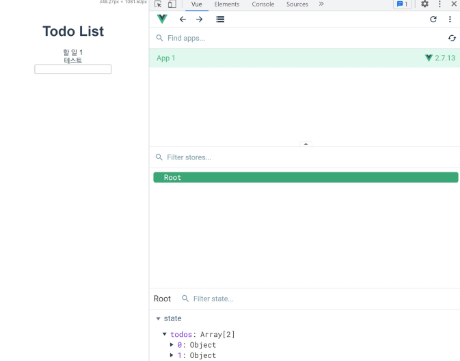

​                                                                                                                                                                                                                                                                                                                              


* Todos의 기존 dummy 데이터를 삭제
* 빈 배열로 수정

```js
// index.js

export default new Vuex.Store({
    state: {
        todos: [],
    }
})
```


* 공백 문자가 입력되지 않도록 처리하기

  * v-model.trim & if (this.todoTitle)

    * 좌우 공백 삭제
    * 빈 문자열이 아닐 경우만 작성

    ```vue
    // components/TodoForm.vue
    
    <template>
    	<div>
            <input
                   type="text"
                   v-model.trim="todoTitle"
                   @keyup.enter="createTodo"
                   >
        </div>
    </template>
    
    <script>
    	export default {
            ...
            methods: {
                createTodo() {
                    if (this.todoTitle) {
                        this.$store.dispatch('createTodo', this.todoTitle)
                    }
                    this.todoTitle = null
                }
            }
        }
    </script>
    ```

* 중간 정리

  * Vue 컴포넌트의 methods에서 dispatch()를 사용해 actions 메서드를 호출
  * Actions에 정의된 함수는 commit()을 사용해 mutations를 호출
  * Mutations에 정의된 함수가 최종적으로 state를 변경


---

## Delete Todo

* ### TodoListItem

  * TodoListItem 컴포넌트에 삭제 버튼 및 deleteTodo 메서드 작성

  ```vue
  // components/TodoListItem.vue
  
  <template>
  	<div>
          <span>{{ todo.title }}</span>
          <button @click="deleteTodo">Delete </button>
      </div>
  </template>
  
  <script>
  	export default {
          name: 'TodoListItem',
          props: {
              todo: Object,
          },
          methods: {
              deleteTodo() {
                  console.log('Todo 삭제')
              },
          }
      }
  </script>
  ```

  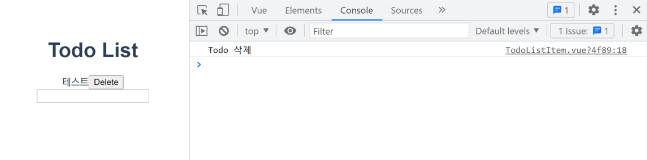


* ### Actions

  * deleteTodo 메서드에서 deleteTodo actions 메서드 호출(dispatch)
  * 삭제되는 todo를 함께 전달

  ```vue
  // components/TodoListItem.vue
  
  <script>
  	export default {
          name: 'TodoListItem',
          props: {
              todo: Object,
          },
          methods: {
              deleteTodo() {
                  // console.log('Todo 삭제')
                  this.$store.dispatch('deleteTodo', this.todo)
              },
          },
      }
  </script>
  ```

  * deleteTodo actions 메서드에서 DELETE_TODO mutations 메서드 호출 (commit)

  ```js
  // index.js
  
  export default new Vuex.Stroe({
      ...
      action: {
          createTodo(context, todoTitle) {
              const todoItem = {
                  title: todoTitle,
                  isCompleted: false,
              }
              // console.log(todoItem)
              context.commit('CREATE_TODO', todoItem)
          },
           deleteTodo(context, todoItem) {
              context.commit('DELETE_TODO', todoItem)
          },
      },
      modules: {   
      }
  })
  ```

  

* ### Mutations

  * DELETE_TODO 메서드 작성

  ```js
  // index.js
  
  export default new Vuex.Stroe({
      ...
      mutations: {
          CREATE_TODO(stat, todoItem) {
              state.todos.push(todoItem)
          },
          DELETE_TODO(state, todoItem) {
              console.log()
          }
      }
  })
  ```

  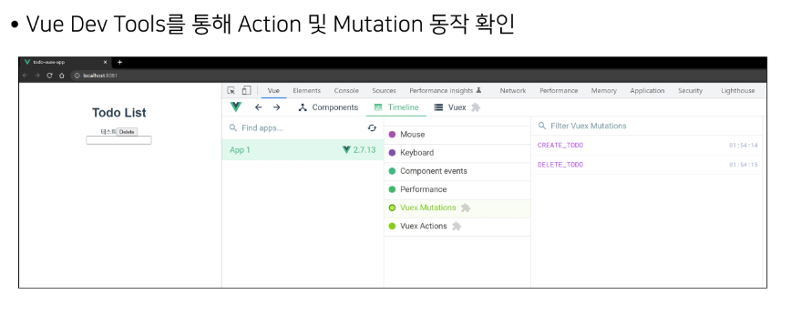

* 전달된 todoItem에 해당하는 todo 삭제
* 작성 후 삭제 테스트

```js
// index.js

export default new Vuex.Stroe({
    ...
    mutations: {
        CREATE_TODO(stat, todoItem) {
            state.todos.push(todoItem)
        },
        DELETE_TODO(state, todoItem) {
            const index = state.todo.indexOf(todoItem)
            state.todos.splice(index, 1)
        }
    }
})
// 여기서 indexOf() 메서드 // Array helper method 
// 즉 해당 요소의 인덱스중 가장 먼저 있는 인덱스 반환
// indexOf(searchElement)
// indexOf(searchElement, fromIndex)
// fromIndex 는 해당 index의 위치부터 찾도록 실행

// 여기서 splice() 메서드 
// splice(start)
// splice(start, deleteCount)
// splice(start, deleteCount, item1)
// splice(start, deleteCount, item1, item2, itemN)
// deleteCount는 start의 인덱스부터 지울 요소의 개수를 의미
```

---

## Update Todo

### TodoListItem

* todo를 클릭하면 완료 표시의 의미로 취소선 스타일을 적용하는 기능 구현
  * 즉 todo의 isCompleted 값 토글하기
* TodoListItem 컴포넌트에 클릭 이벤트를 추가 후 관련 actions 메서드 호출

```vue
// components/TodoListItem.vue

<template>
	<div>
        <span @click="updateTodoStatus">{{ todo.title }}</span>
        <button @click="deleteTodo">Delete </button>
    </div>
</template>

<script>
	export default {
        name: 'TodoListItem',
        props: {
            todo: Object,
        },
        methods: {
            deleteTodo() {
                console.log('Todo 삭제')
            },
            updateTodoStatus() {
                this.$store.dispatch('updateTodoStatus', this.todo)
            },
        }
    }
</script>
```


### Actions

* 위에서 작성한 updateTodoStatus 메서드를 작성
* 관련 mutations 메서드 호출

```js
// index.js

export default new Vuex.Stroe({
    ...
   actions: {
       updateTodoStatus(context, todoItem) {
        context.commit('UPDATE_TODO_STAUTS', todoItem)
        },
   	},
    modules: {
    }
})
```


### Mutations

* actions의 commit() 에 작성한 UPDATE_TODO_STAUTS 메서드 작성

```js
// index.js

export default new Vuex.Stroe({
    ...
   actions: {
       updateTodoStatus(context, todoItem) {
        context.commit('UPDATE_TODO_STAUTS', todoItem)
        },
   	},
    modules: {
    },
    mutations: {
        ...
        UPDATE_TODO_STAUTS(state, todoItem) {
        	console.log(todoItem)
    	},
    }
})
```

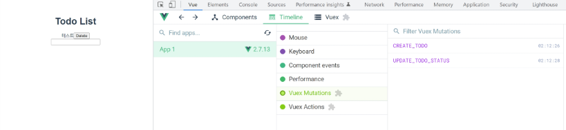

* map 메서드를 활용해 선택된 todo의 isCompleted를 반대로 변경 후 기존 배열 업데이트

```js
// index.js

export default new Vuex.Stroe({
    ...
   actions: {
       updateTodoStatus(context, todoItem) {
        context.commit('UPDATE_TODO_STAUTS', todoItem)
        },
   	},
    modules: {
    },
    mutations: {
        ...
        UPDATE_TODO_STAUTS(state, todoItem) {
        	// console.log(todoItem)
        	state.todo = state.todos.map((todo) => {
    			if (todo === todoItem) {
    				todo.isCompleted = !todo.isCompleted
				}
				return todo
			})
    	},
    }
})
```

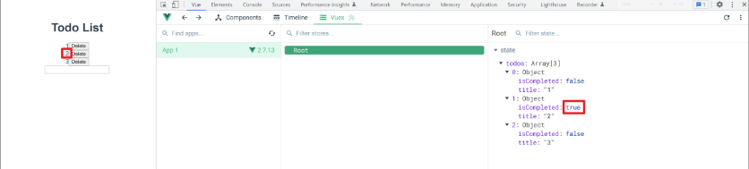


* ### Update Todo

  * 취소선 스타일링
    * CSS 작성
    * v-bind를 활용해 isCompleted 값에 따라 css 클래스가 토글 방식으로 적용되도록 작성하기

  ```vue
  // components/TodoListItem.vue
  
  <styel>
  	.is-completed {
      	text-decoration: line-through;
      }
  </styel>
  
  -----------------------------------------------------------------------------------------
  
  <template>
  	<div>
          <span
                	@click="updateTodoStatus"
                	:class="{ 'is-completed' : todo.isCompleted}"
           >
              	{{ todo.title }}
      	</span>
          <button @click:"deleteTodo">Delete</button>
      </div>
  </template>
  ```

  ​	

---


## 상태별 todo 개수 계산

* ### 전체 todo 개수

  * allTodosCount getters 작성
  * state에 있는 todos 배열의 길이 계산

  ```js
  // index.js
  
  export default new Vuex.Store({
      state: {
          todos: [],
      },
      getters: {
          allTodosCount(state) {
              return state.todos.length
          },
      }
  })
  ```

  * getters에 계산된 값을 각 컴포넌트의 computed에서 사용하기

  ```vue
  // App.vue
  
  <template>
  	<div>
          <h1>Todo List</h1>
          <h2>All Todos: {{ allTodosCount }}</h2>
          <TodoList/>
      	<TodoForm/>
      </div>
  </template>
  
  <script>
  	import TodoList from '@/components/TodoList'
      import TodoFrom from '@/components/TodoFrom'
      
      export default {
          ...
          computed: {
          	allTodosCount() {
              return this.$store.getters.allTodosCount
              }    
          }
      }
  </script>
  ```

  

* ### 완료된 todo 개수

  * completedTodosCount getters 작성
  * isCompleted가 true인 todo들만 필터링한 배열을 만들고 길이 계산
  * filter를 활용하여 완료 여부에 따른 새로운 객체 목록을 작성 후 길이 반환

  ```js
  // index.js
  
  export default new Vuex.Store({
      state: {
          todos: [],
      },
      getters: {
          allTodosCount(state) {
              return state.todos.length
          },
          completedTodosCount(state) {
              // 1. 완료된 todo만 모아놓은 새로운 객체 생성
              const completedTodos = state.todos.filter((todo) => {
                  return todo.isCompleted == true
              })
              // 2. 길이 반환
              return completedTodos.length
          }
      }
  })
  ```

  * getters에 계산된 값을 각 컴포넌트의 computed에서 사용하기

  ```vue
  // App.vue
  
  <template>
  	<div>
          <h1>Todo List</h1>
          <h2>All Todos: {{ allTodosCount }}</h2>
          <h2>Completed Todos: {{ completedTodosCount }}</h2>
          <TodoList/>
      	<TodoForm/>
      </div>
  </template>
  
  <script>
  	import TodoList from '@/components/TodoList'
      import TodoFrom from '@/components/TodoFrom'
      
      export default {
          ...
          computed: {
          	allTodosCount(){
              return this.$store.getters.allTodosCount
              },
              completedTodosCount(){
                  return this.$store.getters.completedTodosCount
              },
          }
      }
  </script>
  ```

  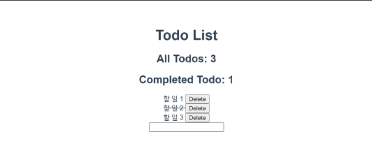

* ### 미완료된 todo 개수

  * 미완료된 todo 개수 === 전체 개수 - 완료된 개수
  * getters가 두번째 인자로 getters를 받는 것을 활용하기
  * unCompletedTodosCount getters 작성

  ```js
  // index.js
  
  export default new Vuex.Store({
      state: {
          todos: [],
      },
      getters: {
          allTodosCount(state) {
              return state.todos.length
          },
          completedTodosCount(state) {
              // 1. 완료된 todo만 모아놓은 새로운 객체 생성
              const completedTodos = state.todos.filter((todo) => {
                  return todo.isCompleted == true
              })
              // 2. 길이 반환
              return completedTodos.length
          },
          unCompletedTodosCount(state, getters){
              return getters.allTodosCount - getters.completedTodosCount
          }
      }
  })
  ```

  * getters에 계산된 값을 각 컴폰넌트의 computed에서 사용하기

  ```vue
  // App.vue
  
  <template>
  	<div>
          <h1>Todo List</h1>
          <h2>All Todos: {{ allTodosCount }}</h2>
          <h2>Completed Todos: {{ completedTodosCount }}</h2>
          <h2>unCompleted Todos: {{ uncompletedTodosCount }}</h2>
          <TodoList/>
      	<TodoForm/>
      </div>
  </template>
  
  <script>
  	import TodoList from '@/components/TodoList'
      import TodoFrom from '@/components/TodoFrom'
      
      export default {
          ...
          computed: {
          	allTodosCount(){
              return this.$store.getters.allTodosCount
              },
              completedTodosCount(){
                  return this.$store.getters.completedTodosCount
              },
              uncompletedTodosCount(){
                  return this.$store.getters.uncompletedTodosCount
              }
          }
      }
  </script>
  ```

  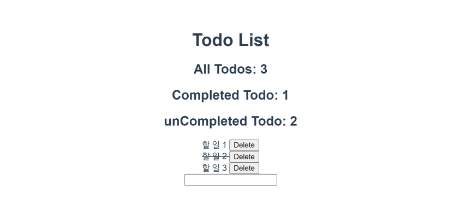

---


## Local Storage

* 브라우저의 Local Storage에 todo 데이터를 저장하여 브라우저를 종료하고 다시 실행해도 

  데이터가 보존될 수 있도록 하기


* ### Window.localStorage

  * 브라우저에서 제공하는 저장공간 중 하나인 Local Storage에 관련된 속성
  * 만료되지 않고 브라우저를 종료하고 다시 실행해도 데이터가 보존됨
  * 데이터가 문자열 형태로 저장됨
  * 관련 메서드
    * setItem(key, value) -key, value 형태로 데이터 저장
    * getItem(key) -key에 해당하는 데이터 조회

  

* ### Local Storage 

  * todos 배열을 Local Storage에 저장하기

  * 데이터가 문자열 형태로 저장되하야 하기 때문에 JSON.stringify를 사용해 

    ​	문자열로 변환해주는 과정 필요

  * state를 변경하는 작업이 아니기 때문에 mutations기 아닌 actions에 작성

  * todo 생성, 삭제, 수정시에 모두 saveTodosLocalStorage action 메서드가 실행 되더록 함

```ja
//index.js

export default new Vuex.Store({
	...
	actions: {
		create(context, todoTitle) {
            const toeoItem = {
                title: todoTitle,
                isComplted = false,
                }
                context.commit('CREATE_TODO', todoItem)
                context.dipatch('saveTodosLocalStorage')
		},
		deleteTodo(context, todoItem){
			context.commit('CREATE_TODO', deleteTodo)
            context.dipatch('saveTodosLocalStorage')
		},
		deleteTodo(context, todoItem){
			context.commit('DELETE_TODO', deleteTodo)
            context.dipatch('saveTodosLocalStorage')
		},
		
		updateTodoStatus(context, todoItem){
			context.commit('UPDATE_TODO', deleteTodo)
            context.dipatch('saveTodosLocalStorage')
		},
		saveTodosToLocalStorage(context){
			const jsonTodoss = JSON.stingify(context.state.todos)
			localStorage.setItem.setItem('toods', jsonTodos)
		}
	},
	modules: {}
})
```

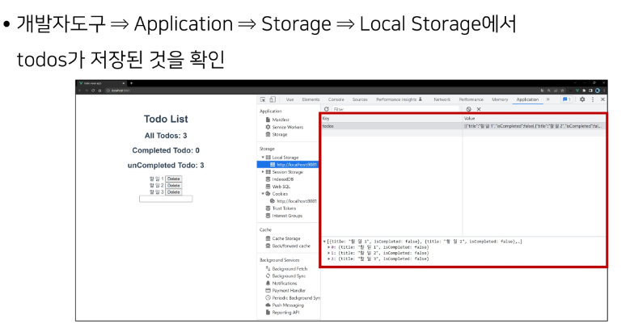


* 하지만 아직 Local Storage에 있는 todo 목록을 불러오는 것이 아니기 때문에 
    페이지 새로고침 이후 목록이 사라진다.

* 불러오기 버튼을 누르면 Local Storage에 저장된 데이터를 가져오도록 할 것.

  1. 불러오기 버튼 작성

     ```vue
     <template>
     	<div>
             <h1>Todo List</h1>
             <h2>All Todos: {{ allTodosCount }}</h2>
             <h2>Completed Todos: {{ completedTodosCount }}</h2>
             <h2>unCompleted Todos: {{ uncompletedTodosCount }}</h2>
             <TodoList/>
         	<TodoForm/>
             <button @click="loadTodos">Todo 불러오기</button>
         </div>
     </template>
     ```

     

  2. loadTodos 메서드 작성

     ```vue
     <script>
     	import TodoList from '@/components/TodoList'
         import TodoFrom from '@/components/TodoFrom'
         
         export default {
             name: 'App'
             component: {
             	TodoList,
             	TodoForm
         	},
             methods: {
                 loadTodos(){
                     this.$store.dispatch('loadTodos')
                 }
             }
     </script>
     ```

     

  3. loadTodos action 메서드 작성

     ```js
     // index,js
     
     export default new Vuex.Store({
         ...
         actions: {
             loadTodos(context) {
                 context.commit('LOAD_TODOS')
             },
         },
         modules: {
     	
         }
     })
     ```

     

  4. LOAD_TODOS mutation 메서드 작성

     * LOAD_TODOS mutations 메서드 작성
     * 문자열 데이터를 다시 object 타입으로 변환 (JSON.parse)하여 저장

     ```js
     // index.jj
     
     export defaul ne Vuex.Store({
         mutations: {
             ...,
             LOAD_TODOS(stat){
         		const localStorageTodos = localStorage.getitem('todos')
     			const parsedTodos = JSON.parse(localStorageTodos)
                 state.todos = parsedTodos
     }
         }
     })
     ```

     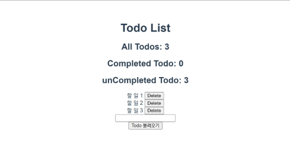

## vuex-persistedstate

* Vuex state를 자동으로 브라우저의 Local Stor를 자동으로 Local Storage 저장해주는 

  라이브러리 중 하나

* 페이지가 새로고침 되어도 Vuex state를 유지시킴

* Local Storage에 저장된 data 자동으로 state로 불러옴


* ### vuex-persistedstate

  * 설치

    * $ npm i vuex-persistedstate

  * 적용

    ```js
    // index.js
    
    import createPersistedState from 'vuex-persistedstate'
    
    Vue.use(Vuex)
    
    export_default new Vuex.Store({
        plugins: [
            createPersistedState(),
        ]
    })
    ```

    

  * 이전에 작성한 localStorage 관련 코드를 모두 주석 처리하기
    * App.vue
      * 불러오기 버튼
      * loadTodos 메서드
    * index.js
      * LOAD_TODOS mutations 메서드
      * saveTodosToLocalStorage action 메서드
      * loadTodos action 메서드
      * context.dispatch('saveTodosToLocalStorage')


---

created는 렌더링되고 표시되는 것.