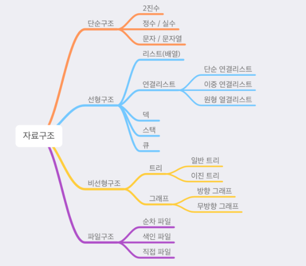
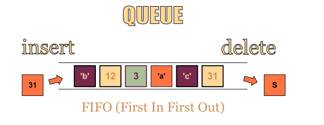
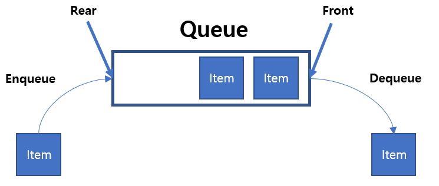
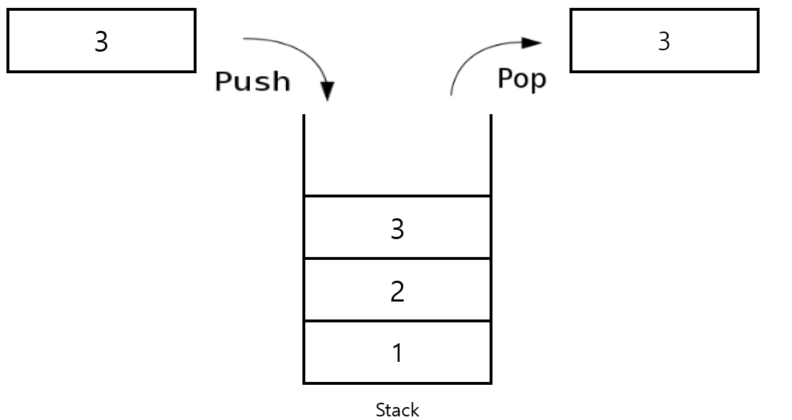
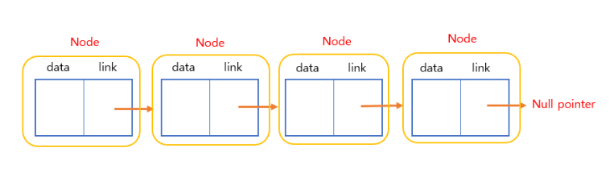
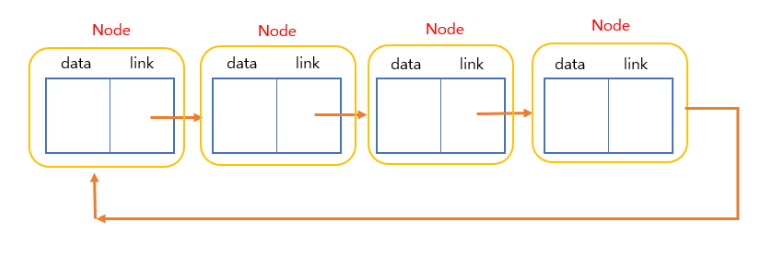
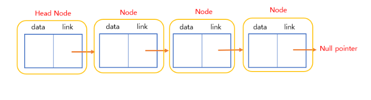

##### 자료구조 

우선 자료구조란?

여러 데이터들의 묶음을 저장하고, 사용하는 방법을 정의한 것.

##### 데이터란?

1. 문자, 숫자, 소리, 그림, 영상 등 실생활을 구성하고 있는 모든 값.

2. 데이터 자체만으로 어떤 정보를 가지기 힘들기에 분석하고 정리하여 활용해야만 의미를 가질 수 있다.

   - 예를 들어 나이라는 데이터만 알고 있다면, 
   - 사람의 나이인지, 강아지의 나이인지, 나무의 나이인지 알 수 없기 때문이다.
     

3. 분석하고 정리하여 활용해야만 의미를 가질 수 있다.

4. 사용하려는 목적에 따라 형태를 구분하고, 분류하여 사용한다.

   

상황에 따른 예시

1. 번호를 다 알지 않아도, 이름을 아는 것만으로도 전화를 할 수 있는 방법은 무엇이 있을까?
2. 웹 브라우저에서 뒤로/앞으로 가는 방법은 무엇이 잇을까?
3. 게임 매칭을 잡을 때, 수많은 사람들을 통제하는 방법엔 무엇이 있을까?

위와 같은 상황을 해결하기 위한 방법인 

**데이터를 효율적으로 다룰 수 있는 방법** 즉 ***자료구조***라는 이름을 붙였다고 합니다. 

자료구조에서 자주 등장하는 네가지는 Stack, Queue, Tree, Graph 가 있습니다.

---

##### Queue (큐)

queue란 ?

FIFO (First In First Out) 으로 선입선출의 특징을 가지는 자료 구조로 한쪽 끝에서만 삽입이 이루어지고, 다른 한쪽 끝에서는 삭제 연산만 이루어지는 유한 순서 리스트입니다. 즉 가장 처음에 들어온 데이터가 먼저 큐 공간에서 제거가 됩니다.

실생활에서 쓰이는 큐의 예시

1. 티켓 판매부스에서 줄을 서서 기다리는 사람들
2. 한줄로 나란히 가야만하는 차들
3. 컴퓨터 운영체제의 테스크 스케줄링 

---

##### 큐의 특징과 구성 및 구현방법

큐의 특징

구조상 먼저 삽입된 item이 먼저 삭제가 이루어진다.

큐의 주요 동작

- enQueue() : 큐에 데이터를 넣는다.

- deQueue() : 큐에서 데이터를 뺴낸다.

- isEmpty() :  큐가 비어있는지 확인한다.

- isFull() : 큐가 꽉 차있는지 확인한다.

- peek() : 앞에있는 원소를 삭제하지 않고 반환한다.

  

큐의 표현

- 순차표현

  - 1차원 배열을 이용한 순차표현으로 인텍스를 값으로 가지는 front, rear라는 두개의 변수와

  - 큐의 사이즈를 나타내는 n이라는 변수를 사용한다.

  - fornt, rear를 -1로 초기화 하여 큐가 empty 임을 나타낸다. (front==rear 일 때 큐는 공백 상태)

  - rear에서 삽입이 되므로 rear가 점차 증가하여 rear==n-1의 경우 큐는 full 상태

큐의 문제점

큐에 삽입이 되며 점차 rear가 증가하게 되며 결국 full 상태가 되었을 때에 첫번쨰 원소의 위치를 큐의 [0]번쨰 인덱스부터 위치되게 한뒤

이것을 기준으로 rear의 위치도 다시 정해주어야 하기 때문에 큐 원소 이동에 따른 지연시간이 발생되어서 순차 표현 큐는 많은 비용을 발생하게 된다.

그래서 해결책으로는 원형큐를 사용하게 되는데 

간단히 정리하자면 원형큐는 큐의 순차표현시 원형큐를 이용하게 되면 원소의 이동없이 이용할 수 있다고 하며

front와 rear를 0으로 초기화 한후 fornt와 rear가 같은 값일 경우 큐는 비어있다는 뜻이 되고

삽입시 rear 를 1씩 증가하게 되며 그 자리에 item을 삽입하고 full 상태를 검사하기 위해서 rear를 증가시켰을 때 front와 같게 된다면

rear+1 == front가 full 로 처리하면 되기에 그렇다면 항상 큐의 front가 가리키는 인덱스는 비어있는 상태로 유지되고 이것을 통해 full과 empty를 구분하게 된다고 합니다.

---

##### Stack (스택)

stack (스택)이란?

한 쪽 끝에서만 자료를 넣고 뺄 수 있는 LIFO (Last In First Out) 형식의 자료 구조

스택의 연산

- pop(): 스택에서 가장 위에 있는 항목을 제거한다.
- push(item): item 하나를 스택의 가장 윗 부분에 추가한다.
- peek(): 스택의 가장 위에 있는 항목을 반환한다.
- isEmpty(): 스택이 비어 있을 때에 true를 반환한다.
  

스택의 구현

- 배열 기반으로 구현
- 동적 배열을 기반으로 구현
- 연결 리스트로 구현

---

###### Linked List (연결 리스트)

Linked List (연결 리스트) 란?

시작(주소) -> 연결(link)-> 끝(null pointer circluar) 으로 구성되며 연결 리스트는 여러개의 노드를 연결함으로써 데이터를 표현가능하다.

노드는 자료를 가진 data 부분과 다음 노래를 연결하는 link 부분으로 나뉘어져 있다.

배열과 연결 리스트 차이

배열 : 정적 할당으로 정해진 메모리 크기를 미리 할당 하기 때문에 오버플로우나 공간 낭비가 발생 가능하다.

연결 리스트 : 동적 할당으로 필요한 만큼 메모리를 동적으로 할당 받아서 만든다.

연결리스트의 여러 종류

- Singly linked list : 기본적인 연결 리스트
- Circularly linked list : 마지막 노드가 다시 처음 노드를 가리킴

- List with a header node : 노드의 가장 앞에 head node를 넣어 삽입, 삭제 등 연산에서 이점을 만듬.

- Doubly linked list : 양방향 연결리스트로 노드를 연결하는 link가 앞 뒤로 존재해서 앞 뒤 노드들 간의 관계를 바로 확인할 수 있다.