- 객체 지향 프로그래밍

  - 객체 지향 프로그래밍(Object-Oriented Programming, OOP)은 컴퓨터 프로그래밍의 패러다임 중 하나이다.

    객체 지향 프로그래밍은 컴퓨터 프로그램을 명령어의 목록으로 보는 시각에서 벗어나 여러 개의 독립된 단위,

    즉 "객체"들의 모임으로 파악하고자 하는 것이다. 각각의 객체는 메세지를 주고받고, 데이터를 처리할 수 있다.

  - ###### 쉽게 생각하면 객체는 정보와 행동으로 구성 되어있다 생각할 수 있다.

    ex) 강아지라는 객체는 리트리버라는 정보와 먹기, 자기 라는 행동으로 구성 되어있다.

  - 기존의 절차지향 프로그래밍

    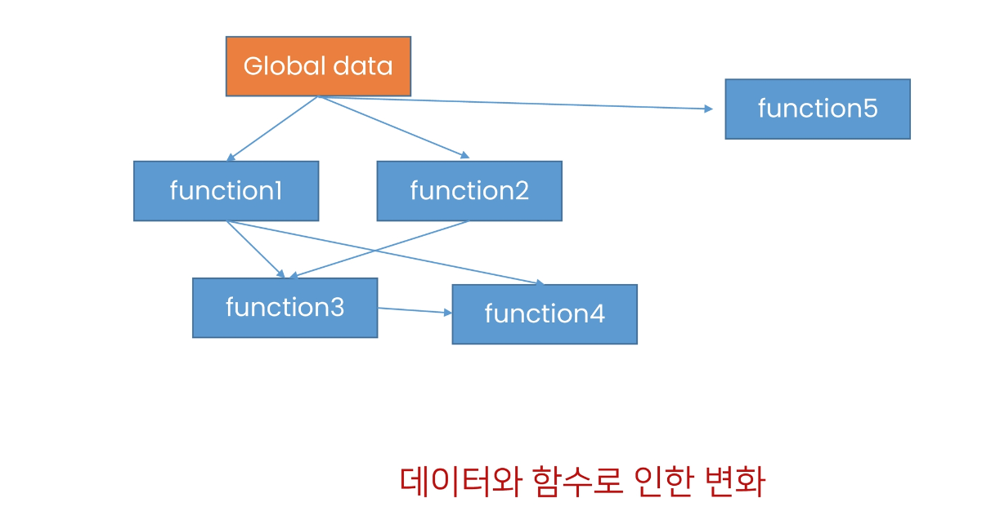

    하나의 Global data로 부터 작업을 계속 했기에 중간중간의 변화가 다음 함수에 영향을 계속 미치게 되었다.

    

  - 객체지향 프로그래밍

    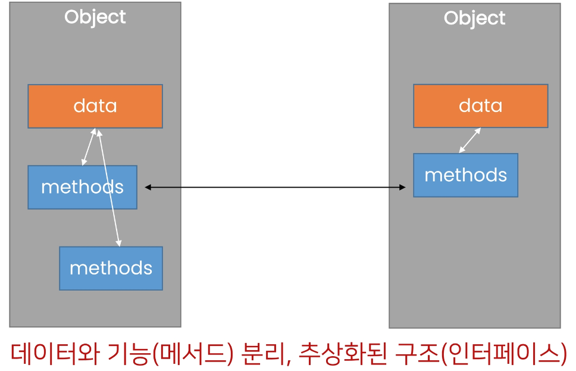

    그래서 서로 분리된 서로 다른 객체들로 구분하여 작업.

    

  - 객체지향 프로그래밍이 필요한 이유 ---> 현실 세계를 프로그램 설계에 반영(추상화)

  - 현실 세계는 너무 복잡 -> 추상화 -> 복잡한 것은 숨기고, 필요한 것은 드러낸다.

    

  - 객체지향 프로그래밍이 필요한 이유

    - 현실 세계를 프로그램 설계에 반영(추상화) 

      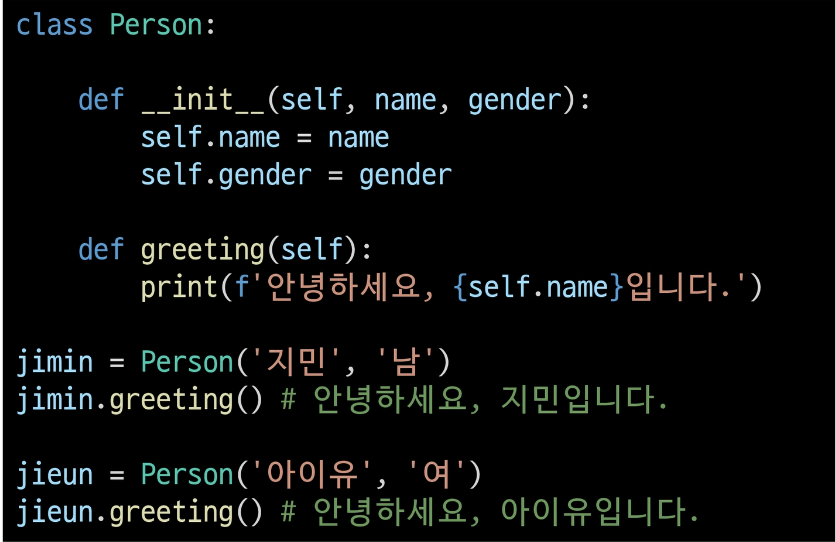

  - 객체지향의 장점/ 단점

    - 장점:

      - 클래스 단위로 모듈화시켜 개발할 수 있으므로 많은 인원이 참여하는 대규모 소프트웨어 개방에 적합

      - ###### 필요한 부분만 수정하기 쉽기 때문에 프로그램의 유지보수가 쉬움

    - 단점:

      - 설계 시 많은 노력과 시간이 필요함
        - 다양한 객체들의 상호 작용 구조를 만들기 위해 많은 시간과 노력이 필요
      - 실행 속도가 상대적으로 느림
        - 절차 지향 프로그래밍이 컴퓨터의 처리구조와 비슷해서 실행 속도가 빠름

- 객체 지향 프로그래밍 기초 (OOP 기초)

  - 객체(컴퓨터 과학)

    - 컴퓨터 과학에서 객체 또는 오브젝트(object)는 클래스에서 정의한 것을 토대로 메모리(실제 저장공간)에 할당된 것으로 프로그램에서 사용되는 데이터 또는 식별자에 의해 참조되는 공간을 의미하며, 변수 자료 구조, 함수 또는 메서드가 될 수 있다.

    - ###### 쉽게 생각하면 객체는 --> 속성과 행동으로 구성된 모든 것

      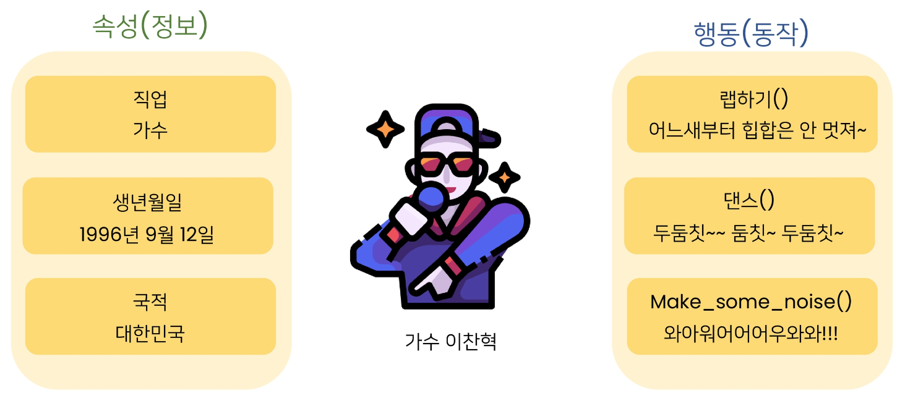

      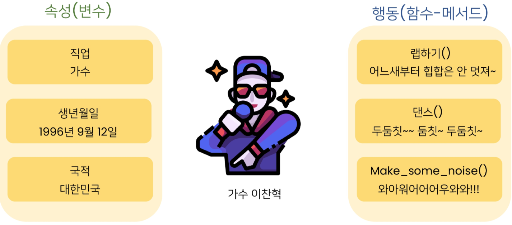

    - 클래스와 객체

      

      

    - 객체와 인스턴스

      - ###### 클래스로 만든 객체를 인스턴스 라고도 함

      ###### 

    - 인스턴스는 

      - Type의 인스턴스 or Class의 인스턴스이다로 정의 가능.

        

      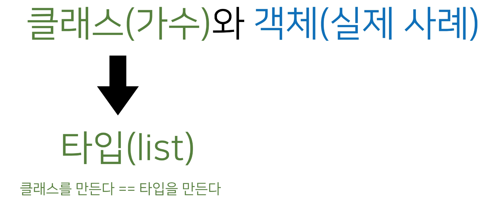

    - 클래스를 만든다는 것은 타입을 만든다와 같은 의미

    - 그래서 파이썬은 모든 것이 객체 (즉 파이썬의 모든 것엔 속성과 행동이 존재)

      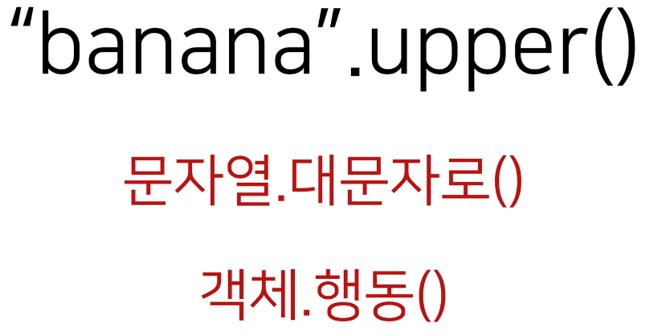

      * banana라는 문자열 타입의 인스턴스에 upper()라는 행동(함수,메서드)을 사용

      

    - 객체와 클래스는 == 타입과 실제 사례(값)

      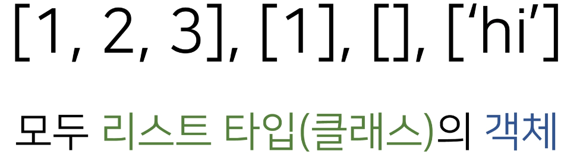

      

      

      

    - 객체는 특정 타입의 인스턴스이다.

      - 123, 900, 5는 모두 int 의 인스턴스
      - 'hello', 'bye'는 모두 stirng의 인스턴스
      - [232, 89, 1], []는 모두 list의 인스턴스

      

  - 객체란?

    - 프로그래밍 : 데이터를 저장하고 처리하는 방법 

    - 타입(type): 어떤 연산자(operator)와 조작(method)이 가능한가?

    - 속성(attribute): 어떤 상태(데이터)를 가지는가?

    - 조작법(method): 어떤 행위(함수)를 할 수 있는가?

      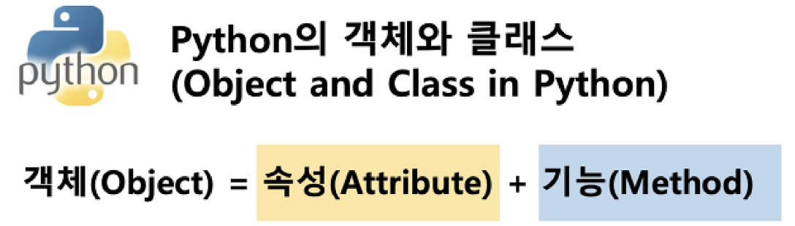

      - 상태==정보==속성(유사한 의미로 사용)

- 객제와 클래스 문법

  - 기본 문법

    - 클래스 정의(설명) class {MyClass}  --> 보통 클래스 명의 첫글자는 대문자로 한다.

         						         pass

    - 인스턴스 생성 my_instance = MyClass()

    - 메서드 호출 my_instance.my_method()

    - 속성 my_instance.my_attribute

  - 클래스와 인스턴스

    - 객체의 설계도(클래스)를 가지고, 객체(인스턴스)를 생성한다.

      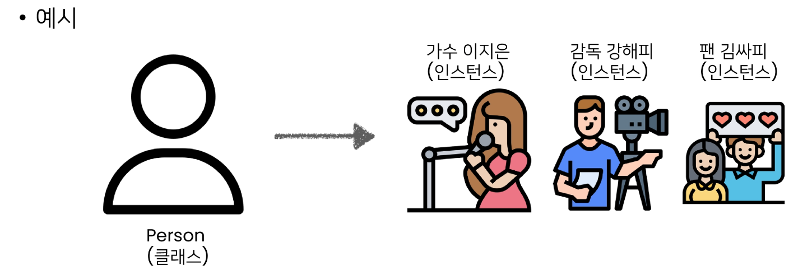

      

    - 클래스 : 객체들의 분류/ 설계도(class)  --> class의 type은 type이다

    - 인스턴스 : 하나하나의 실체 / 예(instance)

      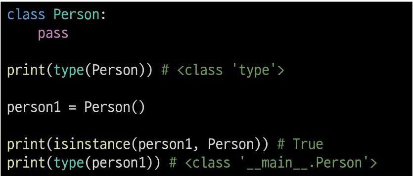

      

  - 객체 비교하기

    - == (내용물이 같으면, 유사)

      동등한(equal)

      변수가 참조하는 객체가 동등한 경우 True ()

      두 객체가 같아 보이지만 실제로 동일한 대상을 가리키고 있다는 것을 확인해 주는 것은 아님

    - is (주소가 같으면, 엄격)

      동일한(identical)

      두 변수가 동일한 객체를 가리키는 경우 True 

      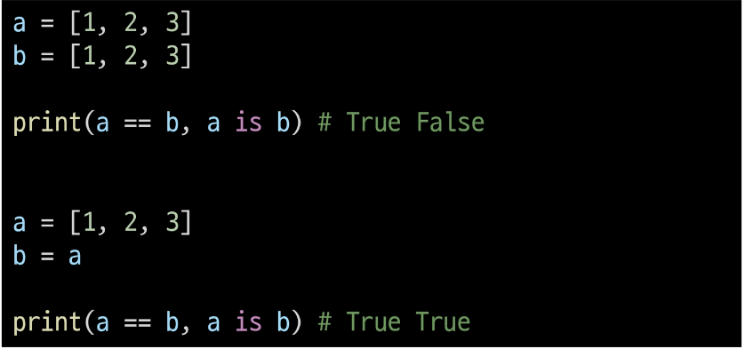

    

  - 속성(데이터, 정보, 상태) --> 변수

    - 특정 데티어 타입/클래스의 객체들이 가지게 될 상태/데이터를 의미

    - 정보 = 클래스 변수/ 인스턴스 변수가 존재

      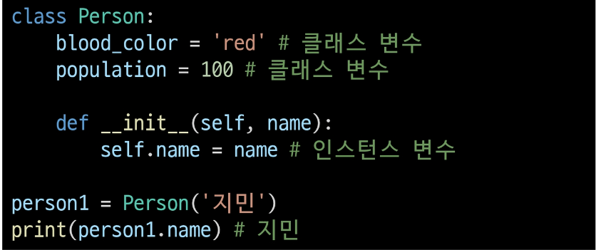

    

  - 인스턴스 변수

    인스턴스가 개인적으로 가지고 있는 속성(attribute)

    각 인스턴스들의 고유한 변수

  - 생성자 메서드(__ init __)에서 self.< name >으로 정의 

  - 인스턴스가 생성된 이후 < instance >.< name > 으로 접근 및 할당

  - 첫번째 __ init __의 첫번째 인자는 self 가 국룰 그래서 person('john')으로 하나의 인자만 받아도 된다.

  - 그리고 __ init __함수 내에서는 self.{}로 지정 

    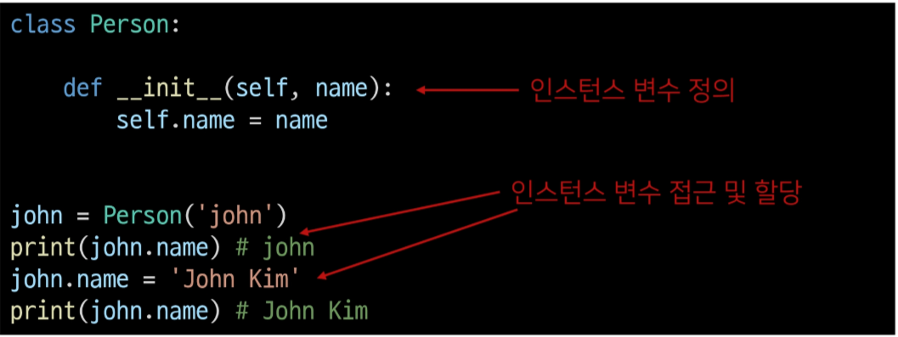

    

    #### 즉! 클래스로 정의를 하고 함수로 사용한다

    ​																				클래스명.클래스변수

    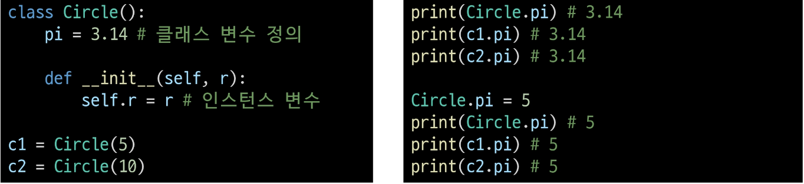

    클래스 내부 함수인 __ init __ 의 r 값이 기존에 없다면 클래스 내부에 있는 변수의 값이 할당 된다.

    

    클래스 변수 = 공용

    인스턴스 변수 = 각자 개인용

    

  - 클래스 변수 활용( 사용자 수 계산하기)

    - 사용자가 몇 명인지 확인하고 싶다면?
    - 인스턴스가 생성 될 때마다 클래스 변수가 늘어나도록 설정하면 된다.

  - 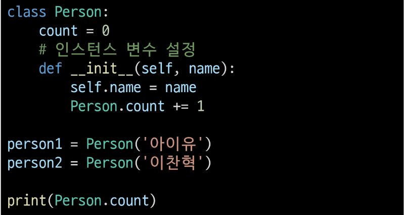

    

  - 클래스 변수와 인스턴스 변수

    - 인스턴스.변수가 만약 없다면 클래스 변수를 전달 
    - ex)c2.pi = 5 추가시 print(c2.pi) --> 5 가 되지만 c1.pi는 3.14 출력
    - 즉 클래스 변수를 변경할 때는 항상 __클래스.클래스변수__ 형식으로 변경
    - 인스턴스 변수를 변경할 때는 __인스턴스.인스턴스 변수__ 형식으로 변경   

    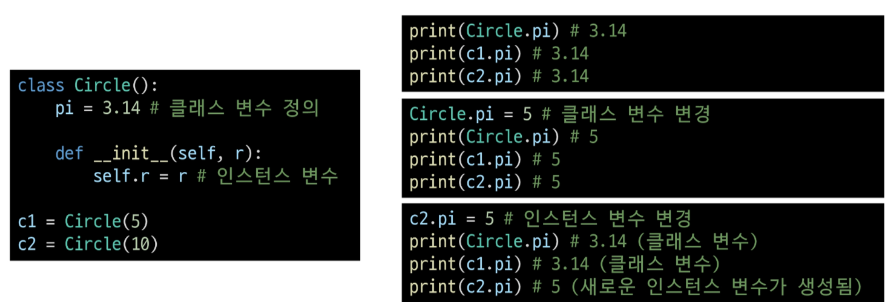

    

- 메서드 

  - 특정 데이터 타입/클래스의 객체에 공통적으로 적용 가능한 행위(함수)

  - 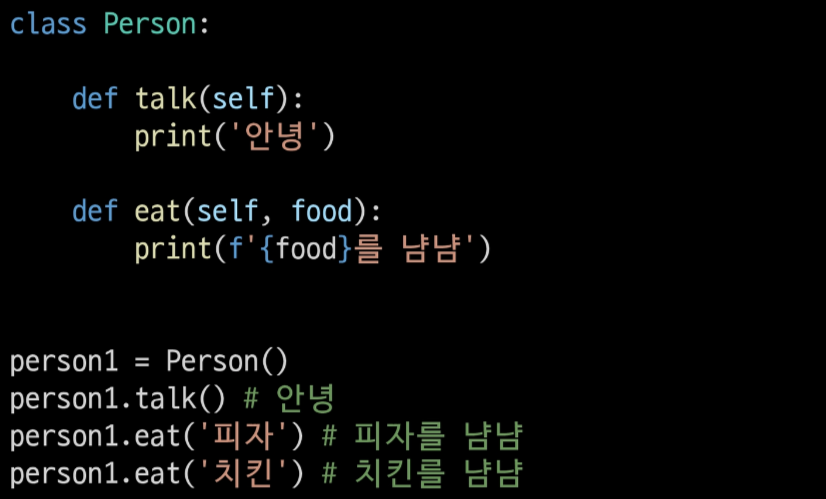

    

  - 메서드의 종류

    - 인스턴스 메서드 (가장 종류가 많다 ) --> 인스턴스 변수 처리(개별 행동)

    - 클래스 메서드 --> 클래스 변수 처리

    - 정적 메서드 --> 나머지

      

  -  인스턴스 메서드

    - 인스턴스 변수를 사용하거나, 인스턴스 변수에 값을 설정하는 메서드

    - 클래스 내부에 정의되는 메서드의 기본

    - 호출 시, 첫번째 인자로 인스턴스 자기자신(self)이 전달됨

    - ###### 즉 self 가 있으면 인스턴스 메서드

  - self

    - 인스턴스 자기자신
    - 파이썬에서 인스턴스 메서드는 호출 시 첫번째 인자로 인스턴스 자신이 전달되게 설계
      - 매개변수 이름으로 self를 첫 번째 인자로 정의
      - 다른 단어로 써도 작동하지만, 파이썬의 암묵적인 규칙

  - 생성자(constructor) 

    - 인스턴스 객체가 생성될 떄 자동으로 호출되는 메서드
    - 인스턴스 변수들의 초기값을 설정
      - 인스턴스 생성
      - __ init __ 메서드 자동 호출

  - 매직 메서드

    - double underscore(__, 던더)가 있는 메서드는 특수한 동작을 위해 만들어진 메서드로,

      스페셜 메서드 혹은 매지 메서드라고 불림

    - 특정 상황에 자동으로 불리는 메서드

      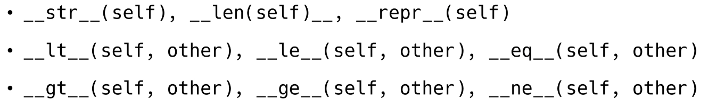

      

  - 매직 메서드 예시

    - 객체의 특수 조작 행위를 지정(함수, 연산자 등)

      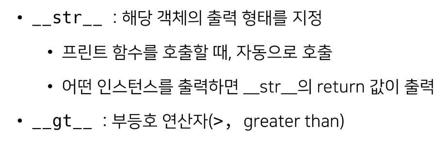

  - 소멸자(destructor) 메서드

    - 인스턴스 객체가 소멸(파괴)되기 직전에 호출되는 메서드 (del은 메모리 삭제)

      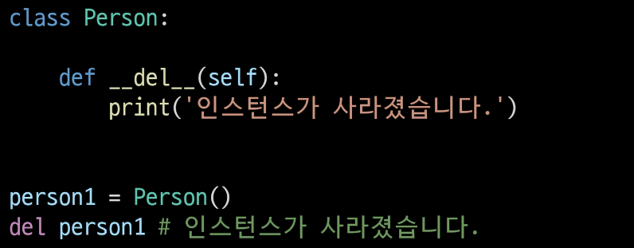

      

      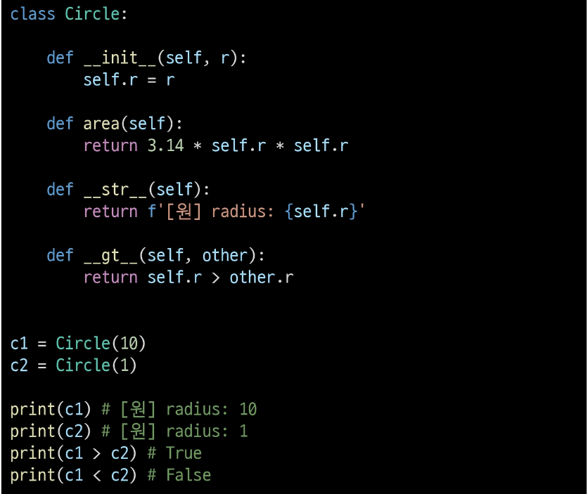

  

- 클래스 메서드

  - 클래스가 사용할 메서드

  - @classmethod 데코레이터를 사용하여 저의

  - 호출 시, 첫번째 인자로 클래스  (cls)가 전달됨

    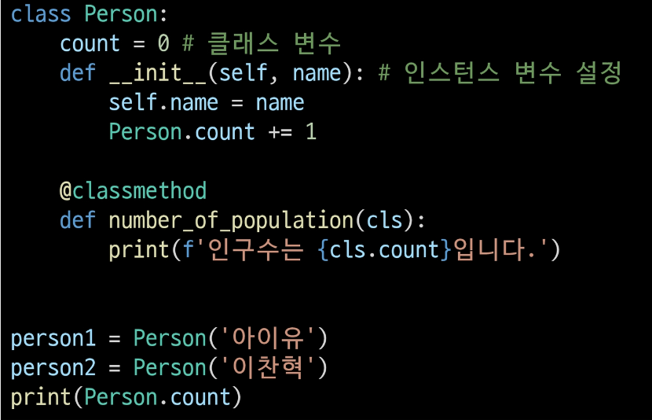

    

  - 데코레이터

    - 함수를 어떤 함수로 꾸며서 새로운 기능을 부여

    - @데코레이터(함수명) 형태로 함수 위에 작성

    - 순서대로 적용 되기 때문에 작성 순서가 중요

      

  - 데코레이터 없이 함수 꾸미기

    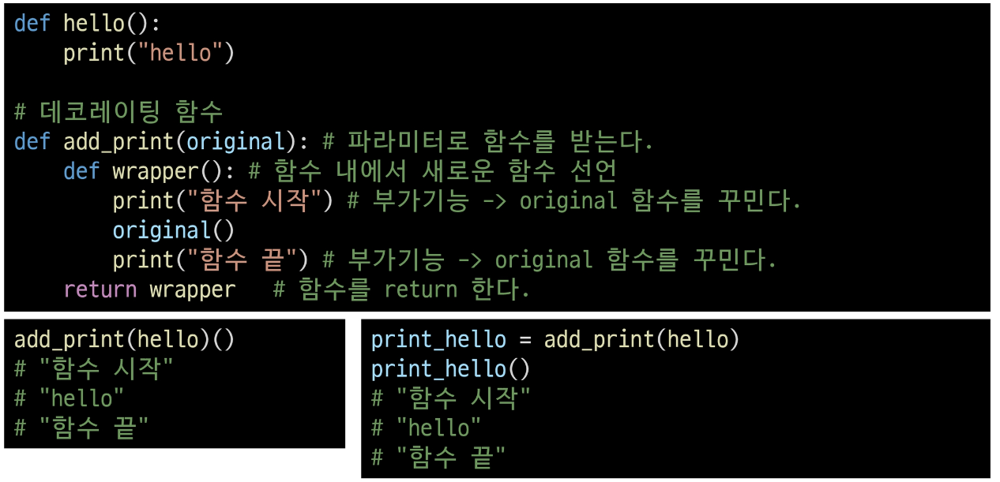

    

  - 데코레이터

    데코레이터를 활용하면 쉽게 여러 함수를 원하는대로 변경할 수 있음

    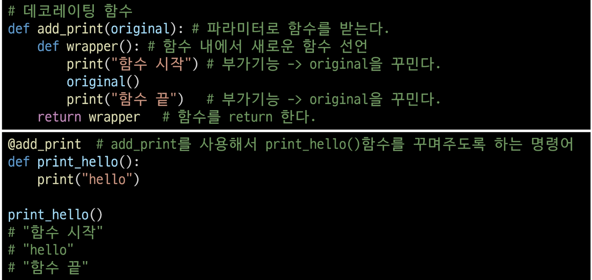 

    

- 클래스 메서드와 인스턴스 메서드

  - 클래스 메서드 -> 클래스 변수 사용 

  - 인스턴스 메서드 -> 인스턴스 변수 사용

  - 그렇다면 인스턴스 변수, 클래스 변수 모두 사용하고 싶다면?

    - 클래스는 인스턴스 변수 사용이 불가능

    - 인스턴스 메서드는 클래스 변수, 인스턴스 변수 둘다 사용이 가능

      

- 스태틱 메서드

  - 인스턴스 변수, 클래스 변수를 전혀 다루지 않는 메서드

  - 속성(데이터)을 다루지 않고 단지 기능(행동)만을 하는 메서드를 정의할 때 사용

  - 인스턴스 변수, 클래스 변수 아무것도 사용하지 않을 경우 사용

    - 즉, 객체 상태나 클래스 상태를 수정할 수 없음

  - @staticmethod 데코레이터를 사용하여 정의

  - 일반 함수처럼 동작하지만, 클래스의 이름공간에 귀속됨 --> __즉 그냥 함수처럼 사용__

    - 주로 해당 클래스로 한정하는 용도로 사용

    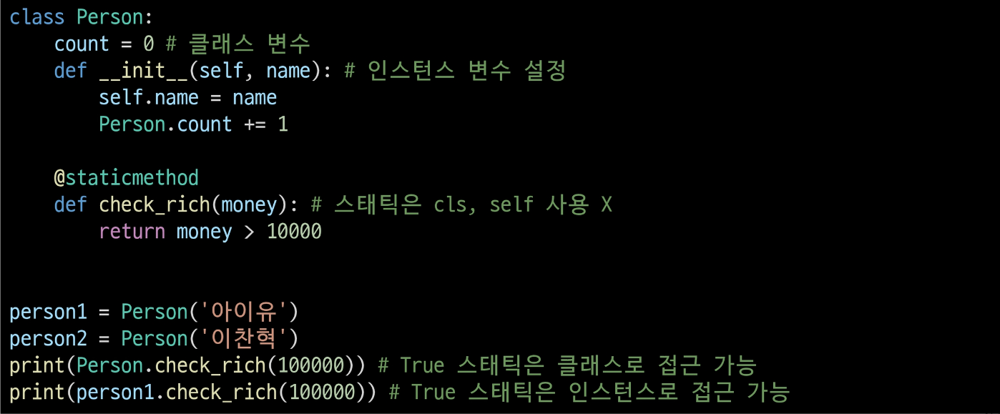

  

- 인스턴스와 클래스 간의 이름 공간(namespace)

  - 클래스를 정의하면, 클래스와 해당하는 이름 공간 생성

  - 인스턴스를 만들면, 인스턴스 객체가 생성되고 이름 공간 생성

  - 인스턴스에서 특정 속성에 접근하면, 인스턴스-클래스 순으로 탐색

    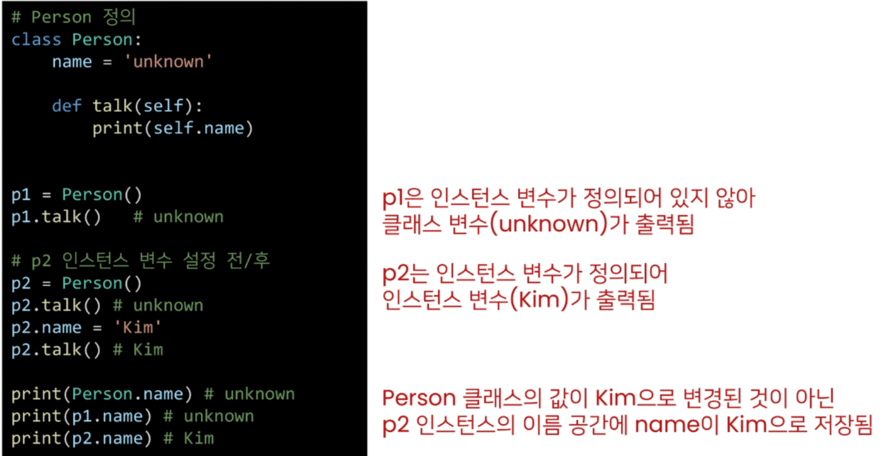

    

  - 

- ###### 일반적으로 정의하여 사용한 def test() 는 함수라고 불리고

- ###### Class 의 내부에서 사용하는 def test() 들은 메서드라고 불린다.

객체 지향 프로그래밍이란?

- 객체랑 객체가 서로 통신하면서 동작하도록 프로그램을 개발하는 방법론
- 정보 : 클래스 변수, 인스턴스 변수
- 행동 : 클래스 메서드, 인스턴스 메서드, 스태틱 메서드
- 객체지향의 핵심 4가지 : 캡상다추 -> 캡슐화 상속 다형성 추상화

추상화 

- 현실 세계를 프로그램 설계에 반영
  - 복잡한 것은 숨기고, 필요한 것만 들어내기

-  함수, 변수, 클래스

- ex) User.login()

  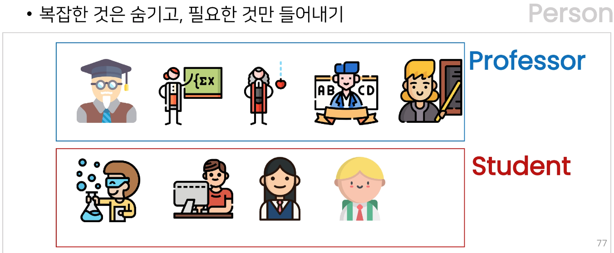

상속

- 상속이란 : 두 클래스 사이 부모 - 자식 관계를 정립하는 것

- 클래스는 상속이 가능함 - 모든 파이썬 클래스는 object를 상속 받음

- ex) class ChildClass(ParentClass):

  ​		paas 

  

- 하위 클래스는 상위 클래스에 정의된 속성, 행동, 관계 및 제약 조건을 모두 상속 받음

- 부모클래스의 속성, 메서드가 자식 클래스에 상속되므로, 코드 재사용성이 높아짐

  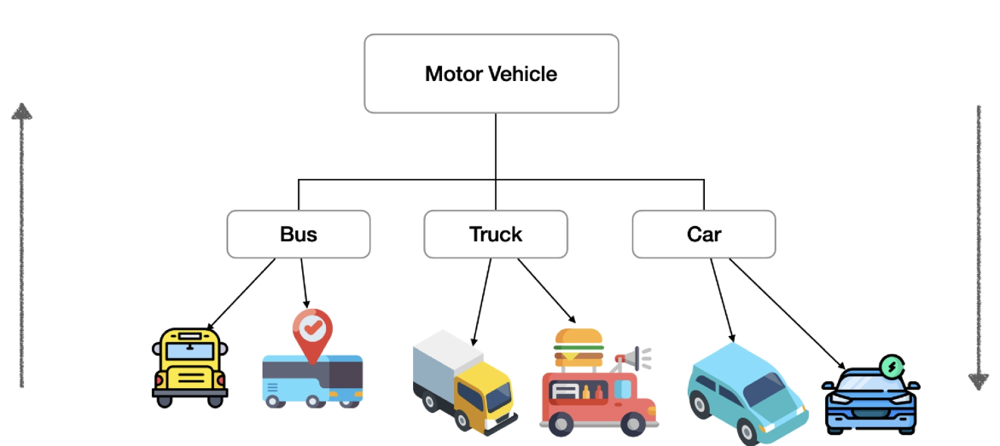

  

  

- ###### 위의 def __ init __ 과 def talk 는 self 로 인자를 받기에 인스턴스 변수

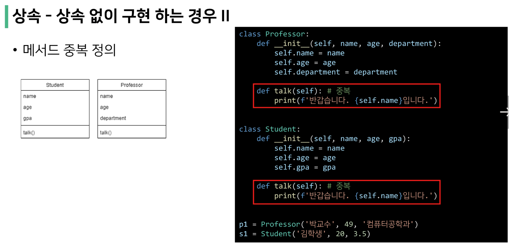

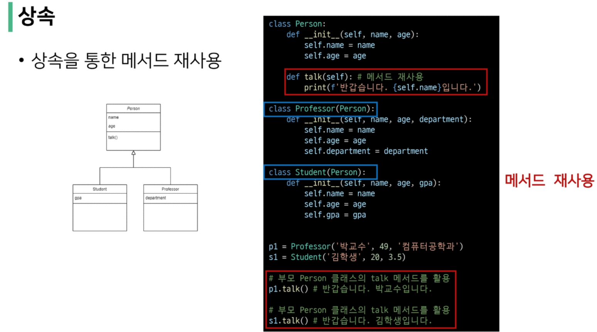

- 상속 관련 함수와 메서드

- isinstance(object, classinfo)
  - classinfo의 instance거나 subclass인 경우 True

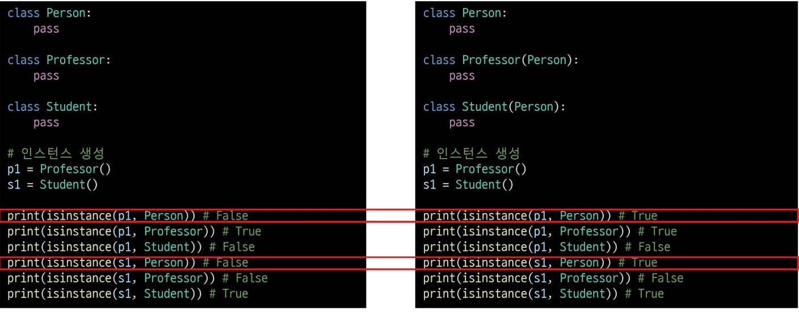

- super()
  - 자식클래스에서 부모클래스를 사용하고 싶은 경우

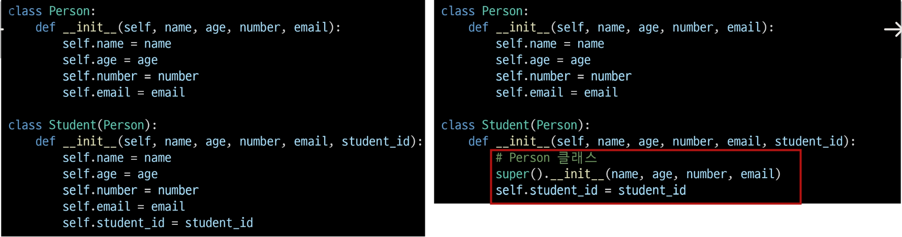

- ___상속 정리___

  - 파이썬의 모든 클래스는 object로부터 상속됨

  - 부모 클래스의 모든 요소(속성, 메서드)가 상속됨

  - super() 를 통해 부모 클래스의 요소를 호출할 수 있음

  - 메서드 오버라이딩을 통해 자식 클래스에서 재정의 가능함

  - 상속관계에서의 이름 공간은 인스턴스, 자식 클래스, 부모 클래스 순으로 탐색

- ___다중 상속___ 

  - 두 개 이상의 클래스를 상속 받는 경우

  - 상속받은 모든 클래스의 요소를 활용 가능함

  - 중복된 속성이나 메서드가 있는 경우 상속 순서에 의해 결정됨

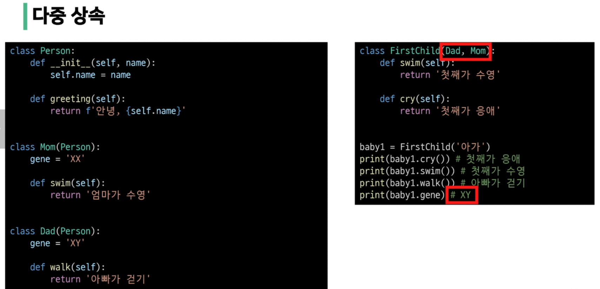

- 상속 관련 함수와 메서드

  - mro 메서드( Method Resolution Order)

    - 해당 인스턴스의 클래스가 어떤 부모 클래스를 가지는지 확인하는 메서드

    - 기존의 인스턴스 -> 클래스 순으로 이름 공간을 탐색하는 과정에서 상속 관계에 잇으면 

      인스턴스 -> 자식 클래스 -> 부모 클래스로 확장

  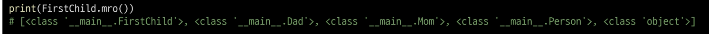

다형성

- 다형성(Polymorphism)이란?

  - 여러 모양을 뜻하는 그리스어

  - 동일한 메서드가 클래스에 따라 다르게 행동할 수 있음을 의미

  - 즉, 서로 다른 클래스에 속해있는 객체들이 동일한 메세지에 대해 다른 방식으로 응답할 수 있음

  - 종류:

    - 메서드 오버라이딩 :상속받은 메서드를 재정의

      - 클래스 상속 시, 부모 클래스에서 정의한 메서드를 자식 클래스에서 변경

      - 부모 클래스의 메서드 이름과 기본 기능은 그대로 사용하지만. 

        특정 기능을 바꾸고 싶을 때 사용

  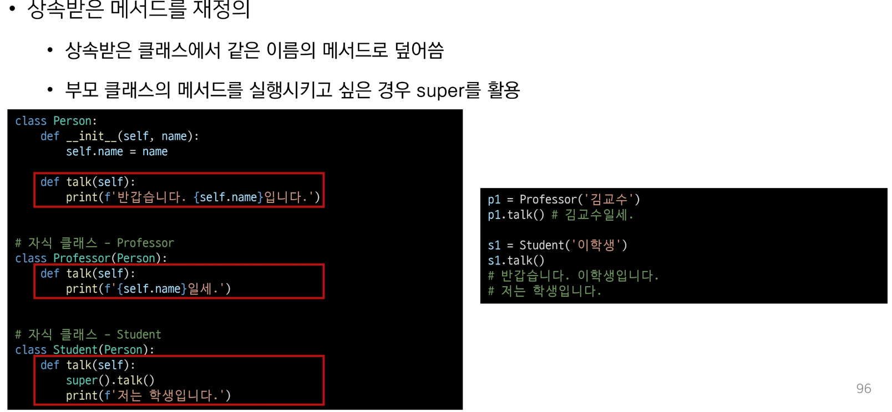

캡슐화

- 객체의 일부 구현 내용에 대해 외부로부터의 직접적인 액세스를 차단

  - 예시 : 주민등록번호

- 파이썬에서 암묵적으로 존재하지만, 언어적으로는 존재하지 않음

- 다른 언어에서는 캡슐화를 상수로 표현

  

- 접근제어자 종류 :

  - Public Access Modifier

    - 언더바 없이 시작하는 메서드나 속성
    - 어디서나 호출이 가능, 하위 클래스 overried 허용
    - 일반적으로 작성되는 메서드와 속성의 대다수를 차지

    

    

  - Protected Access Modifier

    - ___언더바 1개___ 로 시작하는 메서드나 속성
    - 암묵적 규칙에 의해 부모 클래스 내부와 자식 클래스에서만 호출 가능
    - 하위 클래스 override 허용

    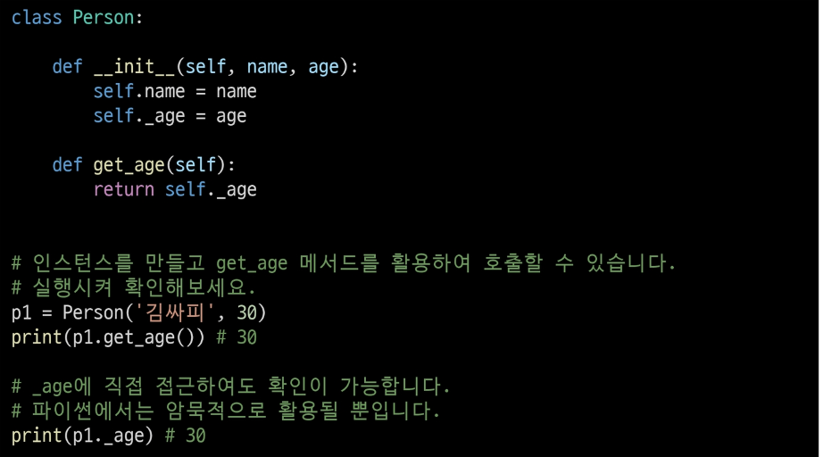

  - Private Access Modifier

    - ___언더바 2개___ 로 시작하는 메서드나 속성
    - 본 클래스 내부에서만 사용이 가능
    - 하위클래스 상속 및 호출 불가능 (오류)
    - 외부 호출 불가능 (오류)

     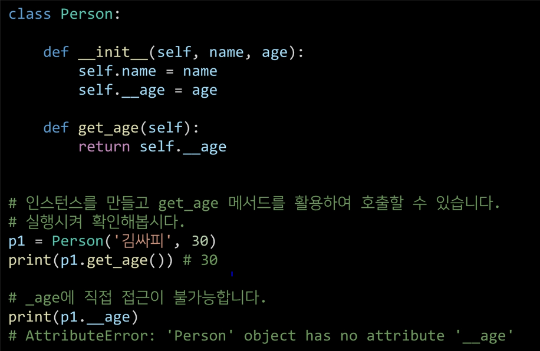

    

- getter 메서드와 setter 메서드

  - 변수에 접근할 수 있는 메서드를 별도로 생성
  - getter 메서드 : 변수의 값을 읽는 메서드 (조회)
    - @property 데코레이터 사용
  - setter 메서드 : 변수의 값을 설정하는 성격의 메서드 (변경)
    - @변수.setter 사용

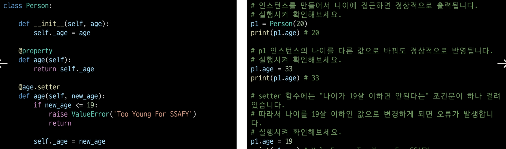

- 객체지향의 핵심 4가지 
- 추상화 : 복잡한거 숨기고 
- 상속  : 부모클래스 자식클래스 관계 -> 물려받기 -> 재사용
- 다형성 : 이름은 같은데, 동작은 다른 것 -> 오버라이딩 -> 부모 자식이 그대로 (x)
- 캡슐화 : 민감한 정보를 숨기는 것 -> getter, setter

에러/예외 처리 (Error/ Exception Handling)

디버깅의 정의

- 잘못된 프로그램을 수정하는 것을 디버깅이라함 -> de(없앤다) + bugging(버그)
- 에러 메세지가 발생하는 경우
  - 해당 하는 위치를 찾아 메세지를 해결
- 로직 에러가 발생하는 경우
  - 명시적인 에러 메세지 없이 예상과 다른 결과가 나온 경우
    - 정상적으로 동작하였던 코드 이후 작성된 코드를 생각해봄
    - 전체 코드를 살펴봄
    - 휴식을 가져봄
    - 누군가에게 설명해봄

- 자주 오류가 발생하는 곳은?

  - 제어가 되는 시점
  - 조건/ 반복/ 함수

- ___"코드의 상태를 신중하게 출력해가며 심사숙고하는 것보다 효과적인 디버깅 도구는 없습니다."___

- 해결 :

  - print 함수 활용
    - 특정 함수 결과, 반복/조건 결과 등 나눠서 생각, 코드를 bisection 으로 나눠서 생각
  - 개발 환경(text editor, IDE) 등에서 제공하는 기능 활용
    - breakpoint, 변수 조회 등
  - Python tutor 활용 (단순 파이썬 코드인 경우)
  - 뇌컴파일, 눈디버깅

  

에러

- 문법 에러(syntax Error)

  - SyntaxError가 발생하면, 파이썬 프로그램은 실행이 되지 않음
  - 파일이름, 줄번호, ^문자를 통해 파이썬이 코드를 읽어 나갈 떄(parser) 문제가 발생한 위치를 표현
  - 줄에서 에러가 감지된 가장 앞의 위치를 가리키는 캐럭(caret)기호(^)를 표시

  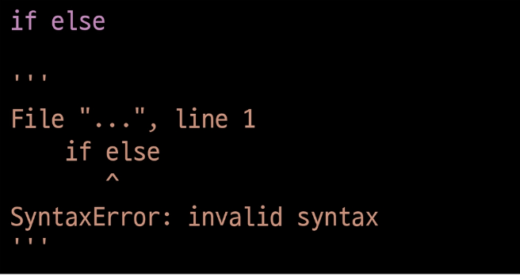

  

- Invalid syntax(문법 오류) 

  

- assing to literal(잘못된 할당)

예외

- 실행 도중 예상치 못한 상황을 맞이하면, 프로그램 실행을 멈춤
  - 문장이나 표현식이 문법적으로 올바르더라도 발생하는 에러
- 실행 중에 감지되는 에러들을 예외(Exception)라고 부름
- 예외는 여러 타입(type)으로 나타나고, 타입이 메세지의 일부로 출력됨
  - NameError, TypeError 등은 발생한 예외 타입의 종류
- 모든 내장 예외는 Exception Class를 상속받아 이뤄짐
- 사용자 정의 예외를 만들어 관리할 수 있음

​			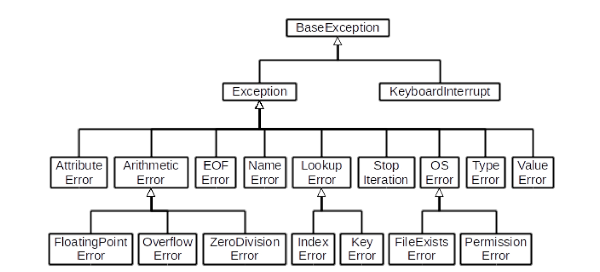

예외 처리

- try 문(statement)/ except 절(clause) 을 이용하여 예외 처리를 할 수 있음

- try 문

  - 오류가 발생할 가능성이 있는 코드를 실행
  - 예외가 발생되지 않으면, except 없이 실행 종료

- except 문

  - 예외가 발생하면, except 절이 실행
  - 예외 상황을 처리하는 코드를 받아서 적절한 조치를 취함

- 작성 방법:

  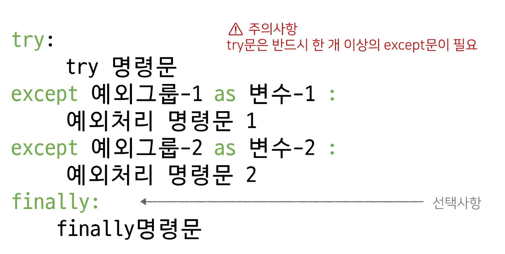

  

예외 처리 종합

- try
  - 코드를 실행함
- except
  - try 문에서 예외가 발생 시 실행함
- else
  - try 문에서 예외가 발생하지 않으면 실행함
- finally 
  - 예외 발생 여부와 관계없이 항상 실행함

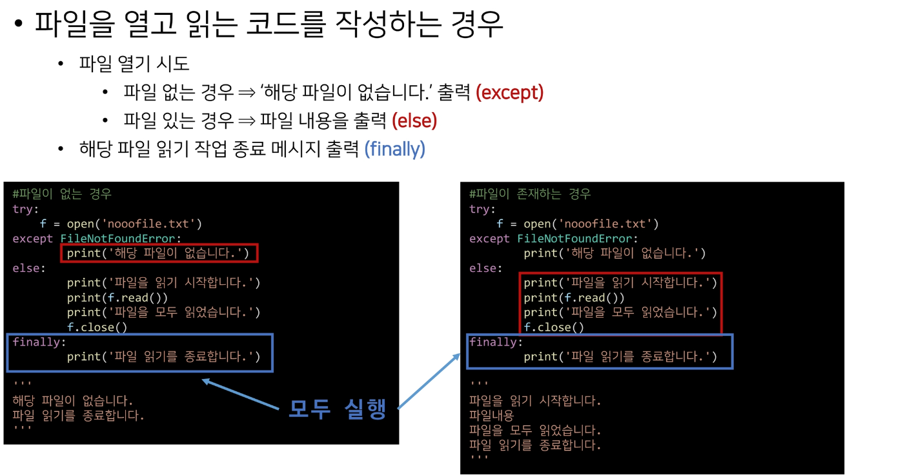

