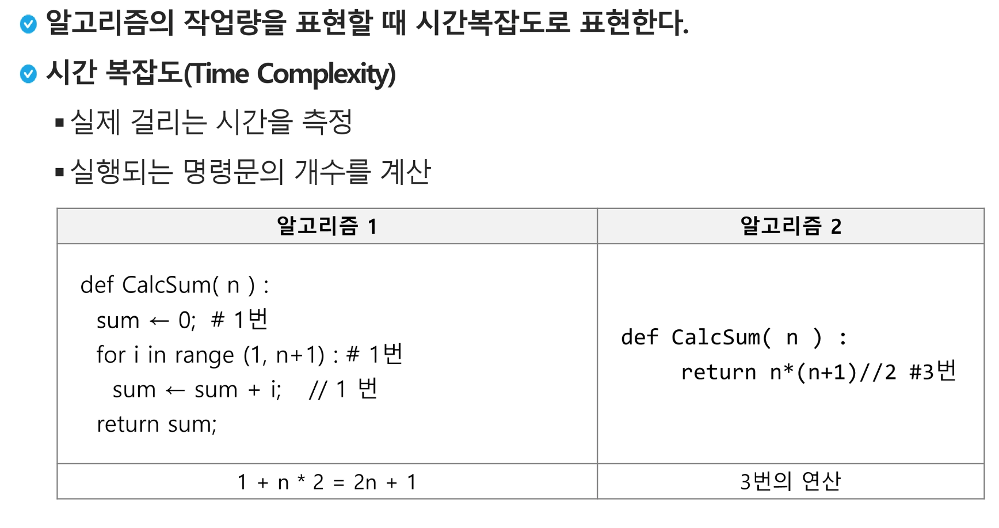

##### 알고리즘이란

문제를 해결하기 위한 절차나 방법

컴퓨터 분야에서 알고리즘을 표현하는 방법은 크게 두가지

1. 의사코드
2. 순서도

알고리즘의 성능은 무엇으로 측정하는가?

정답이라기 보단 보다 좋은 알고리즘이 있을 뿐이다.

---

상수인 고정된 계산은 C로 표기한다 

1Ghz = 10억번 연산 = 1초 연산 시간

---

##### 배열

---

