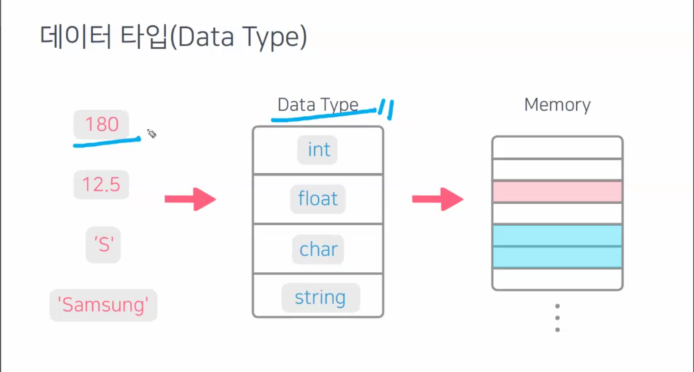
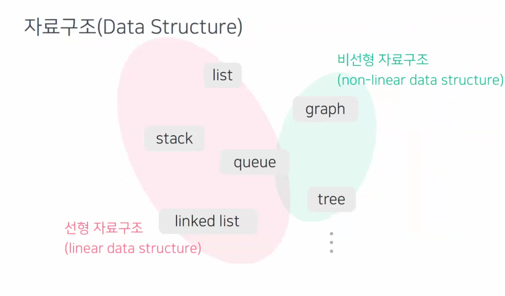
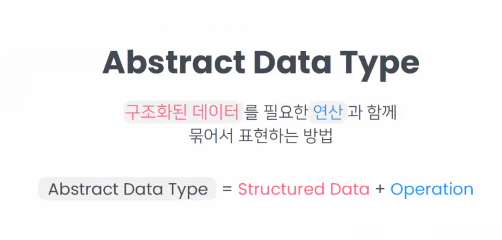
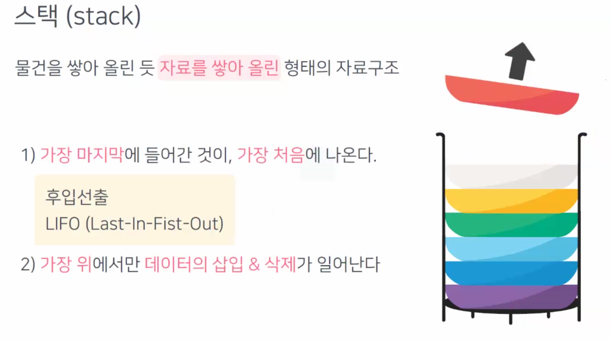
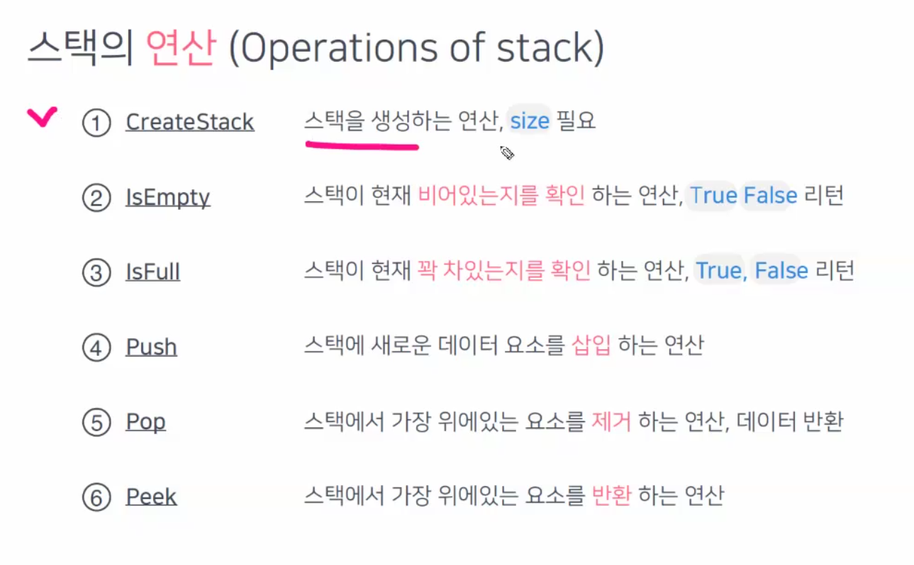
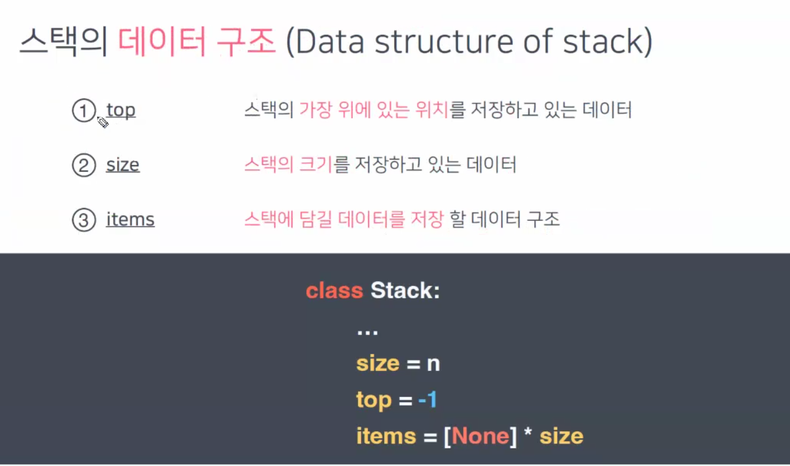

##### 컴퓨터에 데이터를 저장하는 방법 

스토리지

- 데이터가 영구히 저장되는 곳
- HDD, SSD, USB, CD
- 용량이 크지만 속도가 느림
- 당장 필요하지 않은 데이터

메모리

- 데이터가 임시적으로 저장되는 곳
- 용량이 작지만 속도가 매우 빠름
- 당장 필요한 데이터
- 메모리를 효율적으로 사용하자.
- 데이터가 저장 되는 위치 Random
- RAM ( Random Access Memory)
- 각 칸마다 주소값이 지정되어 있음.

---

##### 데이터 타입



데이터를 메모리에 저장하기 전에 

데이터 타입을 지정하고 그 후에 메모리에 저장한다.


데이터 타입이란 : 

더 다양한 데이터 구조를 표현하고 싶어

내가 데이터 타입을 정의하고 싶은데?

-> User-defined data type

클래스를 이용해서 나만의 데이터 타입을 선언

---

##### 자료구조 (Data Structure)

컴퓨터의 메모리를 효율적으로 사용할 수 있도록 데이터를 저장하고 구성하는 방법



자료구조의 장점

데이터의 구조를 전체적으로 파악해서 효율적으로 가용가능

데이터를 표현하기 쉽고, 이해하기 쉽고, 활용하기도 쉽다.


추상 데이터 타입 

데이터가 가지고 있는 공통점을 모으고 

각각의 데이터가 필요한 구조, 연산을 따로 할당


##### Abstract Data Type




##### Stack

물건을 쌓아 올린듯, 자료를 쌓아 올린 형태의 자료구조



top : 삽입과 삭제가 일어나는 지점

pop: 데이터를 뽑아 내는 것

push : 하나의 데이터를 삽입하는 것


함수 콜 스택

```python
def f(n):
    if n == 1:
        return 1
    else:
        return n * f(n-1)
```






DFS = Stack 사용

BFS = Queue 사용