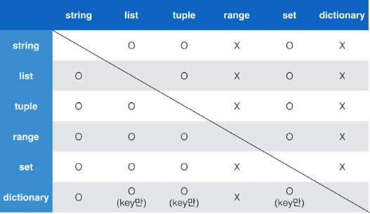

1. 프로그래밍 : 프로그램을 만드는 행위, 컴퓨터에게 일을 시키기 위해서 프로그램을 만드는 행위

   - 프로그램: 특정 작업을 수행하는 일련의 명령어들의 모음

   

2. 프로그래밍 언어 : 컴퓨터는 기계어로 소통하지만 기계어의 대안으로 사람이 이해할 수 새로운 언어를 개발

   - 프로그래밍 언어의 특징: 사람이 이해할 수 있는 문자로 구성, 기본적인 규칙과 문법이 존재

     

3. 소스 코드 : 프로그래밍 언어로 작성된 프로그램

   

4. 번역기 : 소스 코드를 컴퓨터가 이해할 수 있는 기계어로 번역 --> 인터프리터(ex.파이썬), 컴파일러(ex.자바) 

   

5. 인터프리터 & 컴파일러 : 인터프리터 = 소스 코드를 기계어로 변환할 때 통역 하듯이 1줄씩 변환

   ​								 컴파일러 = 소스 코드를 기계어로 변환할 때 한번에 프로그램 전체를 한꺼번에 번역한 후에 실행

   

6. 변수 : 데이터를 저장하기 위해서 사용, 동일 변수에 다른 데이터를 언제든 할당할 수 있게 때문에 '변수' 라고 불림

   

7. 식별자 변수 이름 규칙 

   - __식별자의 이름은 영문 알파벳, 언더스코어(_), 숫자로 구성__

   - __첫 글자에 숫자가 올 수 없음__

   - __길이 제한이 없고, 대소문자를 구별__

   - __기존에 정해져 있는 예약어는 사용할 수 없음__

     

8. 중첩 따옴표 : 따옴표 안에 따옴표를 표현할 경우

   - 작은따옴표가 들어 있는 경우에는 큰따옴표로 문자열 생성

   - 큰따옴표가 들어 있는 경우에는 작은따옴표로 문자열 생성

     

9. 삼중 따옴표 : 따옴표 안에 따옴표를 넣을 때 or 여러 줄을 나눠 입력할 때 편리

   

10. Escape sequence : 역슬래시 뒤에 특정 문자를 넣어 특수한 기능을 하는 문자 조합.

    - \n : 줄 바꿈

    - \t : 탭

    - \r : 캐리지 리턴

    - \0 : 널(Null)

    - \\\\: \

      

11. String Interpolation : print(f'{a}는 ~~~') or print('{}는 ~~'.format(a)) or print('교수님 %s' % name)

    

12. None : 값이 없음을 표현하기 위해 None 타입이 존재, 일반적으로 반환 값이 없는 함수에서 사용하기도 함

    

13. 논리 연산자 주의할 점/ not 연산자

    - Falsy : False는 아니지만 False로 취급 되는 다양한 값

    - 0, 0.0, (), [], {}, None, ""(빈 문자열)

    - 논리 연산자도 우선순위가 존재

    - not, and, or 순으로 우선순위가 높음

    - 논리 연산자의 단축 평가 (0은 False, 1은 True)

      - and 연산에서 첫 번째 값이 False인 경우 무조건 False => 첫 번째 값 반환

        ```bash
        # ex)
        a = 0 and 4   	
        print(a) # 0  
        ```

      - and 연산에서 첫 번째 값이 True인 경우 두 번째 까지 확인 후 결과 반환 => 두 번째 값 반환

        ```bash
        # ex)
        a = 5 and 4   	
        print(a) # 4  
        ```

      - or 연산에서 첫 번째 값이 True 인 경우 무조건 True => 첫 번째 값 반환

        ```bash
        # ex) 
        a = 5 or 0
        print(a) # 5
        ```

    

14. 컨테이너 : 여러 개의 값(데이터)을 담을 수 있는 것(객체)으로, 서로 다른 자료형을 저장할 수 있음 (ex. List, dict, set, tuple ..)

    - 시퀀스 : 순서대로 하나씩 데이터를 나열한 데이터 구조
    - Mutable VS Immutable : mutable은 수정 가능한 객체, immutable은 수정 불가능한 객체
    - Iterable : 순회 가능한 객체

    - 시퀀스형 컨테이너 : 리스트, 튜플 레인지

      비시퀀스형 컨테이너 : 세트, 딕셔너리

    - Mutable : list___, dict

      Immutable : int, float, str, tuple

    - Iterable

      - 순회할 수 있는 자료형 : string, list, dict, tuple, range, set 등
      - 순회형 함수 : range, enumerate

    

15. 암시적 형 변환 : 사용자가 의도하지 않고, 파이썬 내부적으로 자료형을 변환 하는 경우

    - bool, Numeric type (int, float)

      ```bash
      # ex)
      print(True + 3) # 4
      print(3 + 5.0) # 8.0
      ```

    

16. 명시적 형 변환 : 사용자가 특정 함수를 활용하여 의도적으로 자료형을 변환하는 경우

    - 

      ```bash
      # ex)
      print('3'+ 4) # TypeError / 문자열은 암시적 타입 변환이 되지 않음
      print(int('3')+ 4) # 7
      print(int('3.5')+ 5) # ValueError / 정수 형식이 아닌 경우 타입 변환할 수 없음
      ```

    

17. 컨테이너 간의 형 변환

    

    

    

18. 조건 표현식 (Conditional Expression)

    - 조건 표현식을 일반적으로 조건에 따라 값을 정할 때 활용

    - 삼항 연산자(Ternary Operator)로 부르기도 함

    - treu인 경우 값 if 조건 else false 인 경우 값

      ```bash
      value = num if num >= 0 else -num   # 절댓값 저장하기 위한 코드
      ```

    

19. List Comprehension

    - 표현식과 제어문을 통해 특정한 값을 가진 리스트를 간결하게 생성하는 방법

    - [code for 변수 in iterable] or [code for 변수 in iterable if 조건식]

      ```bash
      # 1~3의 세제곱 리스트 만들기
      cubic_list = []
      for number in range(1,4):
      	cubic_list.append(nummber **3)
      print(cubic_list) # [1, 8, 27]
      ```

      ```bash
      cubic_list = [number **3 for number in range(1,4)]
      print(cubic_list) # [1, 8, 27]
      ```

    

20. Dictionary Comprehension

    - 표현식과 제어문을 통해 특정한 값을 가진 딕셔너리를 간결하게 생성하는 방법

    - {key: value for 변수 in iterable} or {key : value for 변수 in iterable if 조건식}

      ```bash
      # 1~3의 세제곱 리스트 만들기
      cubic_dict = {}
      for number in range(1,4):
      	cubic_dict[number] = nummber **3
      print(cubic_list) # [1, 8, 27]
      ```

      ```bash
      cubic_dict = {number : number **3 for number in range(1,4)}
      print(cubic_dict) # {1: 1, 2: 8, 3: 27}
      ```

    

21. 반복문 제어

    1. break : 반복문을 종료

    2. continue : continue 이후의 코드 블록은 수행하지 않고, 다음 반복을 수행

    3. for-else : 끝까지 반복문을 실행한 이후에 else 문 실행

        break를 통해 중간에 종료되는 경우 else문은 실행되지 않음

    4. pass : 아무것도 하지 않음(문법적으로 필요하지만, 할 일이 없을 때 사용)

       

22. 함수 : 사용하는 이유 => 

    1. Decomposition(분해) : 기능을 분해하고 재사용 가능하게 만들고 (ex. )

    2. Abstraction(추상화) : 복잡한 내용을 모르더라도 사용할 수 있도록 재사용성과 가독성, 생산성 

       

23. 함수의 큰 범위의 3가지 분류

    1. 내장 함수 : 파이썬에 기본적으로 포함된 함수

    2. 외장 함수 : import 문을 통해 사용하며, 외부 라이브러리에서 제공하는 함수

    3. 사용자 정의 함수 : 직접 사용자가 만드는 함수

       

24. 함수의 기본 구조

    - 선언과 호출 => 입력 => 문서화 => 범위 => 결과값

      

25. print 함수와 return 의 차이점

    - print를 사용하면 호출될 때마다 값이 출력됨(주로 테스트를 위해 사용)

    - 데이터 처리를 위해서는 return 사용

      

26. Parameter 와 Argument

    - ___Parameter___ : 함수를 정의할 때, 함수 내부에서 사용되는 변수 (ex. def function(___ham___))

    - ___Argument___ : 함수를 호출 할 때, 넣어 주는 값 (ex. function('___spam___'))

      

27. Argument :

    - Positional Arguments : 기본적으로 함수 호출 시 Argument는 위치에 따라 함수 내에 전달 됨.

      ```bash
      def add(x,y):
      	return x + y
      
      add(2,3) # 5
      ```

      

    - Keyword Arguments : 직접 변수의 이름으로 특정 Argument를 전달 할 수 있음

    - Keyword Argument 다음에 Positional Argument를 활용할 수 없음 (positional -> Keyword 는 가능)

      ```bash
      def add(x,y):
      	return x + y
      
      add(x = 2,y = 3) # 5
      add(2, y = 3)    # 5
      add(x = 2, 3)    # Error
      ```

      

    - Default Arguments Values: 기본값을 지정하여 함수 호출 시 argument 값을 설정하지 않도록 함

    - 정의된 것 보다 더 적은 개수의 argument 들로 호출될 수 있음

      ```bash
      def add(x,y = 0):
      	return x + y
      
      add(2) # 2
      ```

    

28. 가변 인자(*args) : 여러 개의 Positional Argument를 하나의 필수 Parameter로 받아서 사용

    - 몇 개의 Positional Argument를 받을지 모르는 함수를 정의할 때 유용

      ```bash
      def add(*args):
          sum = 0
          for arg in args:
              sum += arg
          return sum
      
      print(add(2)) # 2
      print(add(2, 3, 4, 5)) # 14
      ```

    

29. 패킹/언패킹

    - 패킹 : 여러 개의 데이터를 묶어서 변수에 할당하는 것

    - 언패킹 : 시퀀스 속의 요소들을 여러 개의 변수에 나누어 할당하는 것

      ```bash
      numbers = (1, 2, 3, 4, 5) # 패킹
      a, b, c, d, e = numbers # 언패킹
      # ==============================
      num = (1, 2, 3, 4, 5, 6)
      a, b, *rest = num
      print(a, b, rest) # 1 2 [3, 4, 5]
      # ==============================
      numsss = (1, 2, 3, 4, 5, 6)
      a, *rest, e = numsss
      print(rest) # [2, 3, 4]
      ```

    

30. Asterisk (*)와 가변 인자 : *는 시퀀스 언패킹 연산자라고도 불리며, 말 그대로 시퀀스를 풀어 헤치는 연산자

    - 주로 튜플이나 리스트를 언패킹하는데 사용

    - *를 활용하여 가변 인자를 만들 수 있음

      

31. 가변 키워드 인자(**kwargs) : 몇 개의 키워드 인자를 받을지 모르는 함수를 정의할 때 유용

    - ** kwargs는 딕셔너리로 묶여 처리되며, parameter에 **를 붙여 표현

      ```bash
      def family(**kwargs):
      	for key, value in kwargs.items():
      		print(key, ':', value)
      family(father = '아부지', mother = '어무니', baby = '아기')
      # father : 아부지
      # mother : 어무니
      # baby : 아기
      ```

    

32. Python 의 범위(Scope) : 함수는 코드 내부에 local scope를 생성, 그 외의 공간인 global scope로 구분

    

33. 변수 수명주기(lifecycle)

    - built-in scope : 파이썬이 실행된 이후부터 영원히 유지

    - global scope : 모듈이 호출된 시점 이후 혹은 인터프리터가 끝날 때까지 유지

    - local scope : 함수가 호출될 때 생성되고, 함수가 종료될 때까지 유지

      

34. 이름 검색 규칙 : 파이썬에서는 LEGB Rule 이라고 부르고 아래와 같은 순서로 이름을 찾아나간다.

    - __L__ocal scope: 지역 범위(현재 작업 중인 범위)

    - __E__nclosed scope : 지역 범위 한 단계 위 범위

    - __G__lobal scope : 최상단에 위치한 범위

    - __B__uilt-in scope : 모든 것을 담고 있는 범위(정의하지 않고 사용할 수 있는 모든 것) (ex. print())

      

35. lambda 함수 : 표현식을 계산한 결과값을 반환하는 함수로, 이름이 없는 함수여서 익명함수라고도 불림

    - 특징 : return문을 가질 수 없음, 간편 조건문 외 조건문이나 반복문을 가질 수 없음

    - 장점 : 함수를 정의해서 사용하는 것보다 간결하게 사용 가능, def를 사용할 수 없는 곳에서도 사용가능

      ```bash
      a = lambda b, h : 0.5 * b * h
      ```

    

36. 재귀 함수(recursive function)

    - 자기 자신을 호출하는 함수, 무한한 호출을 목표로 하는 것이 아니며, 알고리즘 설계 및 구현에서 유용하게 활용

      

37. 모듈 : 다양한 기능을 하나의 파일로, 특정 기능을 하는 코드를 파이썬 파일(.py)단위로 작성한 것

    

38. 패키지 : 다양한 파일을 하나의 폴더로, 여러 모듈/ 하위 패키지로 구조화 

    

39. 라이브러리 : 다양한 패키지를 하나의 묶음으로

    

40. pip : 이것을 관리하는 관리자

    - 패키지 설치 : $ pip install SomePackage (... 설마 이런게 나올까...)

    - 패키지 삭제 : $ pip uninstall SomePackage

      

41. 가상환경 : 패키지의 활용 공간, 파이썬 표준 라이브러리가 아닌 외부 패키지와 모듈을 사용하는 경우

    - 가상환경 생성 : $ python -m venv {폴더명}  <-- 가변