# Position

## static

- 기본(defaulte)값
- left,right,top,bottom 다 안먹힌다.

## relative

* 상대적인이라는 뜻으로
* 무조건 부모를 따르게 된다.
* position:relative 로 한 뒤 
* left,right,top,bottom에 수치를 적용시키면 아래의 사진과 같이 된다.

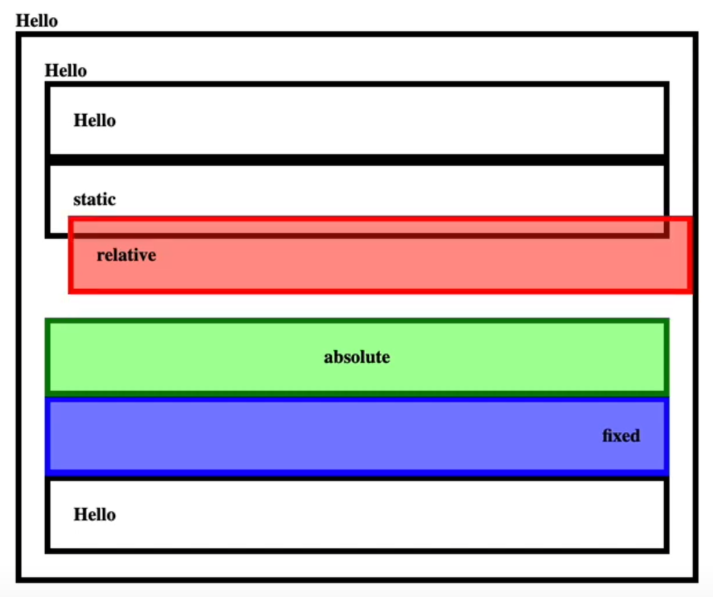

- 또한 relative는 부모의 위치를 기준으로해서 자신의 위치가 결정된다. (상단의 Hello와 border의 거리 비교) 

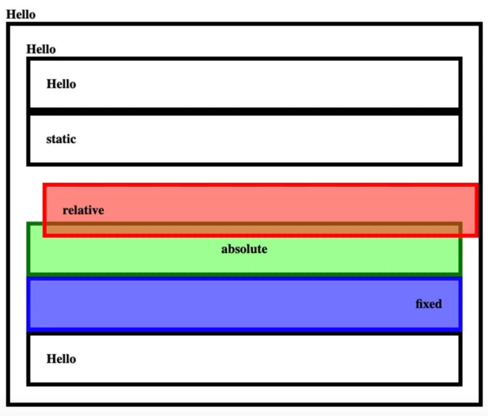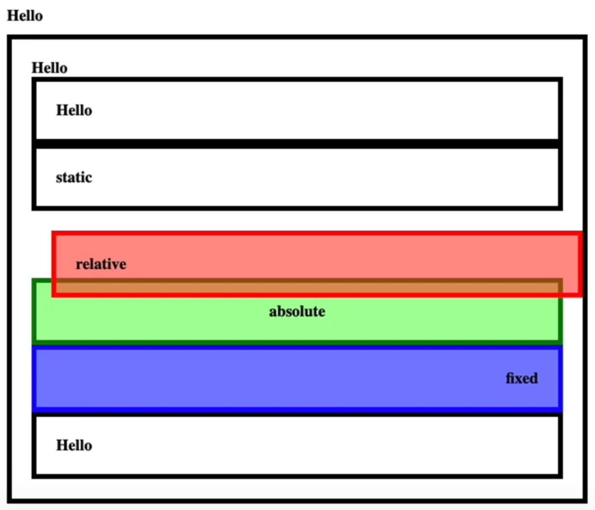

## absolute

* 자신의 영역이 붕뜬 상태가 되며

* 아래에 있던 태그가 올라오게 된다.

* 부모로부터 자유로워지게 된다.

  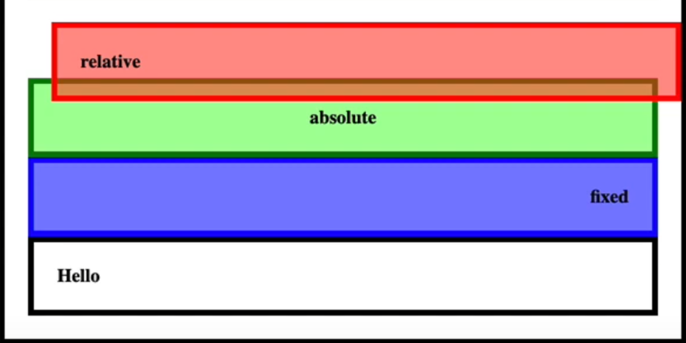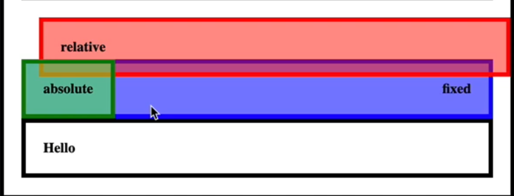

부모의 태그가 static이 아닌 relative로 되어 있다면

* left를 0으로 주게 되면 아래와 같이 부모의 태그의 가장 왼쪽에 붙게 되며

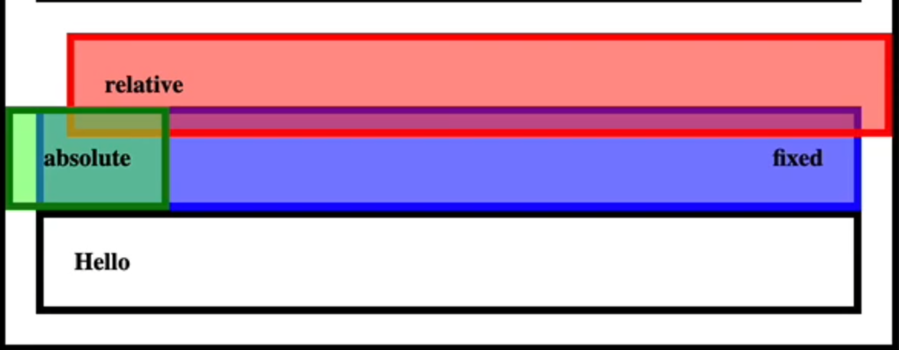

* top을 0으로 주게 되면 아래와 같이 부모의 태그 가장 위쪽에 붙게 된다.

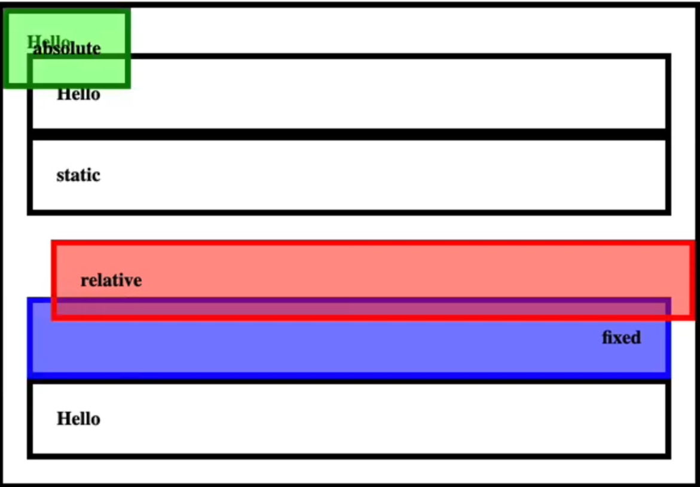

만약 부모가 static일 경우엔 더 상위의 부모의 태그에 붙게 된다.

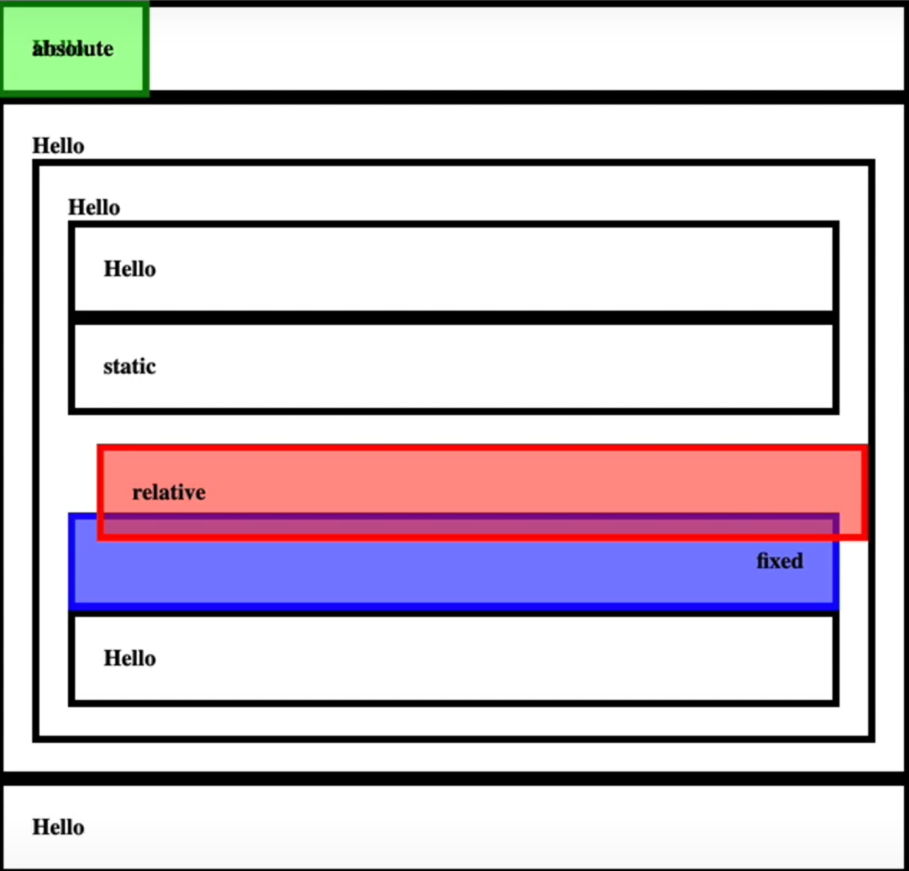

## fixed

* absolute와 유사하지만 더 개성이 있다
* 가장 최상단의 태그에게 붙게 된다.
* 우선 position을 fixed로 하게 된다면 원래 해당 영역만큼만 차지하며 붕뜨게 되고

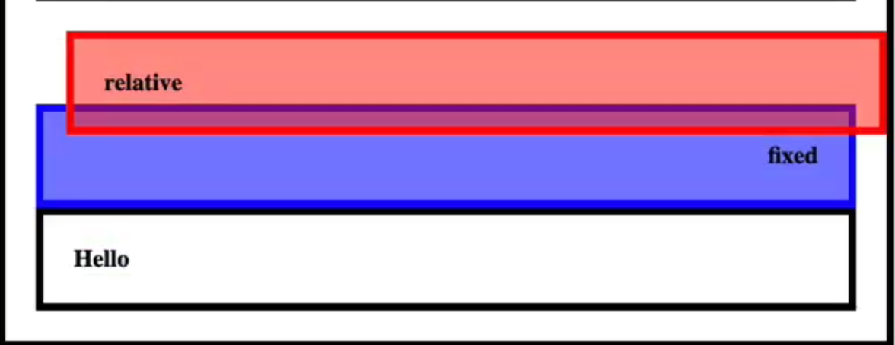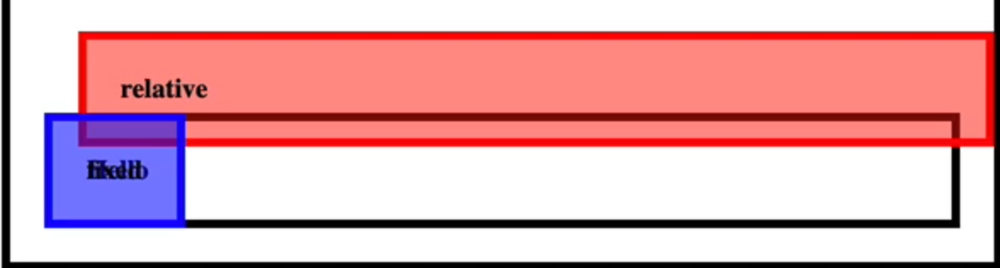

* top 0을 하게 되면 가장 최상단인 body태그에 붙게 되어 가장 위에 가게 된다.

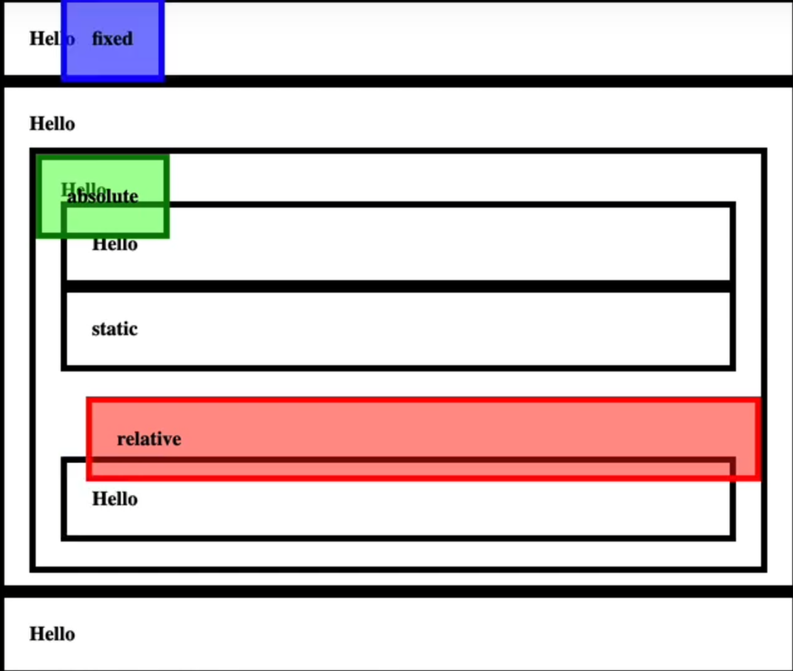

- 그리고 또다른 특성이 있는데 스크롤을 무시한다.

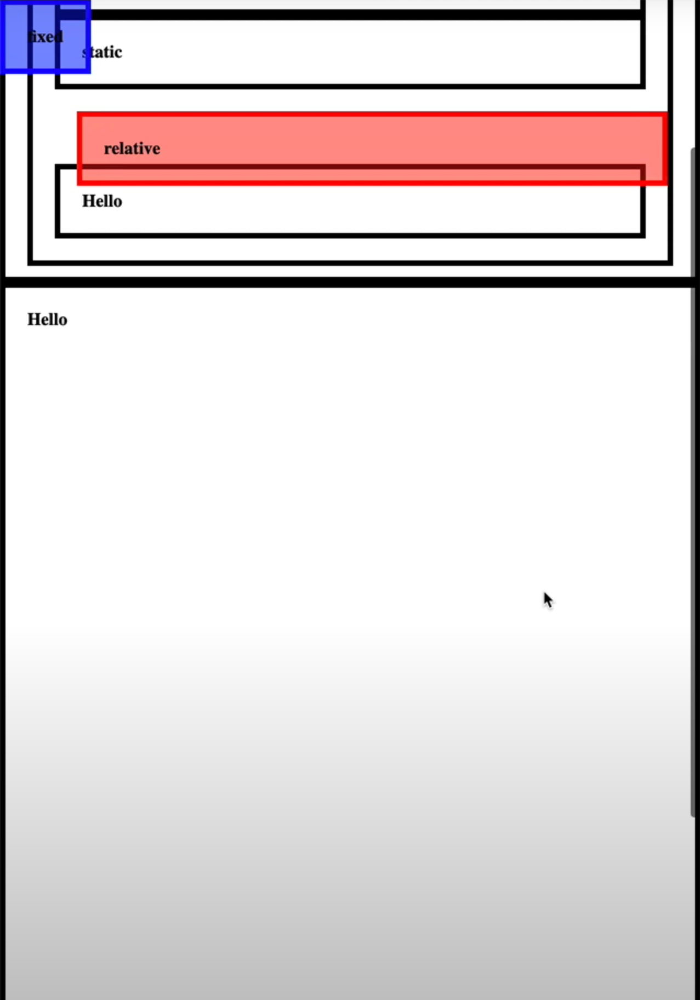