1. 데이터 구조 활용하기

   1. 데이터 구조를 활용하기 위해서는 메서드를 활용

      1. 메서드는 클래스 내부에 정의한 함수, 사실상 함수와 동일

      2. 쉽게 설명하자면 객체의 기능

         데이터 구조.메서드() | 쉽게 보자면 --> 주어.동사()

      3. Sting.split(), List.append(10)

2. 파이썬 공식 문서의 표기법

   1. python 구문이 아니며, 문법을 표현하기 위한 것임
   2. 아래 예시에서 str.replace(old, new [,count])
      1. old, new 는 필수 / [,count]는 선택적 인자를 의미함.

3. 문자열(String Type)

   1. 문자들의 나열(sequence of characters)
      1. 모든 문자는 str 타입( 변경 불가능한 immutable)

   2. 문자열은 작은 따옴표('') 나 큰 따옴표("") 를 활용하여 표기
      1. 문자열을 묶을 때 동일한 문장 부호를 활용
      2. PEP8에서는 소스 코드 내에서 하나의 문장 부호를 선택하여 유지하도록 함

   3. 문자열 조회/ 탐색 및 검증 메서드 (istitle()은 첫 글자가 대문자인지 판별)

      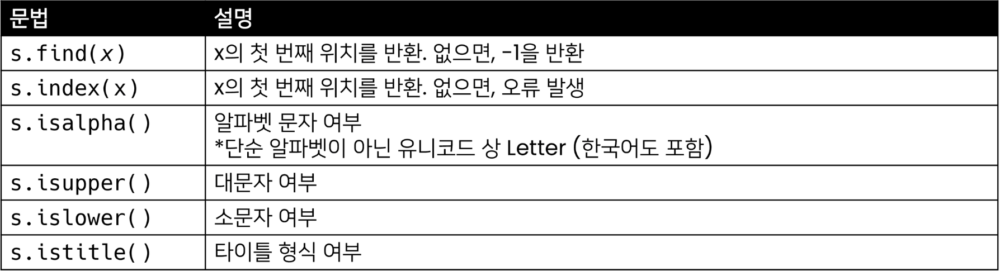

   4. 문자열 관련 검증 메서드, 숫자인지 판별 

      (엄격) isdecimal > isdigit > isnumeric (느슨)

      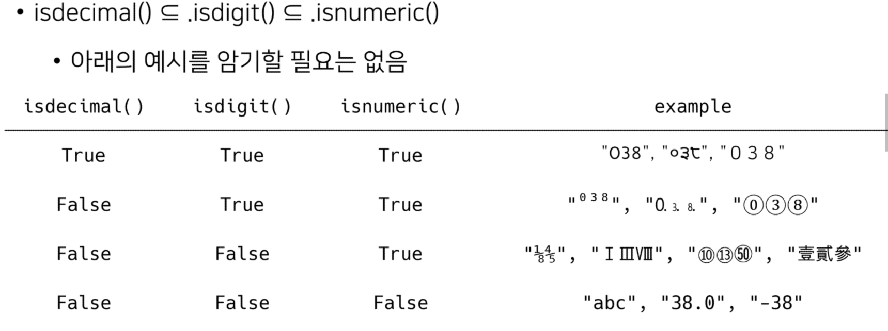

   5. 문자열 변경 메서드 (S는 문자열)

      

      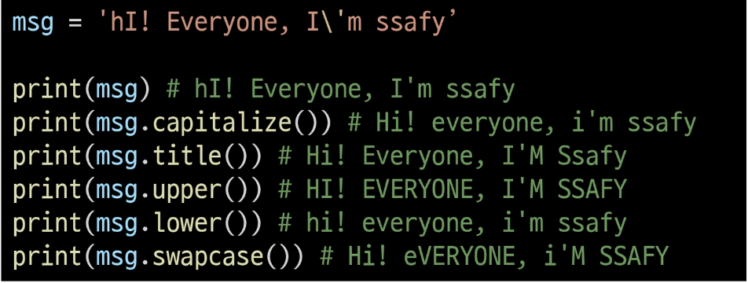

4. 리스트의 생성과 접근 

   1. 리스는 대괄호[] 혹은 list()를 통해 생성

      1. 파이썬에서는 어떠한 자료형도 저장할 수 있으며, 리스트 안에 넣을 수 있다.
      2. 생성된 이후 내용 변경이 가능 -> 가변 자료형
      3. 이러한 유연성 때문에 파이썬에서 가장 흔히 사용

   2. 순서가 있는 시퀀스로 인덱스를 통해 접근 가능 

      1. 값에 대한 접근은 list[i]

   3. 리스트 메서드

      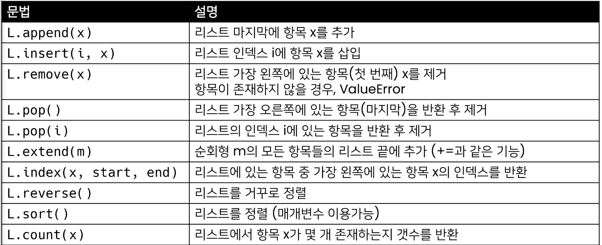

      

      1. List.sort() 의 경우 주소 값의 변수를 정렬하여 print() 할 경우 None 출력

         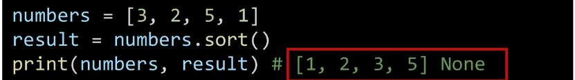

      2. sorted(List)의 경우 원본 변경 X , 정렬된 리스트를 반환

         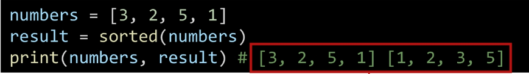

      3. List.reverse() 의 경우 순서를 반대로 뒤집지만 정렬하는 것이 아님!

         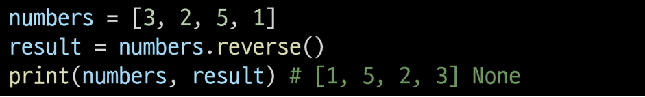

5. 튜플의 정의

   1. 튜플은 여러 개의 값을 순서가 있는 구조로 저장하고 싶을 때 사용

      1. 리스트와의 차이점은 생성 후, 담고 있는 값 변경이 불가

   2. 항상 소괄호 형태로 사용

   3. 튜플 관련 메서드 (확장 연산자를 사용하면 주소 값이 변경되어 새로 생성.)

      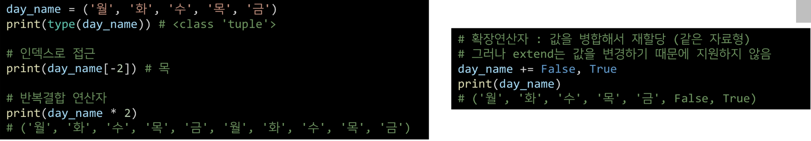

6. 세트

   1. set이란 중복되는 요소가 없이, 순서에 상관없는 데이터들의 묶음

      1. 데이터의 중복 허용x
      2. 순서가 없어서 인덱스 활용x

   2. 수학에서의 집합을 표현한 컨테이너

      1. 집합 연산이 가능(여집합을 표현하는 연산자는 별도로 x)
      2. 중복된 값이 존재하지 않음

   3. 담고 있는 요소를 삽입, 변경, 삭제 가능 -> 가변 자료형(mutable) 

   4. 셋 메서드 

      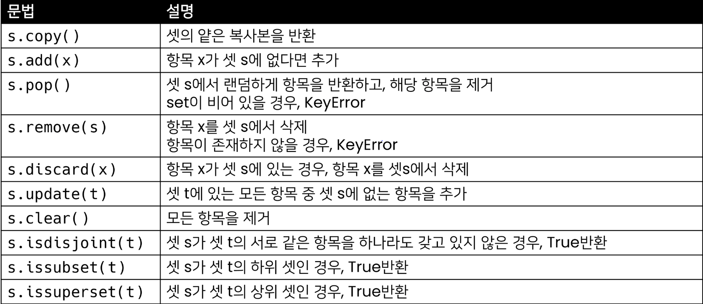

      1. set.discard(x)는 에러처리 x

      2. set.isdisjoint(t) 는 서로소 찾기

      3. set.issubset(t) 는 셋 set 이 셋 t 의 하위 셋인 경우 True, 즉 set < t

      4. set.issuperset(t) 는 셋 set 이 셋 t 의 상위 셋인 경우 True, 즉 set > t

         해석할 때는 앞의  set이 뒤의 set보다 ? 라고 해석하면 된다.

7. 딕셔너리

   1. 키와 값(key-value) 쌍으로 이루어진 자료형

   2. dictionary 의 key

      1. key 는 변경 불가능한 데이터(immutable)만 활용 가능
         1. string, int, float, bool, tuple, range

   3. 딕셔너리 메서드

      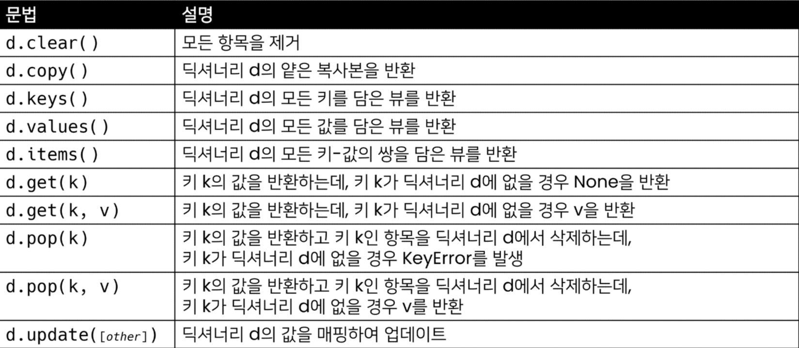

      1. dict.get() 사용하면 없을 경우 None

      2. dict[] 를 사용하면 Error

      3. dict.pop() 의 요소가 없으면 Error,  default 값으로 dict.pop(, default) 가 

         있으면 default 값 출력

      4. dict.update(key = ) 해당 key 값의 value 값을 변경

8. 얕은 복사와 깊은 복사

   1. 할당

      1. 대입 연산자 

         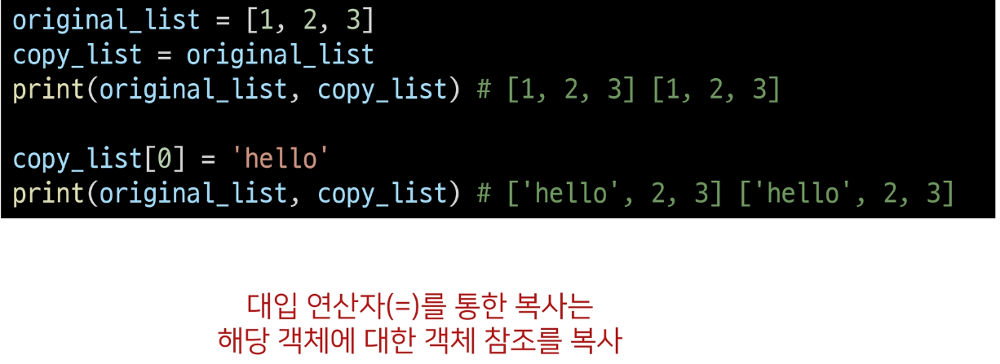

         original_list 와 copy_list 둘 다 같은 주소 값을 이용

         이유는 리스트 형태는 복사

   2. 얕은 복사

      1. Slice 연산자를 활용하면

         같은 원소를 가진 리스트지만 연산 된 결과를 복사 (다른 주소)

         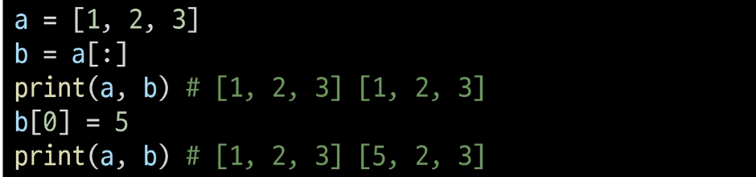

      2. 단 b = a[:] 처럼 복사를 할 경우는 1차원 리스트일 경우

         주소를 참조하기에 의도와 다른 사용 가능

   3. 깊은 복사

      1. 그래서 이차원 배열의 경우 깊은 복사를 사용

         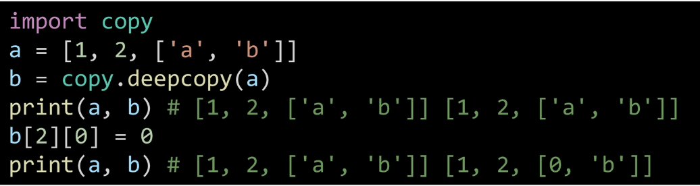

         import copy 후 copy.deepcopy() 를 실행하면

         찐 복사의 경우가 된다.