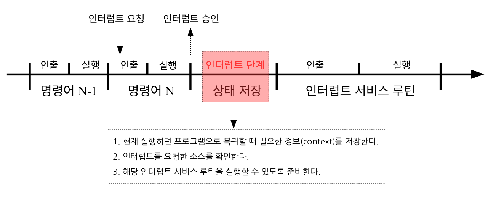
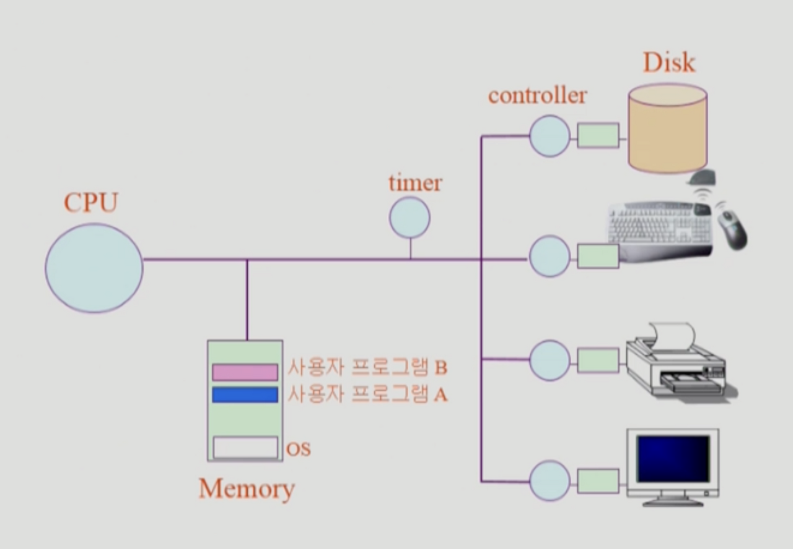

3 인터럽트 전체 과정 - 김홍민
디스크에서 파일 읽어오거나 키보드 입력 받을 때 OS 내부에서 일어나는 과정


<인터럽트의 개념>


* 사전적인 의미로는 `방해하다, 중단시키다` 라는 뜻을 가진다

* OS적으로는 `CPU의 정상적인 프로그램 실행을 방해했다` 는 의미를 가진다

* 프로그램을 실행하는 도중에 예기치 않은 상황이 발생할 경우, 현재 실행중인 작업을 중단하고 발생된 상황을 처리한 후, 다시 실행중인 작업으로 복귀하는 것

  <요약하자면> 

  ```#
  1. OS는 서로 다른 일을 하는 수많은 하드웨어를 사용한다. 
  	이런 장치들은 동기적으로 구동되는데, 이는 각각 동작이 완료될 때 까지 기다려야하므로 
  	아무것도 하지 않으면서 바쁜 상태로 많은 시간을 소비하게된다. 
  	이 때, 인터럽트를 사용하여 한번에 하나의 명령만 수행할 수 있는 CPU의 한계성을 보완할 수 있다.
  ```

  

  

<인터럽트의 종류>


- 외부 인터럽트

  ```#
  CPU 코어 외부에서 어떤 일이 발생한 것을 전기적인 신호로 CPU에게 통지하는 경우, 주로 입출력장치에 의해 발생한다고 합니다.
  
  <유형>
  1. 타이머 인터럽트 : 타이머가 일정한 시간 간격으로 중앙처리장치에게 인터럽트를 요청
  2. 입출력 인터럽트 : 속도가 느린 입출력장치가 입출력 준비가 완료되었음을 알리기 위해 인터럽트를 요청
  ```

- 내부 인터럽트

  ```#
  CPU 코어 외부에서 인터럽트를 거는 경우가 일반적이지만, CPU 내부에서 실행하면서 인터럽트에 걸리는 경우
  
  <유형>
  1. 하드웨어 고장(Hardware Interrupt)
  	컴퓨터 고장
  	데이터 전달 과정에서의 비트 오류
  	전원이 나간 경우
  2. 실행할 수 없는 명령어 : 기억장치에서 인출한 명령어의 비트 패턴이 정의되어 있지 않은 경우
  3. 명령어 실행 오류 : 나누기 0을 하는 경우
  4. 사용 권한 위배 : 사용자가 운영체제만 사용할 수 있는 자원에 액세스하는 경우
  ```

- 소프트웨어 인터럽트

  ```#
  사용자가 프로그램을 실행시키거나 Supervisor(=OS) 를 호출하는 동작을 수행하는 경우
  ```

  

<인터럽트 동작 순서>


- 인터럽트의 처리 과정 : 1. 요청 -> 2. 중단 -> 3. 보관 -> 4. 처리 -> 5. 재개

  

  1. 인터럽트 요청

  

  2. 프로그램 실행 중단
     - 현재 실행중이던 `Micro Operation` 까지 수행  
       - `micro operation` : 레지스터에 저장된 데이터에 의해 이루어지는 동작

  

  3. 현재 실행중인 프로그램 상태 보관

     - `Interrupt Vector` 를 읽어 `ISR` 주소값을 얻음

       - `Interrupt Vector` : 인터럽트 요청이 발생했을 때, CPU는 인터럽트 소스가 무엇이며, 해당 인터럽트 ISR이 어디에 적재되어							있는지를 확인해야한다. 이 때, CPU는 `인터럽트 벡터` 를 활용한다.

         - 여러 종류의 인터럽트에 대한 ISR의 시작 주소
         - `인터럽트 벡터 테이블` : 주기억장치의 특정 영역에 여러 개의 인터럽트에 대한 인터럽트 벡터를 모아놓은 영역

       - `ISR (Interrupt Service Routine) or 인터럽트 핸들러` : CPU에서 인터럽트가 접수되면, 해당 인터럽트 핸들러의 

         코드의 위치를 찾고 실행에 옮긴다. 실행 중이던 `레지스터` 와 `PC` 를 보관함으로써 CPU의 상태를 보존한다. 

         인터럽트가 핸들링이 완료되면 이전의 상태로 복귀된다.

       

     - ISR 로 점프 (이 때, `PC` 값은 자동 대피 저장됨)

       - `PC (Program Counter)` : CPU 내부에 있는 레지스터 중의 하나로서, 다음에 실행될 명령어의 주소를 가지고 있어 

         ​									실행할 기계어 코드의 위치를 지정한다. 때문에 명령어 포인터라고도 불린다.

       - 현재 진행중인 프로그램의 레지스터를 대피함

  

  4. 인터럽트 서비스 루틴 처리

     - 인터럽트 원인을 파악하고 실질적인 작업 수행

     - 서비스 루틴 수행 중, 우선순위가 더 높은 인터럽트가 발생하면 재귀적으로 1~5 과정 수행

  

  5. 상태 복구

     - 해당 작업을 다 처리하면, 대피시킨 레지스터를 복원한다

     - ISR 끝에 `RETI` 명령어에 의해 인터럽트 해제

     - 명령어가 실행되면, PC 값을 복원하여 이전 실행 위치로 복원

  

  

- 쉽게 정리

  

- 위 그림이 시사하는 바는 다음과 같다. 우선, 명령어 사이클은 `인출(fetch stage)`과 `실행(execution stage)` 두 가지 단계를 반복해서 수행한다. 

  그런데 인터럽트 요청이 들어왔다고 해서 바로 이를 처리하는 것이 아니라, 명령어 N의 `실행` 단계를 마쳐야 한다. 

  명령어의 실행단계를 마칠 때마다 중앙처리장치는 `반복적으로` 인터럽트 요청이 있는지 계속해서 확인한다. 

  인터럽트 요청이 있어야 인터럽트 서비스 단계를 진행한다.

  

  좀 더 큰 개념으로 살펴본다면 아래와 같은 그림이 된다.

  

  `인터럽트 서비스 루틴`(ISR) : 어떤 소스(source)가 인터럽트 요청을 하면 반복적으로 수행하는 일이 있다는 뜻이다. 

  다른 말로 `인터럽트 핸들러`(interrupt handler)라고도 한다.


---


<프로그램의 입출력>

1. 프로그램은 입출력을 하기 위해 우선 운영체제에게 부탁한다.
2. 이후 시스템 콜(system call)이라는 소프트웨어 인터럽트를 걸어서 CPU가 OS에게 넘어가게 한다(= trap을 걸어서 인터럽트를 건다).
3. OS는 항상 올바른 요청인지 확인 후 입출력을 수행한다.
4. 입출력이 완료되면 하드웨어 인터럽트가 걸리게 된다.



다시 한번 정리하자면 

1. 사용자 프로그램이 입출력을 요청하기 위해서 OS에게 시스템 콜이라는 소프트웨어 인터럽트를 겁어줍니다.
2. OS가 입출력 장치에게 일을 시킨다.
3. CPU는 다른 프로그램에게 넘어가게 된다.
4. 시킨 일이 끝나면 하드웨어 인터럽트가 걸린다(일을 끝냈다고 입출력 장치가 CPU에게 알린다).