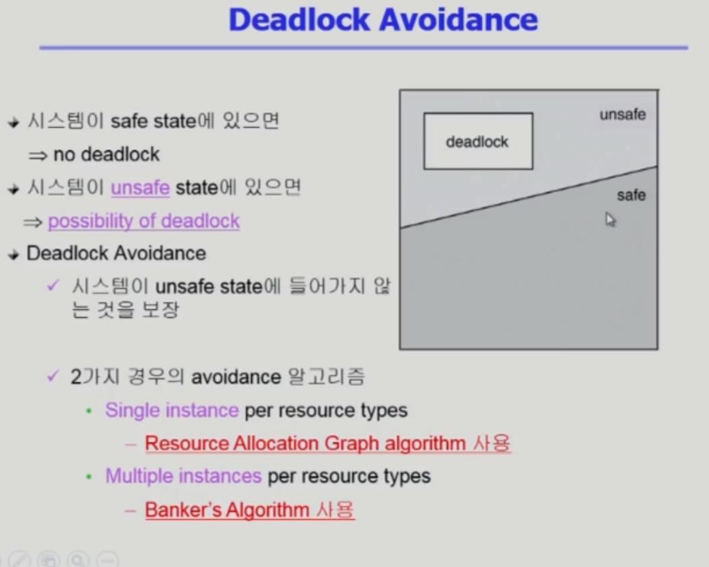
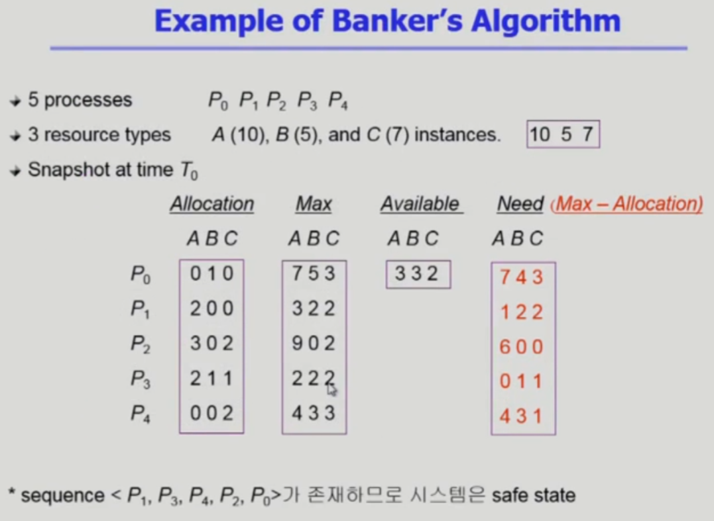

## Deadlock Avoidance

- Deadlock Avoidance란 :

  - 프로세스마다 내 평생의 자원을 최대로 사용하면은 얼마나 사용할지에 대한 정보가 미리 주어진다고 가정하여 Deadlock을 회피하는 것.

- 자원 요청에 대한 부가적인 정보를 이용해서 deadlock의 가능성이 없는 경우에만 자원을 할당

- 시스템 state가 원래 state로 돌아올 수 잇는 경우에만 자원 할당

  

- safe state : 시스템 내의 프로세스들에 대한 safe sequence 가 존재하는 상태

- safe sequence 

  - 프로세스의 sequence <P1, P2,......, Pn> 이 safe 하려면 Pi(1<= i <=n)의 자원 요청이 '가용 자원 + 모든 Pj (j<i)의 보유 자원'에 의해 충족되어야 함

  - 조건을 만족하면 다음 방법으로 모든 프로세스의 수행을 보장

    - Pi의 자원 요청이 즉시 충족될 수 없으면 모든 Pj (j<i)가 종료될 때까지 기다린다.

    - Pi-1이 종료되면 Pi의 자원요청을 만족시켜 수행한다.

      

Deadlock 에 들어가지 않도록 하는 Deadlock Avoidance 알고리즘으로

1. 단일 인스턴스를 가지는 자원의 경우
   - Resource Allocation Graph Algorithm
2. 다중 인스턴스를 가지는 자원의 경우
   * Banker's Algorithm

 

---

## Resource Allocation Graph Algorithm

사각형 :자원

원 : 프로세스

화살표가 가리키는 곳 :

- 실선 :

  - 해당 프로세스는 자원을 요청했지만 해당 자원은 다른 프로세스가 가지고 있다는 의미

- 점선 : 

  Deadlock Avoidance는 점선을 추가한다.

  - 점선은 항상 프로세스에서 자원을 향해서 나아가는 선만 존재하며
  - ***의미로는*** 평생에 해당 자원을 요청하는 시기가 있을 수도 있을 것이다라는 의미를 가짐 (지금 요청X), 평생에 한 번 이상 요청할 수 있다. 
  - 만약 P2 프로세스가  R2를 요청하게 되면 (현재 안전한 상황이라고 가정하에) 
    - 점선에서 실선으로 변경되며 해당 자원은 요청한 프로세스를 향해 화살표를 가리키게 된다. 
  - 가장 오른쪽 그림을 보게 되면 화살표가 서로를 향해 가리키게 되어 Circular Wait (환형 대기)가 될 것 같지만
  - P1에서 R2로 가는 선이 점선인 경우로 교착 상태는 아니지만 unsafe한 조금 위험한 상황이 되어 버리게 된다.
  - 그런데 만약 P1이 R2의 자원을 요청하게 된다면 Circular Wait 이 되어 교착 상태가 되어 버리게 된다.

---

## Banker's Algorithm

Allocation : 각 프로세스 별 현재 사용하고 있는 자원의 수

Available : 현재 사용 가능한 자원 양으로 사진상의 [10,5,7]에서 현재 사용하고 있는 Allocation을 뺀 남은 자원의 수

Need : 추가로 요청 가능한 자원으로, Max의 값에서 Allocation인 현재 요청한 자원 수를 뺀 사용 가능한 자원의 수 

Max : 각 프로세스들이 평생에 최대로 사용하게 되는 자원의 수

**<만약>**

상황 : P0 가 C를 하나 요청 했을 경우

결론 :현재 Available을 보면 C는 2개로 요청이 가능한 상황이지만 Banker's Algorithm의 경우 

​			비록 자원이 여유가 있더라도 만약에 그 자원을 줬을 때 불안정한 상황이 생길 수 있다면 해당 요청을 받아들이지 않게 된다.

과정 : Available(가용 자원)의 경우 여유가 있어서 줄 수는 있지만 P0의 경우 필요로 하는 자원인 

​			Need의 경우 [7, 4, 3] 가 되는데 Need에 있는 수 만큼 모두 지금 요청해 버리면 가용자원인 Available 자원으로는 충족이 되지 않게된다.

​			물론 다른 프로세스들이 사용 중이던 자원을 반납하게 되면 괜찮을 수 있지만 

​			그렇지 않은 경우엔 가용자원은 없고 다른 프로세스들은 가지고 있는 걸 내어놓지 않게되며 처리할 수 없게 되어 Deadlock이 발생하게 된다.

정리 : Banker's Algorithm의 경우 비록 자원의 여유가 있더라도 해당 프로세스가 자원을 최대로 요청했을 때 해당 자원을 

​			현재 가용 자원으로 충족이 되지 않는다면 해당 요청을 받아들이지 않게 되어 **Banker's Algorithm 항상 safe state를 유지하게 된다. **

safe 의미 : 가용 자원만 가지고 해당 프로세스를 하나씩 종료 시킬 수 있는 그러한 sequence 가 있다면 safe 하다고 한다.

​					그래서 사진의 마지막에 있는 sequence <P1, P3, P4, P2, P0>를 보게 되면

​					우선 P1가 요청하는 자원은 가용 자원으로 충족이 되기에 실행 후 종료를 하게 되면 현재 사용했던 자원 또한 반납하게 되며

​					가용 자원은 반납 받은 자원을 더한 수가 되며, 다른 프로세스 또한 요청하는 자원이 가용 자원으로 충족이 되어 

​					요청을 받아들여 실행을 종료하게 되는 것을 반복하여 P0까지 안전하게 수행할 수 있게 되는 시퀀스이기에 

​					해당 시퀀스의 시스템은 safe state, safe sequence 라고 할 수 있다. 

 