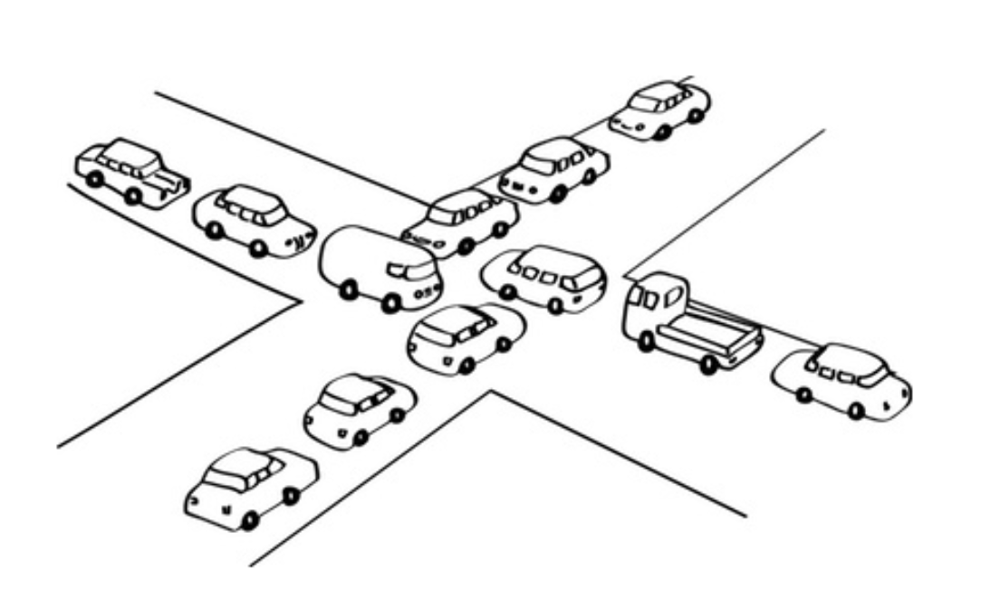
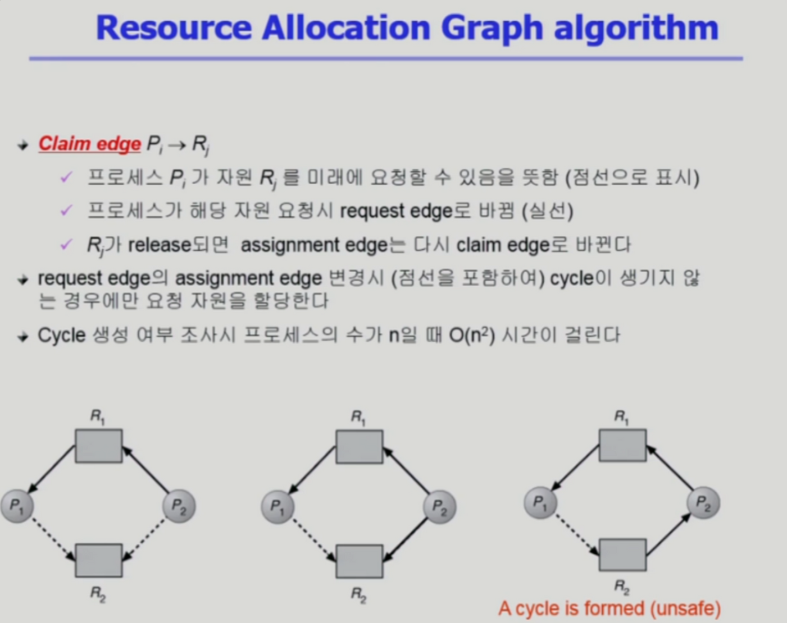
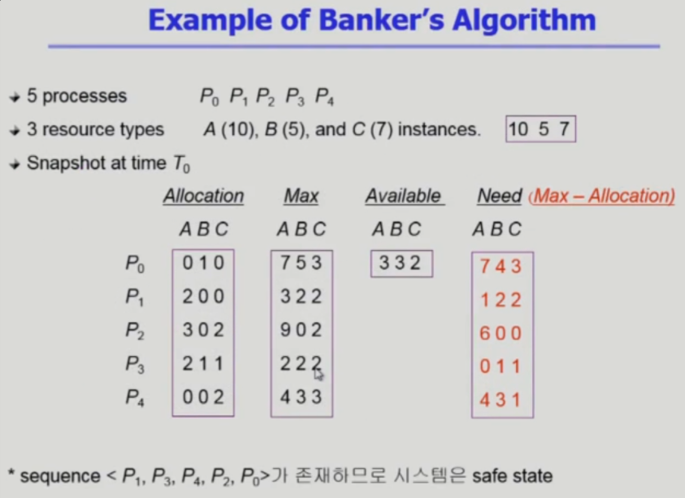
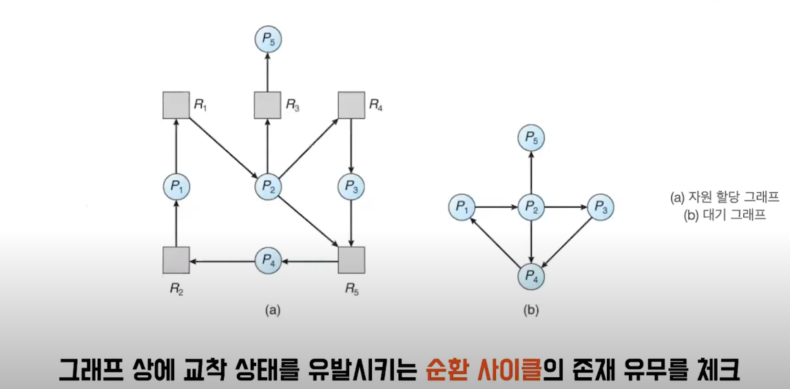
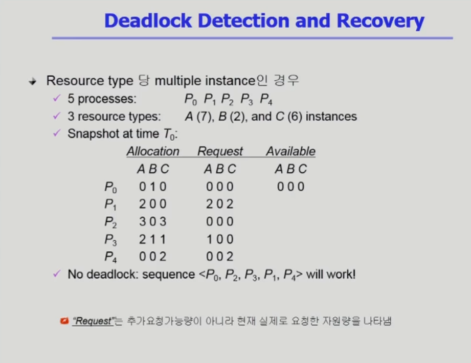

# 데드락(Deadlock, 교착상태)

간단 정리본.

​													

1. 데드락의 개념

   - 두 개 이상의 작업이 서로 상대방의 작업이 끝나기만을 기다리고 있기 때문에 아무것도 완료되지 못하는 상태

   - 하나의 리소스를 가지고 있고 다른 프로세스가 갖고 있는 리소스를 갖기 위해 기다리는 상태인데 기다리는 상태가 끝나지 않음.

     

2. 데드락을 일으키는 조건

   - 아래 4가지 조건을 모두 만족해야 데드락이 발생할 수 있게 된다.

   1. Mutual exclusion (상호 배제) : 매 순간 하나의 프로세스만이 자원을 사용할 수 있음

   2. No preemption (비선점) : 프로세스는 자원을 스스로 내어놓을 뿐 강제로 빼앗기지 않음

   3. Hold and wait (점유와 대기) : 자원을 붙잡은 상태에서 다른 자원을 기다리고 있음

   4. Circular wait (원형 대기) : 자원을 기다리는 프로세스간에 사이클 형성

      

3. 데드락을 관리하기 위한 방법

   - **예방** : 데드락을 일으키는 4가지 조건 중 하나라도 불만족하게 하기 (mutual exclution(상호배제)는 데이터 일관성 문제로 

     ​			불만족 시킬 수 없기에 다른 3가지 조건 중 하나라도 불만족시켜야 한다.) 

     

     - No Preemption : 다른 리소스를 즉시 못 받는 상황이면 자신이 가지고 있는 리소스도 반납하여 필요한 

       ​							프로세스에서 사용하도록 하기.

     - Hold and wait : 모든 리소스를 한 번에 요구하게 하여 하나씩 가지고 있지 않도록 하기.

     - Circular wait : 리소스를 오름차순이나 내림차순으로 정렬하여 사용.

     **일반적으로 자원 사용 효율성이 떨어지고 비용이 많이 드는 방법.**

     

   - **회피** : Unsafe State에 진입하지 않게 하는 방식으로 교착 상태 발생 가능성을 검사해서 발생 가능성이 있다면 

     ​			사전에 회피하는 방식.

     

     - safe state : 데드락 없음
     - unsafe state : 데드락 가능성 있음

     

     - 순서
       1. 프로세스가 자원 요청시, 자원을 할당한 후에도 안정 상태로 남아있는지 사전 검사
       2. 안정 상태라면 자원을 할당
       3. 불안정 상태라면 다른 프로세스가 자원을 해지할 때까지 대기

     

     - 알고리즘의 종류

       1. 자원 할당 그래프 알고리즘

          

       2. 은행원 알고리즘

          

     **자원을 요청할 때마다 시스템 상태를 검사하는 만큼 오버헤드가 크며 은행원 알고리즘의 경우 전제 조건이 많다.**

     

   - **탐지와 회복** : 교착 상태를 허용하지만 상태를 탐지하고 회복하는 방식으로 

     ​					알고리즘을 주기적으로 실행함으로써, 시스템에 발생한 데드락을 체크하고 회복

     

     - 알고리즘 종류 :

       1. Single Instance - Wait-for graph

          자원 할당 그래프의 변형이며 사이클이 존재하는지를 주기적으로 조사.

          또한 자원이 하나 뿐인때 사이클을 더욱 빠르게 찾을 수 있다.

          

          

       2. Multiple Instance 

          Banker's 알고리즘과 유사하며 우선 가용자원인 Available을 전부 주고

          나중에 내놓을 가능성이 있는 녀석, 즉 자원을 요청하지 않은 자원인

          아래 사진에서의 P0,P2 의 경우 가진 자원을 내어 놓게 되면 가용자원이 

          늘어나게 되어 다른 자원의 요청을 수행할 수 있게 된다.

          

          

     

     

     - 만약 데드락 발생하면

       1. 프로세스 종료 :
          - 교착 상태의 프로세스를 모두 중지
          - 교착 상태가 제거될 때까지 한 프로세스씩 중지

       2. 자원 선점 :
          - 비용을 최소화 할 수 있는 것을 선정
          - 교착 상태가 제거될 때까지 프로세스가 점유한 자원을 선점해 다른 프로세스에게 할당

       

     - 회복시 고려 사항

       1. 희생자 선택
       2. 후퇴 (Rollback)
       3. 기아 상태 (Starvation)

     

   - **무시** : 교착 상태 자체를 무시하고, 특별한 조치를 취하지 않는 방법. 

     ​			애초에 Deadlock이 매우 드물게 발생하기에 Deadlock에 대한 조치 자체가 

     ​			더 큰 overhead일 수 있다는 것. 

