# 220720

어제꺼 정리하자면 

Mutable 자료형 : List, set, dic

Immutable 자료형 : Tuple, String , range

# 1. input ()  --->

 문자열로 받기에 int를 원할 경우 int(input()) 으로 해주기.

# 2. 복수 조건문

if 문에서 범위를 지정하지 않아도 해당 끝 값을 기준으로 다음 조건의 문을 기준으로 

범위가 만들어진다. 

```bash
dust =  80
if dust > 150:
   print("매우 나쁨")
elif dust > 80:
   print("나쁨")
elif dust > 30:
   print("보통")
else:
   print("좋음")

# 위에 작성한것처럼만 작성해도 30~80까지는 보통, 80~150까지는 나쁨 이렇게 출
```

만약 전의 조건 기준이 내가 원하는 조건이 아닐 경우 AND, OR 사용.

# 3. 조건 표현식

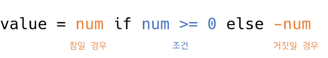

true인 경우 값 if 조건 else false인 경우 값

  (왼쪽 참)         if 조건      (아닌경우 오른쪽)

```bash
value = num if num >= 0 else -num
# 절댓값을 저장하기 위한 코드
```

bash

```bash
num = 5
values = num if num >= 0 else 0
# 해당 코드들 처럼 같은 변수에 값을 넣을때 사용하며 else 뒤에는 변수 작성 X
```

# 4. 반복문의 종류

- while 문
  
  종료 조건에 해당하는 코드를 통해 반복문을 종료시켜야 함.
  
  - 무한 루프를 하지 않도록 종료 조건이 반드시 필요.

- for 문 
  
  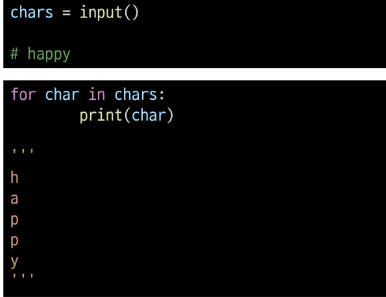
  
  - 반복가능한 객체를 모두 순회하면 종료
  
  - 보통 횟수 기반으로 사용하며 처음부터 끝까지 모두 순회하기에 종료 조건 X
    
    for 문은 시퀀스(String, Tuple, List, Range)를 포함한 순회 가능한 
    
    객체의 요소를 모두 순회
    
    break. continue, for-else

- for 문을 이용한 문자열 순회
  
  

- 딕셔너리 순회
  
  - 딕셔너리 자체를 순회 하게 된다면 Key  값만 student에 들어가서 
    
    Key만 출력이 되고
  
  - Value 값을 출력하기를 원한다면 딕셔러니인 grades[key]를 한다면
    
    Value 값이 출력 된다.
  
  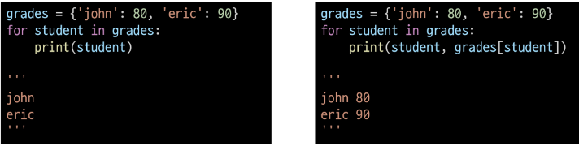
  
  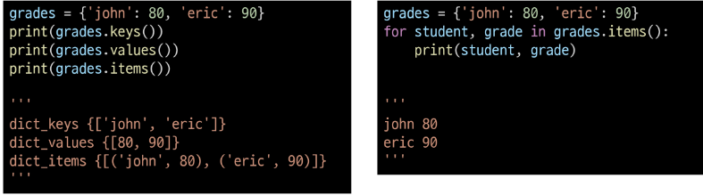

- enumerate 순회
  
  - 인덱스와 객체를 쌍으로 담은 열거형(enumerate)
  
  - (index, value) 형태의 tuple로 구성된 객체 반환
    
    - number 이 해당하는 값이 된다.

            

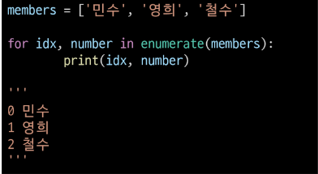

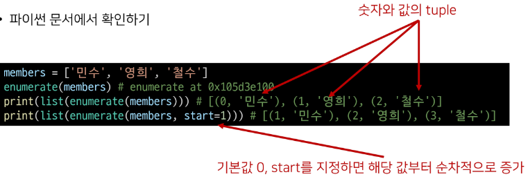

- List comprehension
  
  - 표현식과 제어문을 통해 특정한 값을 가진 리스트를 간결하게 생성하는 방법
    
    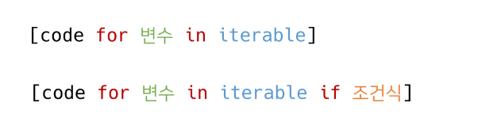

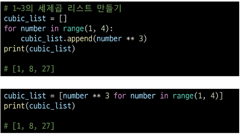

- Dictionary Comprehension
  
  - 표현식과 제어문을 통해 특정한 값을 가진 딕셔너리를 간결하게 생성하는 방법.
  
  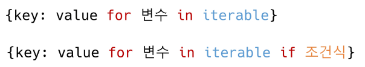
  
  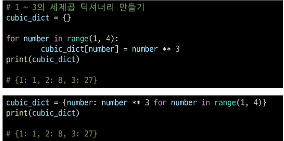`

- pass
  
  - 아무것도 하지 않음 
    
    - 특별히 할 일 없을 때 자리를 채우는 용도로 사용
  
  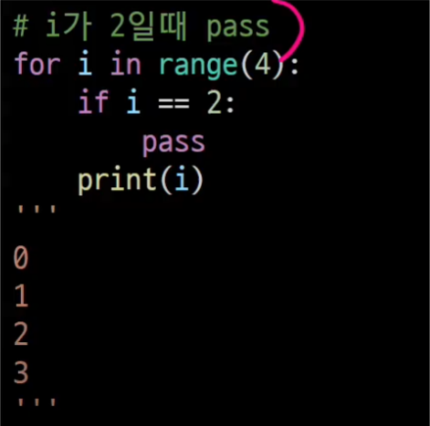

## 복합 연산자(In-place Operator)

- 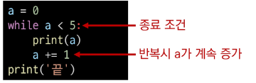
  
  복합 연산자란 연산과 할당을 합쳐 놓은 것
  
  - Ex) cnt += 1

- Iterable 이란
  
  - 순회할 수 있는 자료형(String, List, Dict, Tuple, Range, Set 등)
  
  - 순회형 함수(Range, Enumerate)
    
    ```bash
    for i in iterable
    ```

- map(함수, 타겟)
  
  - map(int를 많이 넣어서 형변환인줄 알지만 함수를 넣는것이다.)

- for else
  
  - break를 통해 중간에 종료되는 경우 else 문은 실행되지 않음.


# 함수

- 함수 안의 retrun 값 대신에 print를 넣는다면 출력은 되지만 변수에 넣어서 사용하려고 하면 None 이 출력되는데 
  - 이유는 출력되고 사라지기 때문에 변수에 넣으면 출력이 안된다.


- 원래 함수는 1개의 return 값을 반환하는데 

  - 파이썬에서는 return 값을 튜플로 묶어 값을 넣어 줄 수 있다.

  

  - 또한 None은 다른 언어에서는 Void라고 한다.


# 함수의 입력

- Parameter 와 Argument

  - Parameter : 함수를 정의할 때, 함수 내부에서 사용되는 변수

  - Argument : 함수를 호출 할 때, 넣어주는 값

    - 필수 Argument : 반드시 전달되어야 하는 argument

    - 선택 Argument : 값을 전달하지 않아도 되는 경우는 기본값이 전달

    - 또한 Argument 는 Positional Arument와 Keyword Argument가 있는데 

      - 기본으로는 Positional Arument로 적용이 되기에 Positional -> Keyword는 가능하지만 

      - 

      - Keyword -> Positional 은 불가능 하다.

        

    - Default Arguments Values
  
      - 기본값을 지정하여 함수 호출 시 argument 값을 설정하지 않도록 함
      - 보통 기본 값으로 사용.
      - 

    - 정해지지 않은 여러 개의 Arguments 인 가변 인자(*args)

      - 여러 개의 Positional Argument를 하나의 필수 Parameter로 받아서 사용

      - 가변인자는 몇 개의 Positional Argument를 받을지 모르는 함수를 정의할 때 유용.

        

    - 패킹 / 언패킹

      - 가변 인자를 이해하기 위해서는 피킹, 언패킹을 이해해야 함

        

      - 가변 인자는 * (asterisk) 를 변수 왼쪽에 붙여주면 요소들을 리스트에 담을 수 있다.

        

      - 가변 인자 예시

        

        

      - 반드시 받아야하는 인자와, 추가적인 인자를 구분해서 사용할 수 있다.

        

    - 가변 키워드 인자(**kwargs)

      - 조심해야하는 것은 father = '아부지' 처럼 : 콜론이 아닌 = 이퀄로 표기( 즉 변수로 넣어주는 역활을) 해야한다

      

    - 가변 인자와 가변 키워드 인자를 함께 사용할 수 있다.

      

  - 그래서 Argument 에서 Parameter로 전달이 된다.
  
    - 


# Python 의 범위 (Scope)

- 함수는 코드 내부에 Local scope를 생성하며, 그 외의 공간인 global scope로 구분
  - Scope
    - global scope : 코드 어디에서든 참조할 수 있는 공간
    - local scope : 함수가 만든 scope로 함수 내부에서만 참조 가능
  - Variable
    - global variable : global scope에 정의된 변수
    - local variable : local scope에 정의된 변수


- 변수 생명주기(Life Cycle)

  - built-in-scope

    - 파이썬이 실행된 이후부터 영원히 유지

  - global scope

    - 모듈이 호출된 시점 이후 혹은 인터프리터가 끝날 때까지 유지

  - local scope

    - 함수가 호출된 때 생성되고, 함수가 종료될 때까지 유지

      

- 이름 검색 규칙(Name Resolution)

  - 파이썬에서 사용되는 이름(식별자)들은 이름공간(namespace)에 저장되어 있음

    

    

- LEGB 예시

  

​		


- ### Global 예시

  

  

  - Global 관련 에러

    


- ### Nonlocal 예시

  

  - Nonlocal, global 비교

    


- ## map

  


- ## filter


- ## zip(*iterables)


- ## lambda 함수

  - 표현식을 계산한 결과값을 반환하는 함수로, 이름이 없는 함수여서 익명함수라고도 불림

  - 계속 사용이 아닌 한번 정도만 사용할 것 같을 경우 사용

  - 

    - 특징: 

    - return문을 가질 수 없음

    - 간편 조건문 외 조건문이나 반복문을 가질 수 없음

      

    - 장점:

    - 함수를 정의해서 사용하는 것보다 간결하게 사용 가능
  
    - def를 사용할 수 없는 곳에서도 사용가능
  
      


- ## 재귀 함수(recursive function)

  - 자기 자신을 호출하는 함수
  - 무한한 호출을 목표로 하는 것이 아니며, 알고리즘 설계 및 구현에서 유용하게 활용
    - 알고리즘 중 재귀 함수로 로직을 표현하기 쉬운 경우가 있음
    - 변수의 사용이 줄어들며, 코드의 가독성이 높아짐
  - 1개 이상의 base case(종료되는 상황)가 존재하고, 수렴하도록 작성


- 재귀 함수는 base case에 도달할 때까지 함수를 호출함
- 메모리 스택이 넘치게 되면(stack overflow) 프로그램이 동작하지 않게 됨
- 파이썬에서는 최대 재귀 깊으가 1000번으로 호출 회수가 이를 넘어가게 되면 Recursion Error가 발생한다.


- 반복문과 재귀 함수 비교
  - 알고리즘 자체가 재귀적인 표현이 자연스러운 경우 재귀함수를 사용함
  - 재귀 호출은 변수 사용을 줄여줄 수 있음
  - 재귀 호출은 입력 값이 커질 수록 연산 속도가 오래 걸림


- ## 묘듈과 패키지

  - 모듈 : 다양한 기능을 하나의 파일로 묶은 것.
    - 특정 기능을 하는 코드를 파이썬 파일 단위로 작성한 것.
  - 패키지 : 다양한 파일을 하나의 폴더
    - 특정 기능과 관련된 여러 모듈의 집합
    - 패키지 안에는 또 다른 서브 패키지를 포함

  

  ​								* 외부 개발자 코드를 가져다 쓸 경우

  

  - 라이브러리 : 다양한 패키지를 하나의 묶음으로 묶은 것 (Ex) 도구)
  - 프레임 워크 : 라이브러리와 유사하지만 나의 마음대로 완전히 하기 힘든것? (Ex) 포크레인)
  - pip : 이것을 관리하는 관리자
  - 가상환경 : 패키지의 활용 공간


- ## 파이썬 패키지 관리자(pip) 명령어

- 가상환경

  
  
  


- ## 모듈/패키지 활용하기

  - 패키지

    - 패키지는 여러 모듈/하위 패키지로 구조화

  - 패키지 만들기

    - 계산 기능이 들어간 calculator  패키지를 아래와 같이 구성

  - __init__ 하는 이유는 

    


- ## 가상환경

  - 버전이 다양할 경우

    

  

  

  

  - ### 가상환경 활성화/비활성화

  


- ## print 또한 Default Aruguments Values 를 사용하고 있다.

  - print( ) 안에는 end = \n 이 기본적으로 있기에 우리는 연달아 출력하고자 한다면
    - print( x, end = ' ') 이렇게 공백으로 바꾸어준다.
  - 또한 print 는 print(*args, end = ' ') 이기에 여러개의 문자를 입력 받을 수 있다.ㄹ


- ### 매개변수는 함수 안에 받는 값, 

- ### 인자는 함수의 매개변수로 넣을 값

- ## Iterable  : 반복 가능한 객체, 값을 차례대로 꺼낼 수 있는 객체

  - List
  - Dict
  - Set
  - Str
  - Bytes
  - Tuple
  - Range
