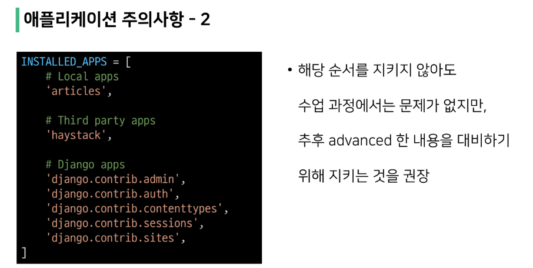
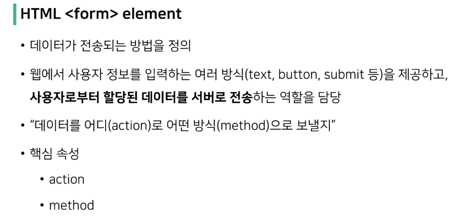

잘 만들어진 친구 가져다 쓰자.

장고의 장점: 로그인, 로그아웃, 회원관리, 관리자 기능이 강력한 지원 기능이다.

장고 = 파이썬으로 구성된 덩어리

프레임워크 != 라이브러리

프레임워크 -> 부트스트랩

프레임워크 사용시 장점 : 소프트웨어의 생산성과 품질을 높임

인터넷 

www = World Wide Web = 전 세계에 퍼져 있는 거미줄 같은 연결망

---

##### 웹 브라우저

웹 페이지란 

- 우리가 보는 화면 각각 한 장 한 장의 웹 페이지

웹 페이지 종류

1. 정적 웹 페이지

   - 한 번 작성된 HTML 파일의 내용이 변하지 않는 것.
   - 사실상 마주하기 어렵다.
   - READ ME 문서의 경우 정적 웹 페이지로 작성하게 된다.

   

2. 동적 웹 페이지

---

##### MTV Design Pattern

효율적인 요청 방법 : 프로토콜 

프로토콜 종류 : HTTP, FTP, pop3 ...

---

Django's Design Pattern

model 이 데이터를 가지고 있으며

View 는 사용자 관점의 시점

controller 는 모델로부터 View가 요청한 요청한 데이터를 처리

MVC 와 MTV 의 View 는 서로 다르다는 점.

---

##### MTV

Model : 장고가 가지고 있는 디자인 패턴 중 하나이며 데이터 구조를 정의.

**Python -> SQL 문으로 번역하는 것을 ORM 이 한다.**

Template : 레이아웃과 화면 단을  정의

View : 데이터가 필요시 model에 접근해서 데이터를 가져오고 응답을 반환

---

##### 작업 순서 

URL -> View -> Template

장고 3.2.13 버전을 사용하는 이유는

---

##### Django Project 생성

서버 종료 : ctrl + c

---

##### 프로젝트 구조

- ***settings.py 는 자주 들어와서 변경해주게 될 예정.***

- 배포시 사용 할 예정

---

##### App

ex)

회원 App 

- 회원 가입
- 로그인 
- 로그 아웃

게시물 App

- 게시글 생성

- 게시글 수정

- 게시글 삭제

- 게시글 조회

- 댓글

  

App 생성 : $ python manage.py startapp articles

---

##### 애플리케이션 구조

- 수업 중 사용 하지 않을 예정

- 수업 시간 중 사용하지 않을 예정

- 가장 많이 사용하게 될 예정 ( 함수 작성할 예정)

프로젝트 등록해주기

**기본적으로 리스트 타입이기에 순서가 있다.**

내가 만든 앱들부터 -> 다른 사람들이 만든 앱 -> 기본 장고 앱

---

##### Project & Application

---

##### 주의 사항

---

##### 작업 순서

index/ = 요청 보낼 곳

최상위 파일은 manage.py 가 있는 곳

장고에서 뷰의 함수에서 매개변수 값으로는 request 를 첫 번째 인자값으로 고정해야한다.

request, '파일 경로'

urls.py 에서 path에 있는 'index/'를 실행시키면

views.py 에서 뷰 함수가 실행이 되며 해당 함수의 return의 render(request,'파일 이름') 파일을 실행하여 

오전에 수업의 최종은 

**urls**(path('index/', view.index)) -> **views**(함수 생성) -> **template**(ex. index.html)

***꼭 하나씩 순서대로 작성하기***

---

##### 추가 설정

---

##### Django Template

- 조건문, 반복문, 변수를 HTML에서 사용할 수 있다.

- HTML에 Python 처럼 작성 한 것  뿐인 것이지 Pyhon 코드로 실행되는 것은 아님.
  - 즉 HTML 에서 알고리즘을 작성하는 것이 아니다.  

---

- {{변수명}} # 꼭 중괄호 2개를 사용해주어야 한다.

- ex) 
  - 이름을 모두 소문자로 하고 싶을 경우 --> {{name | lower}}
  - truncatewords --> 텍스트 ... 로 몇글자씩 끊어서 ...을 출력할 지 
- 그래서 앞에 있는 변수를 뒤에 필터로 보내주는 것.

-  end 를 사용함으로써 종료 태그를 적용

- 일반적으로 주석 처리처럼 하게 되면 comment 로 나오게 된다.

html 에서는 key 값을 가지고 value 값을 불러오기

---

##### Sending and Retrieving form data

##### Form Tag 

