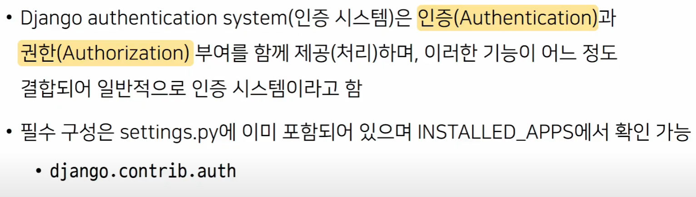
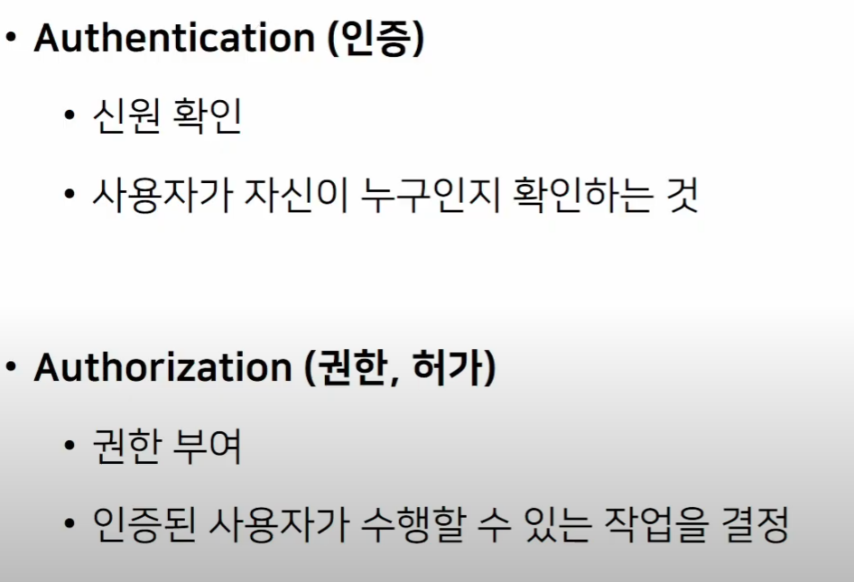
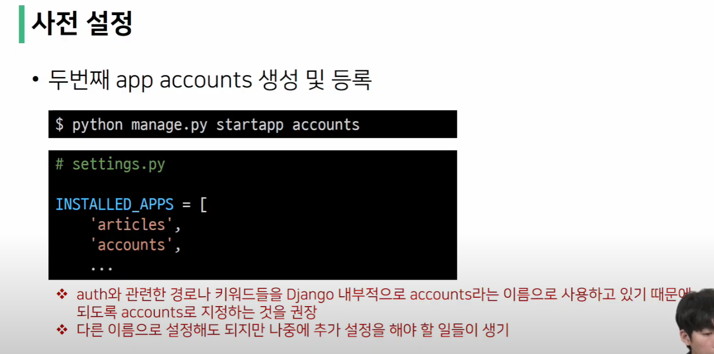
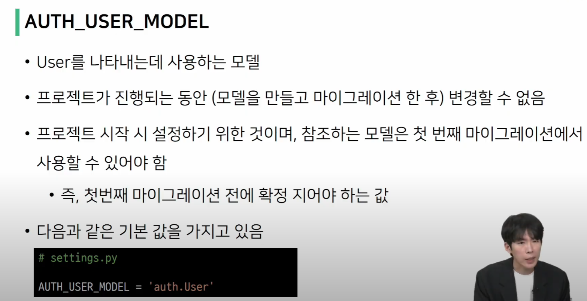

# The Django authentication system

인증 시스템 : 인증 + 권한,허가

앱 이름은 항상 복수형으로 만들기

우리가 새로 만들 앱으로는 accounts -> 회원, 인증

장고의 내부적으로 인증의 경우 accounts 라는 이름으로 사용하고 있기 때문에 되도록 

accounts 로 지정하는 것을 권장.

---

# Substituting a custom User model

'커스텀 User 모델로 대체하기'

기본 User model을 필수적으로 custom User model로 대체하는 이유?

 