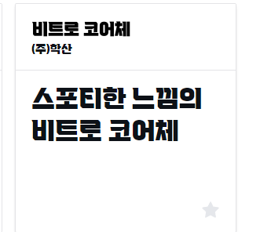
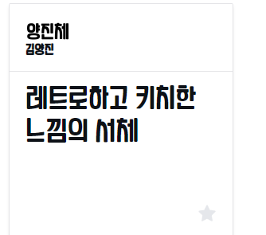
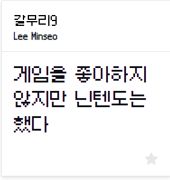

1. 메인 컨셉
   1. 영화의 명대사를 입력하면 영화를 찾아주는거?
   2. 지금 티빙, 넷플 처럼 선호도에 맞는 추천 카테고리, 최근에 시청 영화 목록 등등 (식상)
   3. 시간과 장소를 설정하면 영화를 추천 + 그 주위의  정보 제공(날씨, 식당, 관광 명소 등등)
   4. 기본 영화 홈페이지에 미니 게임을 통해 포인트를 쌓아 혹은 출석 체크 포인트를 쌓아서 나의 무비 플레이리스트를 타 유저에게 선보일 수 있도록 하는 서비스 제공? 사실 싸이월드 처럼 캐릭터 꾸미고 하면 더 좋긴 할텐데 
   5. 현재 나와있는 티빙, 왓챠, 넷플 등등에서는 필터로 어떤 배우가 나오지 않은 영화 찾기 이런건 없는 걸로 알고 있기에 요론것도 넣으면 좋긴 할듯, 이유는 어떤 배우가 법법행위를 저질렀다는 등의 이유로 그 배우가 나온 영화 소비를 하기 싫을 경우
   6. 기존 영화를 보여주는 사이트를 기준으로 해당 영화에 어떤 ost가 있었는지를 함께 보여주고, 해당 ost를 클릭하면 api를 이용하여 바로 들을 수 있는 사이트 혹은 youtube로 이동하도록 하기 
2. 테마 컨셉 잡기(옛날 비디오방, 애니 모음방 등등)
3. 불러오고 싶은 API 종류 체크
4. 컨벤션 서로 맞추기
5. branch 나눠서 어떻게 작업할 것인지 체크.
   

----

발표 시간은 대략적으로 6분정도이고 Q&A 2분 정도 이렇게 생각하면 된다고 하심

영화 로그 표시하는 거는 프레임워크가 있다고함

기획이 가장 중요하다. 그래야 방향성을 잡을 수 있기 때문이다.

게시물 구성요소라던지 

희망하는 이벤트에 대한 분배를 잘 정리해야할거같고

컴포넌트들의 구성과 연결을 정리해야할거 같다.

